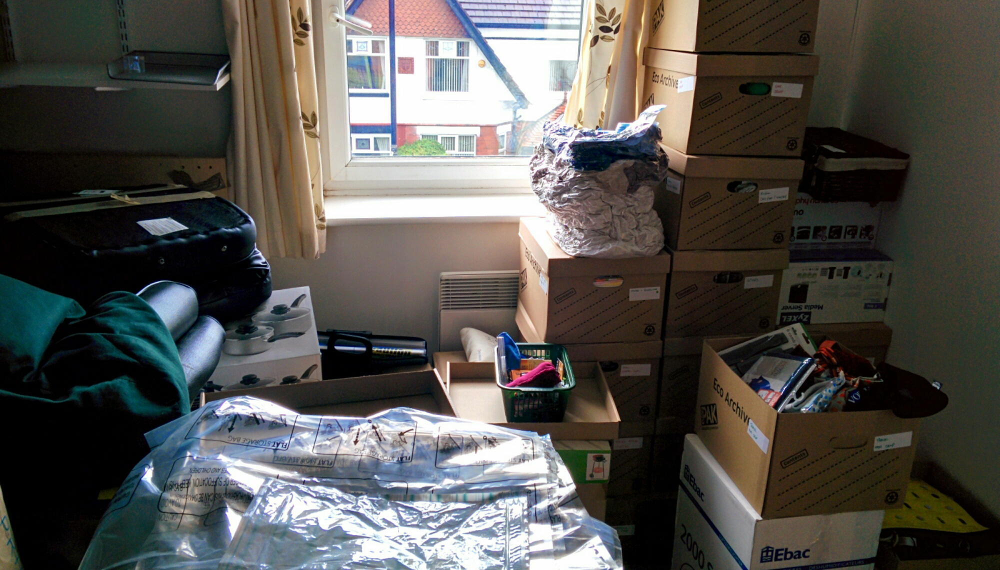

When we booked our flight to Kathmandu that we were committed to travelling – there’s no backing out now!

Our next stage was the long and tedious process disconnecting ourselves from the many contracts, bills and responsibilities we have here. We composed a list of things to do which helped us throughout the process.

Here’s the most important things we did:

•Quit job: make sure you read your contract regarding notice periods. Mine required 1 months’ notice. Also, try to end on good terms ☺

•Notice to suppliers – give notice in writing to water/electric suppliers, Sky TV, Council tax etc. Ideally do this a month in advance so you have a paper record of cancellation documents and closed accounts. _It’s ideal to scan these documents so if you get hounded by suppliers when your off travelling you have the documents online to resolve any issues._

•Tenancy agreement – at the same time as giving notice to suppliers we contacted our landlords to notify them of our plans. Luckily for us we get on well with our landlords and gave them enough notice so they could put the flat back on the rental market. _\*We also redirected mail and gave the landlords our permanent home addresses incase any mail came after our departure._

•Banking – we made sure our online bank accounts worked before we leave. We also notified in person to our banks of our plans to travel, and ordered new credit cards which are designed to get the best rates when travelling abroad (click [here](http://www.halifax.co.uk/creditcards/clarity-card/) to see which cards we ordered).

•Storage – fortunately Kyle’s mum let us store our belongings in the attic which saved us a lot of money! Otherwise we would have looked into long-term storage options.

Once our notices were in and underway, we started to sell unwanted items to increase the travel fund. Our first big task was getting rid of the car, followed by old gadgets and clothing. It’s so important to start listing things as soon possible – we didn’t want to be chasing payments and shipping items off in the last few days before we jet off.

We brought storage boxes and compression to pack up our belongings. It’s actually quite astonishing to see how much stuff we’ve accrued over the years. There were several times where we just decided to do a mass clear-out and donated most of our stuff to charity shops. Still, we had nearly a small room full of boxes which were ready to be transported to the attic.

Trust me when I say this task is so long-winded! Coming to think about it, it’s easy to see why many people don’t travel. It’s just so easy to carry on a conveyor belt of ‘normality’ whereby everything easily fits into place and has its routine. It’s exhausting breaking away from that cycle, and a lot of planning is required to take that leap of faith.

For now we remain excited but starting to feel nervous about the journey ahead of us. I was particularly sad the day we moved out the flat. We’d been living there just over 2 years and it was surreal to no longer call it our home. However this is what we want – we don’t want to be living an easy life anymore! We’re wanting a challenge, and I’m pretty sure we’ll be encountering some new ones in a matter of weeks ☺

