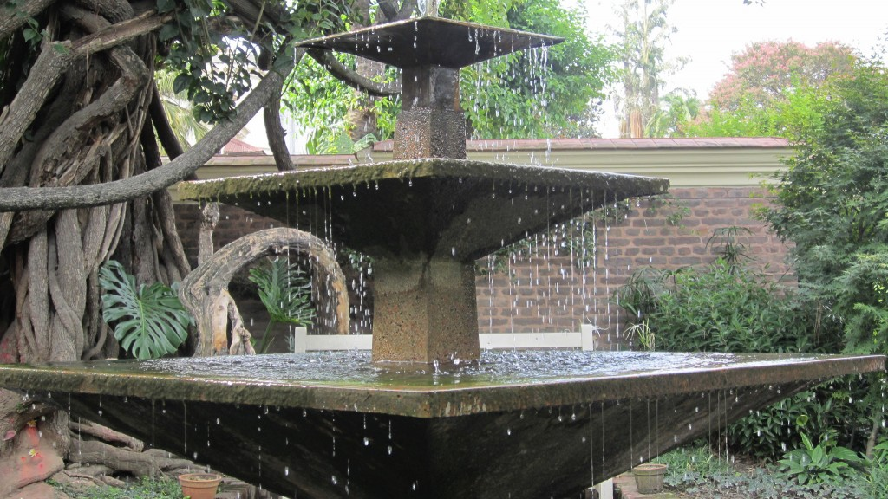
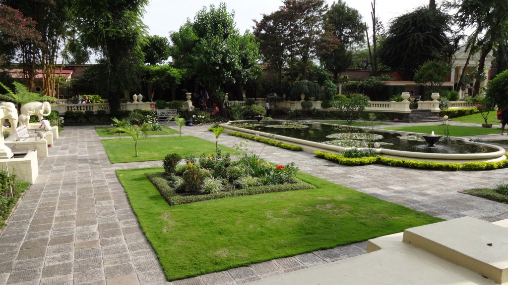
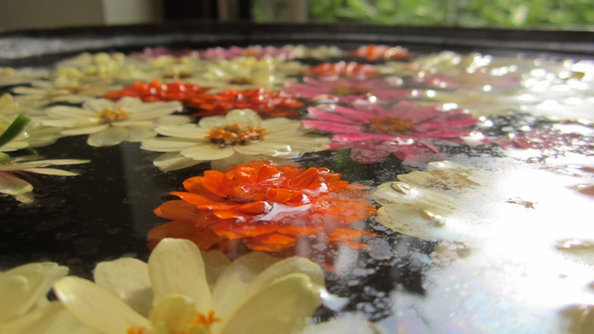
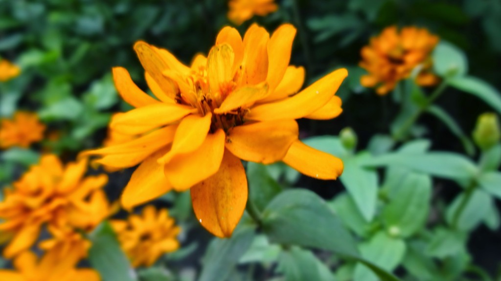
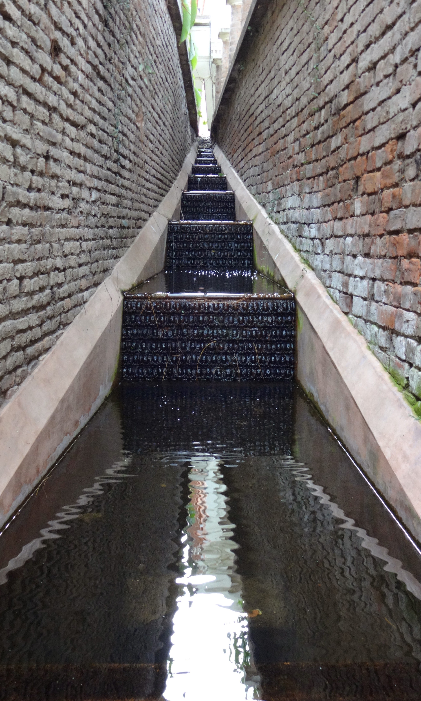
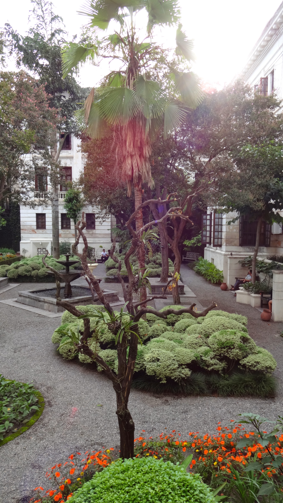
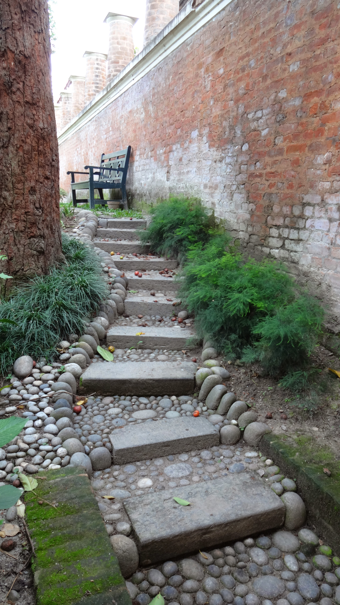

I was first skeptical about going to the Garden of Dreams at first as the location is right next to a busy road. _How can these gardens be appreciated if there is so much noise nearby?_ Thankfully my skepticism soon changed after strolling around the lush greenery, tranquil water features and beautiful flora on a sun filled afternoon.

Single entry is 200NPR per person, once your ticket is stamped by security you are free to roam around. There are plenty of benches and a couple of cafes to relax and absorb the wonderful environment. Cafe prices are slightly inflated so if you’re budgeting bring your own snacks and water (there were plenty of people eating/drinking items they bought in).

It seemed like the place to be for many couples and young families; it’s a perfect place to spend some down time reading a book or have a picnic with friends. If you’re interested in looking into the garden’s history there is a small section at the rear of the gardens to check out (_small room, but informative info and cool pics of the gardens transformation_).

You can still hear the noise from the main road, but it wasn’t as loud as thought it’d be (+ there are plenty of birds around that drown out the unwanted noise outside which helps!)

We spent a few hours enjoying the beauty of the gardens, and would certainly return here for a peace of tranquility again.

Here are some of my favourite snaps taken by myself & Kyle-

   

