Our next stop after Varanasi was Agra – home to Agra Fort and the iconic Taj Mahal.

We had a guided tour around Agra Fort in the morning. It was a wonderful fort to walk around and admire. The fort is full of interesting legends and showcases beautiful architecture. From the top of the fort you can see the Taj Mahal in the distance (and apparently the prison where Shah Jahan died).

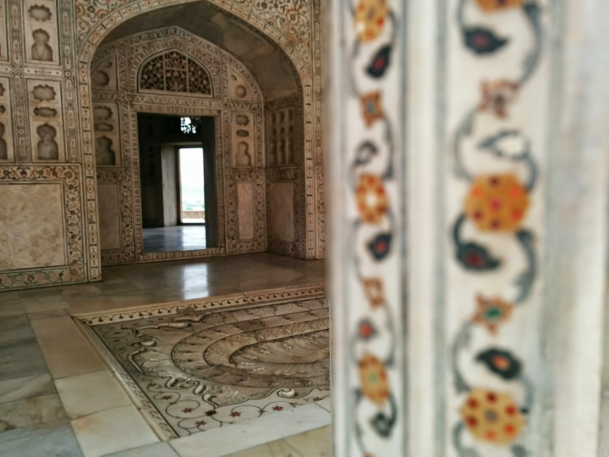

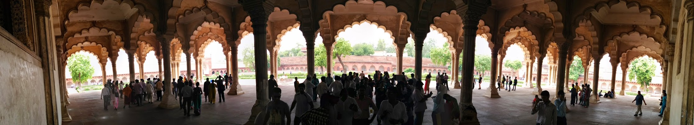

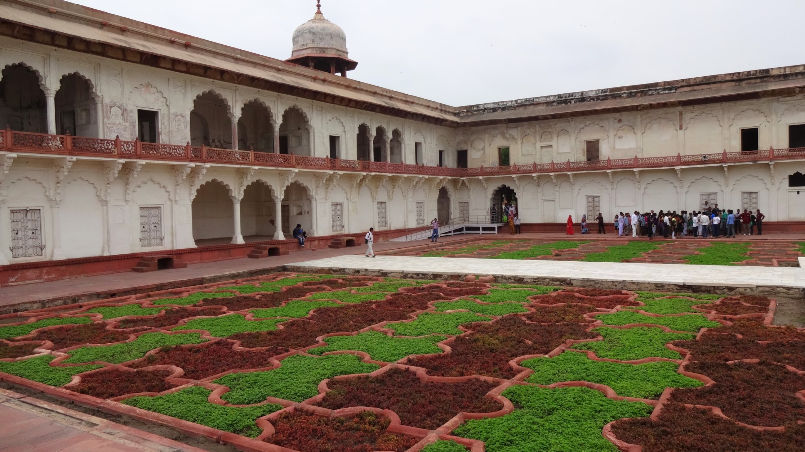

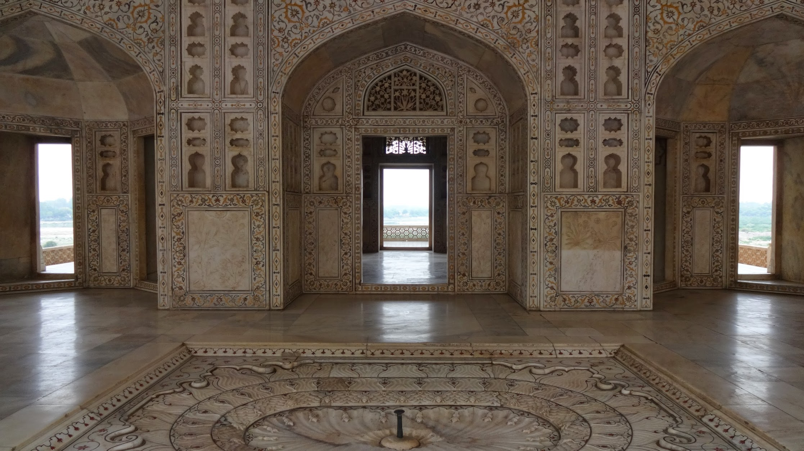

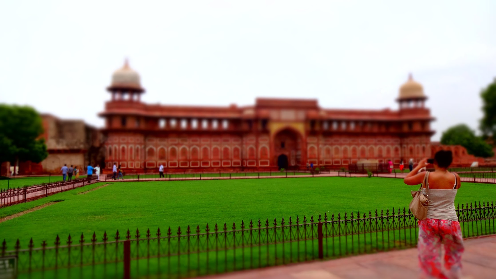

In the afternoon we visited the Taj Mahal. Again we had a tour guide who explained in detail the famous historical love story; after that we had free time to explore.

The Taj Mahal is an icon which has to be seen in person, I think no photo can truly capture its beauty. We went inside which contains replica tombs of Mumtaz Mahal and Shah Jahan – unfortunately no photos were allowed in this area and you are rushed to walk around as quick as possible by the guards (it’s because of the amount of people they squeeze in that causes the rush!).

If I was to visit again, I’d go very early morning or late evening. It was really busy when we went, and it got to the point where ‘we’ became the attraction and had people coming to us for photos!

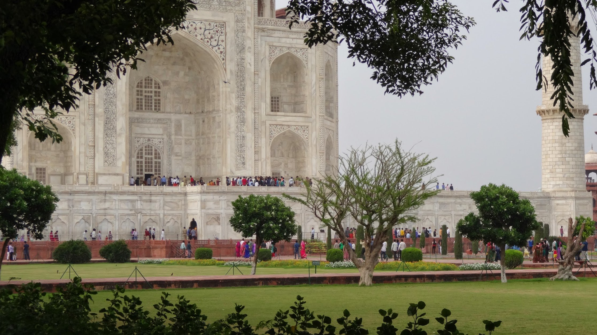

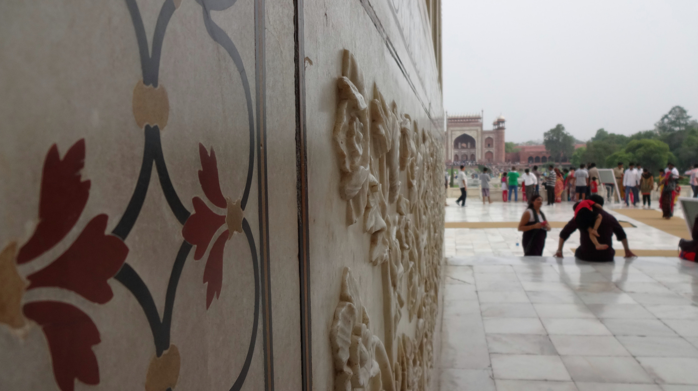

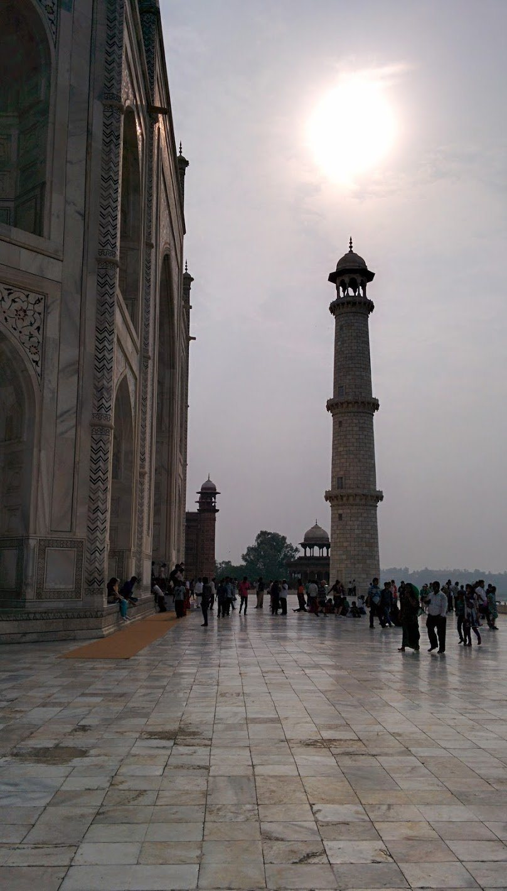

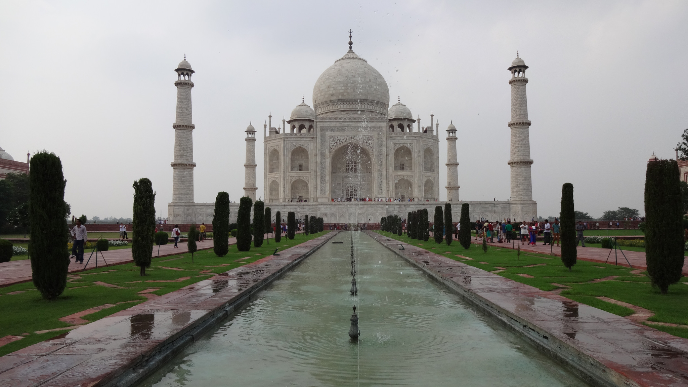

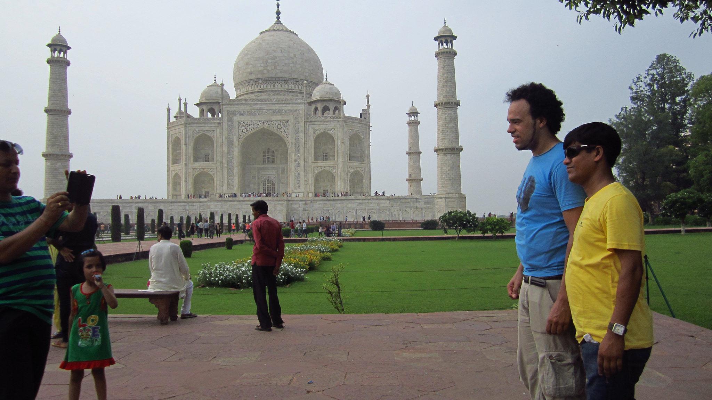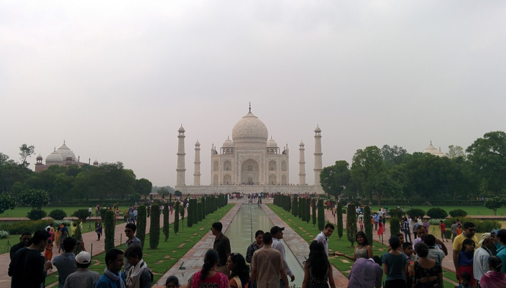
