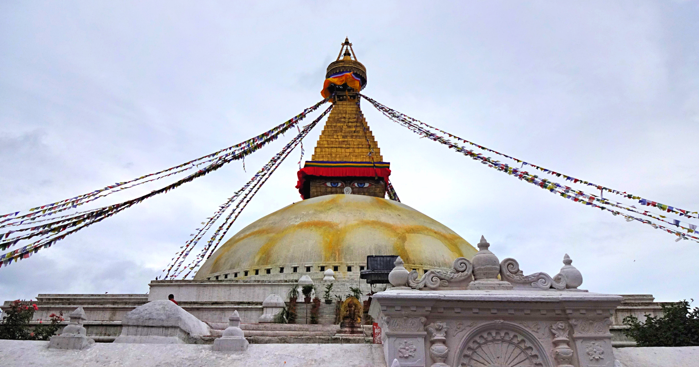
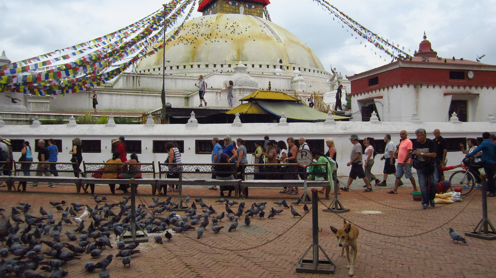
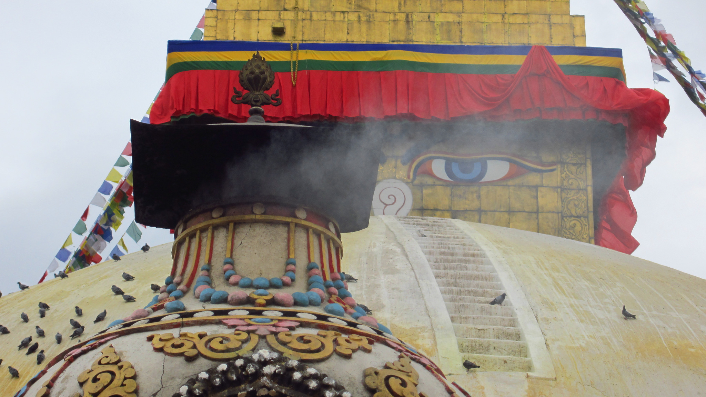
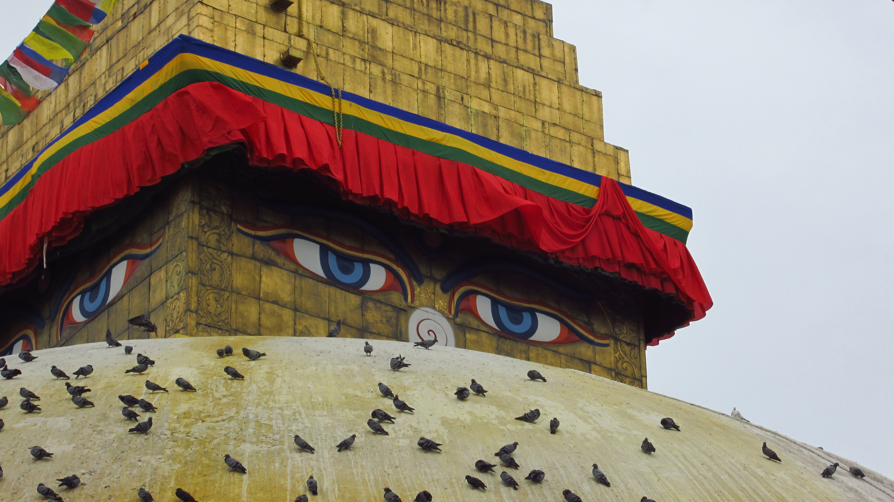

Boudhanath Stupa is the largest Buddhist stupas in Nepal. Built during the 5th century AD Boudhanath is an important site of pilgrimage and meditation for Nepalis and Tibetan Buddhists. It is considered to be a very spiritual area which was once on an ancient trade route between Nepal and Tibet. In 1979 Boudhnath became a UNESCO Heritage site.

As part of our Gecko’s tour this was one of the first activities we visited. We were shown around by a tour guide who explained Boudhanath’s history, and were then able to explore around the stupa.

Throughout the day many locals and pilgrims ritually walk around the stupa several times (in a clock wise direction) repeating the mantra ‘_Om Mani Padme Hum_‘.

As the ritual follows we walked around the stupa in a clockwise direction. The atmosphere filled with musky smelling incense and gentle hums from the monks around us repeating their mantras and spinning the prayer wheels. There were many stray dogs resting in the courtyard, whilst high up perched on the stupa sat hundreds of birds.

The slight breeze gently rustled the brightly coloured flags around the stupa, parting ways to get a glimpse of those eyes. The mesmerizing eyes which are present in all four directions represent the wisdom of an ‘all seeing Buddha’

It was fascinating to see and feel such a spiritual presence. There is a strong Tibetan culture at Boudhanath, which is as close as we feel we can get to Tibet. Surrounding the stupa are various traditional shops selling items like singing bowls, prayer wheels and art.

Boudhanath Stupa is one of the holiest sites in the world for Buddhist culture, and I feel very privileged to have visited such a tranquil place of worship and peace.
