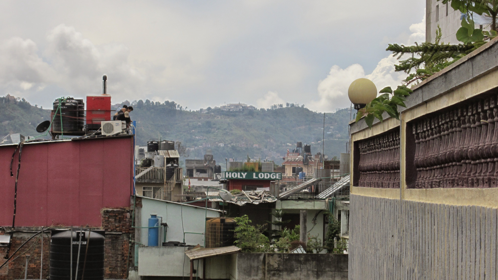
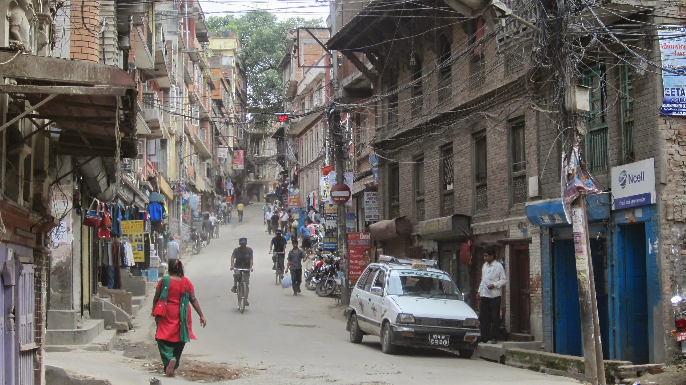
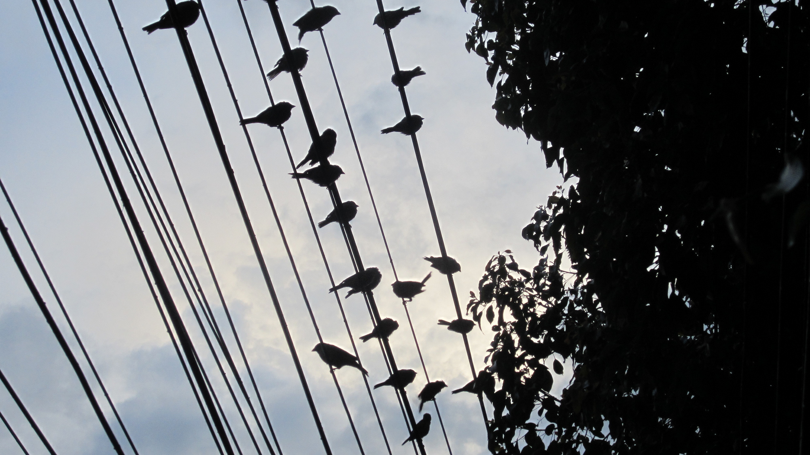

The roof top view from Zen B&B

After resting from our severely delayed journey to Kathmandu, we were finally able to venture outside into the chaos that is Thamel.

Thamel is a popular tourist area in Kathmandu, overflowing with an abundance of energy, colours, and noise. As soon as you arrive on the main stretch for the first time you will experience a sensational overload. Trying to navigate a way to the nearest coffee shop whilst trying not to get run over and rejecting every taxi request/sales pitch/beggar advance following you definitely requires patience and skill!

There are so many restaurants and cafes in Thamel, I’ve checked out Trip Advisor to find the best picks. We’re concious of hygiene and trying our best not to get ill before we go on tour!

There is an abundance of stalls selling clothing, music, art (and much, much more). It’s great to wander around the stalls and chat to the locals. We’re trying to learn key phrases such as ‘thank you’ and ‘goodbye’ – our pronunciation isn’t quite there but the locals appreciate the effort!

I look forward to checking out new sights and eateries over the following days.

_What were your inital thought when you visited Kathmandu?_
