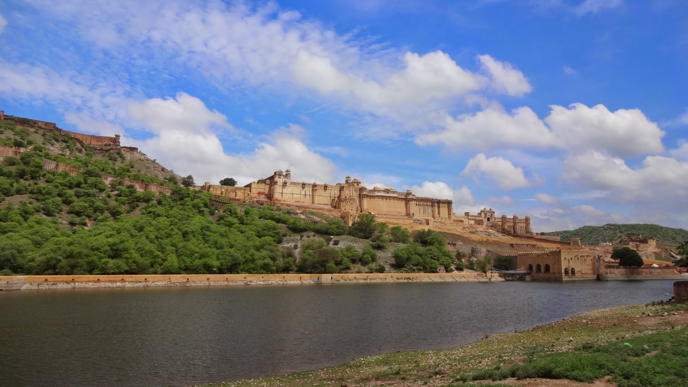
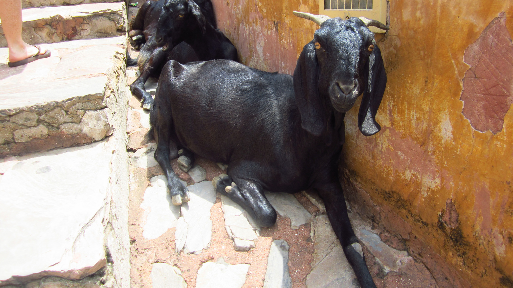
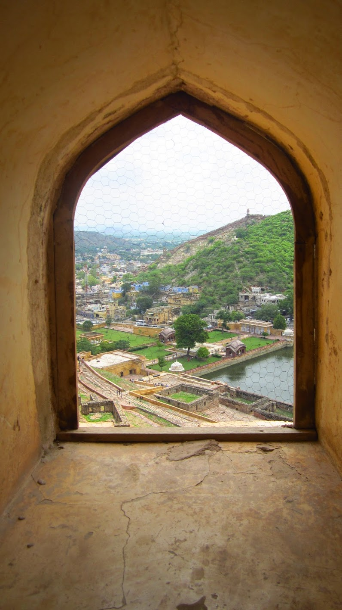
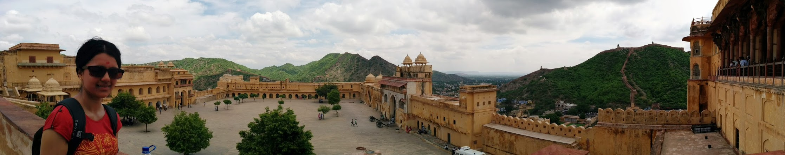
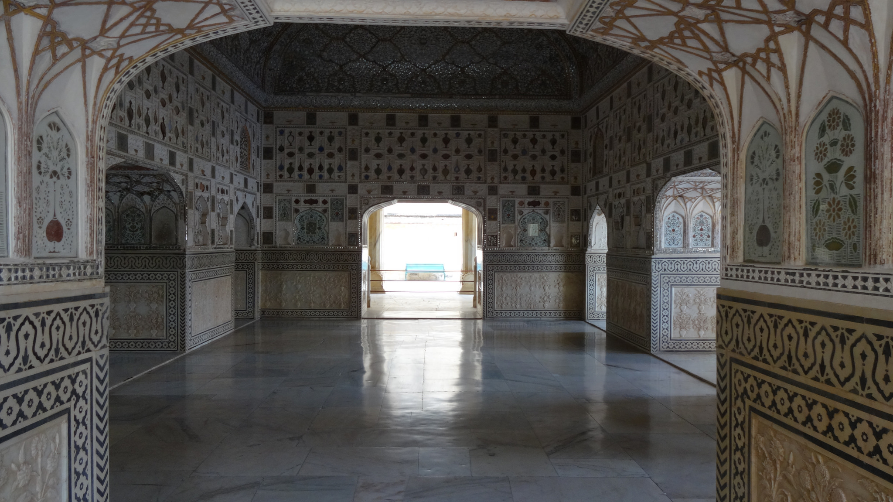
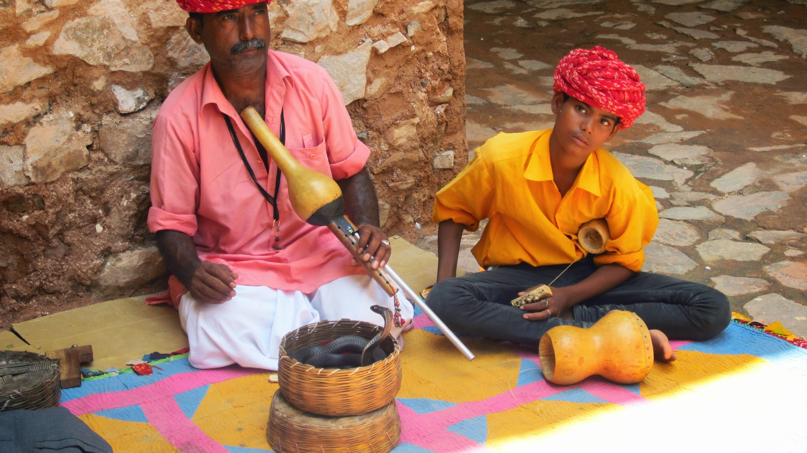
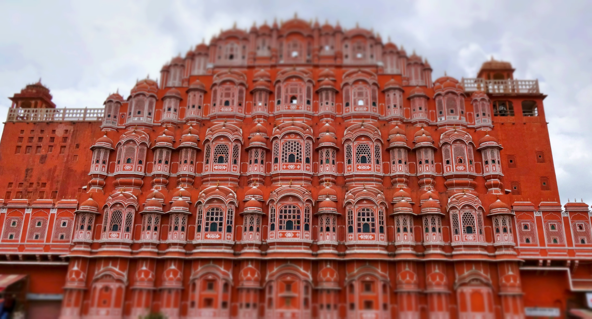
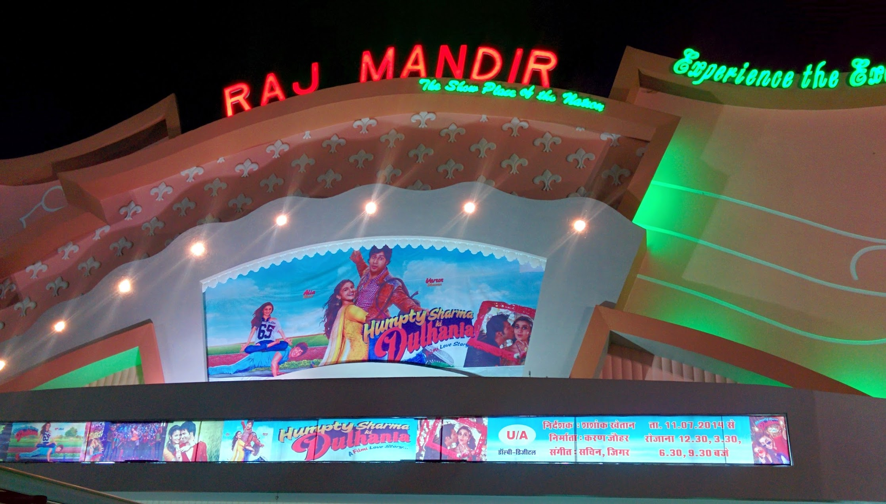
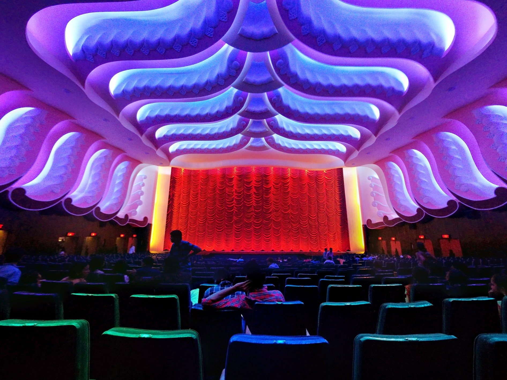

Ahh, Rajasthan! The place of rich heritage and stunning architecture. For me this was a highlight of the tour as this is an area I’ve not previously visited.

Jaipur, known as the Pink City is the largest Indian state in Rajasthan.

Our day began visiting Amber Fort. Located on a hill, the fort combines a beautiful blend of Hindu & Mughal architecture (think red sand stone and white marble). The interior of the palace displays impressive artwork, carvings and mirrored walls. The views from the top were fantastic, it was well worth the climb! The only downside I found were from the annoyances of touts and vendors lurking around, forcing stuff in your face to buy. _This does happen at every attraction, however it did slightly dampen the experience for me_.

Tuk tuks were arranged in the afternoon to do our own sightseeing. We stopped off at the Palace of the Winds first and managed to take a few photos – unfortunately the area was full of vendors that crowded us asking the standard 100 or so questions.

Moving on as quick as possible we visited a wholesalers where we watched garments hand-made. Kyle got measured up to have to some trousers made, he seemed pretty happy choosing colours and styles! We also checked out the local markets, bargaining our way through spices and food.

Palace of the Winds

In the evening we all went to the Raj Mandir cinema to watch a Bollywood film. The atmosphere was crazy! People were whistling, cheering, taking photos, even talking on their mobiles throughout the whole movie (the thought of that happening in a cinema back home is a no-no!) It was fun and kinda’ annoying at the same time, but still a really enjoyable experience!

Bollywood time!

How lavish is this cinema!
