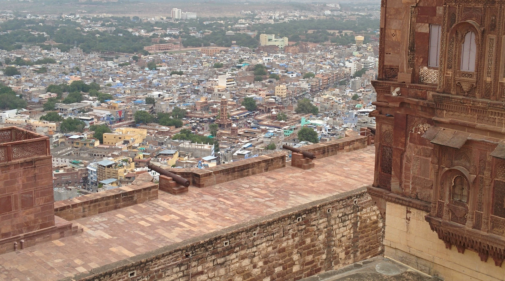
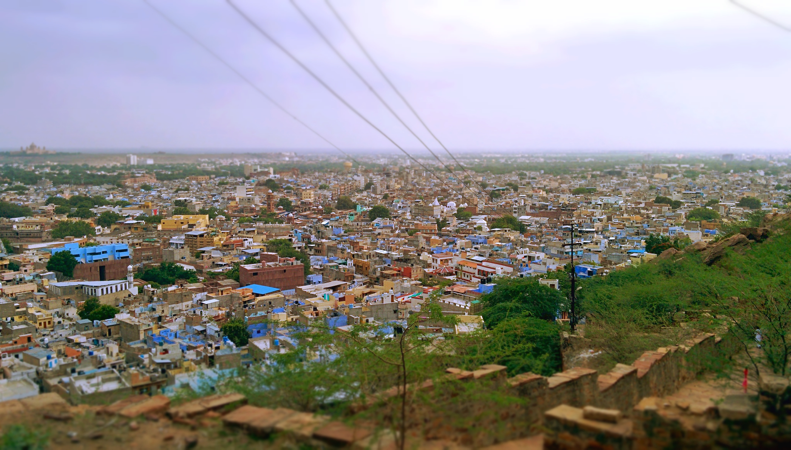
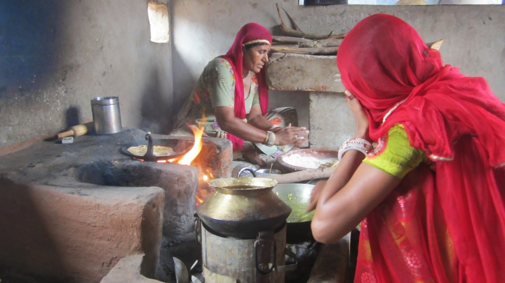
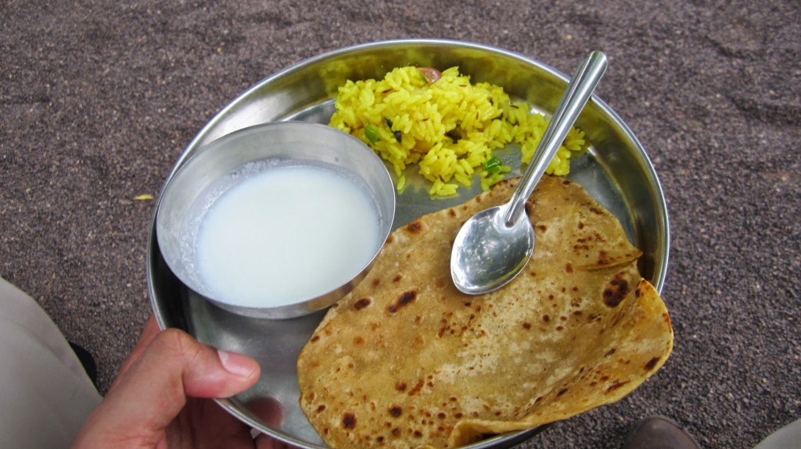
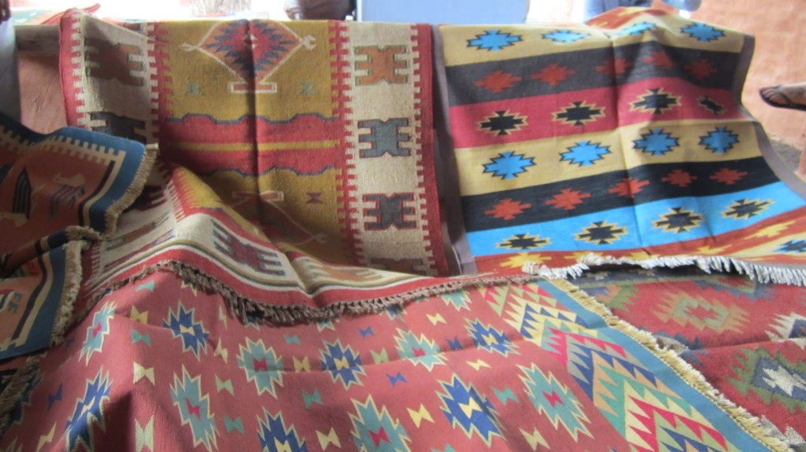
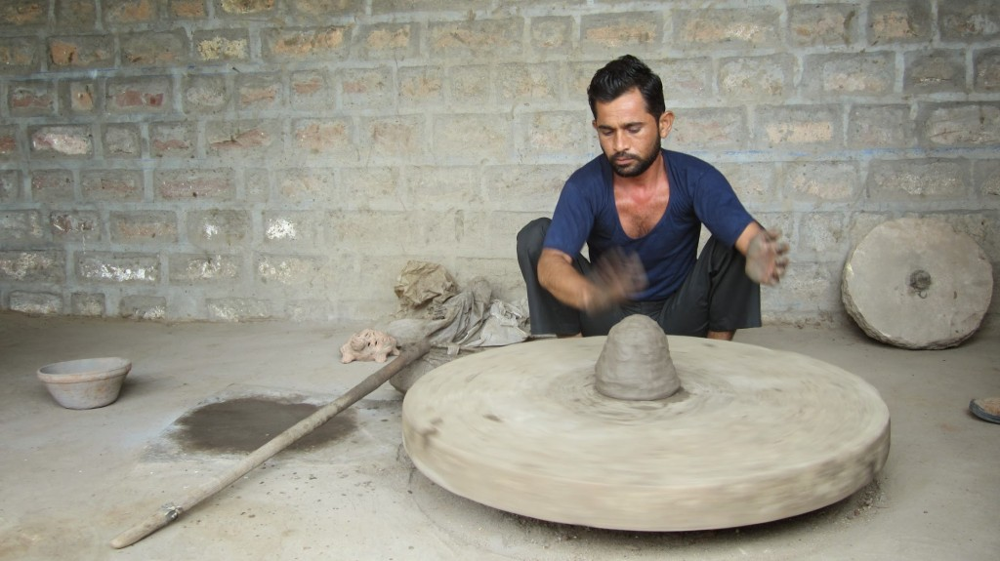

The city of Jodhpur is a great place to indulge in history and heritage. It is the second largest state in Rajasthan and is known as the blue city due to vivid blue painted buildings sprawled around Mehrangarh Fort.

We visited Meherangah Fort, which is one of the largest forts in India. The majestic fort is 400 feet above the city, and provides spectacular views over the city. We took an audio tour guide which I enjoyed, it’s like having your own private history lesson at your own leisure_._ Inside the fort there are impressive collections of elephant howdahs, royal palanquins and ancient weaponry.

The following day we visited a local village specialising in handmade carpentry and pottery. Stopping off at Pukhraj Durry Udhyog in the morning, we were treated to a delicious homemade breakfast (which consisted off rice, paratha, yoghurt, semolina, lemon-orange pancakes, bananas, fresh mango juice and chai!). With unlimited refills and full tummies we watched how rugs are handmade, whilst several group members joined in. The time and energy put in to create the rugs really impressed us, it takes on average 3 weeks to complete a rug from start to finish. We did see a couple of rugs and couldn’t resist a purchase!

Watching our breakfast being cooked by the local women

The first part of our awesome breakfast

Colourful selection of rugs on offer, we bought the rug on the left hand side 🙂

We also stopped off to visit a nearby family specialising in pottery. The craftsman showcased his impressive clay skills to the amazement of us all as we had to guess what he was making. It was great fun to watch and the group also had the opportunity to try it themselves. Of course there was a chance to buy some clay souvenirs but we chose not to as we had no room to carry anything delicate!

Amazing pottery about to commence!
