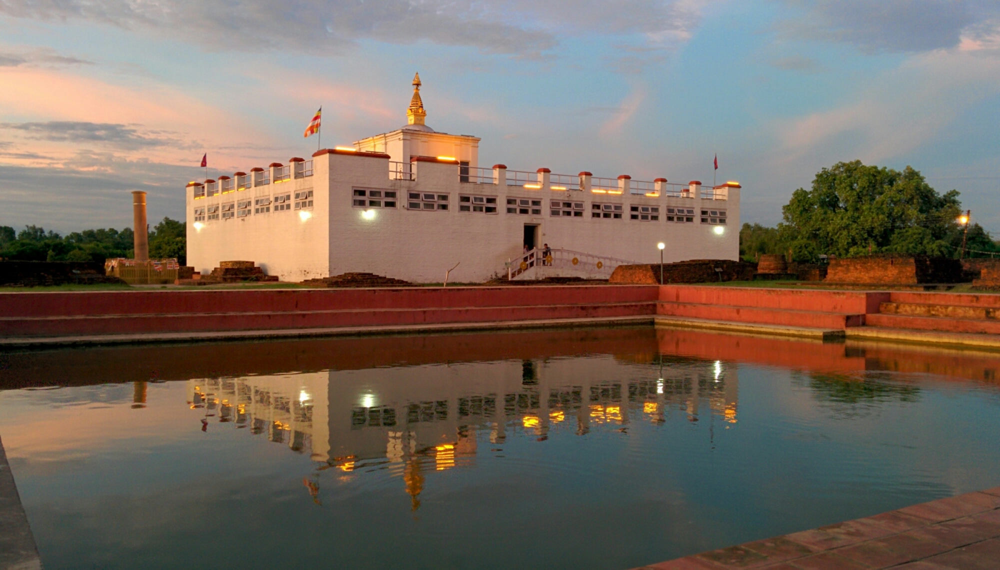
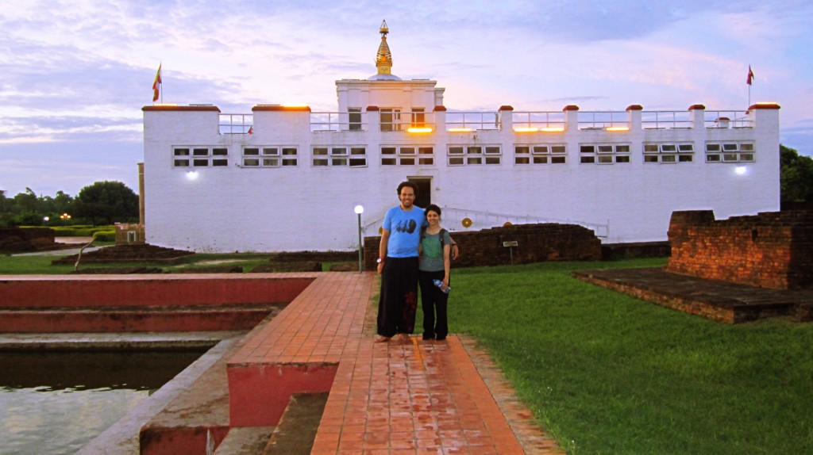
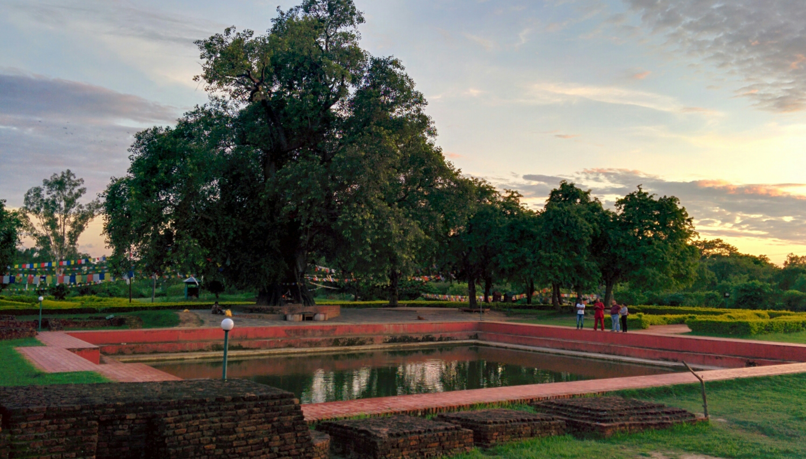
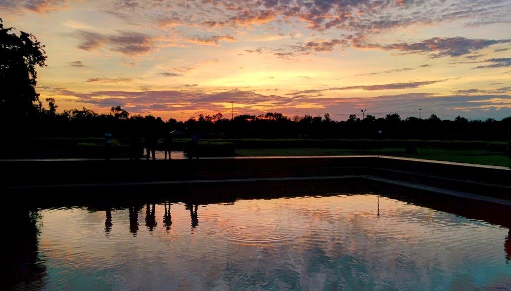

Mayadevi temple

Lumbini is one of the holiest places on earth and is known as the birthplace of Buddha. It is a religious pilgrimage for many devotees around the world. Lumbini is allegedly the place where Queen Mayadevi gave birth to Siddhartha Gautama (Lord Buddha).

After a 10 hour bumpy ride from Kathmandu, we dropped off our bags at the Lumbini Garden Resort and waited for the group to arrive. (The resort comprises of several lodges within natural scenery, it’s a wonderful place to disconnect from technology and connect with nature. Star gazing on a clear night was a personal highlight for me!)

We missed out on the days activities, but Bikash (the tour leader) arranged for us to visit the Birthplace of Buddha when the group members got back. We were welcomed back by the rest of the group then shortly made our way to the site. Fortunately for us when we arrived the temperature had cooled and there were minimal tourists.

We had a peaceful walk inside the temple and around the gardens whilst Bikash explained the legend behind Buddha’s birth. Adjacent to the temple is the sacred pond and ancient Bodhi tree.

There are plenty of spots to sit down and absorb the peaceful environment around, even watching the monks praying besides the grand tree. There is a sacred, spiritual nature which can be felt – _regardless if you’re Buddhist or not_.

It was a beautiful way to end the day and uplift our spirits.

