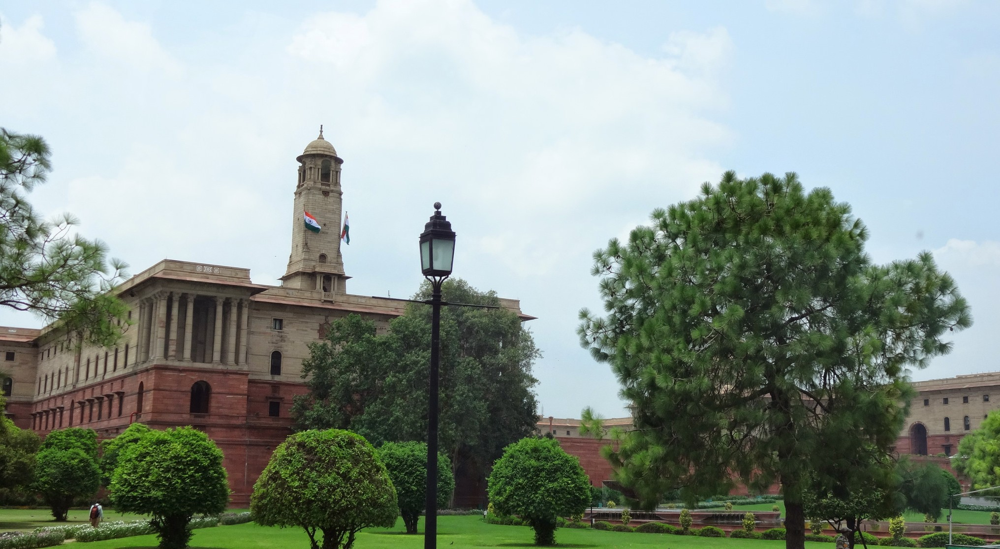

Following a 14 hour sleeper train journey from Udaipur (which left me feeling fragile and restless) we finally reached New Delhi where our tour ends.

After dropping off our bags at Hotel Perfect (which we found rather average _ironically_) we went out to do some sightseeing. As we were out on the day of Eid ended, the tour leader cancelled the scheduled activities due to safety concerns. Instead, our sightseeing consisted driving past the Presidency estate and a quick stop off at India Gate.

As this was the last day of our tour, we all went out in the evening to Raasta, a Caribbean lounge in Haus Khas Village. There’s a good choice of drinks and cocktails, and a good choice of food on offer. Unfortunately it was also karaoke night (I hate karaoke) which was painful to listen to, but great to see everyone have a good time.

The day after we checked out of Hotel Perfect and said our goodbyes to the group members left. After a crazy fun-filled weeks of touring it was sad to say goodbye. We were sad the tour had ended, but happy that we were finally able to get a good nights. No more early morning starts – yay!

We checked into Hotel Staywell which is located near New Delhi rail station, as we are planning to get a Vietnam visa. It should about take a week to process. In the mean time we are enjoying the thought of a good nights rest, WiFi to catch up with friends and family and planning our itinerary for Vietnam. The journeys only just beginning for us and we can’t wait to see what’s next 🙂
