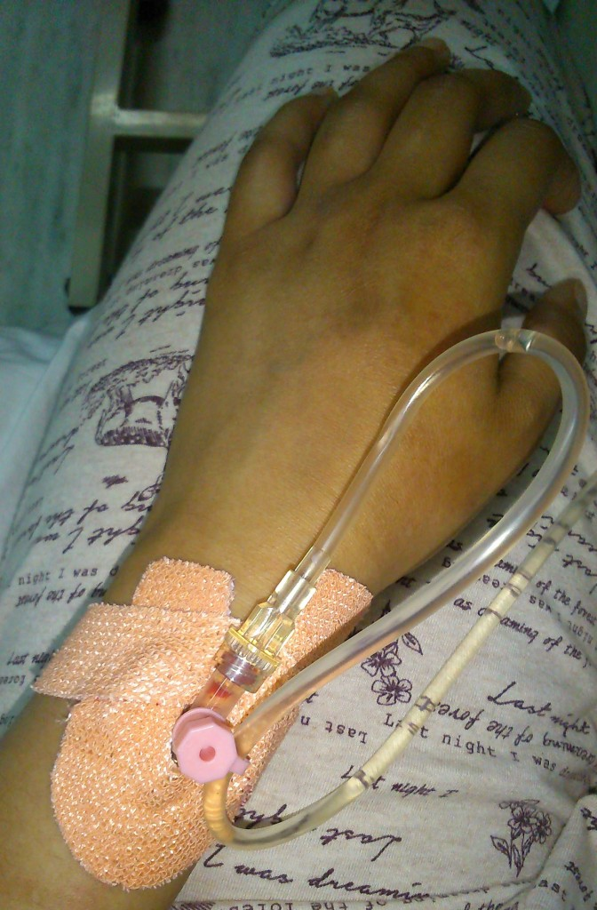

…I unfortunately come down with food poisoning!

I fell ill on the second day during the tour after we all went out to eat at a local restaurant. Deciding to _play it safe_ I opted for a vegetarian thali dish. Admitted I didn’t feel 100% before the meal, however it was during the meal where I was starting to feel pretty uncomfortable. Luckily I made it back to the hotel in time to experience severe diarrhea and vomiting.

After rehydration sachets, immodium tablets and chugging back bottles of water (all of which I threw back up) I still felt awful. This continued throughout the night, it got until 3am where Kyle called the tour leader for medical assistance (_there was no way I was well enough to do the original group plan – to be ready at 6am to leave to Chitwan_).

The tour leader Bikash arranged to take me to the nearest clinic where I was seen to straight away. Diagnosed with food poisoning and dehydration, I was placed on a drip immediately and required to stay at the clinic for two nights. The clinic kindly put us in a room where Kyle had his own bed so he could stay with me.

As soon as I was well enough (and our travel insurance had paid the clinic costs) I was discharged promptly and went back to the hotel. A Gecko’s tour representative came over to discuss how we can reach the group at the next destination. As I had been kept in for an extra night we missed out on going to Chitwan National park.

We were gutted about this, but just stayed positive and moved on.The tour rep was helpful and arranged transport to Lumbini for the next day and paid for the extra hotel nights (it saved us the stress of arranging it ourselves).

Personally, there was nothing that could’ve stopped me being ill. Travellers diarrhea/food poisoning can happen anywhere and anytime. I was fortunate to be in a tour where I got help and medical attention straight away. Both Gecko’s and Ciwec clinic provided the assistance to help me better and get us to the next destination as soon as possible.

_Big thanks to Geckos and Ciwec for my recovery, and special thanks to Kyle who stayed and kept me company!_
