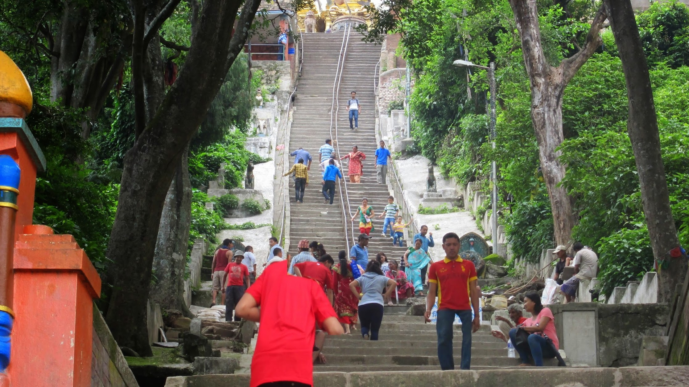
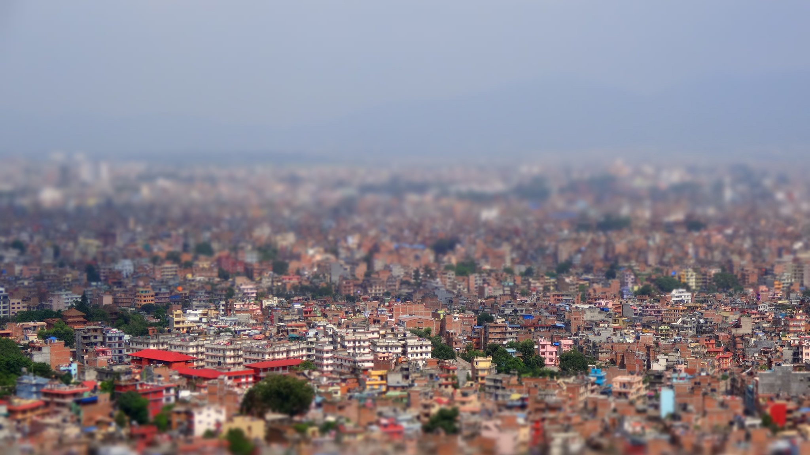
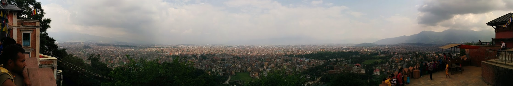
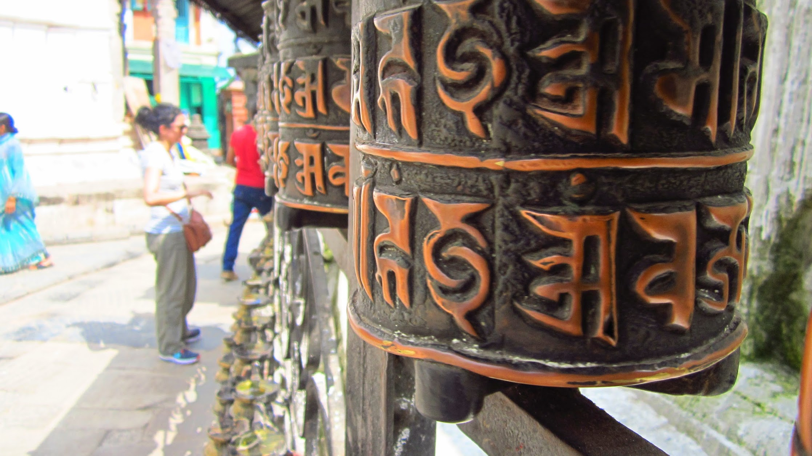
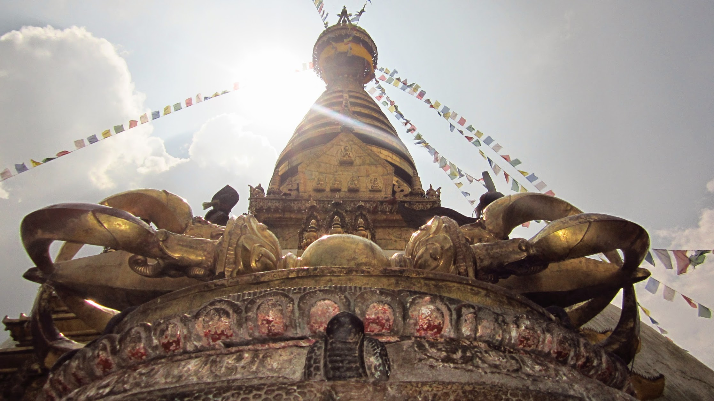
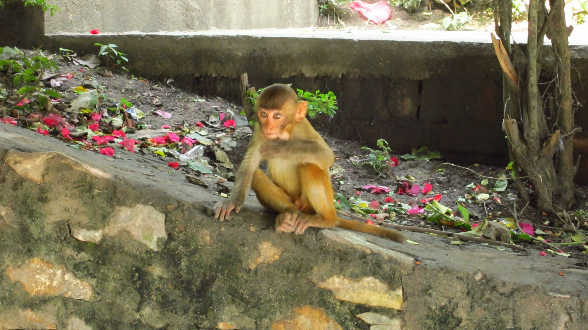
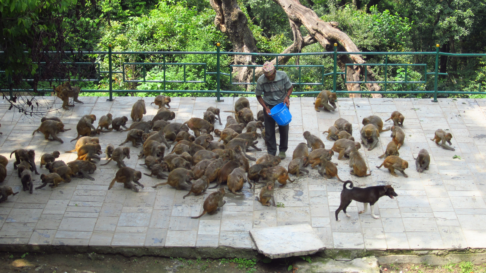
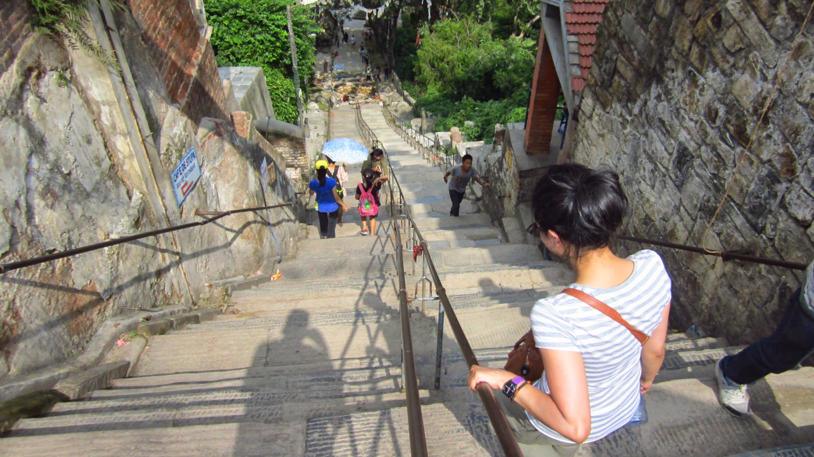

……Or the Monkey temple as it’s otherwise known!

After hearing recommendations from fellow travellers we challenged ourselves to walk to the temple, venturing into new territory away from the touristy hub of Thamel. Soon after we left the central markets, we were beginning to feel so much calmer. We were able to walk freely without someone hassling us to get into a taxi or buy their items at a _‘special discount’_. No children were begging and following us around; instead the kids waved enthusiastically at us and kept shouting _hello!_ as we walked past.

It took about 35-40 minutes to reach the temple from B&B. Three golden Buddha monuments greeted us as we arrived at the entrance. Following the monuments is a long stairway leading up to the temple.

_Word of warning, the stairs take a lot of energy out of you unless your reaally fit, in which case you’re fine._

Entry is 200NPR per person (for foreigners I should say, rates for locals are 50NPR pp). After we reached the 365th step (_according to Wikipedia, I was too tired to count_) we turned around to see the breathtaking panoramic views of Nepal. It was a beautiful sight which none of our cameras could fully capture. It’s something you have to witness for yourself. Absorbing the views up top for a while, we went in search to find monkeys. It didn’t take us long before we found a group of cheeky monkeys playing in the trees and munching on treats given by tourists. It was great getting up close to them, plenty of photo opportunities are available.

Incredible view!

After a couple of hours roaming around the temple the heat was starting us slow us down. We decided to retreat to the long stairway down and make our way back. I would definitely recommend visiting the temple, it’s a great way to spend an morning/afternoon away from the hype in central Thamel.

Making our way back down

_Just imagine how great it would be to arrive at the top when it’s sunrise (note to self: must do this next time I’m in Nepal!)_
