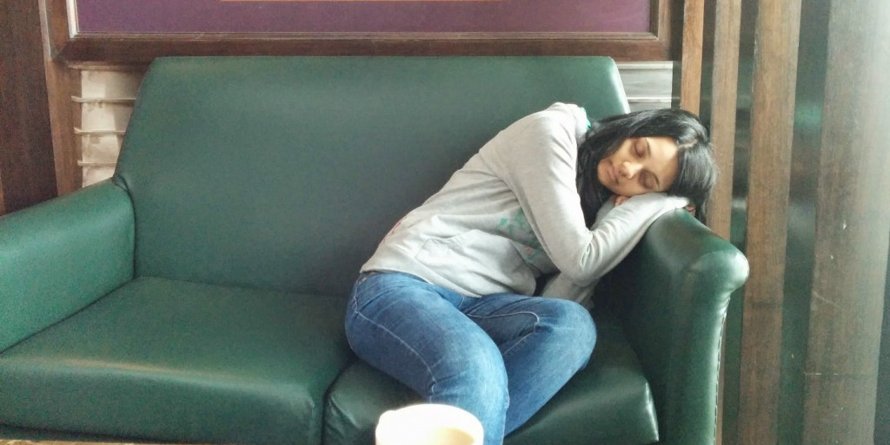
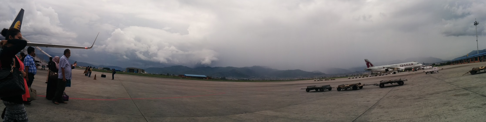

Having to contend with a delayed train to the airport, a delayed flight (we’re talking 24 hours later for departure) _and_ a 10 hour connection was not the way I imagined our travelling journey to start, but it was sure was an experience.

Our flight from London Heathrow to Delhi did not depart due to ‘technical issues’. We boarded the plane which intended to depart at 20:45 – it wasn’t until 00:45 when the pilot announced the plane wouldn’t be departing till 17:00 the next day! Tired and confused, we were moved from plane and carted off in coaches to nearby hotels. We didn’t arrive at our hotel till 03:00 (imagine an angry group of passengers queuing to get their hotel room with just 2 staff at the desk) but luckily managed to get in bed by 03:30. Even though the flight delay was frustrating, having a few hours rest, breakfast and lunch was a welcomed prospect.

The worse part of the ordeal was missing our connecting flight from Delhi to Kathmandu. Due to the delay to get to Delhi, we were informed that there would be a 10 hour connection time at Delhi before we boarded our connecting flight. Once we arrived at Delhi, we were desperately trying to keep ourselves awake for the next 10 hours which was easier said than done! I didn’t care for shopping, eating or talking – I just wanted to sleep. On several occasions I found myself dozing off and waking up in panic mode because I though I missed the connection!

Trying to stay awake at Delhi Airport

Anyway, we did eventually get the connecting flight and landed in Kathmandu safely. We opted to get a Visa on arrival which was really easy to do. We even had a free airport pick up from the staff at Zen Bed and Breakfast (where we’re staying before we embark on the Gecko’s tour to India). Even though we had arrived a day later than expected we were so happy once we received the room keys. Finally, we can start to enjoy Kathmandu!

We landed!
