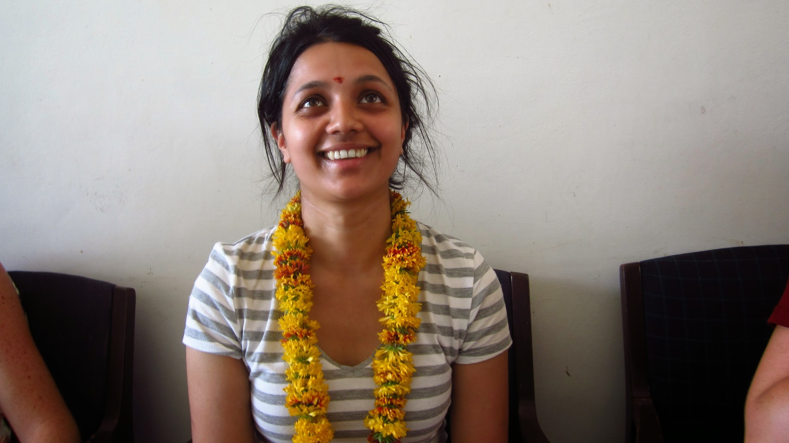
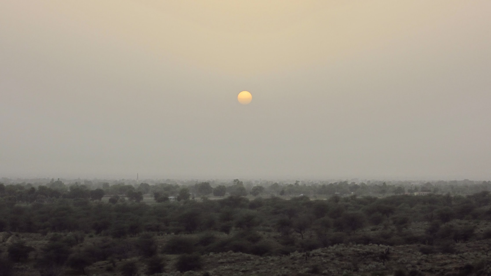
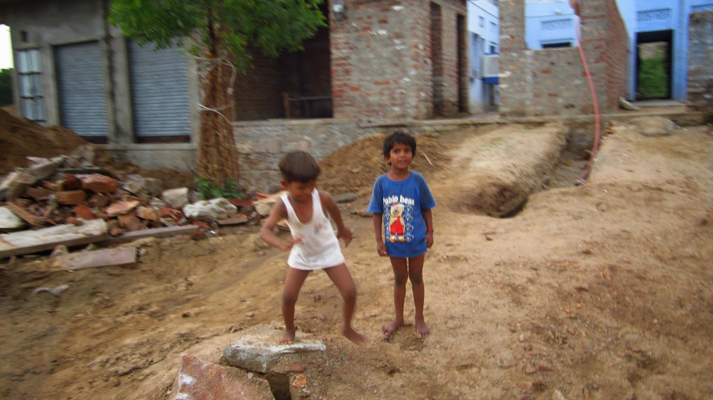
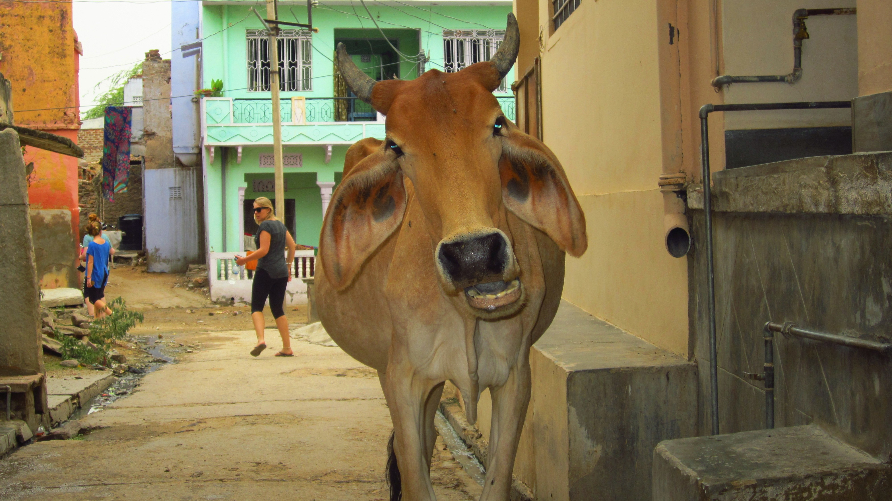
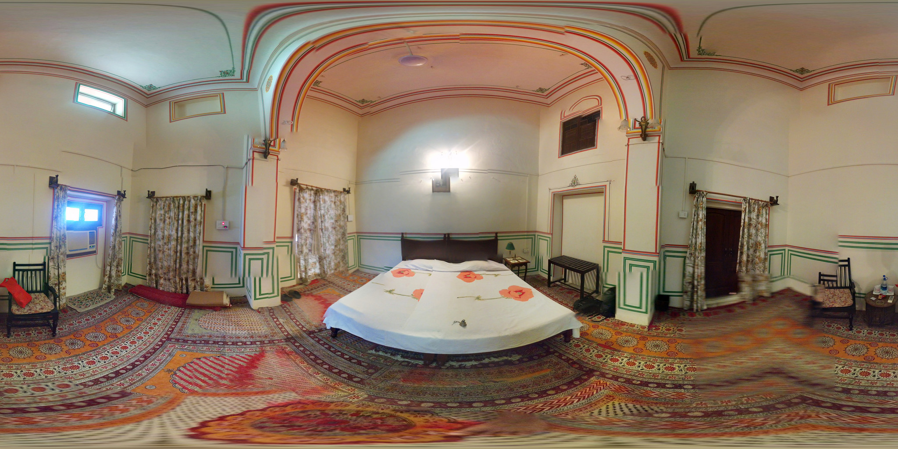
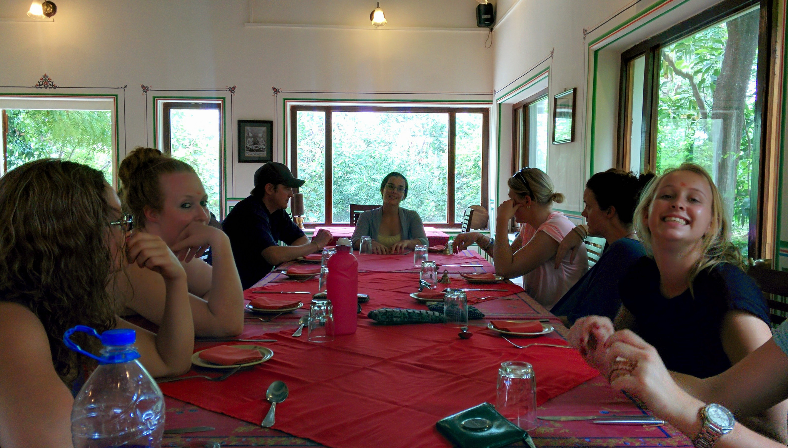
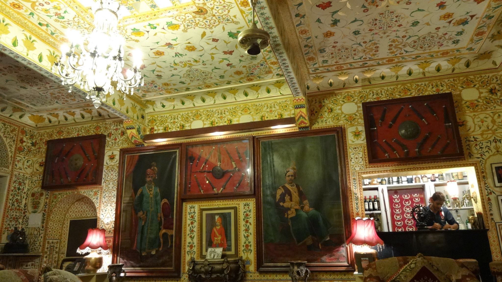
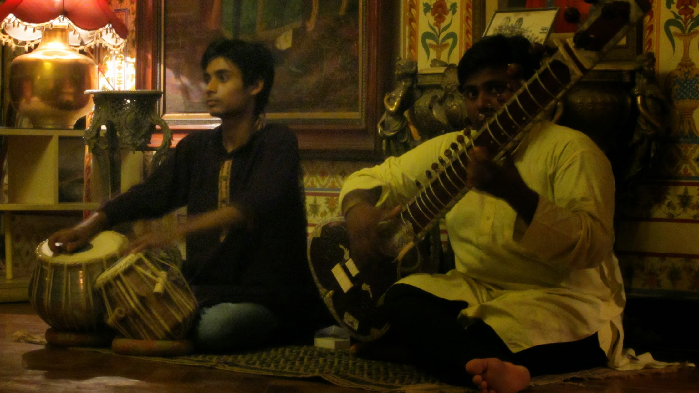
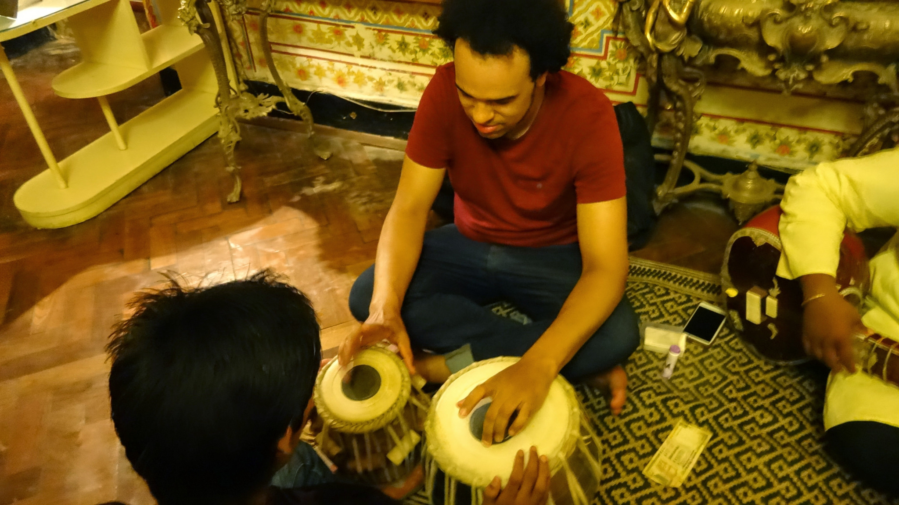

One of the highlights being on tour is having the chance to go ‘off the beaten track’.

Tordi Gardh and Nimaj Bagh were both amazing villages we had the privilege of staying at. I thoroughly enjoyed both stays and loved the caring hospitality received by all. The friendliness and warmth from the locals will not be forgotten. It’s as close the group will get to the ‘real’ India I’ve seen on my former trips with family.

**Tordi Gardh**

We stayed at the Tordi Gardh hotel and were greeted with a warm reception from the locals. The hotel staff were superb and accommodated all our needs. The rooms were spacious and clean, the hot water was most certainly welcome! In the afternoon we went on a camel ride to a nearby hill, which we walked up and watched the sun set with a cup of chai. It was a perfect occasion to reflect and reset.

Feeling welcomed at Tordi Gardh hotel, shame about the messy hair!

Camels waiting to take us to the hills

Watching the sun set in Tordi Gardh

Children running up to us shouting hello! and waving

**Nimaj Bagh**

We stayed at the Rawla Bagh hotel and received another warm greeting from the locals in the village. The rooms were huge and beautifully decorated. There was also a pool and lounges – proper fancy facilities! For the evening we went to Hotel Bissau Palace. The hotel interior is lavishly decorated, we enjoyed a fantastic buffet put on for us. After the meal we were treated to a live musical performance by Sahil Khan.

