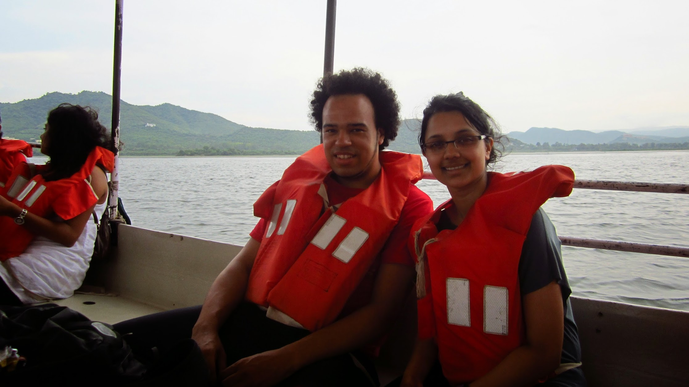

One word to sum up Udaipur? Stunning.

I have fallen in love with Udaipur. Known as the Venice of the East, Udaipur boasts amazing scenery, friendly people, and awesome food.

We visited the City Palace of Udaipur, accompanied by a tour guide. The palace overlooks lake Pichola, and compromises of various towers, terraces, courtyards as gardens. The interior of the palace showcases beautiful artistic imagery, detailed mirror work, and antique furnishings. It’s vital to have a good tour guide to bring the palace’s history to life. Personally there was nothing I disliked about palace, it was by far the most beautiful palace I’ve visited!

In the afternoon we went for an Indian cooking lesson, the chef (Shakti Singh) was also the owner of the hotel we were staying at, Pratap Bhawan. We learned the basics – making the popular masala chai tea, aloo biryani, paneer curry, and chapati’s. We all got to pitch in the cooking and enjoyed the reward of eating it all!

Kyle and Shakti posing for pictures while our chai is brewing 🙂

Like a scene from Masterchef!

In the evening we went on a boat ride on lake Pichola. Unfortunately there wasn’t a guide on the boat to show us what the landmarks were, but it was still nice to be out on the water admiring the scenery.

We ended the evening with a few beers watching the beautiful sunset over Udaipur. The sunset was an incredible end to a joyous day.

