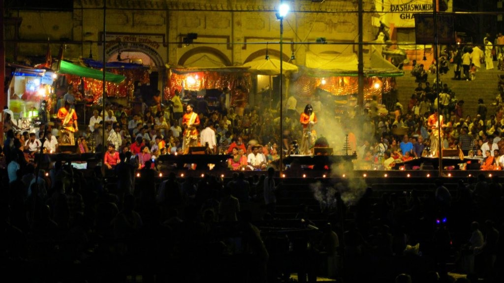

After a bumpy journey across the border we finally made it to Varanasi. We stayed at the Hotel Surya and enjoyed an evening meal at their restaurant. We ventured out the next day to see the River Ganges, stopping off at the Blue Lassi shop. I’m not a fan of Lassi (I generally find Indian sweet stuff _too sweet_ ) but the shop was packed full of travellers and had a vast selection of flavours on the menu.

Making Lassi

Can’t tell if he likes it or not!

Whilst walking through narrow alleyways, avoiding oncoming bikes and cow dung we barely missed a group of cows and dogs charging past us. There was no time to take a picture as it happened so quick, it did shake us all up though!

Wading through a partially flooded street!

At the time we arrived at the Ganges there was a lot of activity around. There was a Hindu festival where hundreds of people were dressed in orange. Walking along the river we saw groups of people washing themselves or their cows nearby, cleaning their clothes or praying. We also saw cremations taking place on several occasions along the river, a surreal experience to encounter.    
An included tour activity involved a sunset boat ride on the Ganges. It was great to take photos of the landscape whilst Suki (tour leader) gave us a brief history of the Ganges. As the sun set we lit candle offerings and placed them on the water.

On the way back we stopped to briefly stopped to watch a ritual ceremony being performed on the banks. There were boats full of families all around us watching the ceremony. It was a wonderful experience to watch and a great way to the end the days activities.  
 

 
