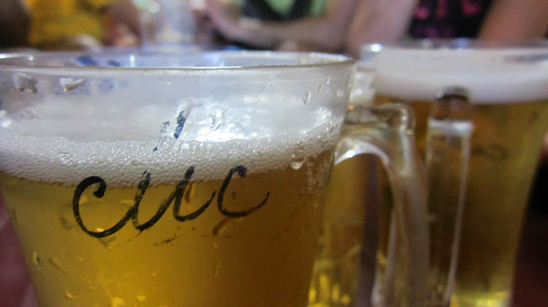
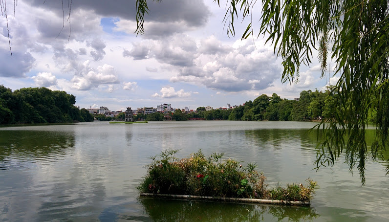
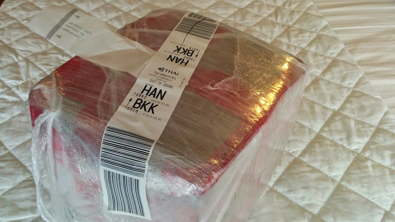

…and we can’t get enough of the place!

Having tackled the chaos of India’s traffic and constant hassle of questions/tuk tuks/beggars, we both felt a huge wave of calm over us in Hanoi (_even though there still is traffic and horns, it’s tame compared to India!_).

We kept the itinerary simple over the days, checking out nearby museums, local eateries and familiarizing ourselves with the area.

I really enjoy the vibe around the Old Quarter as it has something for everyone . There’s plenty of restaurants and bars all within walking distance, as well as the ‘beer corner’ which is naturally a huge tourist magnet due to its cheap prices (approx. 5000 VND per half pint, which is equivalent in UK standards to about 14p!!!)

Now I’m not a fan of beer, but for 14p even I can’t resist buying half a pint!

There are several museums to check out (eg. Womens Museum, Museum of Ethonology or Temple of Literature to name a few) for a good dosage of culture, whilst a visit to the Hoam Kiem lake is a calm setting to chill out, have an ice cream and people watch.

Hoam Kiem Lake

We successfully managed to send our India souvenir box back home (yay!) with a standard courier service. We went for the cheapest option which was via cargo – the downside is that it’ll take 3 months to reach home but we’re glad for now that it’s out of our hands (fingers crossed for a safe delivery!)

Bye bye box! Safe journey back to the UK!

The staff at Tulinh Palace 2 have been superb so far, we’ve always been greeted with smiles and warm welcomes no matter what time of the day. We’ve booked 2 excursions through the hotel – a 2 night trek & home stay at Sapa and a 2 night cruise at Halong Bay. Looks we got a busy week ahead of us 🙂
