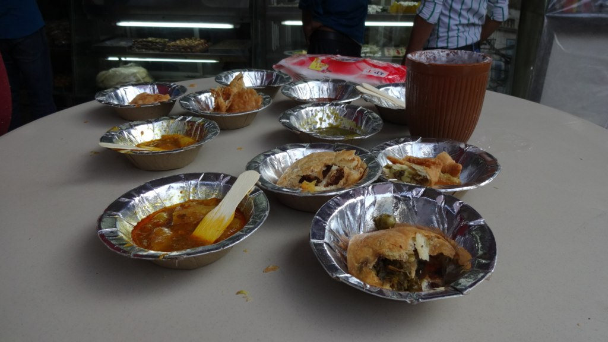
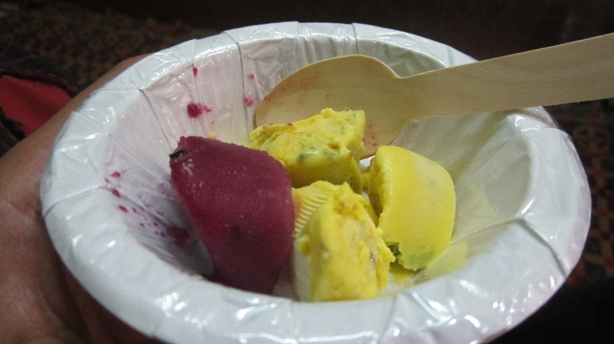
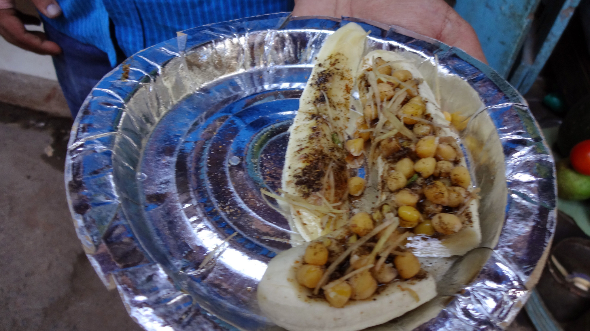
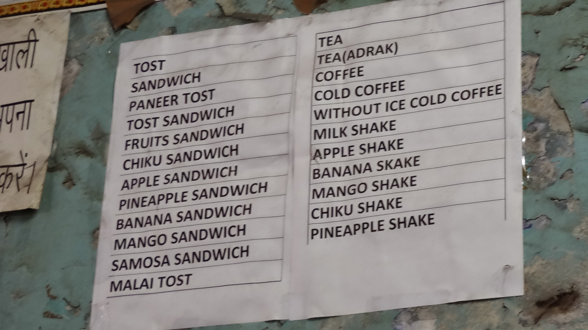
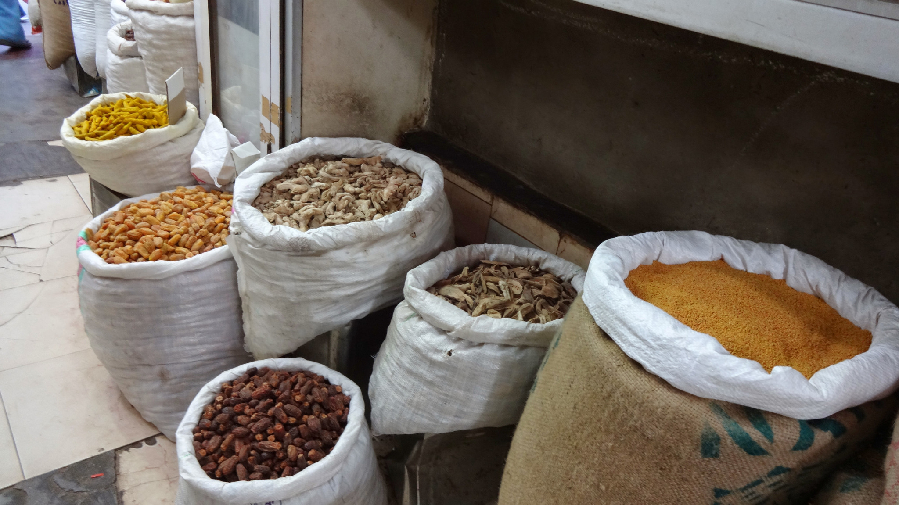
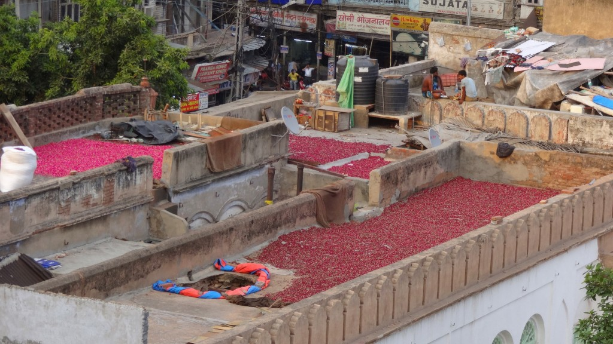
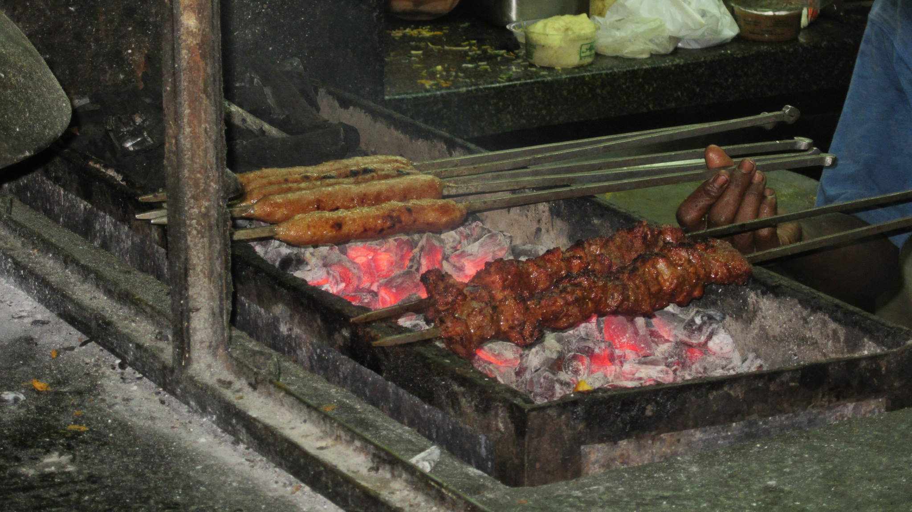
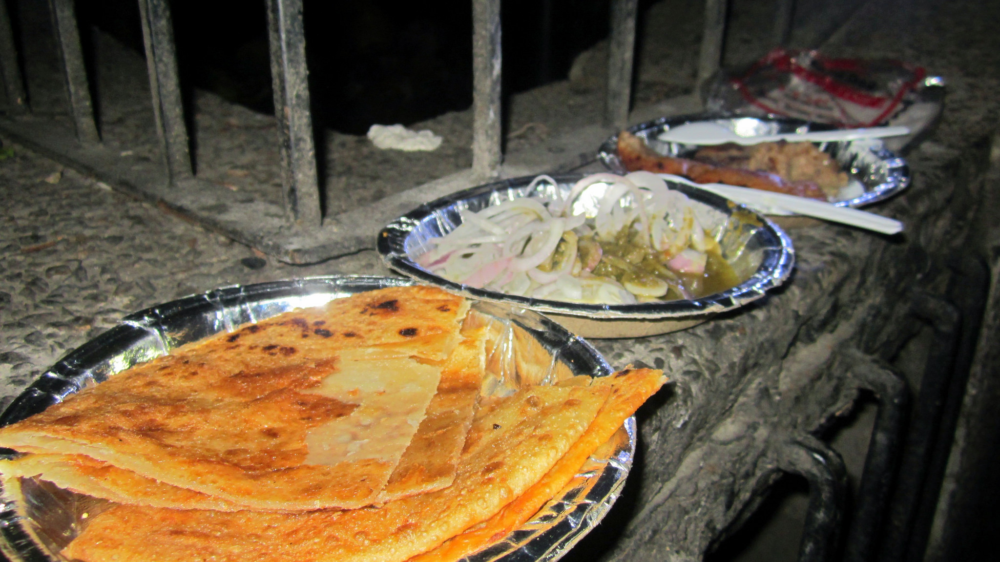

Following a successful day of shopping we went on a food tour in the evening with [Indian Food Tours in Delhi](http://foodtourindelhi.com/#_=_).

Our guide was Jaidev, a very knowledgable guy who knew so much about Delhi’s history and took us to food establishments we would have never otherwise found.

Exploring by foot and rickshaw we ventured into Old Delhi and ate so much – tasty samosas, spicy chicken skewers, lassi, sweet pastries and curries to name a few!

Starting off the tour with a generous sample of street vendor snacks

Delicious kulfi, the purple flavour was my fave (it’s made from Jamun fruit)

You won’t always like everything – I hated this the most!

Besides the food Jaidev gave us a historical insight about Old Delhi. There was a real hard-working nature here, we weren’t hassled by vendors or sales pitches, and there were even no tuk tuks around. We were guided around the local bazaars and learned of the various spices used to make our well-loved curries.

Fruit sandwich anyone?

Bags of fresh spices can be found around the bazaars

Chillies drying on the rooftops

Spicy chicken skewers over hot coals, yum!

Tasty roti with a selection of meats and salads

Due to the amount of food we consumed our tour only lasted a few hours. True to word we arrived back at the hotel with full tummies and happy faces. Jaidev was a very kind and informative guide, we enjoyed learning about Old Delhi and tasting true Indian food from vendors we would have never found. I’d definitely recommend this for anyone wanting to enjoy and learn about Delhi’s foodie culture.

_To find out more information about Indian Food Tours please visit their [website](http://foodtourindelhi.com/#_=_) and [TripAdvisor](http://www.tripadvisor.co.uk/Attraction_Review-g304551-d3879008-Reviews-Indian_Food_Tours_in_Delhi-New_Delhi_National_Capital_Territory_of_Delhi.html)._
