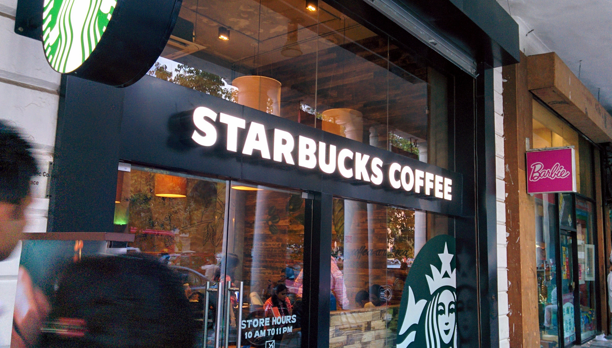
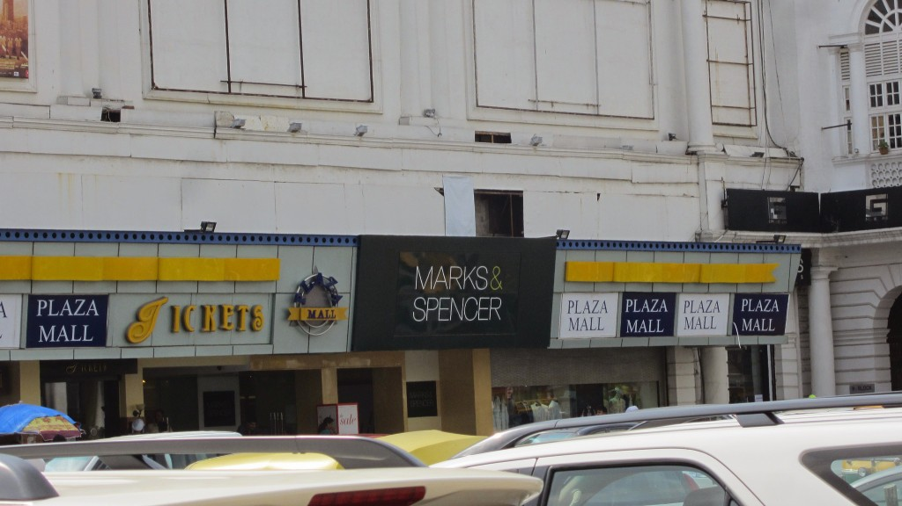
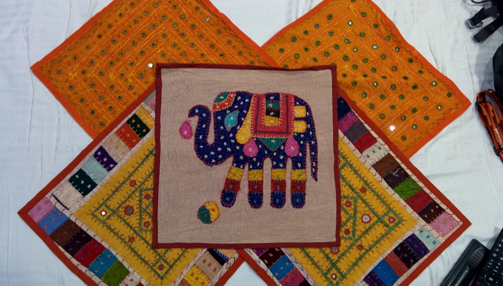

Without the reliability of our tour to get us around, we had the opportunity to get to mingle with locals around Delhi.

The ultimate irony fell upon us as we tried to hail a tuk tuk to take us to the Vietnam Embassy. Usually we’re hounded by tuk tuks whilst we are walking about our own business. However we found that as soon as they stopped and we asked where they can take us, they either asked for too much money (wanting 350 rupees for a journey costing 150 rupees), or plainly put didn’t want to take us that far. After seeing us struggle and failing miserably the hotel security guard came out and helped us. We had to repeat this frustrating process on 3 occasions – we were sent away the first time we arrived at the Embassy as their application times were only open from 10am-12pm. Luckily the other two journeys were okay, though it did take us time haggling with many tuk tuk drivers.

We collected our passports at the Embassy 5 days after submission so we can now book our flights to Vietnam! We kept the remaining days in New Delhi simple. We went down to Connaught Place to see what the ‘hype’ was all about. Turns out it was nothing at all. Just the same branded shops selling the same stuff as anywhere else in the world!

I felt quite disappointed with New Delhi. It didn’t represent the ‘real’ India I had witnessed, but I guess this could be so said for cities around the world. Put off by the commercialised atmosphere and constant stream of men asking us to check out ‘such and such’ place and to get in their taxis, we retreated back to the hotel.

Really?

For shopping we stuck around the Paharganj area (where our hotel was located), there’s plenty of wholesalers offering various goods at competitive prices. We actually did pretty well, buying 3 sarees, tea boxes, pillow cushions and an array of carved wooden ornaments – all of course haggled down to an agreed price.

Just a small selection of colourful cushion covers we bought

On the day we flew out to Vietnam (flight departing 2300) we decided to find a courier service to ship our souvenirs back home. The whole experience was a nightmare! After finally hailing down a tuk tuk to take us to Connaught Place we realised that finding a DHL service was more difficult than expected. We went round for ages, constantly stopping at various points to see if anyone had an idea where it could be. It took us over 2 hours to find a DHL, and when we did our problems didn’t stop there.

To cut a really long and angry story short, DHL could not send our belongings back to the UK because the following items are prohibited – tea, wood, carved wooden ornaments…which were pretty much most of the souvenirs we bought. Me and Kyle were furious about this, because they could not offer a proper explanation as to why they couldn’t ship the items.

Every item was neatly packaged in their own plastic wrapper, nothing had been open. Even their guide-book had no specific guidelines stating that only tea from China or Hong Kong couldn’t be exported to the UK. No matter how much we challenged their decision, they couldn’t do anything for us. Feeling defeated and stressed we left their office and went back to the hotel. We gladly packed our belongings, paid the hotel bill and requested a taxi to the airport.

At the airpotr we watched the Lego Movie (which was really good and had us giggling!), played cards and knocked back large amounts of caffeine. Fortunately we were able to check in our box of souvenirs so lets hope we have better luck in Vietnam.
