Visiting Sapa is a must do for anyone travelling around the north of Vietnam. Sapa is home to a rich diversity of rice terraces, lush vegetation and remote hill tribes.There are plenty of travel agencies in Hanoi that can arrange day or night excursions with the choice to stay in hotels or with the locals.

We were recommended by our hotel to book a 2 night home stay in North Sapa (as the North is said to be less touristy than the South). The receptionist assured us that we’ll have a great time as Sapa is her home village. We also got speaking to another couple who recently visited and had a fantastic experience.

Hearing all these amazing stories we decided to book the tour. Our expectations were high and we did not want to be disappointed!

We booked a 2 night home stay in northern Sapa. We weren’t given an itinerary so we didn’t really know what to expect – on the day of departure we got our sleeper train information and were informed that we’ll be picked up from the train station from there. Once we arrive in Sapa someone will meet us there and will take us to our home stay. Simple right?

We were booked on a deluxe 4 sleeper cabin overnight train, leaving at 20:25 and arriving 07:00 am the following morning. The cabins were in good condition and the train departed on time (amazing by Asian transport standards!) however the carriages rattled and bumped throughout the night, so there was no chance of us getting a nights rest!

When we reached Lao Cai we were struggling to stay awake, fortunately we found the driver taking us to Sapa and got grouped with other locals going the same direction as us. The journey took another hour and got real bumpy, but the scenery was amazing! Hills after hills of lush greenery, we were leaving the tourism and going into the green.

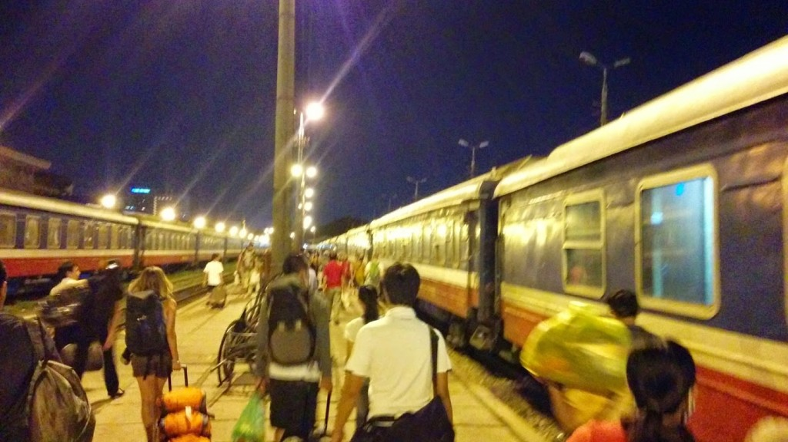

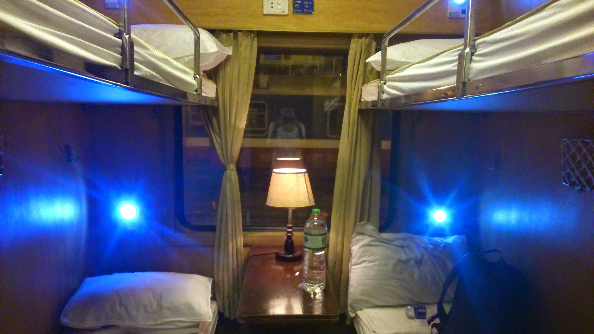

When we arrived in Sapa we were greeted by a very petite lady by the name of Li’May who took us to a cafe for breakfast. Li’May did not speak very much English so it was difficult to have a conversation. From what we gathered, we’d eat and then walk 3/4 hours to our home stay. Breakfast perked us up but not for long.

Unfortunately the ‘walk’ was in fact a 10km trek crossing streams, ascending muddy hills and descending down rocky alleys! _Had we known this was the case, I would have mentally prepared myself!_My Nike trainers couldn’t rise to the challenge faced ahead of me and had me constantly slipping and falling at every possible opportunity, much to the amusement of Kyle!

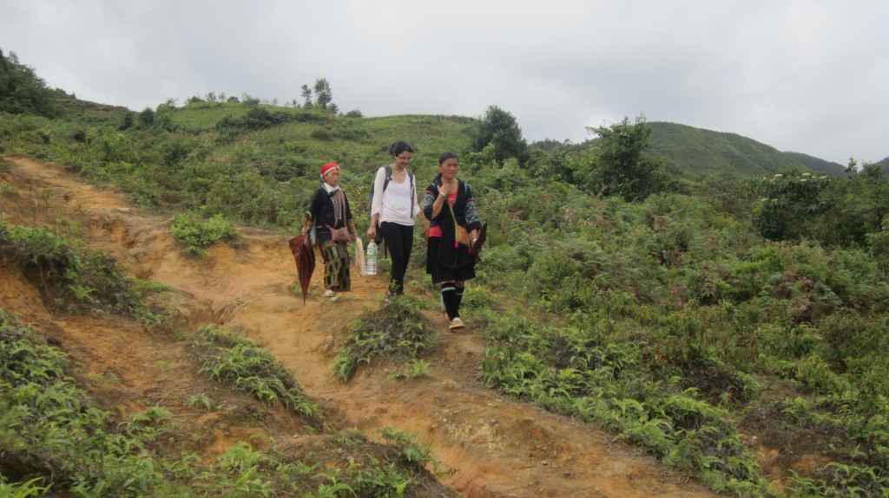

Away we go

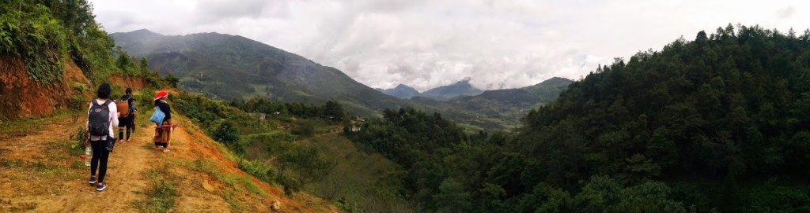

Stunning scenery

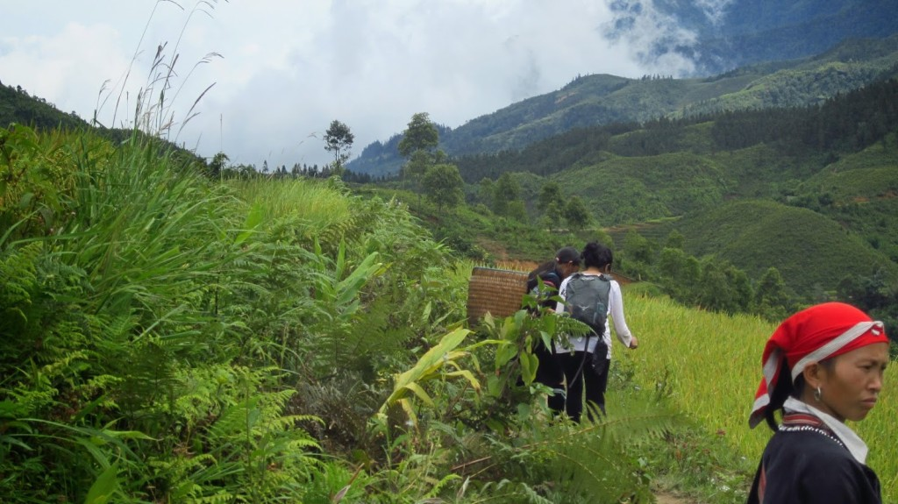

Tripping up again!

It took over 4 hours to reach our home stay, with a brief lunch break midway. We were absolutely shattered when we arrived! After a sweaty, mud filled trainer soaking trek we plonked ourselves on tiny stools to admire the wonderful scenery. The family home was raw and basic. Think hard mud floors, wandering livestock, squat toilets, large tanks of water with buckets to wash and log fire burner to cook.

We didn’t know what to do with ourselves after we unpacked our bags, so we sat and admired the view until the host arrived. Mai-lai arrived a couple hours after us and kindly welcomed us into her home, our meeting was brief as she left to go cook the family meal.

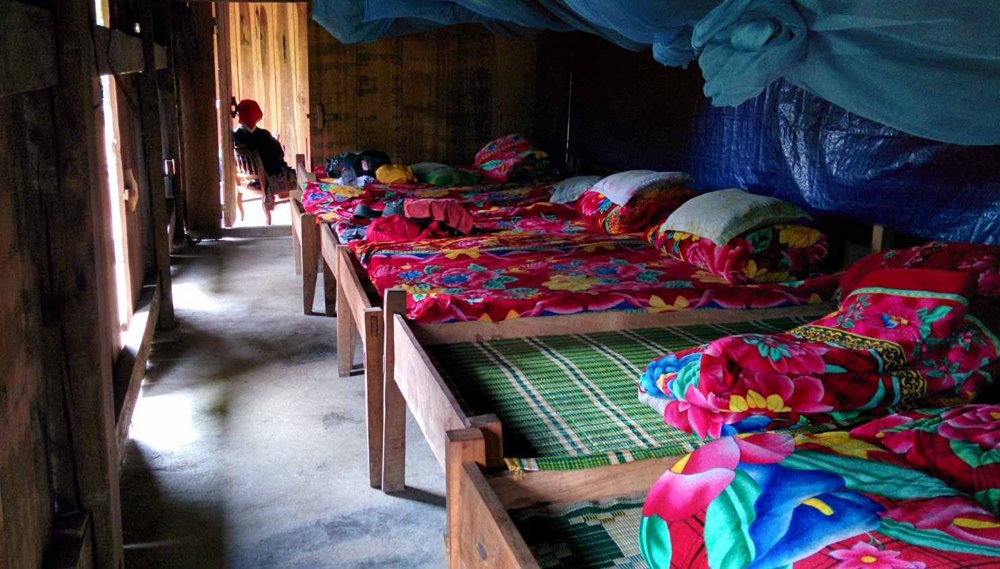

Our dorm room

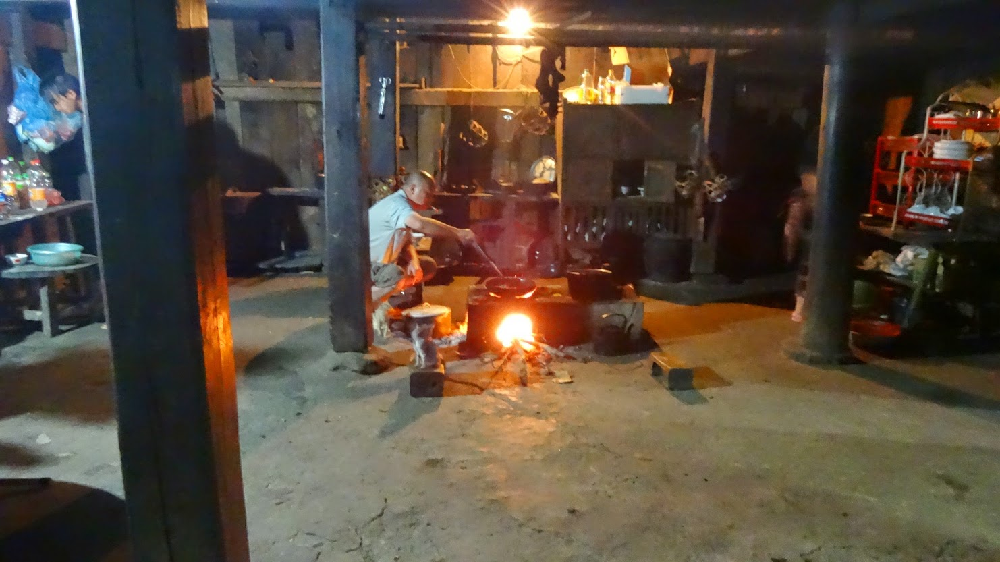

Cooking, the good ole’ fashion way

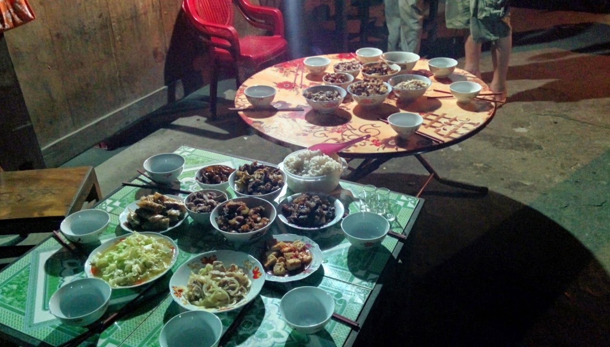

A porky feast!

Catch of the day was pig, so each dish consisted of various piggy parts fried or boiled with veg and rice. We sat around the table with Mai-lai’s family and toasted the meal with a shot of rice wine before we all tucked in. Unfortunately the smell of ‘pig’ became overbearing for me so I stuck with rice and veg! What I enjoyed the most was watching the family together, eating and catching up. Back home its rare to see this family bond. Sadly we’re too attached to technology and take it with us everywhere – even when we’re eating so no one ends up talking to each other!

After the meal we retreated to bed for some much-needed rest. What we forgot (being out in the hills) were our ear plugs, so unless you enjoy the sounds of thousands of insects buzzing away you’re in for another sleepless night!

The next day had a ‘what’s going on?’ vibe again. We enjoyed a simple breakfast of home-made pancakes with bananas, then waited around to see if anyone knew what the plans for the day are. Unlike my initial thoughts about home stays, I felt disappointed that there were no activities to get involved within the household.

Ma-lai was busy for the day so it was up to Li’May to take us out. As it had rained throughout the night we insisted on a lighter trek, so Li’May took us around the villages. The walk was definitely manageable this time round, but lacked any meaning. We visited 2 villages but didn’t get the chance to interact with the locals or hear about their history which I found to be a shame. Our walk lasted 3-4 hours, and we arrived back at the home stay in the afternoon. Once Li’May left we again didn’t have anything to do! Fortunately there were several French girls staying at the home stay too, so we joined them in playing cards and watched a film after the evening meal.

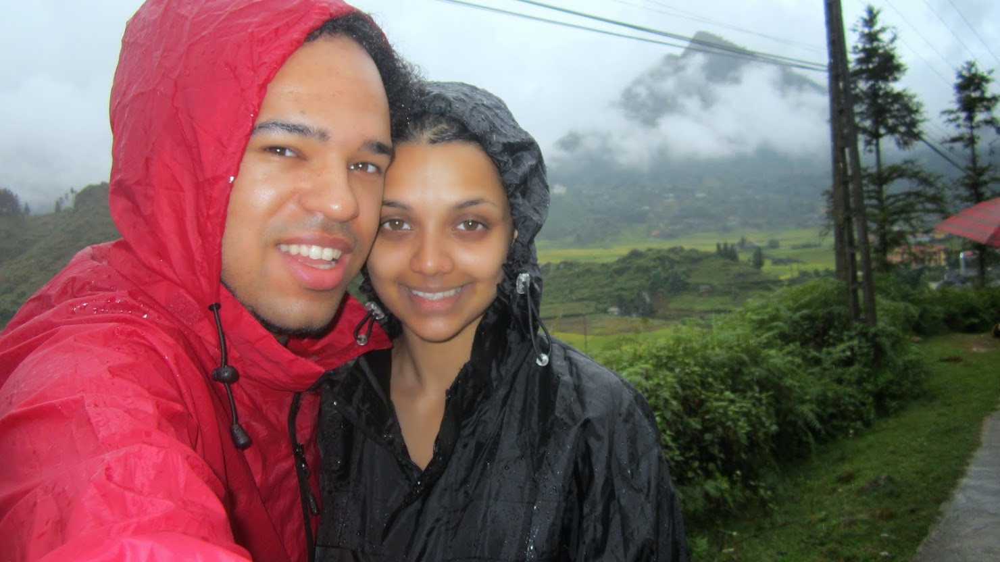

Day 2. Wet but happy to walk an easier route!

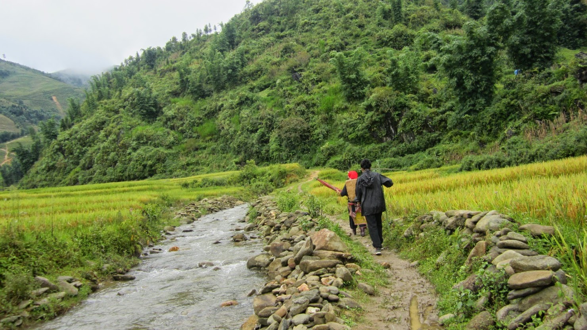

After 2 sleepless nights (thanks to the crazy insects!) the thought of returning to a hot shower and comfy bed in the next 24 hours was a welcomed prospect. Li’May again accompanied us on our walk. As Ma-lai was busy again we didn’t get the opportunity to say goodbye to her.

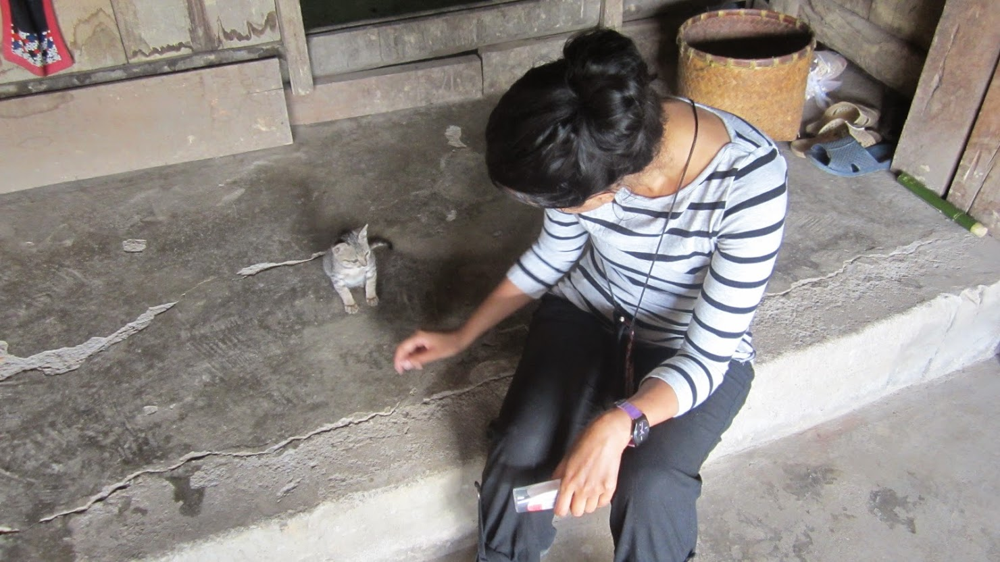

Saying bye to the kittens (was impossible to get them both in the same shot!)

The plan for the last day was to walk through the hills which lead to a main road which would take us back to the train station in Lao Cai. Saying our goodbyes to the rest of the family members we slowly made our way back. The walk was by far the easiest route we’d been on, paths snaking around the beautiful hills. Again the views were stunning, there were several occasions where we sat on some rocks to absorb the peaceful environment around us.

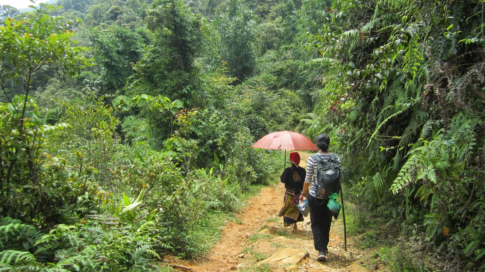

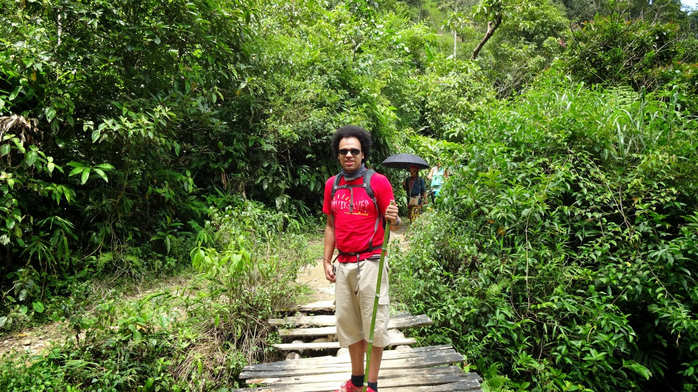

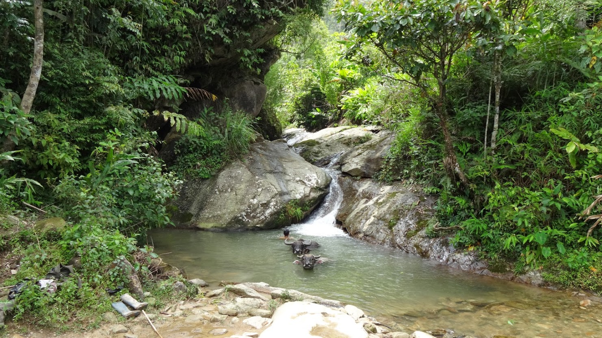

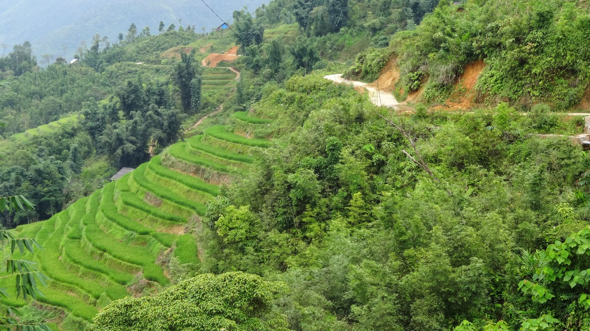

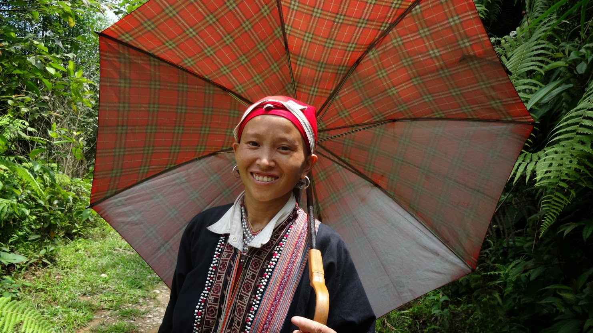

Li’May

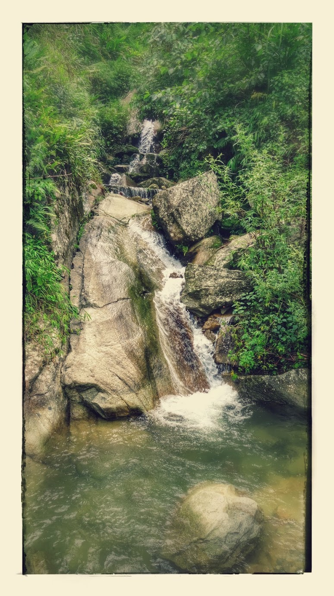

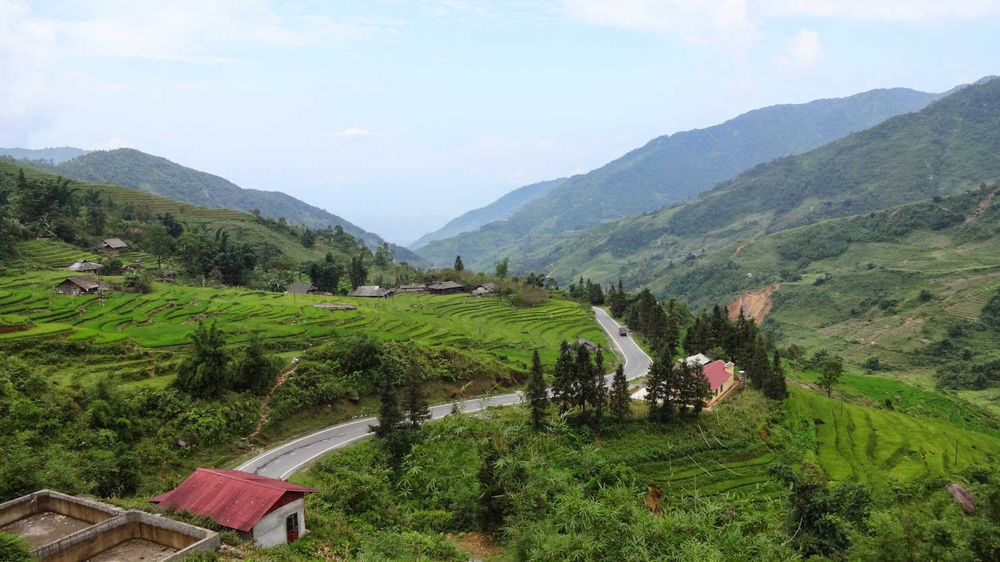

When we arrived at the main road Li’May kindly waited with us till our bus arrived, we thanked her for her time and gave her a tip as we weren’t sure if she’d be getting paid. Thankful that we were now on the bus back, we descended back down the hills to the train station. Our train departed on time again, and due to the exhaustion over the days I managed to get a few hours sleep. We arrived in Hanoi at around 04:45am, and eventually back at our hotel around 05:00am.

Overall I had mixed feelings about our excursion. As there was no itinerary we couldn’t prepare ourselves for the long treks ahead or long periods where we had nothing to do. Li’May was a lovely person but we couldn’t communicate well due to the language barriers, thus missing out asking loads of questions about life in Sapa. I felt that there should have been opportunities to interact and get involved with the families then to just stay in their homes as a novelty.

Regardless of the downsides, I’m still glad I went to Sapa as the landscape was truly breathtaking. There are very few places in the world where you will meet such friendly people, picture perfect scenery and a strong value of traditional family life.

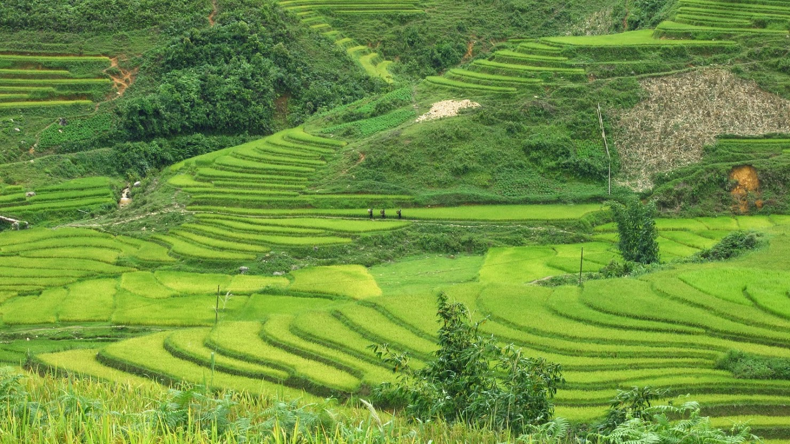

The greenest ‘green’ you’ll ever see!
