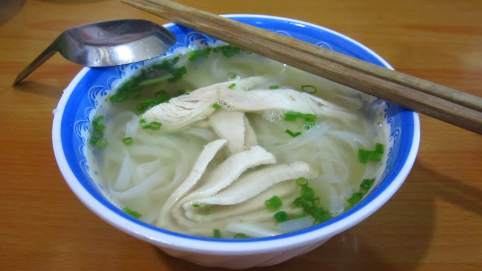
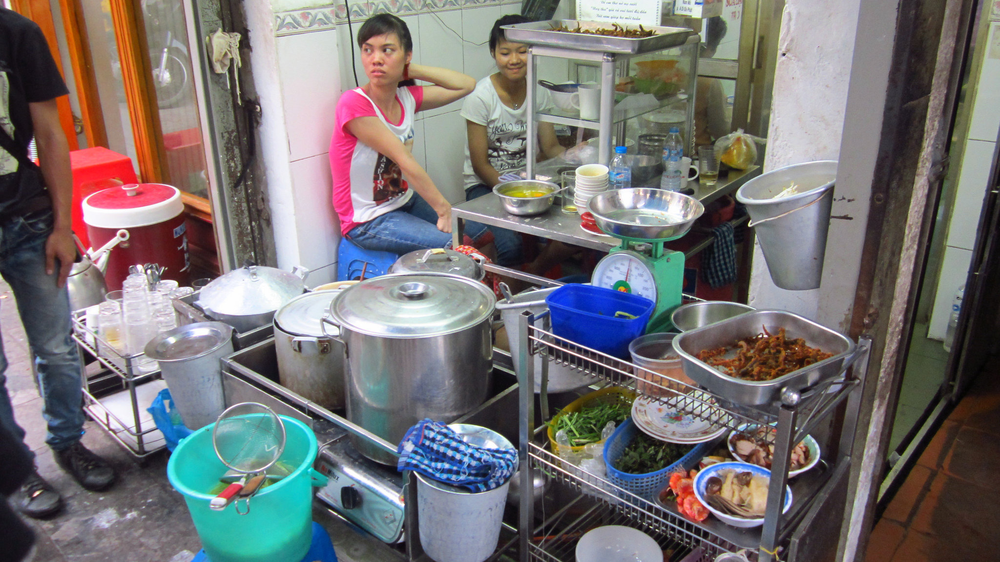
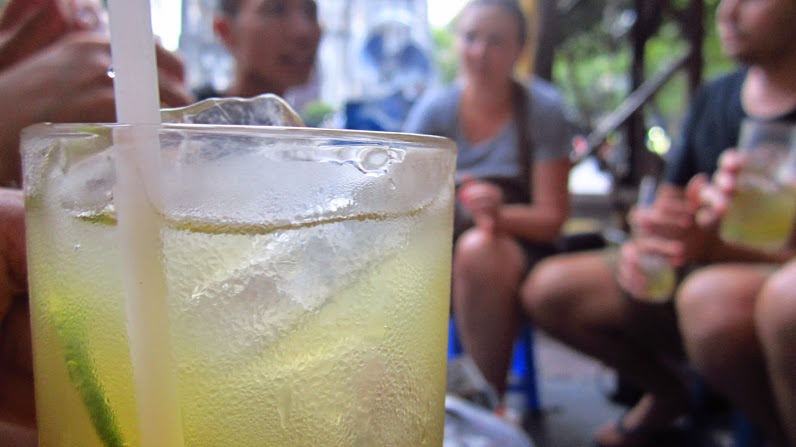
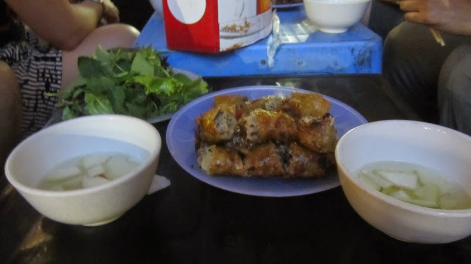
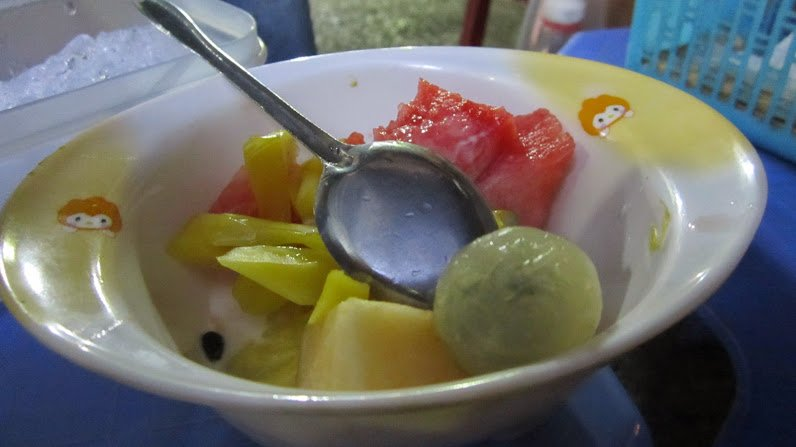
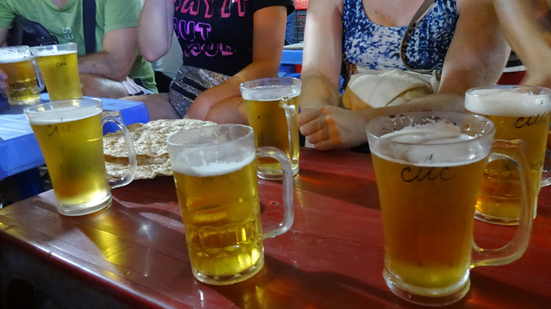
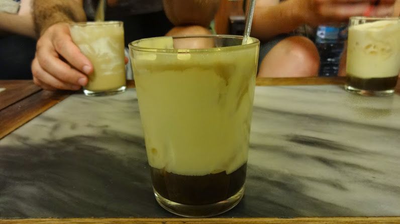
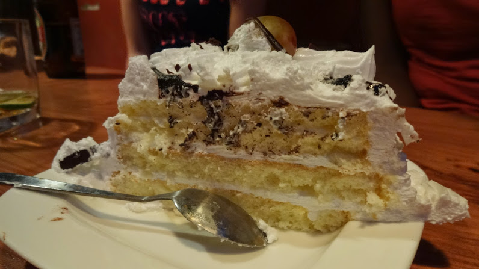

A couple days after settling into our new surroundings and hotel we booked ourselves on a street food tour. I found the tour via TripAdvisor and after a couple of quick friendly emails we were booked for the next day. We opted for the 17:00 start departing at the tour office. The price per person is 20$.

Our guide for the evening was Sea, a fun quirky guy who kept us entertained throughout our time. In total there were 8 of us which was a great size to interact with. We tried a variety of Vietnamese dishes, consisting of pho, spring rolls, stuffed pancakes, mangosteens, fruit salad, lemon tea, local beer and egg coffee (yum!)

Pho Ga (chicken & noodles in a tasty broth)

Having a glass of refreshing lemon tea

Tasty spring rolls

Fresh fruit salad

Cheers!

As we had experienced a food tour in India, we were wiser this time round and ate little bits at each establishment to avoid getting full too early!

I was personally satisfied with each dish I tried, but my favourite had to be the egg coffee. We all thought the worst (_would it be like scrambled egg floating in black coffee?!_) but I’m glad I was proved wrong! The egg is frothed up to a creamy (almost liquid meringue-like) texture, combined with the coffee just makes it so delicious! It’s definitely one to drink slow to savour the experience.

The tour ended with the lovely Sea asking us what we all enjoyed and giving us all a big hug as we returned back to the office. After the tour ended a few of us decided to go for a drink in a nearby bar. It was great to meet new people and share travelling experiences over a couple’ drinks.

The delight that is egg coffee!

Overall I’d thoroughly recommend Hanoi Street Food tours. There will be places which we’ll definitely return to again, especially the egg coffee! I think this is a must do in Hanoi, don’t miss the opportunity to sample local cuisine and gain new friends!

_For more information about [Hanoi Street Food tours](http://www.hanoistreetfoodtour.com/) check our their website here and [TripAdvisor](http://www.tripadvisor.co.uk/Attraction_Review-g293924-d5583955-Reviews-Hanoi_Street_Food_Tour-Hanoi.html) rating. Happy eating!_

Some locals were celebrating their birthday at a bar we went into for a couple’ drinks after the tour. They had a huge cake and kindly brought around a couple of slices to us and others at the bar. As a thank you we all pitched in and bought them a birthday drink! p.s. the cake was GOOD!
