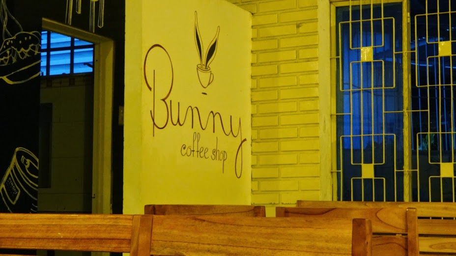
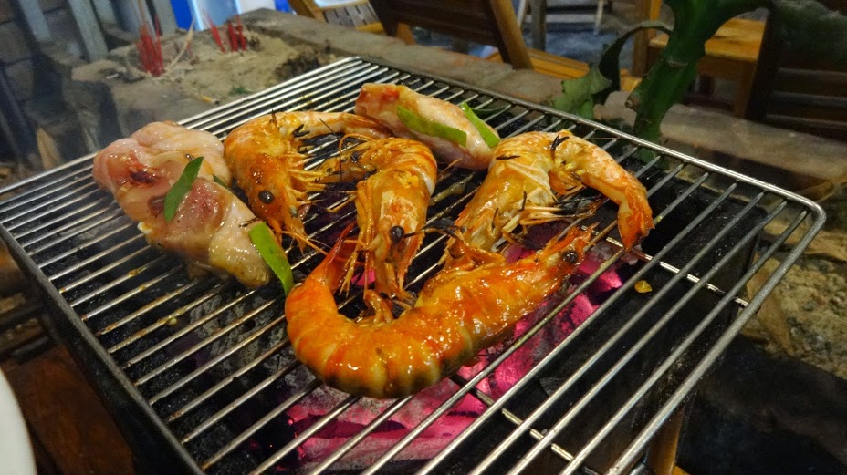
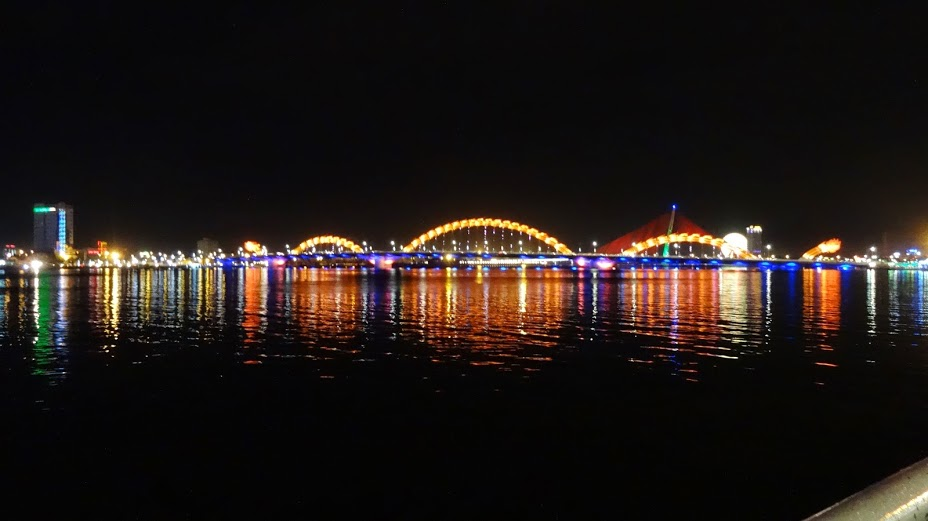
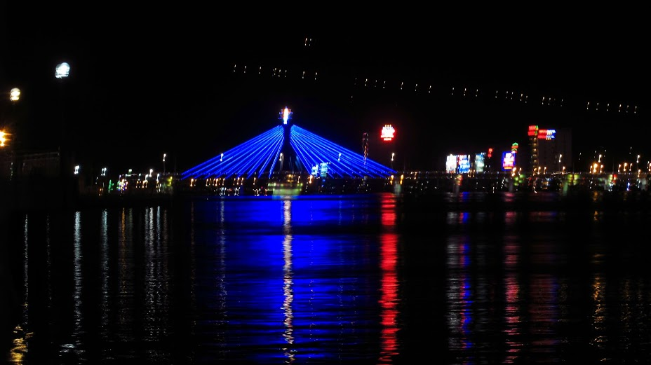
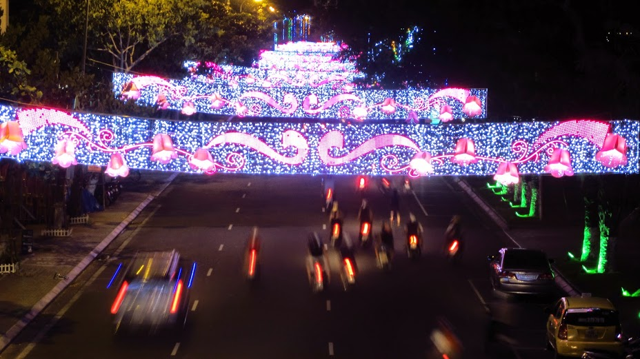
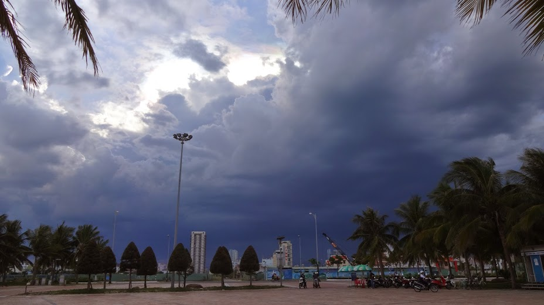

After a 2 hour bus ride from Hoi An we arrived into Da Nang. This vibrant city combines a fusion of sky-high buildings, a stunning beach encased by surrounding mountains.

Da Nang still has a local feel to the area; we rarely saw other travelers during our 2 night stay. This may be because Da Nang is a tad pricey, we stayed at the Olina Hotel which was a few minutes walk to the beach but a 35-40 minute walk to the city. The place is still undergoing a major revamp, there are many construction sites in progress and very few restaurants are within the vicinity.

I believe that Da Nang is an upcoming city with a lot of potential, but for now it’s still in its infancy. There isn’t much to do apart from the beach, there are a couple of clubs and bars but if you’re not a huge drinker (like me) then a stay more than 2 days might get boring.

We kept our visit brief with a simple itinerary. There are plenty of coffee shops around and we found a favourite called Bunny coffee store which did the best cocoa coffee I’ve had in a long time, as well as refreshing Italian Sodas.

We noticed that Da Nang was popular for BBQ style restaurants – we decided to eat at a local restaurant where we got our own little BBQ and chose our meats. The experience was eye watering (from the smoke) and hectic; the place was packed out with only 4 members of staff managing everything. It was crazy but authentic, and as the only 2 Westerners in there we felt as close to being a local.

Grilling up some spicy shrimp

In the evening the city lights provided a showcase of dazzling colours over the waters. The Dragon bridge is a visual feast with its ever-changing colour sequences, a great spectacle to watch from afar.

Unfortunately the weather was patchy during our stay and it did rain often so we only briefly checked out the beach. The beach itself is in great condition as is very well maintained, we didn’t see any tourists there (that’s probably cause the weather was like the picture below!)

Storm brewing up as we got to the beach 🙁

I’m sure over the years Da Nang will gain popularity and receive as many visitors as Hoi An. Still, it’s a good place to rest for a couple of days to get away from the hustle and bustle.
