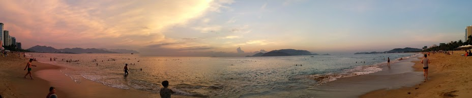
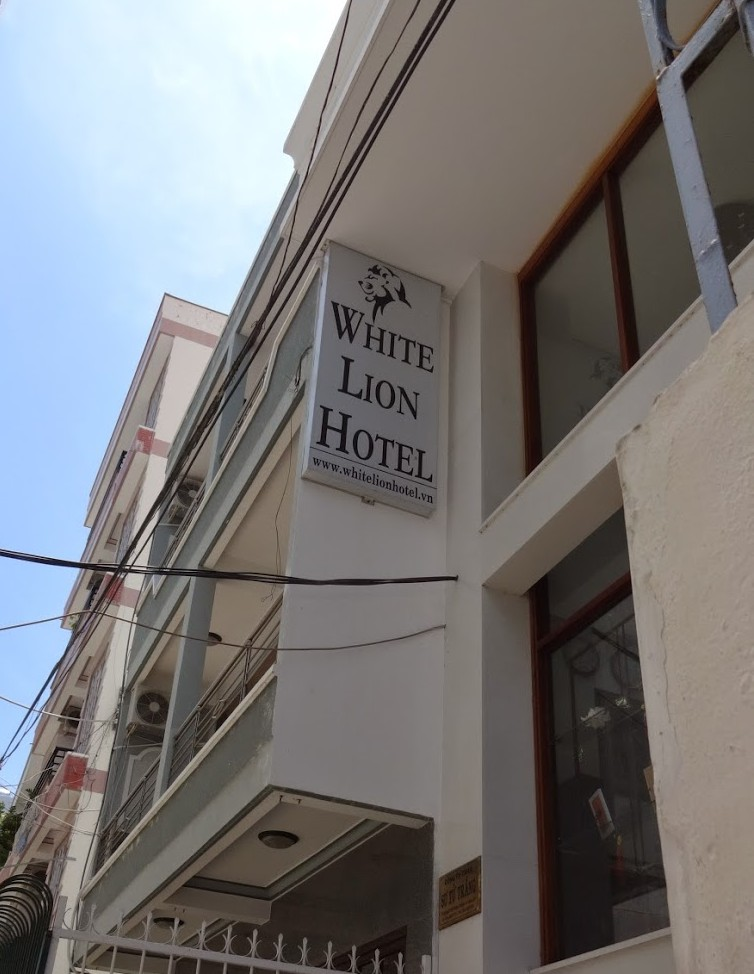
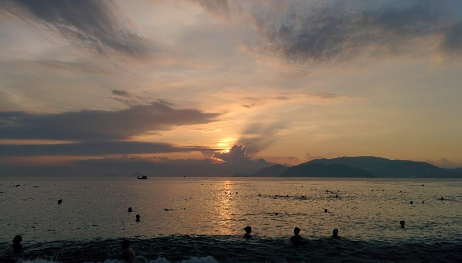

After our second (and final) 14 hour train journey from Da Nang we finally arrived in Nha Trang.

We found a Mai Linh taxi (we find them to be most reputable) to take us our hotel. We initially booked a few nights at the Golden Summer hotel, but we weren’t happy with the room and the staffs negative attitude. We decided to find another hotel for the night and ended up staying at The Summer hotel. After an awful night’s rest we packed up again and went to the Golden Lion hotel, which was the cheapest rate (at 900,000 for 3 nights).

White Lion Hotel – great value and a pleasant stay

Finally sorting our hotel drama, we walked around to see what Nha Trang had to offer. What surprised us the most was the amount of Russians in the area, there were more Russians than there were locals!

Even the shops and menus were adorned in Russian language – it was pretty surreal to see something like this in Vietnam. After a quick Google search it seems that Russia has a direct flight into Nha Trang making it an ideal destination (a bit like Brits jetting off to Benidorm or Majorca).

The only thing that made up for all this was the beach – a long sandy stretch of clear sands and swaying blue waters cheered us up. It was great walking along the stretch in the evening as the sun set. We noticed that when the tourists retreat back to their hotels many locals turn up, frolicking in the water after a long hot day.

We woke up at 5am to see the sun rise thinking the beach would be clear. Wrong! The beach was packed with locals going in the sea for their morning dip, exercising away and scrubbing themselves with sand (natural exfoliation?). We enjoyed the sun rise and the local activity before the heat kicked in and the tourists came flocking.

There were plenty of food establishments and loads of bars with the usual ‘Happy Hours’ that last through the night. The only restaurants we enjoyed eating at were Letimo Restaurant, Lanterns Restaurant and Pita GR restaurant.

Letimo have a huge menu but we stuck to their breakfasts which were really good, they also have cakes on offer which are very tempting (dark chocolate cake looked too good to resist!). Lanterns also had a great menu and the place is always busy which is a great sign. We opted for a little BBQ where we grilled a selection of meats and dish – delicious! Pita GR specialises in Greek cuisine, the souvlaki is authentic and great value for money.

Though Nha Trang had some perks (mainly its food and beach) I still preferred the laid back nature Hoi An had to offer (the beaches there were less busy, and the people were much friendlier). Still, I’m glad I went to see what all the fuss was about!
