As we make our way South of Vietnam we decided to spend a couple of nights in Hue.

We got a day train from Hanoi to Hue. Our train departed 06:00 morning and arrived into Hue at 20:30. The soft seats we booked were manageable for the duration, although the carriages weren’t in the best of condition. There were so many bugs crawling all over carriage walls and curtains, whilst the overheard TV’s blared out Vietnam’s latest hits and showed Indian films dubbed in Vietnamese (random!).

The guy sitting opposite us was also quite a character. With his 4 phones (if only I could ask him why he needed more than 1 phone) super long finger nails and tin box under the seat which rattled every time the train stopped (I’m not sure what sort of creature was inside, and I’m glad we didn’t find out!) it was a challenging 14 hour journey.

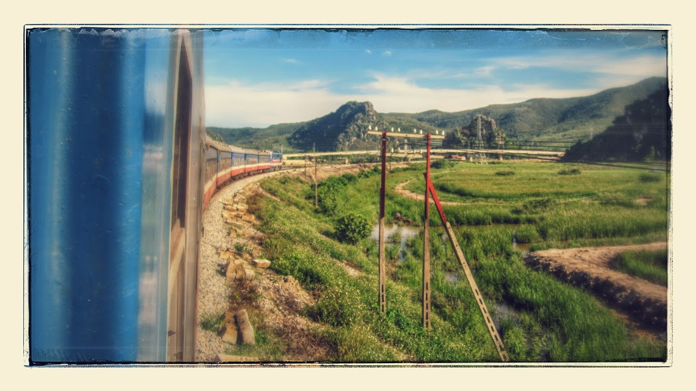

Train journey, Hanoi to Hue

We welcomed our arrival into Hue and flagged down a taxi to take us to Than Thien Friendly hotel. The staff at the hotel were indeed friendly and although they only had a twin room available the rooms were spacious, clean and comfortable. After a comfortable nights rest, we popped down to the restaurant for breakfast. There was a good choice of Vietnamese and Western food to fill ourselves before we embarked on the day ahead.

No trip to Hue is complete without stopping by at the Imperial City, _or so we thought_. Described as one of Hue’s prime attraction this unique city combines a variety of moats, temples, pavilions, galleries, shops and museums all within a large square boundary. It took around an hour to walk to the Imperial City from our hotel, we were gasping when we eventually reached as the heat was scorching!

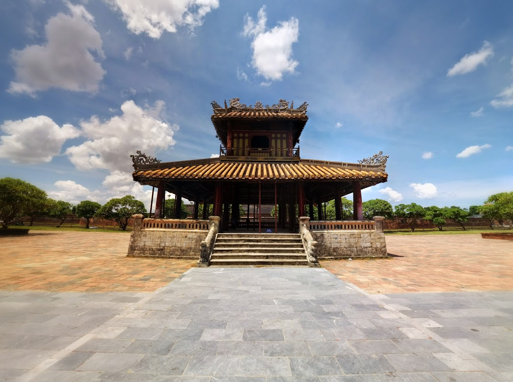

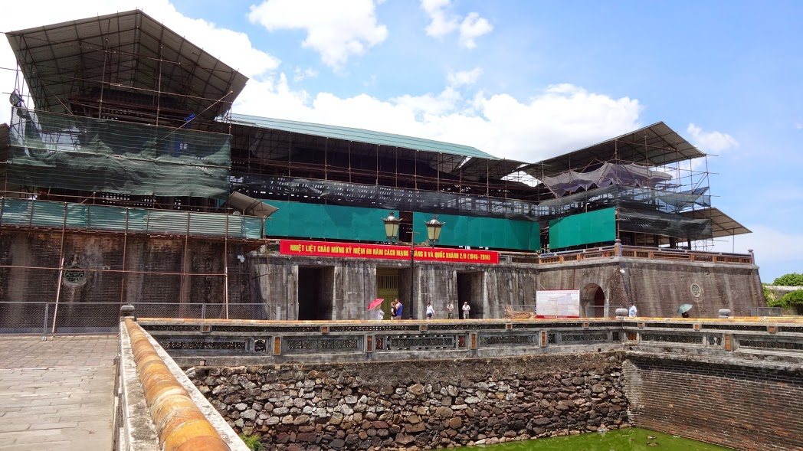

Just another renovation site – no, wait. That’s the entrance to the Imperial City!

Upon arrival we paid the heavily priced tourist fee 220,000 VND (for 2 of us). We weren’t given a map or layout of the citadel, so it was up to ourselves to bring its history alive. As we walked inside one of the rooms we stumbled across a huge TV which showed a brief history about the Imperial City.

During 1947 – 1968 the citadel suffered major destruction from the wars as well as being affected by natural weather events. The remains and ruins caused by past turmoil is still evident whilst walking around. As a result of this restoration work continues on the site and judging by what we saw, it has a really long way to go before completion. I wouldn’t be running back to see this place again unless there was a tour guide present, just so we knew what it was we were looking at!

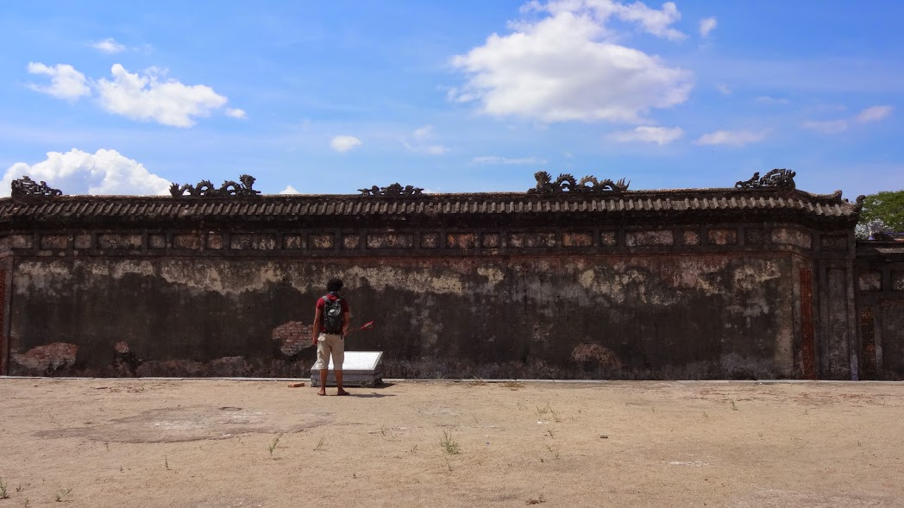

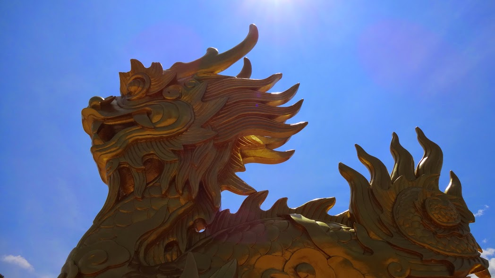

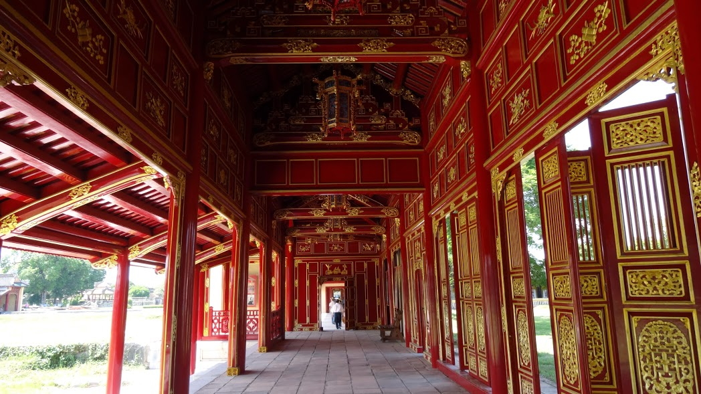

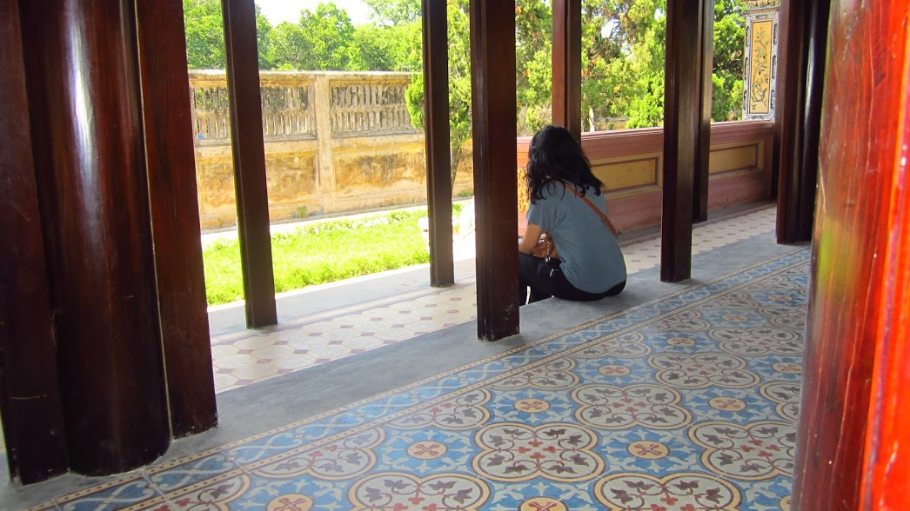

We only managed a couple of hours of walking before the heat migraines kicked in. As we left to go back we walked past an open museum of abandoned military equipment. It was awesome to actually see old rusty tanks, fighter jets and helicopters in front of us, we didn’t want to pay the entrance fee so just took a few snaps and carried on walking!

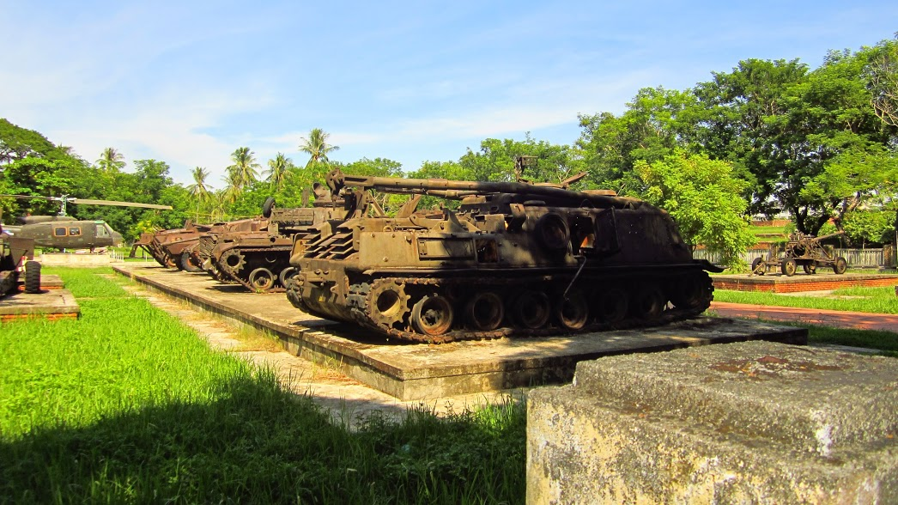

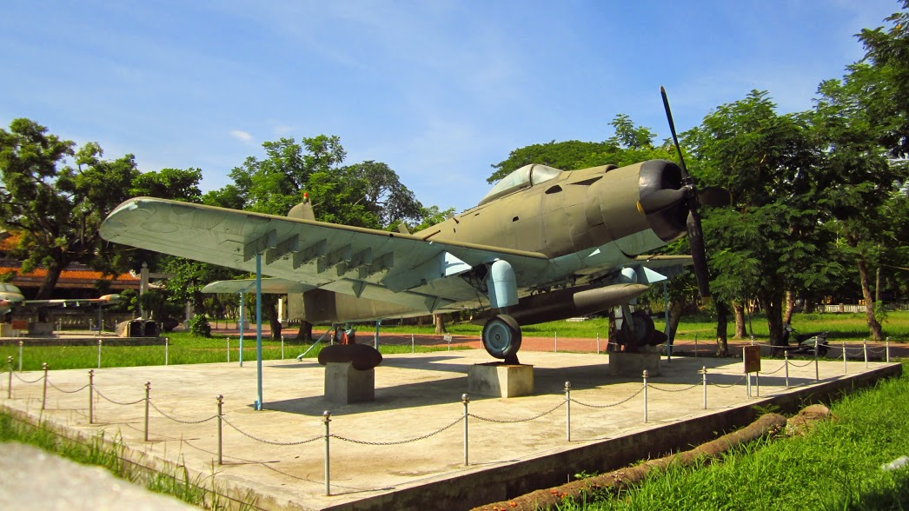

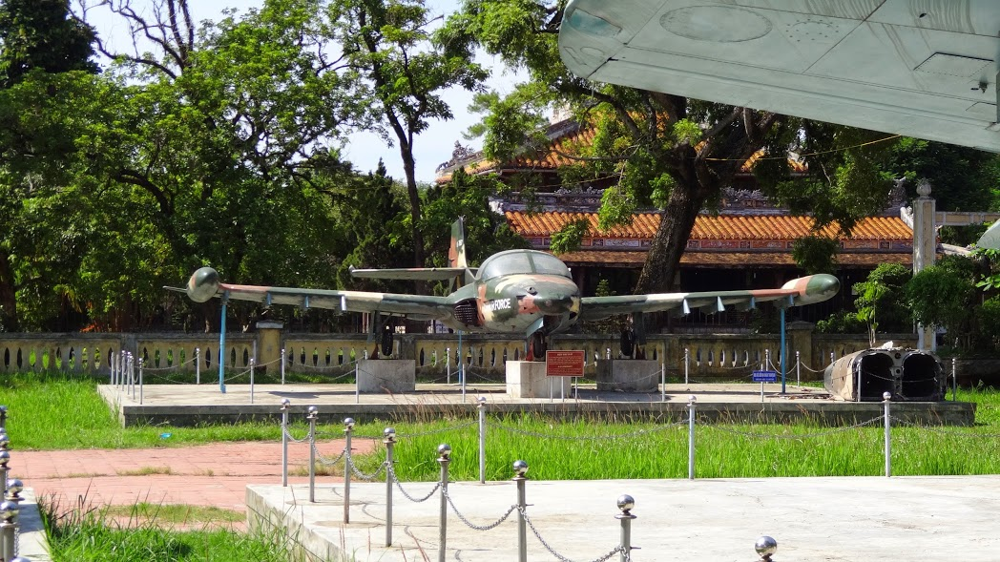

In the evening we dined at the Zucca restaurant. The staff were lovely and we had a really good meal.. We decided to catch a couple of drinks at a nearby backpackers hostel where we got chatting to a friendly German guy and a couple we spotted on the train to Hue.

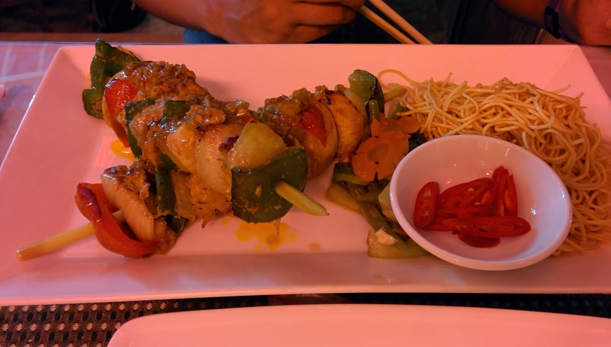

Nommy!

Though I’m glad we visited Hue, I wouldn’t recommend staying more than 1 night – actually, you could probably do all the sightseeing in 1 day. Hue has a big backpacker scene but unless you’re a sucker for cheap 2-4-1 drinks deals or love seeing old ruins and tombs, then it’d probably be best to give it a miss.

It’s taken me a while to write this post because I’m not really sure how I would sum up my time here. Yes, it was a good experience to see what Hue had to offer, but… Was it enough to make me return? Probably not.
