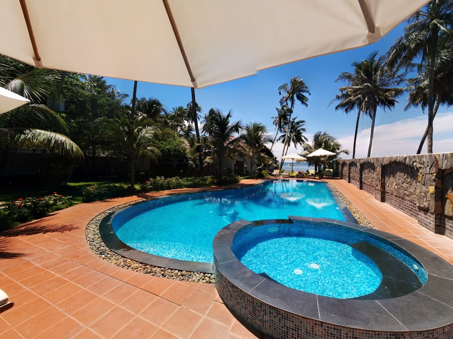
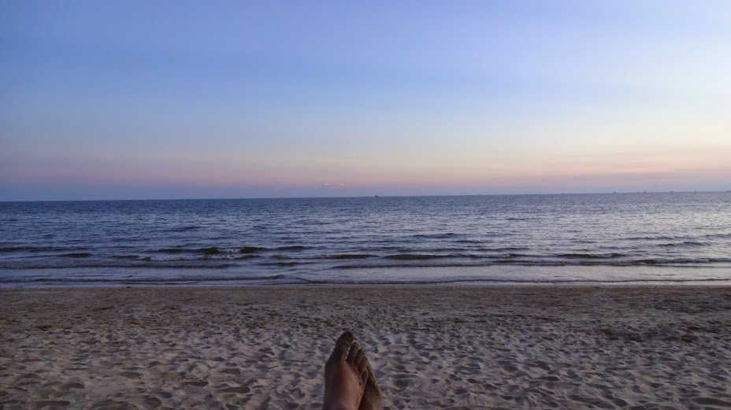
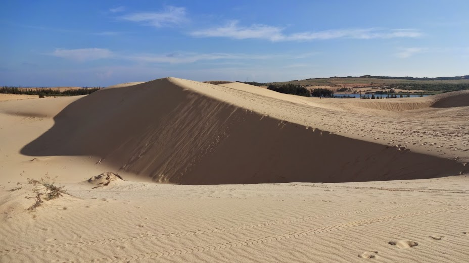
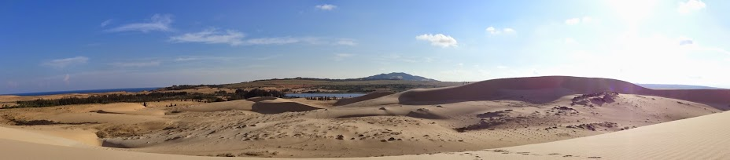
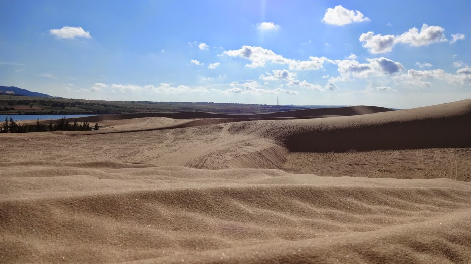
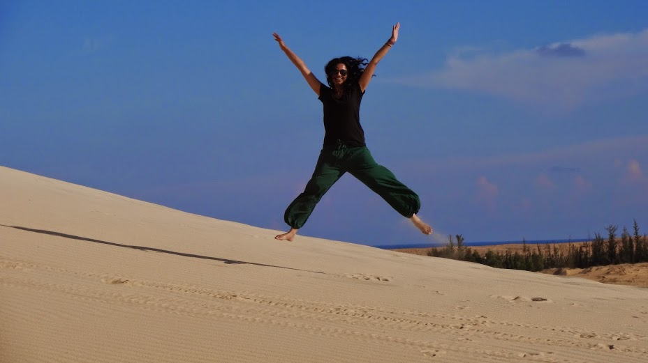
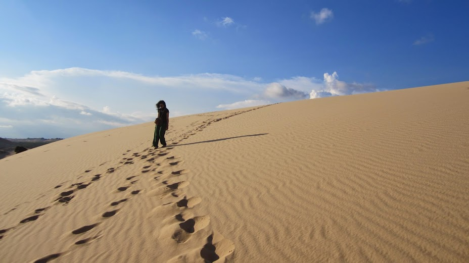
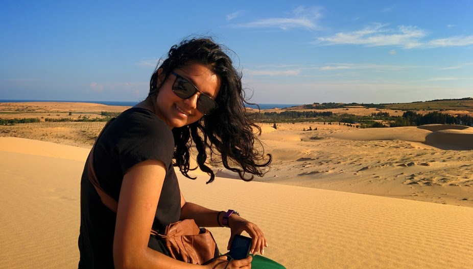
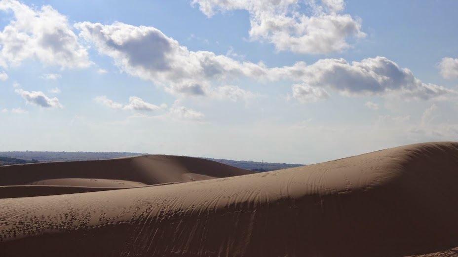
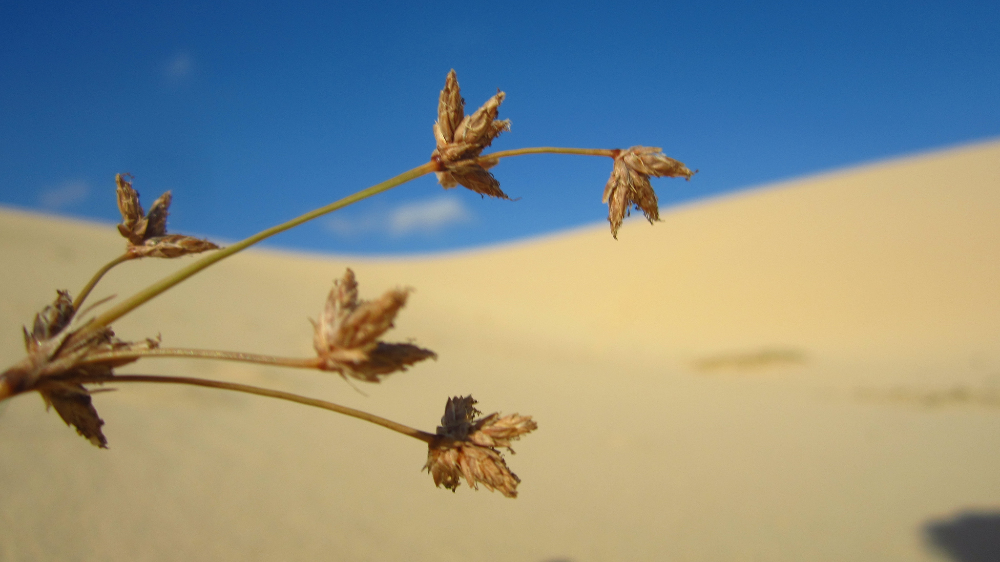

Mui Ne is a coastal town in the South east region of Vietnam. We got the bus from Da Lat to Mui Ne which took about 5 hours. The roads are in a desperate state of repair and we counted down the hours till we got off the bus, we lost count of how many potholes the bus went over!

Mui Ne is still in development as there are a number of construction sites popping up around the area. There are still a few shops which cater primarily for Russian tourists (but nowhere to the extreme like Nha Trang). The main strip is vast and takes a while to walk around.

Wanting a bit of luxury we stayed at the Windflower Boutique Hotel for a couple of nights, the rooms and pool area were great and the beach was so close, but everything else was lacking in quality which slightly dampened our experience (bad breakfast, unhelpful staff). Fortunately we found a great place to eat (The Bar) which did great food and was only a 20 minute cycle away.

Nice pool area at Windflower Boutique

Watching the sun set at the beach

The main reason we wanted to go Mui Ne was to check out the sand dunes. We arranged a bike hire through the hotel we stayed at (Windflower Boutique) and ventured off. It took around 40 minutes to reach the White sand dunes. Upon arriving we paid the 10,000 VND entrance fee (per person) and ventured off. There were quad bikes which could be rented but decided to discover on foot instead.

The sand dunes were of impressive scale and much larger than I initially thought. We walked further out than most of the tourists and to get away from the loud roaring quad bikes (which I thought were ruining the landscape).

It was pretty surreal to be walking on a sand dune, in Vietnam! We enjoyed running up and down the dunes and taking pictures of this unique landscape. The bumpy journey was well worth it to see this spectacle!

