We booked a bus via The Sinh Tourist from Hue to Hoi An, the journey took under 4 hours to arrive in Hoi An.

Hoi An ancient town is listed as a UNESCO World Heritage and has something for everyone – a beautiful beach, quaint town, gorgeous food and a load of tailor made shops competing at your disposal (as I’m super fussy with clothing I decided not to get anything made..this time!)

We booked a few days at the Prince Hotel – a new hotel which is located mid point between the town and the beach (20 minutes each way on bicycle). The hotel has free bicycle hire and a small swimming pool.

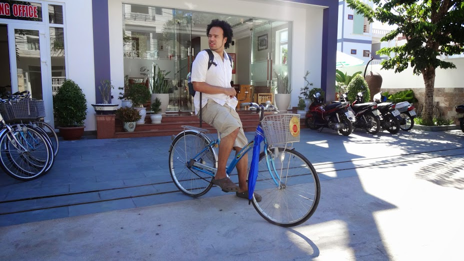

Unlike Hanoi, Hoi An was much quieter to walk around and oozed space. We welcomed the calmer approach here, it was a relief not to feel like we were going to get run over every time we stepped out of the hotel!

We were excited to go to the Ancient town and see the lanterns in the evening. Initially as we approached the entrance we were stopped at a tourist point, where a lady informed us we needed to pay 120,000vnd (that’s per person!) to enter the town as it is listed as a UNESCO site. Apparently the ticket is ‘valid’ till you leave (though I’ve no idea how they monitor that) and provides 5 tokens to enter into some attractions. Stumped by this we explained that we did not intend to go into the attractions, we merely want to walk around and take some photos. _If we want to go inside an attraction, I can understand the need to pay. But to pay a fee just to walk around? No thank you!_

After a few minutes getting no where with our predicament we wandered back, angry and disappointed. Luckily for us, we walked a further 2 blocks where we saw another entrance into the town which was free to walk in – yay! We later found out that tickets sold are not compulsory – I’m so glad we didn’t give into the pressure to buy a ticket (though I imagine plenty of tourists do).

Happy that we found a way in, we ventured inside for a walk. Apart from the many, many hawkers forcing themselves upon us (not a good start) and after a brief walk around the town we began to wonder what was being preserved. Row upon row of shops sold the same merchandise, every street looking identical to the last. I think that the term ‘UNESCO’ has been exploited and leaves very little to the imagination. Dismayed at the ‘same same’ stuff everywhere we still lingered around till the evening to see the lanterns.

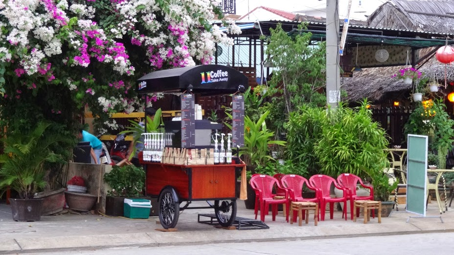

Diddy coffee stall, complete with diddy chairs

The lanterns did perk up our mood and like many others we happily snapped away until we got bored of seeing ‘another pretty lantern!’

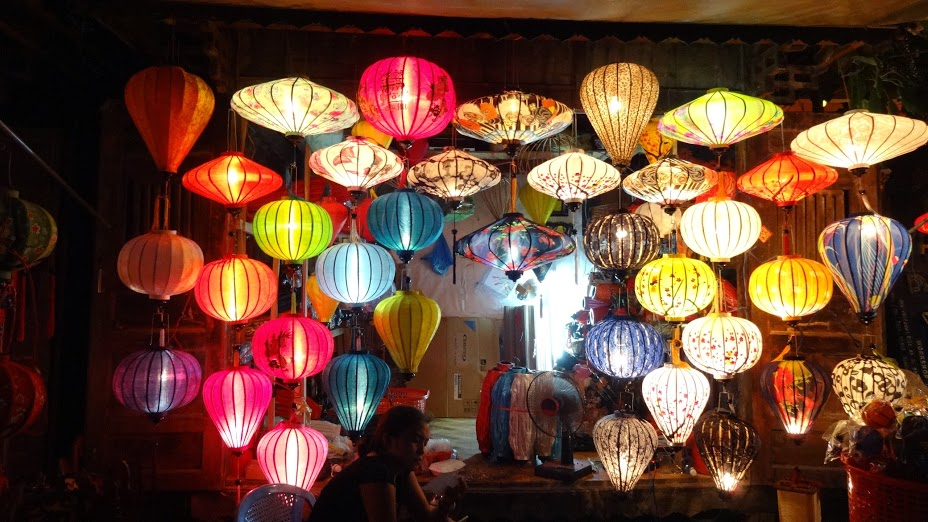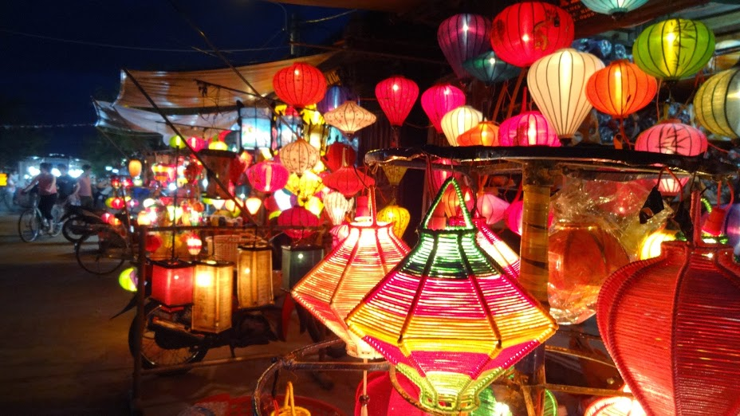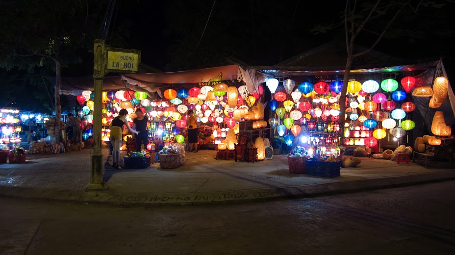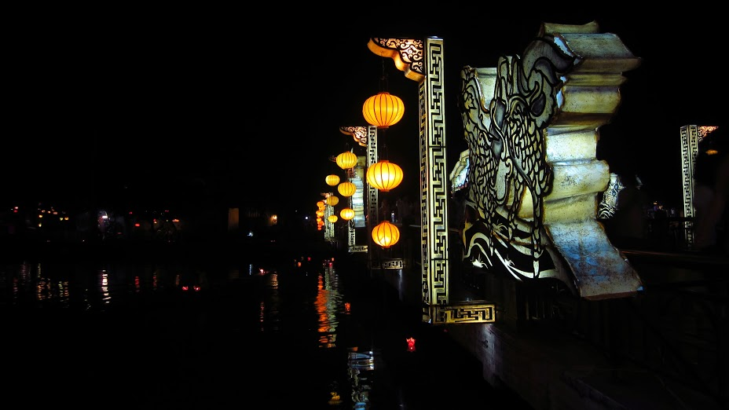 The highlights of Hoi An for me had to be the beach and the food. We jumped on a bicycle for a quick 20 minute journey to Ang Bang Beach. The beach was quiet considering we arrived past noon, there were hawkers around but they weren’t pushy.

The beach was just lush! The sand was super soft to walk on, the clear water sparkled in the sun shine. It was a joy to be there, but even more so with a drink in hand at Ang Bang beach bar.

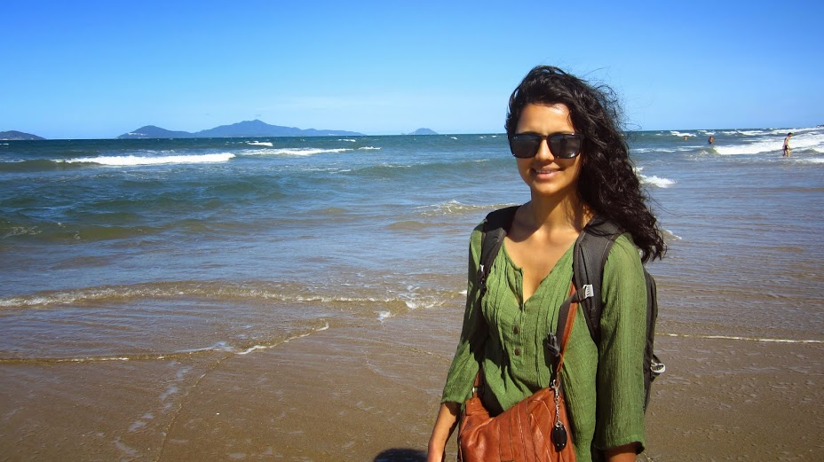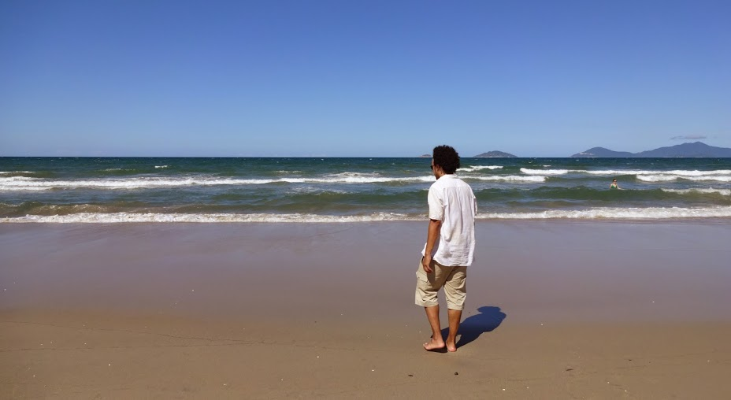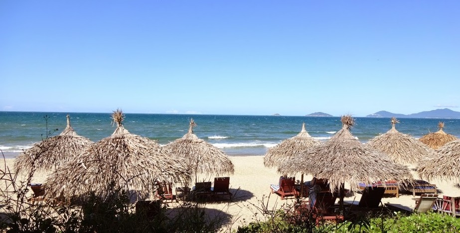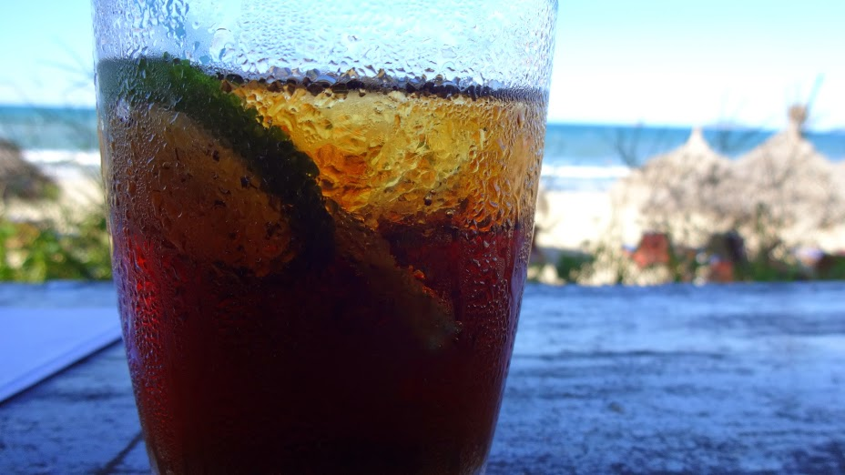

The food in Hoi An is some of the best tasting food I’ve tried in Asia so far – both local and western cuisine. Hoi An is home to its own culinary delights, in particular its Cau Lau (chewy noodles with pork slices and herbs), Fried Wonton, White Rose (steamed shrimp dumpling) and Com Ga (Chicken fried rice). Our favourites are Com Ga and Cau Lau – just thinking about them makes me hungry!

We also tried non -Viet food and went to Hola Taco! and Namaste Indian restaurant. I can fully recommend the food at both these joints – Hola Taco! has _the most_amazing guacamole and tacos I’ve ever tasted, whilst Namaste fixes those curry craves and provides wonderful service throughout the meal.

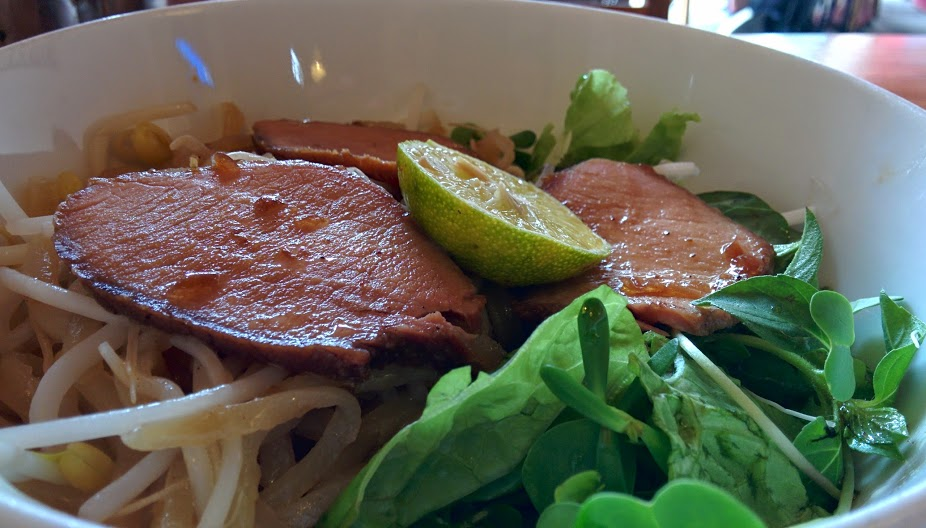

Cau Lau – Hoi An speciality

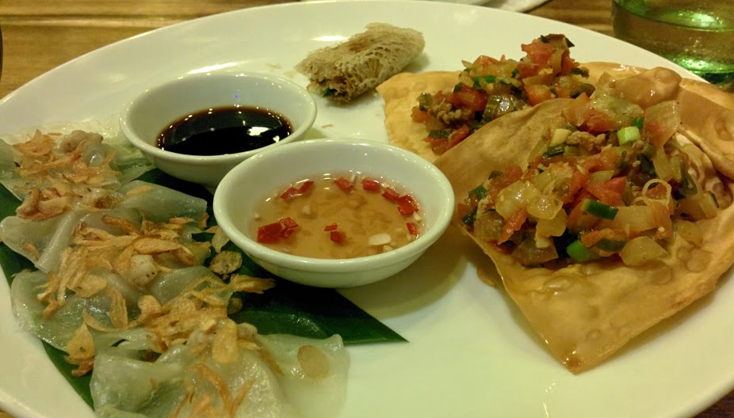

Left – White Rose, Right – Fried Wonton

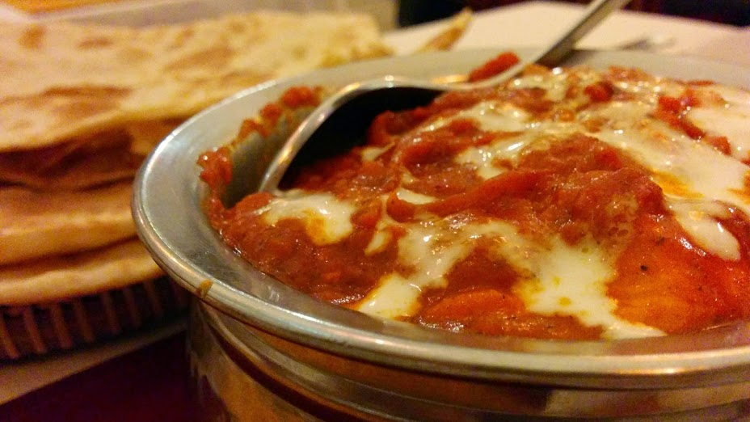

Madras curry at Namaste

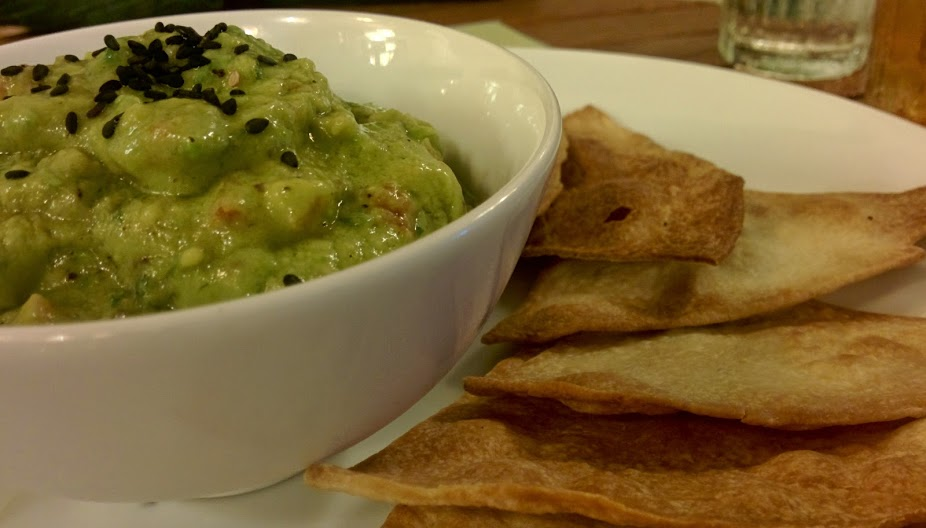

Best guacamole ever at Hola Taco!

Overall Hoi An ticked a lot of boxes for us and gave us the much needed rest we were looking for after Hanoi. I would definitely return here to visit Ang bang beach, eat everything I mentioned above and maybe get something made at the tailors!
