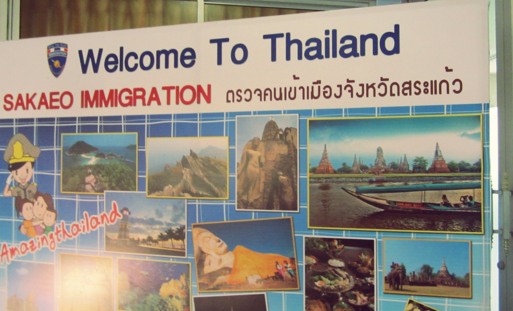
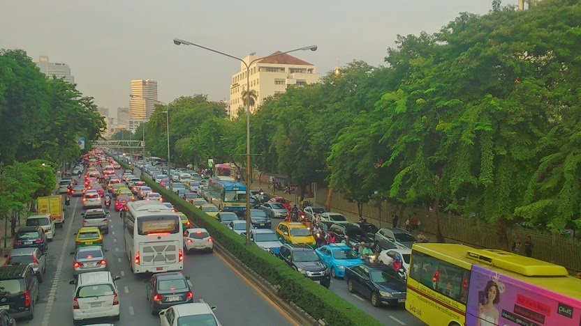
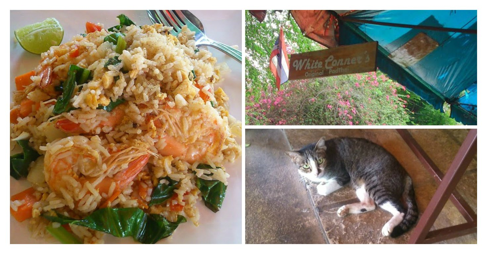

Pretty much anyone on a travelling quest will no doubt pass through Thailand. What can easily be recognised as Asia’s main gateway, Bangkok is usually the first port of call for newbie travellers embarking on an Asian adventure.

To be frank I hadn’t been looking forward to Thailand. I was worried for the following reasons:

A. The plague of tourists and travelers that now flock here every year have dented Thailands’ idyllic reputation

B. The beaches are ‘overrated’

C. Constant political drama continues to spark uncertainty and unrest

Though I had my reservations I tried my best to keep them aside in the hope I’d be proven wrong as I arrived in Bangkok.

Oh how I tried…

Arriving at the Thai border from Cambodia

Having arrived overland from Siem Reap the bus journey to Bangkok was pretty manageable – even immigration was an easy process and took around an hour. However we neared towards Bangkok I realised how bad the ‘traffic’ situation really is. I counted at least 5 lanes of traffic (this in on both sides of the carriage way) that had no end in sight. To say it was ridiculous is an understatement.

Anyways, because of the road situation our bus journey reached the station over an hour later than anticipated. The fun was not over yet, after waiting _another_ hour in line for the ‘meter taxi’ it took yet _another_ 40 minutes to reach our hotel (the journey in ‘normal’ traffic should’ve take around 15 minutes).

Welcome to traffic. All day. Every day.

Now I probably sound like I’m having a proper moan. Even I’ll admit that! So instead of ranting (it’s good to let it out) I’ve tactfully written my moans in brief-ish points (though I can’t guarantee I’ll stop moaning, _sorry_).

So, I’ll get the bad/ugly points out the way:

Attitude: now I understand that locals will have a different attitude in cities in comparison to local areas. I particularly found most (but not all) of locals to be very abrupt and non-smiley. _Is this because of the way tourists and travellers and have treated them? Pushing them to the point where they no longer care anymore?_ I’m unsure why I found this to be, but it made an uncomfortable introduction.

Money grabbin’: this mostly applies to taxis and tuk tuks. By law all taxi’s must put on meters during a fare. Unfortunately a high number of taxi drivers choose to ignore this and will charge a flat rate before you even step inside. It took us around 6/7 attempts before we managed to find a taxi willing to put on their meter. This happened every time we wanted a taxi – even when we queued for a ‘metered’ taxi. Their reason for charging flat fares? ”_Bangkok have bad traffic. You pay more because of this”_.

Now this may sound like a legitimate reason BUT-

1.Bangkok _always_ has traffic, and  
2.It doesn’t give the right for drivers to charge up to 3 times as much!

As for tuk tuks, well they were just as bad. They also charge flat fares as high as the taxis – so unless you stand your ground or good at haggling, chances are you’ll get ripped off.

ATM: there’s only one bank which doesn’t charge transaction fees, and that’s Citibank. However the nearest ATM is located in CentralWorld Plaza shopping mall which was 5km away from where we stayed. Most ATM’s charge around 150-180 baht per transaction (around £3) which easily adds up.

‘Khao San Road’: _breathe Kim_….this is my real gripe. I heard so much about this infamous road and wanted to see the craziness myself. Ohhh how disappointed I was!

Khao San road has no authenticity about it.**At all.** Row upon row of stalls sell the same tourist junk, overbearing masseuse staff beg passers-by to get ‘good massage’, fried insects and scorpions are shoved in your personal zone (But No. You can’t take a photo – you’ll have to pay for that). Lets not forget those seedy little men brushing past every so often muttering ‘_ping pong shows, yes?’_.

Sorry folks but this is not what Thailand represents, and more fool the people thinking so.

Click above to see how many brands we found within walking distance at Khao San Road.

Okay, moan over. I can’t leave this post without mentioning something good about my time Bangkok, and granted there was one place which I’d be willing to return to Bangkok to. Just around the corner from where we stayed on Samsen Soi 6 was a small family run cafe by the name of White Connors. We ate there one evening and had _the_ most tastiest Thai food.

It was that amazing even, that we returned and ate there every day till we left! The family were genuine, kind and caring. I loved everything about this wonderful little joint and it really restored my faith in the kindness of people. Amidst the chaos of Bangkok there are still regular folk earning a living without compromising their kind hearted nature to match that of the city.

The delicious food at White Connor’s saved my faith in Bangkok. This delicious fried dish cost £2 including a drink.

My feelings for Bangkok are indeed bitter-sweet. I’ve spoken to other travellers that have fallen for Bangkoks charms and highly rate the city. Maybe my experience was impacted by my preconceived thoughts, or that I just had high expectations? I can’t say for sure. I’m just glad that to be moving on from Bangkok soon to explore what Thailand really has to offer.

_Currently White Connors do not have a TripAdvisor link, but you can find them here on their Facebook page [here](http://www.facebook.com/WhiteConners)._

_So, who thinks I’m overreacting about my Thai dramas! What were your thoughts when you visited Bangkok?_
