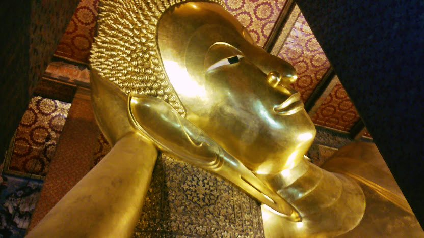
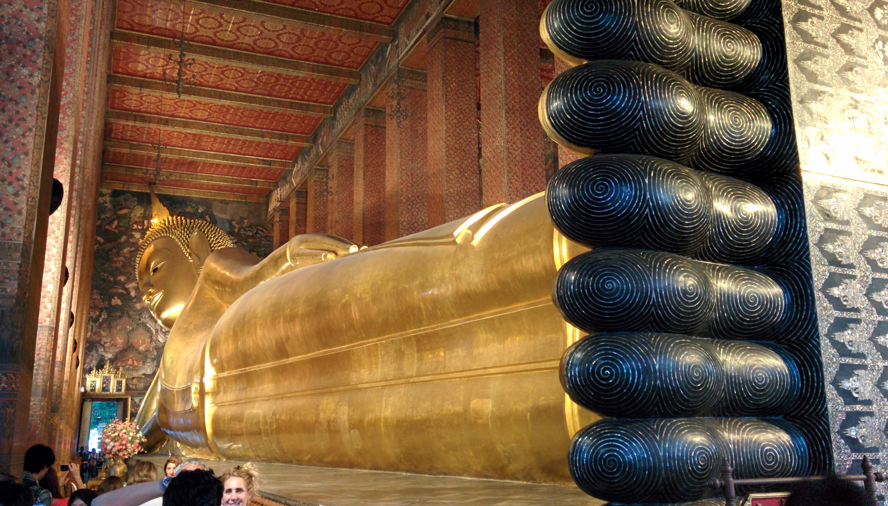
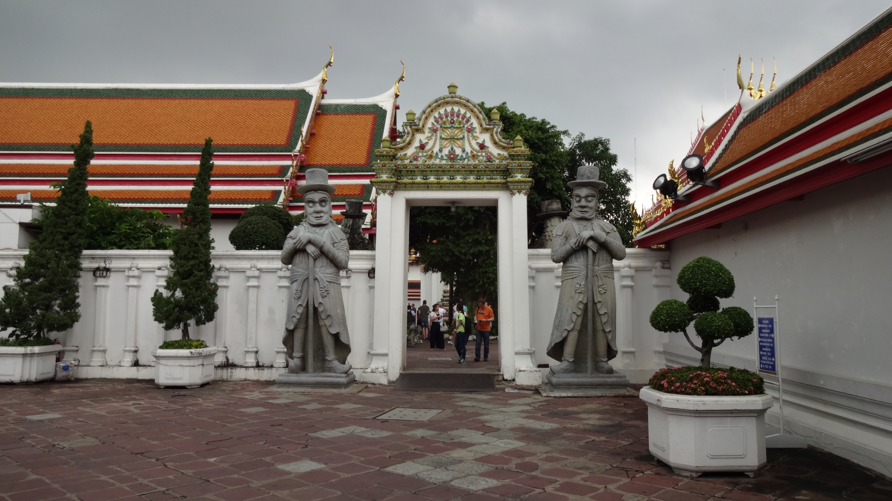
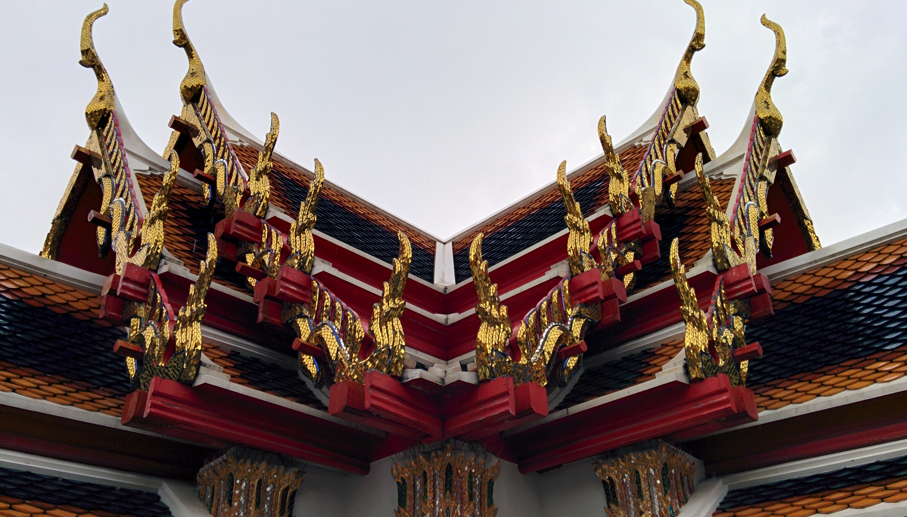
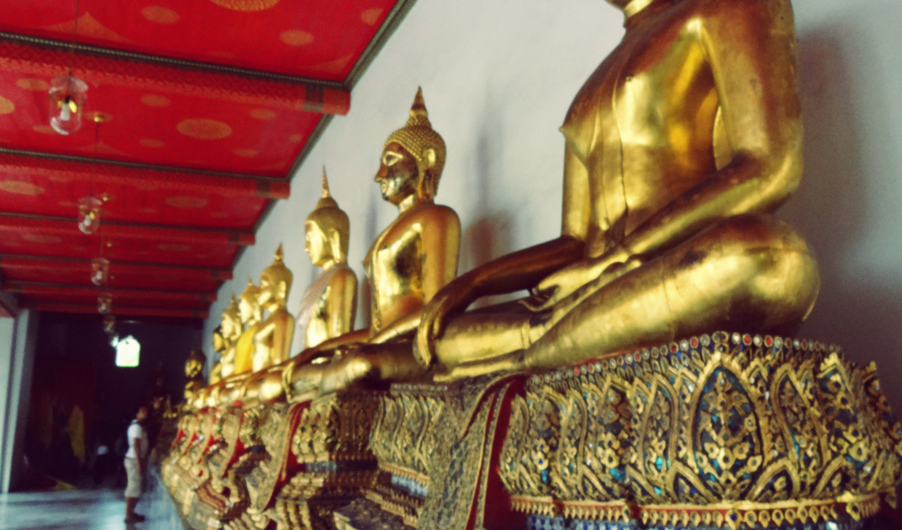
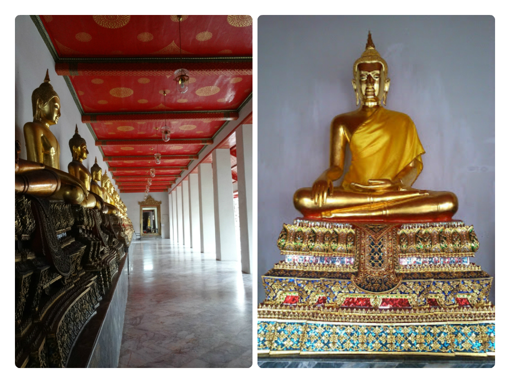

Though I’m not a fan of [Bangkok](/posts/2014-10-feeling-bitter-sweet-in-bangkok) I did enjoy an afternoon visiting Wat Pho, one of Thailand’s oldest wats (temple). Wat Pho has more than 1000 Buddha monuments and is home to the renowned ‘Temple of the Reclining Buddha’

Wat Pho has the largest reclining Buddha in Thailand. The reclining Buddha is to represent Buddha’s passing into Nirvana (death). Admission fee for tourists is 100 baht per person. There is also a dress code under strict guidance – no exposed shoulders or knees (and above). Gowns are handed out if you don’t match the requirements. Shoes also have to be taken off before entering (but you’re given a bag to keep them with you which is handy).

It’s difficult to take a full length photo of the Reclining Buddha as there was so many other tourists trying to do the same as us! But believe me when I say it was beautiful; the sheer size is enough to leave you astounded. The statue is 15 metres high and 46 metres long. The body is covered in gold leaf, both the eyes and feet are decorated in mother-of-pearl. The soles of the feet are beautifully designed in over 108 auspicious characters (that distinguish a true Buddha).

Our best shot getting the Reclining Buddha in full!

There are plenty of Buddha monuments around the Wat accompanied with information boards for those keen to read into the history.

It’s not just the Buddha monuments that are covered in gold leaf – check out the detail on the roof!

Kyle admiring the monuments in the distance

Within the grounds of the complex remains a Thai massage school. Wat Pho is considered to be the spiritual birthplace of Thai massage and medicine. It’s very popular for tourists to experience a Thai massage here, though we decided not go on this occasion.
