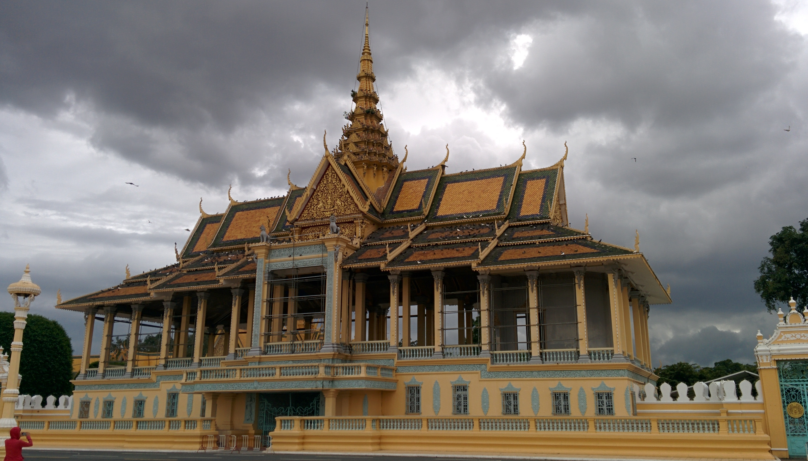
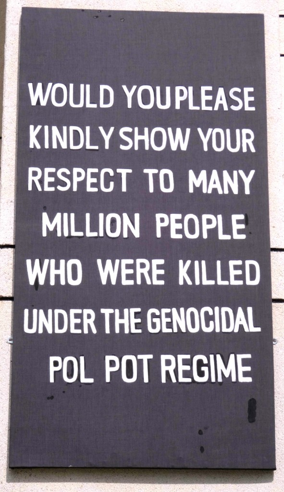
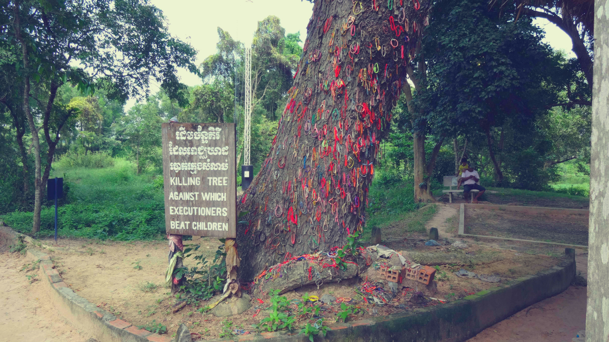
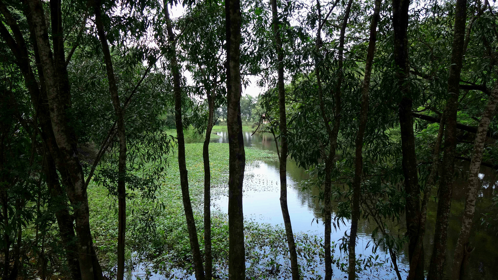
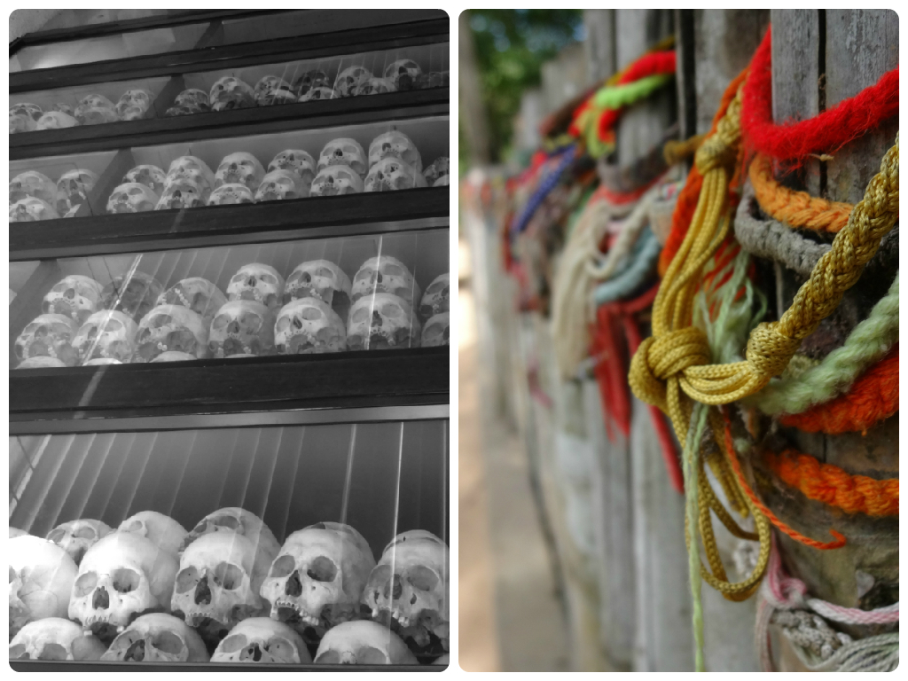
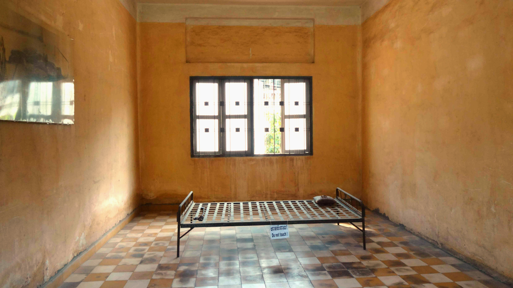
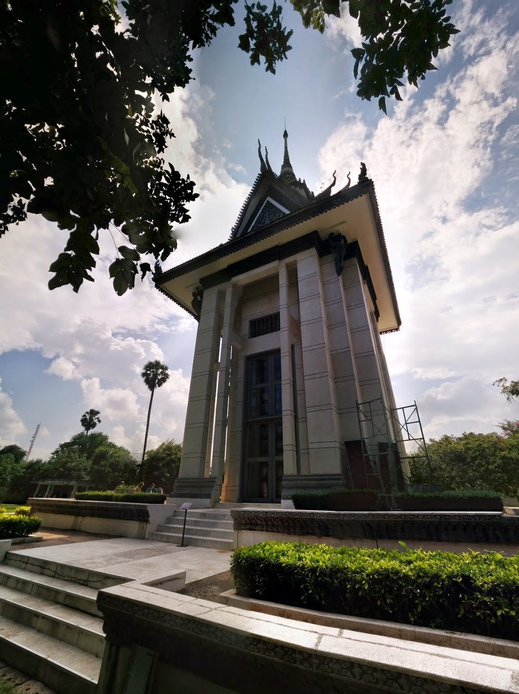

Royal Palace

After a couple hours queueing to get our Cambodian visa, a bus change and yet a few more hours on the road we eventually reached Phnom Penh. What surprised me as soon as I got off the bus were the sheer number of tuk tuk drivers bombarding every passenger! Already being savvy we had pre-planned our route to the hotel so managed to dodge the fares and walk.

I wasn’t entirely sure what to expect of Phnom Penh, and to be honest I still don’t really know how to sum up my time here. To begin with I was surprised that the main currency used is US dollars, l They still use the Cambodian Riel, but if you pay in US dollars you will receive change in both dollars **and** in riel.

Money rant aside, Phnom Penh strikes me as an upcoming city trying to shake off its poverty-stricken image. Unfortunately I feel the city needs to tackle its current issues before it starts to gain recognition as a major tourist hub. It’s clear to see the rich/poor divide as I walked around the city; luxury 4X4’s whiz past old rusty bicycles and worn down buses. Beggars are rife (especially around the river) and many young children (some as young as 5 years) take to the streets selling books and bracelets, even going inside restaurants. Tuk tuks hound you around every street corner in the desperate attempt to gain a fare. Beautiful maintained gardens and pristine temples are marred by the sight and smells of trash dumped nearby.

In terms of luxury, ’boutique’ hotels are in fact regular (or just plain basic) hotels scraping by hospitality standards, whilst an average guesthouse start at rates around 15$ (for an average double room/no window). Certain side streets in the evening scream a scent of seediness, making a comfortable stroll turn into a quick power walk out the area.

Although Phnom Penh didn’t leave a lasting impression on me, I was still glad to have visited the city so we could visit the Killing Fields and S-21 prison.

**Killing Fields and S-21**

Admittedly I didn’t know much about Khmer history before visiting Cambodia. I was aware that it went through a ‘dark’ period but naïvely, that was all I knew. We decided to visited the Killing Fields in the morning and S-21 prison in the afternoon. After negotiating a round trip fare with a tuk tuk driver (for 15$) we were on our way.

Admission to the Killing Fields was $6 and included an audio guide and map. The audio guide was an excellent tool to enable every person to learn how the Khmer Rouge came into control in 1975 with their distorted ideologies, leading to the devastation now left etched in Cambodian history.

Labeled Year Zero, the Khmer Rouge had wiped out generations – killing babies through to the elderly in the most inhumane way possible. Professionals (including doctors, engineers, teachers) were systematically wiped out – even people who wore glasses were seen as a threat and murdered. The rest of the civilians were forced into hard manual labour creating the Khmer Rouge’s vision of a rural, classless communist society.

As I walked around the site on a beautiful warm afternoon, I couldn’t comprehend the evil atrocities that had occurred on the very grounds I walked on over 40 years ago. _To hear that the sharp leaves from trees were used to slit people’s throats, the mounds civilians were forced to dig – unbeknownst to them that these were to be their very own graves. The terrifying sound of the generators and music to cover the sounds of the innocence slayed ruthlessly_.

As I look around at the other visitors, I too can see their solemn expressions as we continue to listen the victim’s terrifying ordeals.

No words to describe the pain of seeing of this

Water grave – What looks so calm is in fact a burial ground which has not been excavated as a sign of respect for the deceased.

Left -Cabinets are filled with the remains of the deceased recovered from the open graves at the stupa. Right – Coloured bracelets are placed around the graves as a sign of respect for the victims.

S-21 prison (also known as Tuol Sleng Genocide Museum) was our next stop, which was around a 20 minute journey away from the Killing Fields. In 1975 these very grounds were originally Tuol Svay Prey high school. However Pol Pot’s security forces had forced their way in and had taken over, converting this school to Security Prison 21 (S-21).

S-21 become a mass detention centre for the torture and brutal killings of innocent men, women and children. Walking around the building we were able to see the cells where prisoners were held; some had very distressing images of the deceased when they were found.

What I found most distressing were the rows upon rows of images of the prisoners detained at S-21. A haunting collection of faces stared through me as I walked past; photos of adults young and old, and even children. I could sense the dreadful realisation in their eyes, knowing that they weren’t going to make it out of this prison alive.

One of the few cells that remain at S-21 prison. The victims that were brought here inflicted the most inhumane, barbaric torture

The scale of atrocities that occurred at the Killing Fields and S-21 prison were too large to contemplate emotionally. Nothing can sum up the thoughts and feelings encountered, listening to the treacherous acts of terror committed on innocent civilians, seeing the equipment used in these heinous acts, and those haunting images of innocent civilians destined to an early, brutal death.

Visiting these particular sights will be so emotional, but the importance to go and learn about Cambodia’s dark history means that we’ll forever remember the people that suffered throughout this horrific turmoil.

Memorial Stupa at Choeung Ek
