Final bus journey, Mui Ne to Saigon (via The Sinh Tourist)

We embarked on our final bus journey to Saigon, departing from Mui Ne.

As we arrived at the Sinh Tourist office five hours later, it was clear that we were once again back in a major city. _Glaring bright lights, frantic motorbikes whizzing in all directions, taxis racing up and down, hawkers galore_…yep, welcome to Ho Chi Minh!

Instead of checking into a hotel we opted to go Airbnb and stayed with an expat couple in District 2, a much quieter part of the city but only a 15 minute bus/car journey into District 1. (_Airbnb is a fantastic experience to stay outside the tourist zone and feel like a local_). We were grateful to be out of the chaos of the city and stay in a local neighbourhood with a bustling expat scene.

Our sole purpose in Ho Chi Minh was to rest and recuperate from our whirlwind journey which started in Hanoi. In fact, we were pretty lazy and spent most our time in coffee shops, buying souvenirs and occasionally going to a few museums (mainly the predominant tourist spots like Cu Chi Tunnels and War Remnants).

It was great to have a loose itinerary and relax – travelling does get tiring so it’s important to take some time out to recharge.

Saigon boasts a vibrant scene for travellers. There is the usual main backpacker’s area (near the Sinh Tourist Office) full of cheap bars and happy hours, as well as boasting trendy bars and jazz clubs. Let us not forget about the food which I’ll get to further down!

Now…there is an issue of traffic, but this is a occuring theme throughout Vietnam. Yes, the traffic here is bad, but I found it to be no worse than the traffic in Hanoi. At least the majority of people stop at traffic lights here!

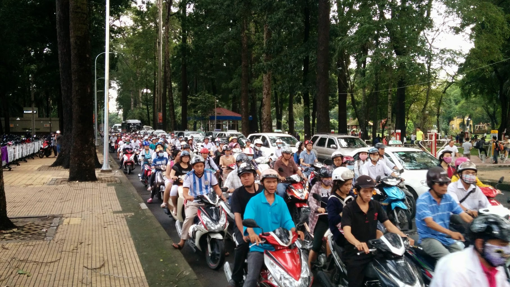

Just a normal day in the city…

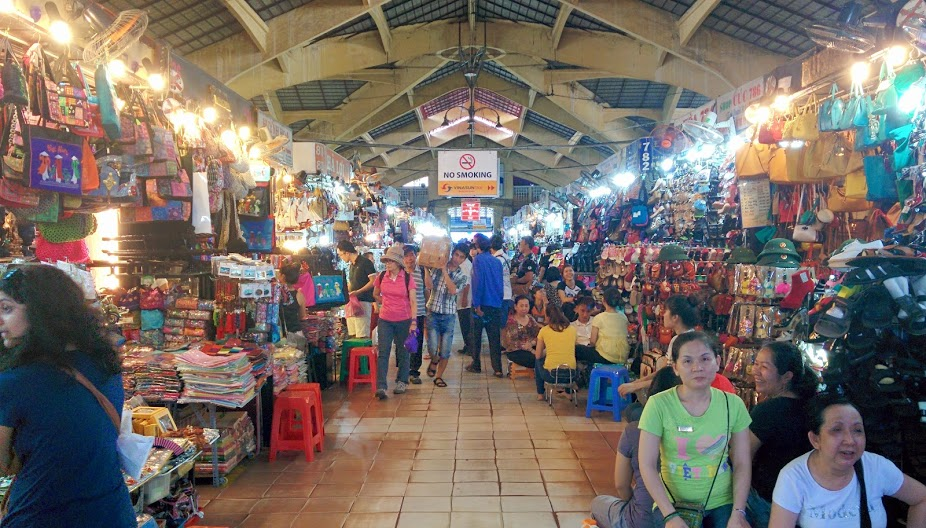

Ready to start the bargain hunt at Benh Than market – be careful as people will grab you to get your attention. Stand your ground and tell them where to go if it gets a bit too much!

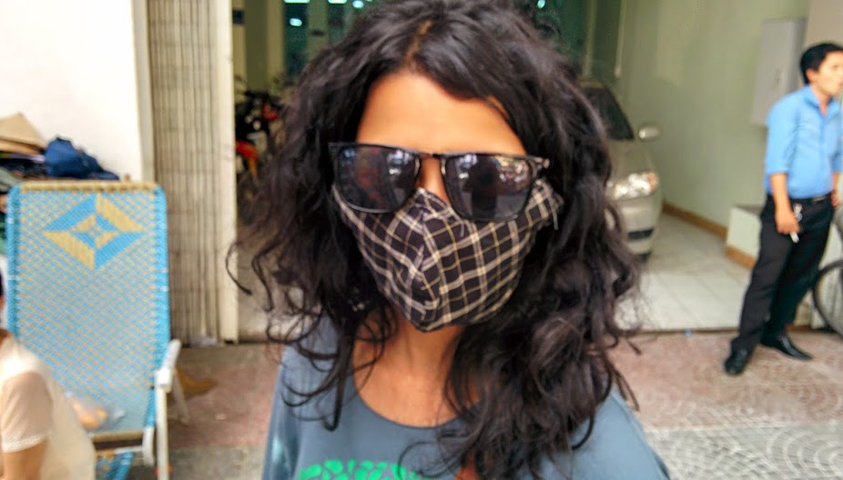

Yay! I can now blend in with the locals

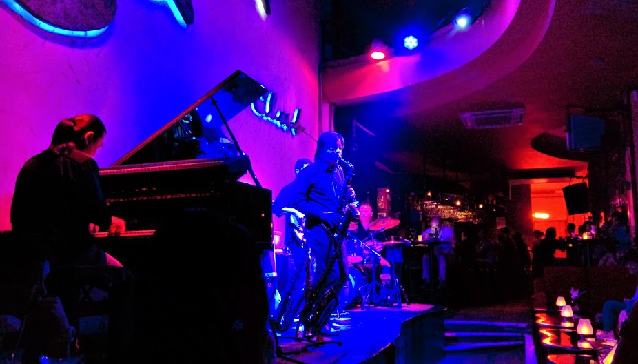

Checking out live music @Sax n Art Jazz club

After weeks of touring around Vietnam we welcomed the prospect of international food. Much to our delight Ho Chi Minh had plenty more to offer then the standard Western chains (though they do provide a quick fix!). The city proved to be a real it for the foodies within us, and we relished the opportunities to check out some great food establishments. With a little help from Trip Advisor we had some amazing meals at the following places:

Ichiban Sushi – pricey but amazing sushi, sit around the bar to watch the chefs prepare your selected delights.

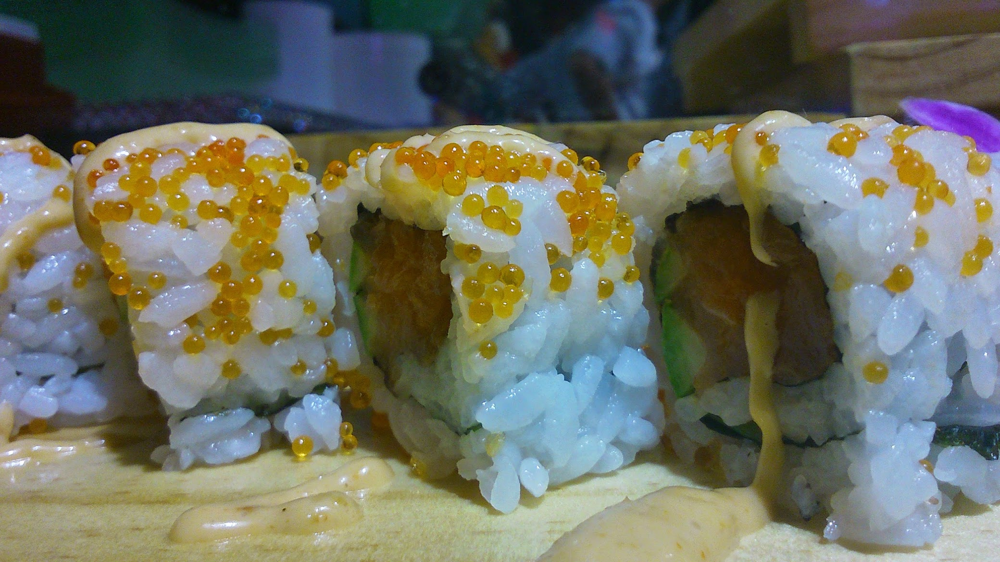

It tastes as good as it looks..

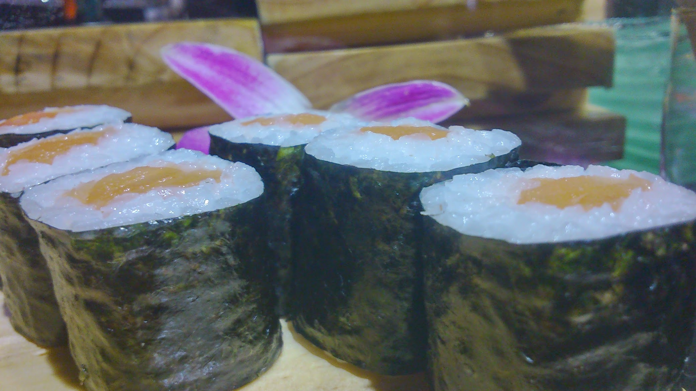

Badhja Restaurant – specialising in African/Algerian food, this restaurant serves the most tender of meats and tastiest tagines alongside a gorgeous gravy and fluffy cous cous. All mopped up with fresh warm bread, ahh.

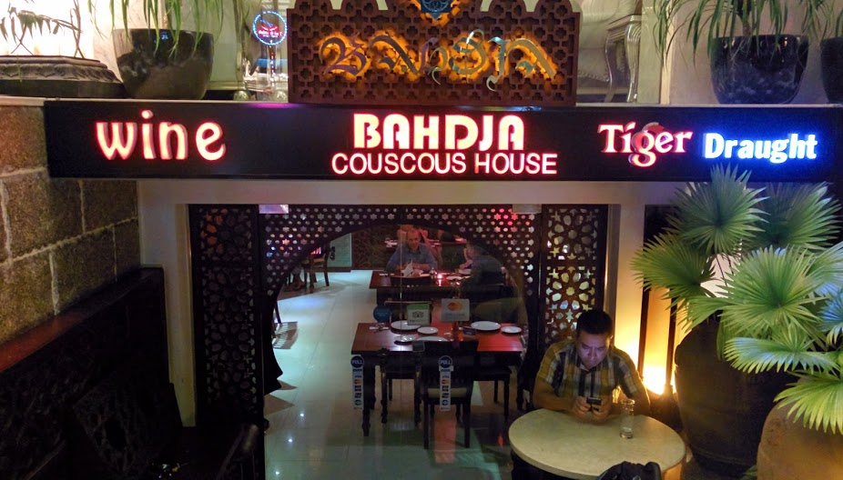

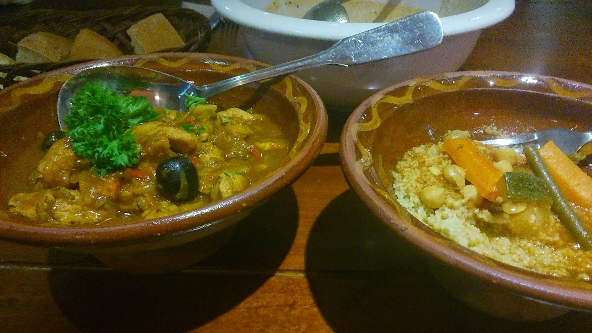

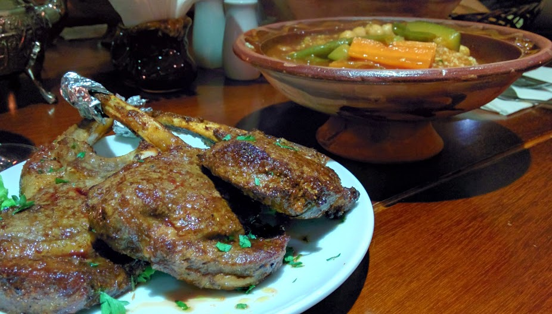

Pizza 4P’s – traditional stone baked pizza with a fusion of flavours. The tuna curry and chicken teriyaki flavours are winners for us!

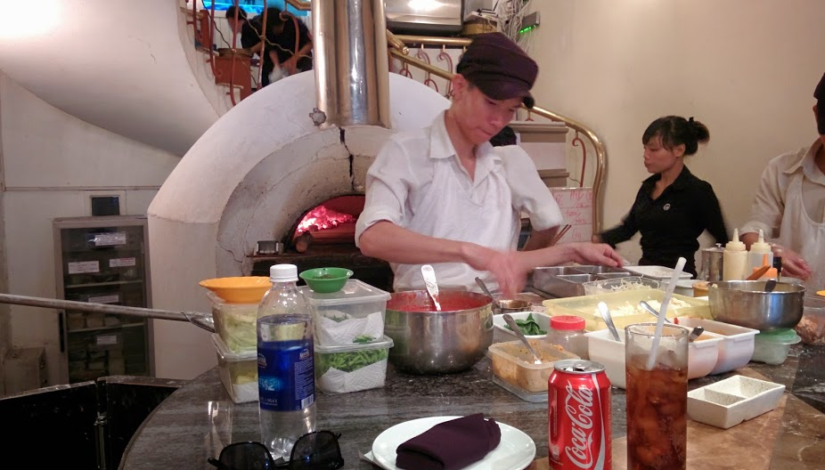

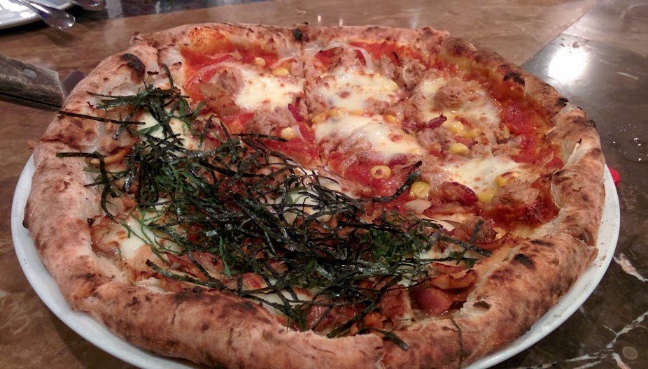

We really enjoyed our short stay in Ho Chi Minh, even more so with AirBnB as we met a lovely couple and got the chance to stay in a local neighbourhood. The city was a perfect way to end off our tour in Vietnam which still provided an awesome fusion of modern city life with traditional comforts.

I can see why this city is such a hit with expats – there’s plenty of opportunities and potential to be made here. For now we end our adventurous 2 month journey through Vietnam. I’d love to return again in a few years to see how this wonderful country has developed, I have high hopes for Vietnam!
