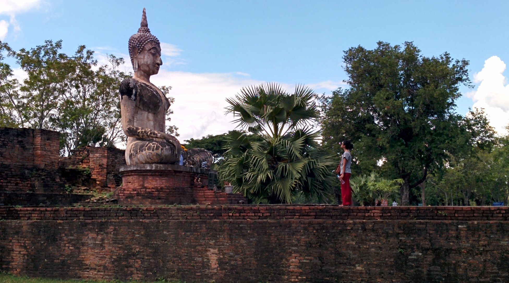
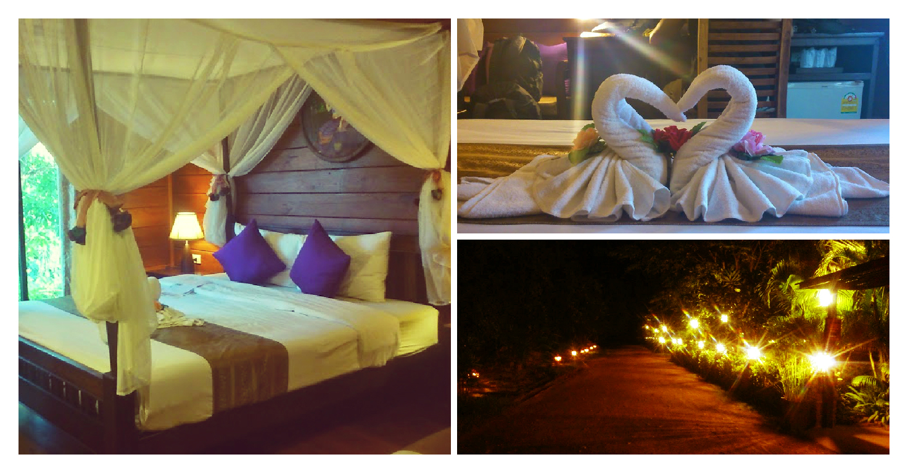
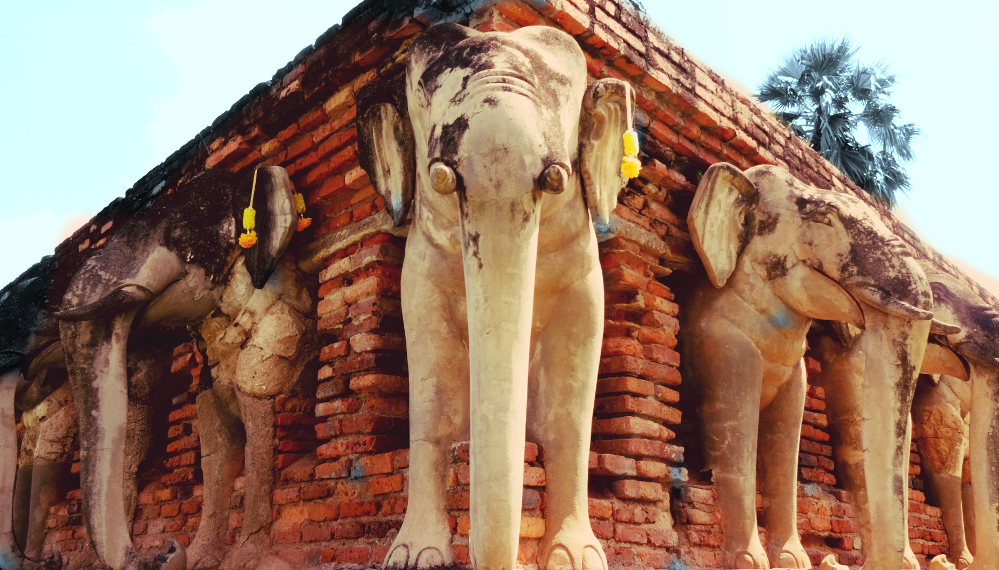
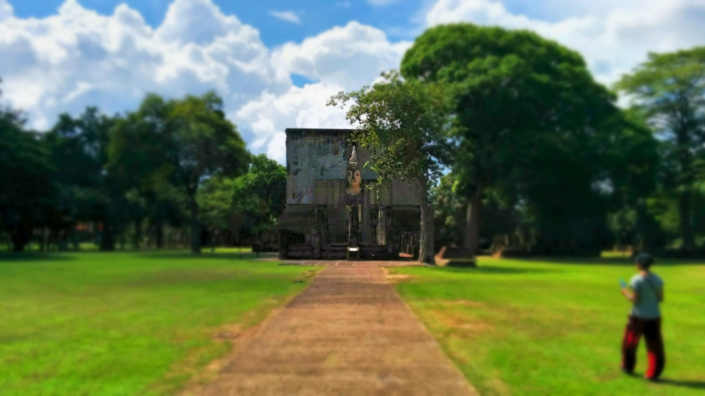
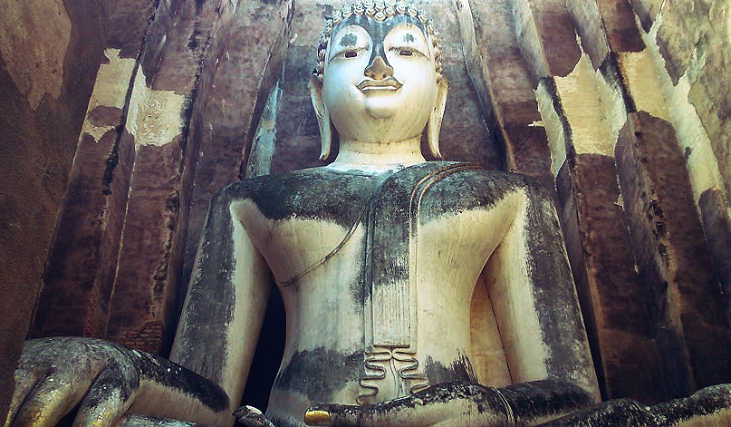
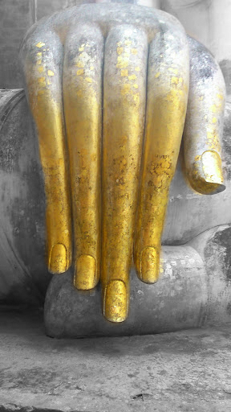
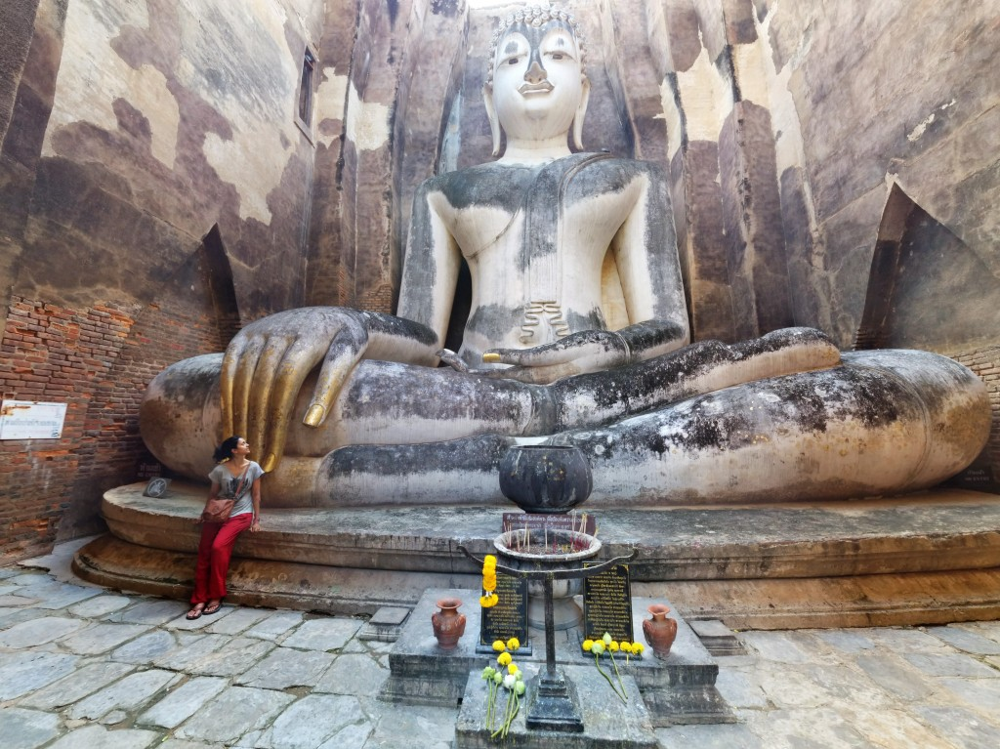

Curiously getting up close to a Buddha monument. Have you ever looked at a Buddha statue for so long that you feel that its staring right back at you?

We visited Sukhothai as it was on the travel route north (where we’ll eventually make our way to Chiang Mai). The journey wasn’t direct but easy enough; first we boarded the morning train from Bangkok to Phitsanolouk which was about a 5 hour journey. From Phitsanolouk rail station we got a tuk tuk to the bus station and boarded a local bus to Old Sukhothai. There were other travelers going in the same direction as us which made the journey easier to navigate.

Sukhothai was once Thailand’s’ Capital in the 13th century. Today it is renowned for its remarkable ruins remained during this era. Many of these ancient monuments and temples were restored and can be found at Sukhothai Historical Park which had been recognised as a UNESCO Heritage site in 1991.

We decided to stay in the Old town as it was closer to the Historical Park. We stayed at Thai Thai Sukothai guesthouse for a couple of nights.

The park is divided into five zones which all have separate admission fees of 100 baht per person. It’s ideal to research which zones to see, especially if you’re on a short visit. For me there only one monument I really wanted to see – Wat Si Chum.

Thai Thai Sukothai Guesthouse – we stayed at this wonderful place for 2 nights. It was slightly more than our usual budget but definitely worth the splurge!

Wat Si Chum is an incredible monument built in the 14th century. It is located in the Northern Zone, and is easily accessible by bicycle or walking. Inside the Mandapa sits a Buddha ‘Phra Achana’ which measures up to 15 metres high.

Oh and believe me, _it is incredible_.

Walked past this wonderful elephant monument on the way to Wat Si Chum

The grounds at Wat Si Chum are beautifully maintained and very peaceful. As I walked through the entrance I was delighted to see the entrance and a peek of the Buddha.

The ‘golden’ hand

What intrigued me the most about this monument was the Buddha. Compared to other monuments I’ve visited in Asia, this particular Buddha had very feminine features. The power and beauty emitted from the Buddha was something I’ve not experienced at other monuments. It sure was a humbling experience to be within the graceful presence of this Budhda.

Though we only stayed in Sukhothai for 2 nights we really enjoyed our time here. Sukhothai was so laid back and peaceful, not once were we hounded by tuk tuks or hawkers. I’m so glad we visited this beautiful pocket of Thailand. My initial reasons were to visit Wat Si Chum – the friendly people, tasty eats and no hassles were just an added bonus 🙂
