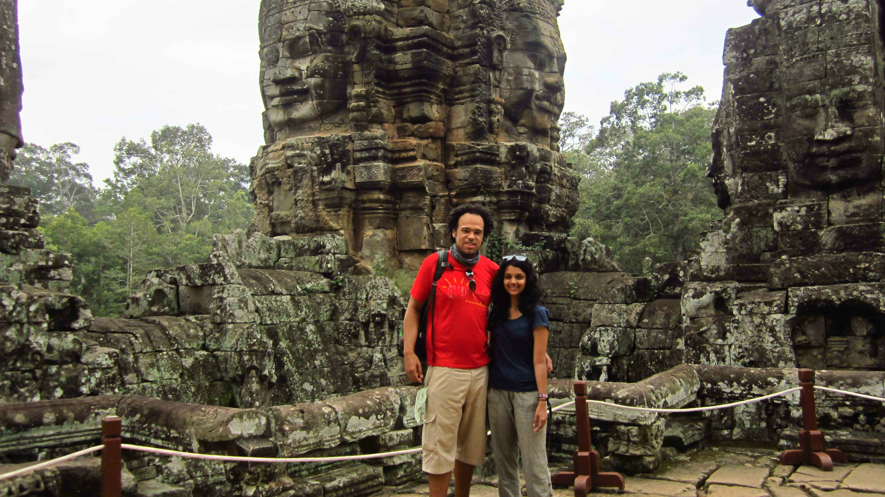

At Bayon, Angkor Thom

Planning which temples to visit required more planning than I expected. Stretching over 400km around the park the temples are the magnificent remains from the Khmer Empire spanning back from the 9th -15th century. It’s important to budget when visiting the temples as costings add up quick.

There are various types of passes ranging from the following: 1 day ($20), 3 days ($40) or 7 days ($60).

Tuk tuk prices have to be negotiated before you go as return fares can cost between $10 – $15 or more depending on which temples you decide to see. Try to group temples in the same location for a better rate. We decided to go for a 3 day pass to give us the time and flexibility. Luckily there was a driver at our hotel so we managed to negotiate a return fare of $10 (per visit).

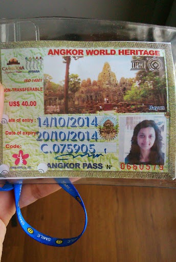

This is what the 3 day pass looks like. Photos are taken on site so there’s no need to bring copies. Your pass has to be carried at all times and will need to be presented before you enter the temple zone. The hole punches on the left are done by security – each ‘hole’ represents 1 day used from your pass

With our 3 day pass, we visited the following temples:

_NB: we took so many photos that it was impossible to share all of them 🙁 I’ve tried my best to narrow them down to my favourites to give you an idea on how amazing Angkor is!_

**Preah Khan temple**

Located 2km North-east Ankgor Thom, Preah Khan (meaning Sacred Sword) was built in the 12th century by King Jaya-varmanVII. The temple had originally served as a Buddhist monastery and school for over 1000 monks. We found this temple to be less touristy and a great base to start exploring the ruins.

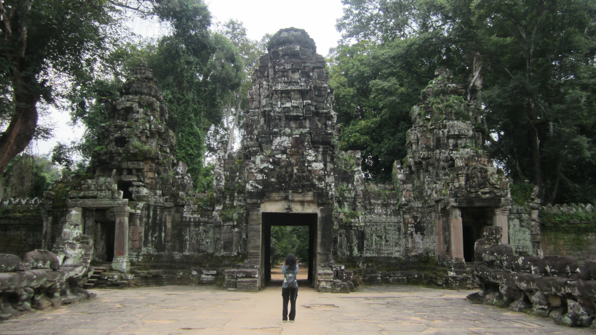

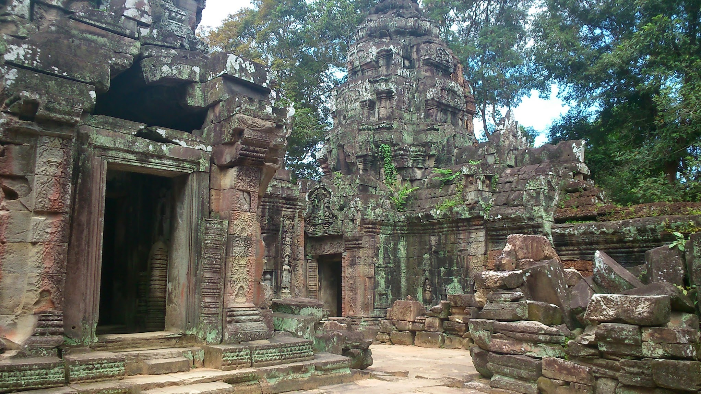

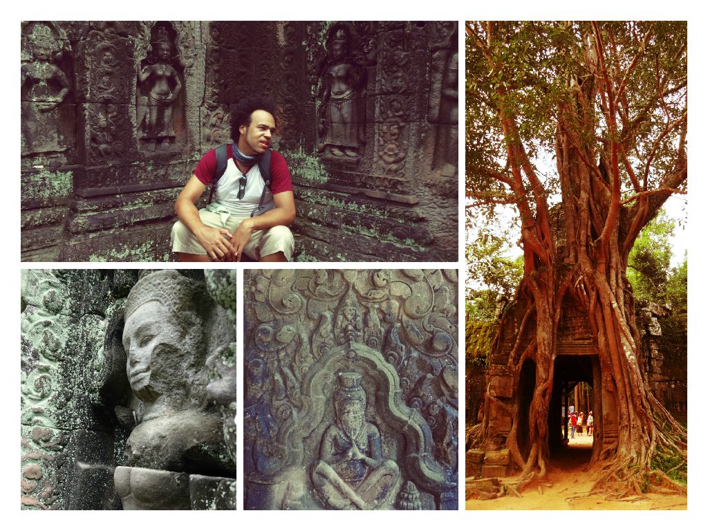

Fascinating detailed images taken around Preah Khan temple

Angkor Thom – A vast squared complex containing the popular sites within – Bayon, Baphuon, Terrace of the Elephants, Terrace of the Leper King. Requires a tuk tuk to visit each area. Be prepared to climb narrow stairs at certain complexes for the best views 🙂

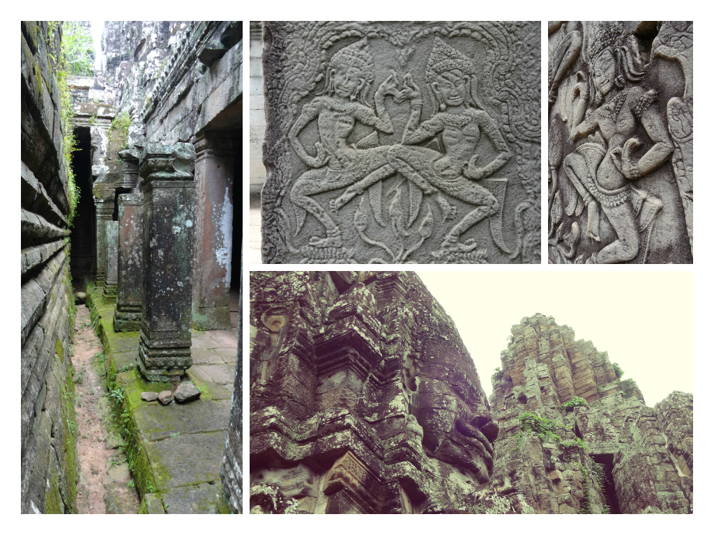

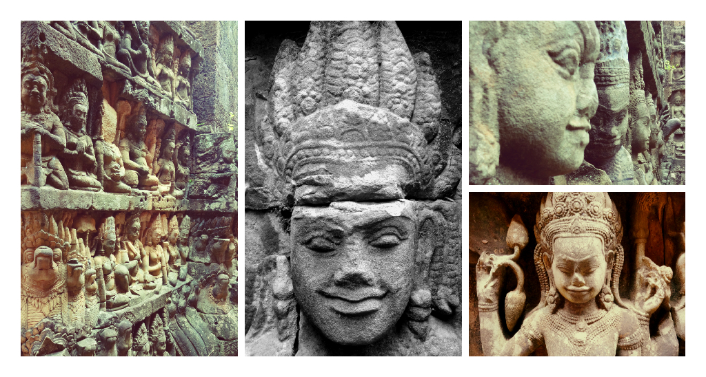

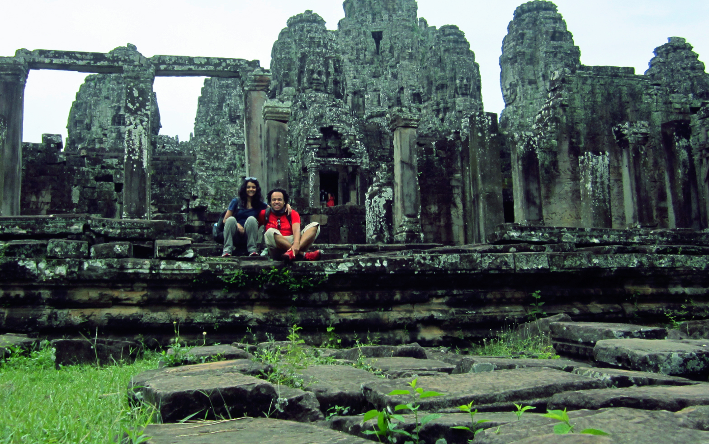

Outside the Bayon complex

**Ta Phrom**

Otherwise known as the Tomb Raider temple (for obvious reasons if you’ve watched Tomb Raider!). Ta Phrom’s magnificent architecture has slowly been reclaimed by nature and the ever-changing results are amazing! As we climbed around the ancient stones we could not help but marvel at the giant trees growing through the ruins.

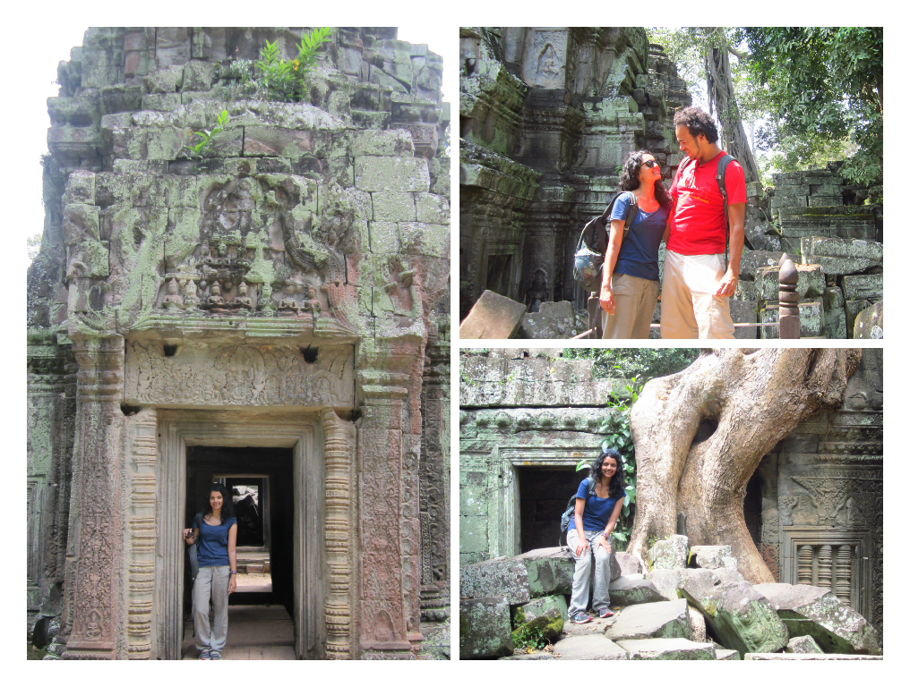

Wondering around the splendid ruins at Ta Phrom

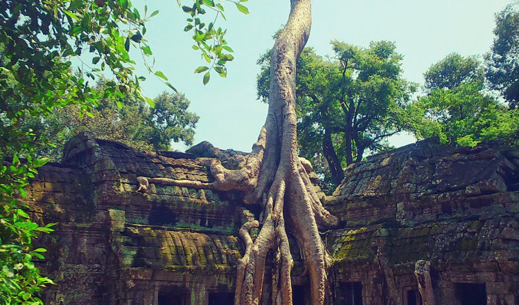

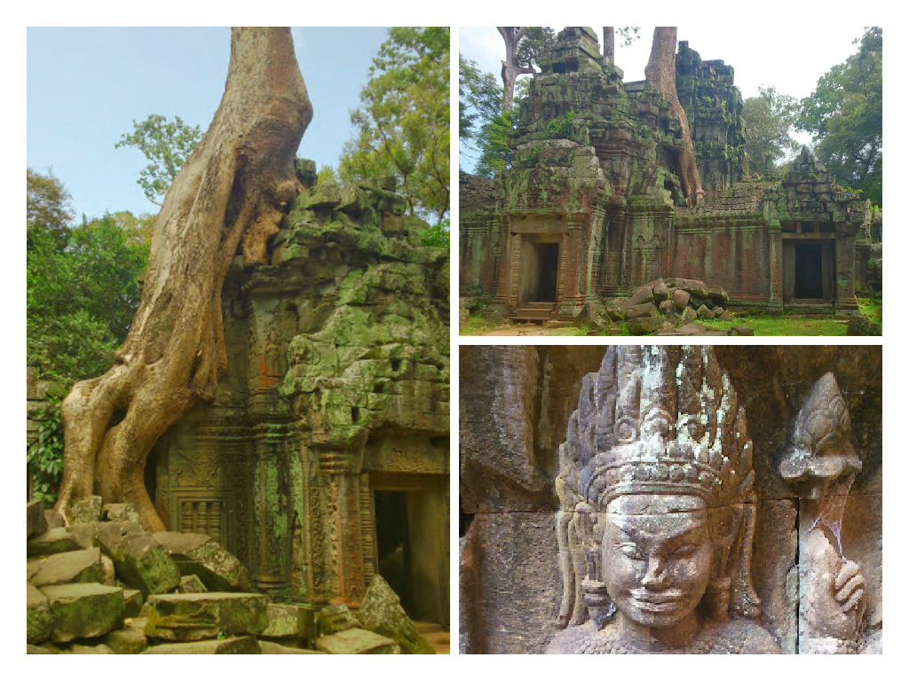

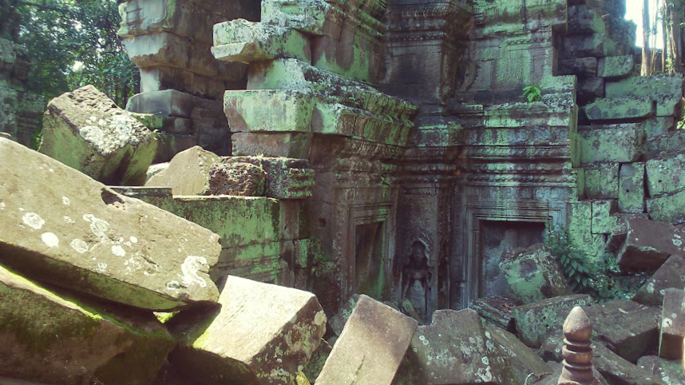

Crumbling ruins – many of the structures are in disrepair and will continue to be reclaimed back by the jungle

**Angkor Wat**

Originally Hindu and then a Buddhist temple complex. Angkor Wat is the largest religious monument in the world. It is the best preserved complex at the park. Angkor Wat has become a prime symbol for Cambodia and proudly appears on the national flag.

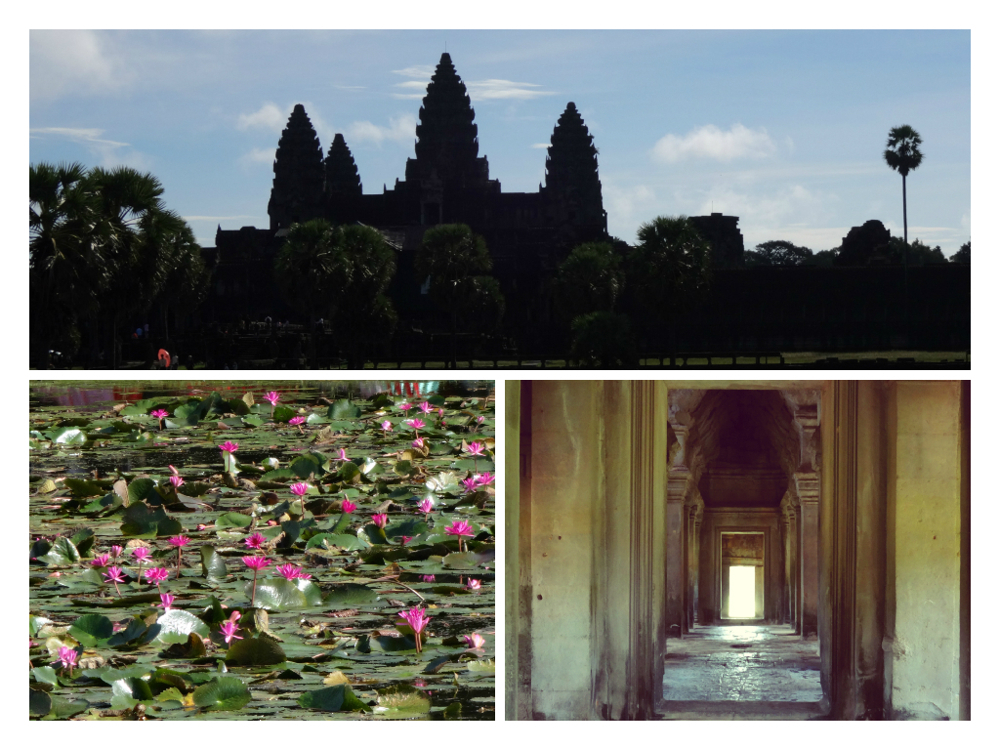

Angkor Wat – incredible in sunlight and shade!

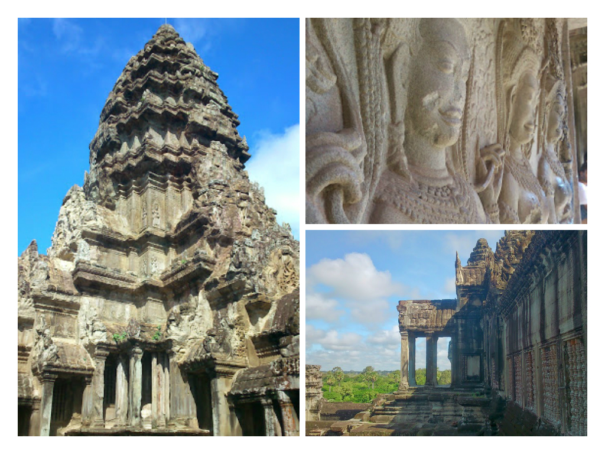

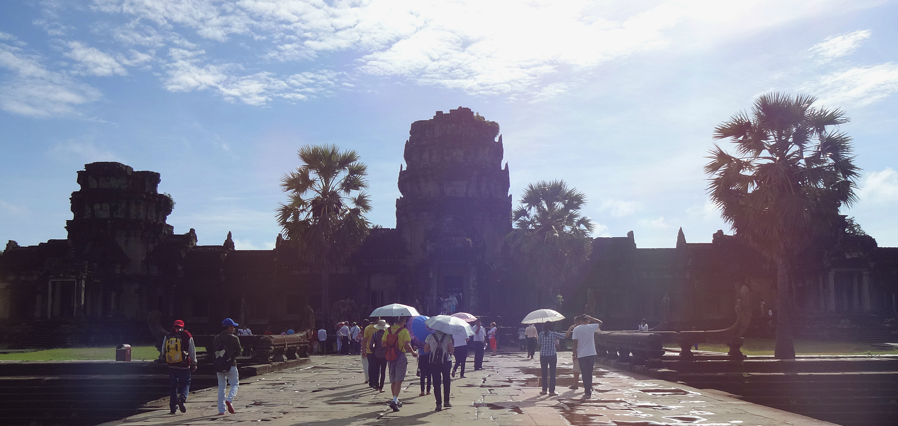

The grand entrance to Angkor Wat

The 3 day pass was an ideal option to visit the temples. As with most things it can be difficult to remain enthusiastic when visiting high volume tourist areas. Judging by how crowded the sites get the best times to visit are early morning or late afternoon.

During the day the heat is intense, it’s important to keep hydrated and even take an umbrella for shade. There are plenty of child beggars selling small souvenirs and drinks around the complexes – I didn’t notice anything suspicious but I observed several beggars usually approach one person (which could make it easy for a theft to occur if the person’s attention is diverted).

The ancient temple complexes steal Cambodia’s limelight as one of the busiest tourist attractions. The temples really do live up to their wonder and brings out the adventurer in us all. There were so many times I imagined I was on a Indiana Jones set!

Due to the structure of some of the temples I can’t imagine they’d be around within the next decade unless serious renovation starts. So if Cambodia is a destination you’ve been dreaming of, then go now!
