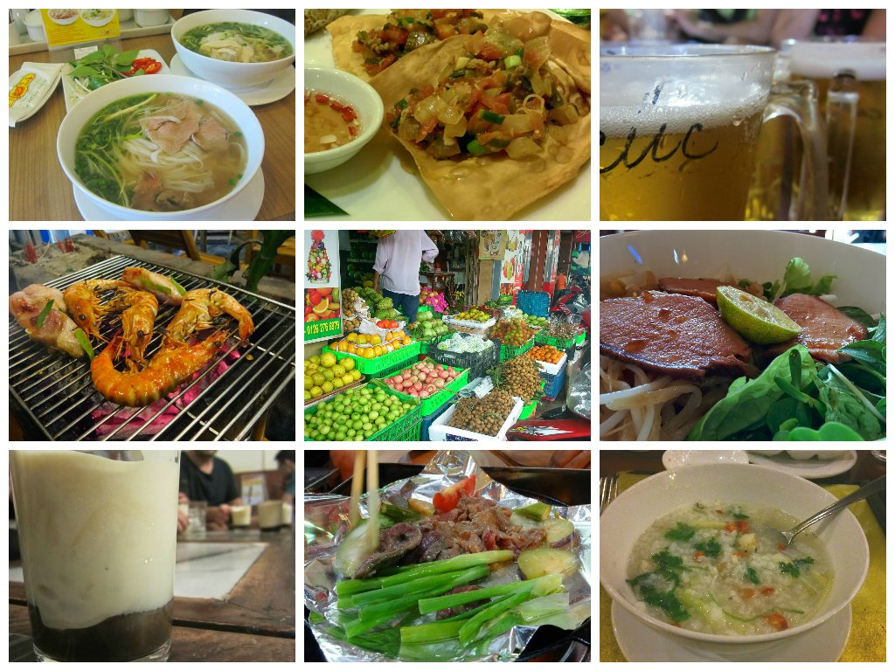

Immerse yourself into Vietnamese culture and tantalise your taste buds like never before!

Vietnam is an incredibly diverse country. Its food is as much of a highlight as anything else with a variety of local cuisines differing along the country. Now there is plenty of choice in terms of local and international food, and I’m sure everyone that has visited Vietnam has their select favourites they’ll treasure.

Check out my personal favourites I’ll remember during my travels in Vietnam:

Pho – ahh, the humble staple that can quite easily be summed up as Vietnam’s national dish. As an introduction to Vietnamese cuisine, I’ve tried many variations of Pho which can be served with chicken, beef or fish (+ many other weird and wonderful meats). I dare anyone travelling through Vietnam not to try a bowl of Pho!

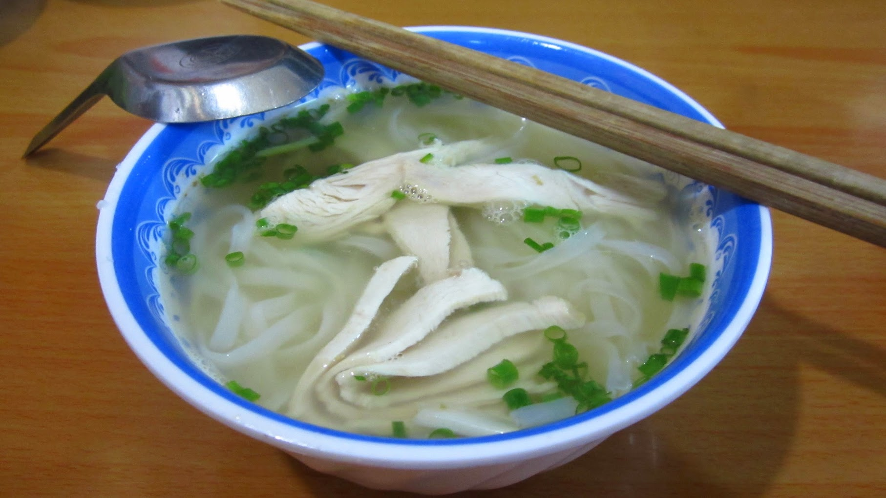

Vietnam’s national dish – Pho

Rice Congee – kind of similar to Pho, can be described as ‘rice porridge’ this dish is a very simple rice broth flavoured with various herbs and selected meats. A simple but hearty dish.

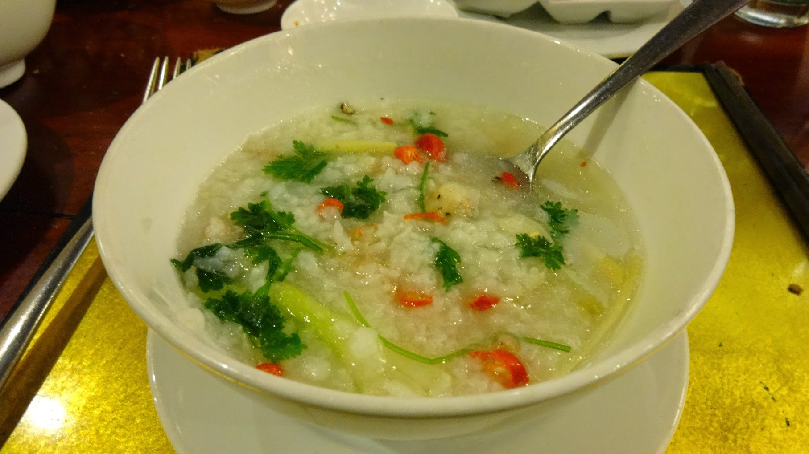

Prawn rice congee dish at Morning Glory restaurant, Hoi An. (Fresh Chilli added by moi 😉

Egg coffee – let me just start by saying how awesome the coffee is in Vietnam. I can only describe it as having this dark, rich, slightly bitter but chocolate-y goodness about it…it’s just soo good! My favourite though has to be egg coffee. This unusual creation combining coffee and sweet eggy frothy goes down such a treat. Attracting tourists and locals alike, there are many variations you can try out – including egg hot chocolate and egg vodka!

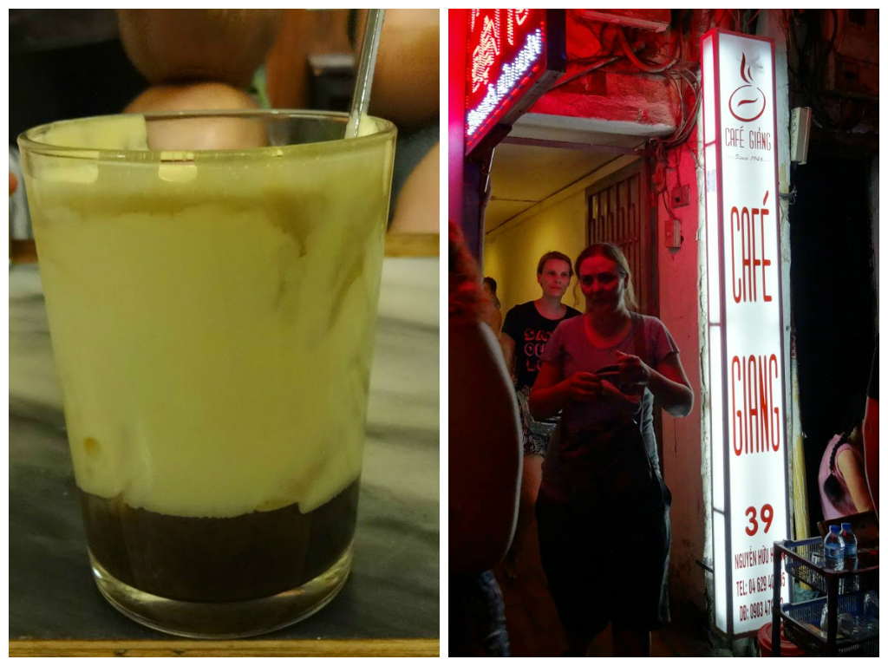

Cafe Giang in Hanoi is the place to go for egg coffee – its a narrow entrance so keep your eyes out!

Banh Mi – essentially rotisseried pork stuffed alongside crunchy pickles and fresh salad with lashings of hot sauce and mayonnaise – all encased within a warm flat bread/or crunchy baguette. These delights can be found throughout Vietnam, at around 30,000 VND (which is the highest price I’ve seen) and make a perfect lunchtime snack.

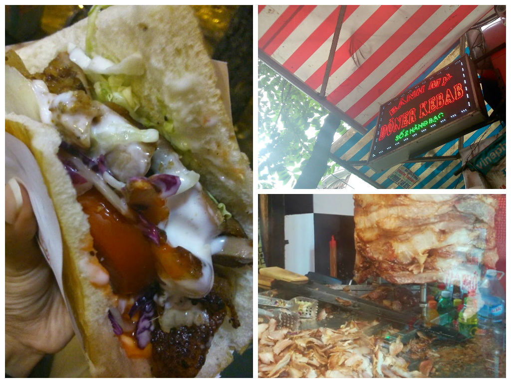

Find this banh mi at the intersection of Hàng Bạc and Hàng Bè in Hanoi for around 30,000 VND

Cau Lau – a Hoi An speciality, Cau Lau is a delightful broth combining chewy yellow noodles, thin slabs of tasty pork accompanied with fresh greens and herbs. Delish!

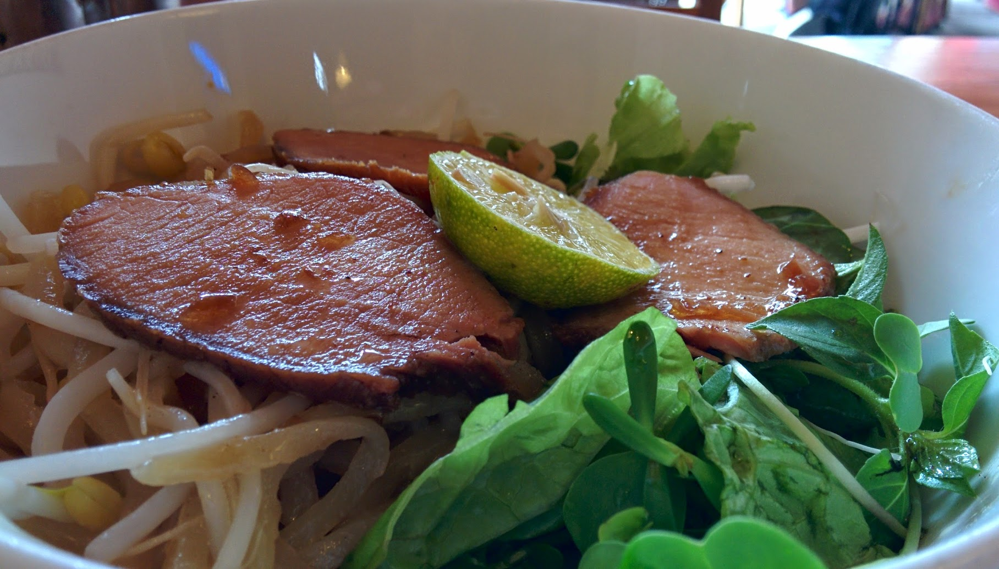

Just looking at this makes me hungry!

Fried Wonton – yet another Hoi An speciality, Fried Wonton can be described as a Chinese/Mexican fusion. Deep fried and served with a meat/veggie salsa-style topping, these wonton dumplings are moreish delights and make a perfect appetizer.

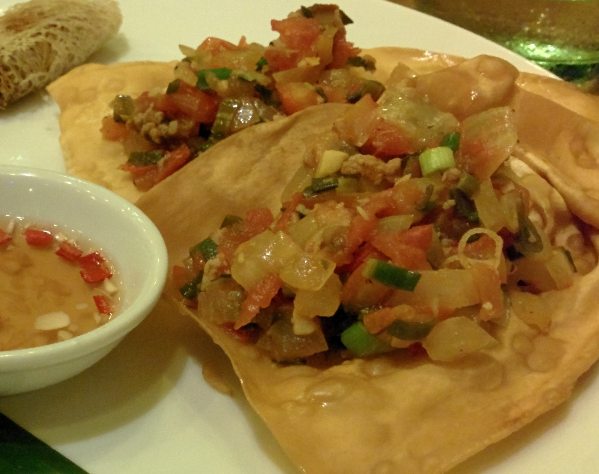

Try these delicious fried wonton at The Little Menu Restaurant, Hoi An

Spring Rolls – whether you decide to try them lightly fried or freshly hand-made, spring rolls are prepared with a variety of ingredients to satisfy the needs of meat lovers and vegetarians alike.

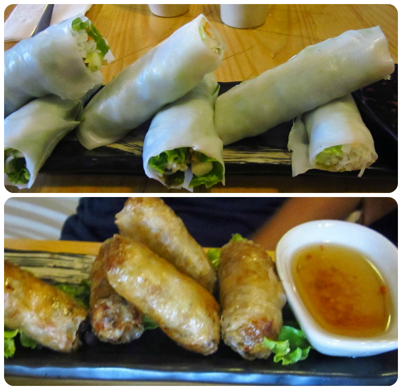

Whether you try them fresh or fried, spring rolls come in a variety of fillings and make a great appetizer

DIY BBQ’s – the humble BBQ is somewhat of a staple throughout Vietnam, with many businesses choosing the hands on approach for customers to cook their own chosen meats. This simple, yet effective move became a novelty for us during our travels down the country. Our favourite had to be Xuan Xuan in Hanoi. For under £10 you can order a tray of beef with veg, rice, baguette and a couple’ beers – an easy fill for 2 hungry travellers.

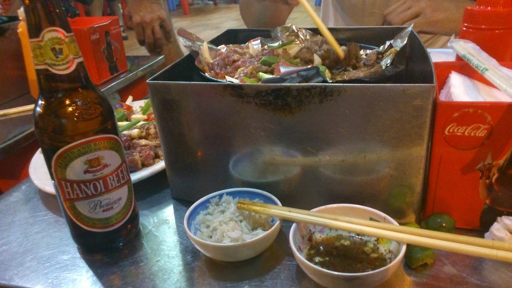

Simple. Tasty. And a winner for those on a budget.

Fruit – …okay so this is pretty vague but let me explain! The fruit in Vietnam is exotic, fresh, and abundant. My breakfast in Vietnam always involved juicy watermelon, mellow dragonfruit and super sweet mini bananas. It was also my first time trying mangosteen (dark purple fruit containing white segments that taste similar to a sweet lychee) and rambutan (known as a hair cherry, once its exterior is peeled its fleshy tender fruit it comparable to a sweet/sour grape). Oh and do try the oranges, which have a green exterior!

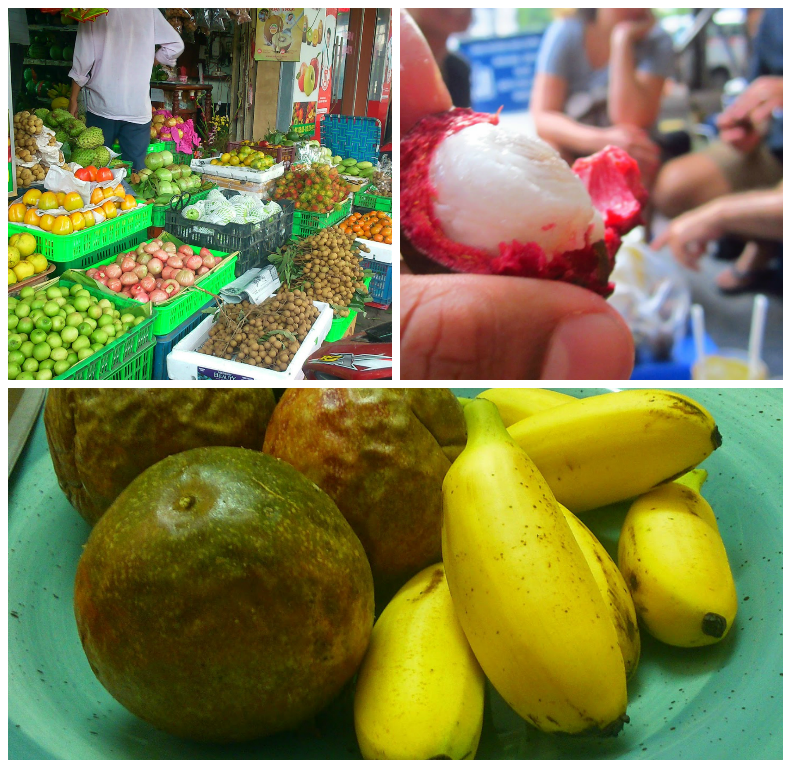

Top Left – a variety of fresh fruit is always available at the many stalls across Vietnam | Top Right peeling a mangosteen | Bottom – passion fruit and mini bananas!

Bia Hoi – or most commonly known as…beer! This local draught beer is popular business in Hanoi where travellers and locals flock to the street corners in the evening for a cheap (we’re talking 15p half pint) bevvie with a side of salted pumpkin seeds. Cheap, fun and authentic! Even non beer drinkers (like myself) can’t resist a cheap pint!

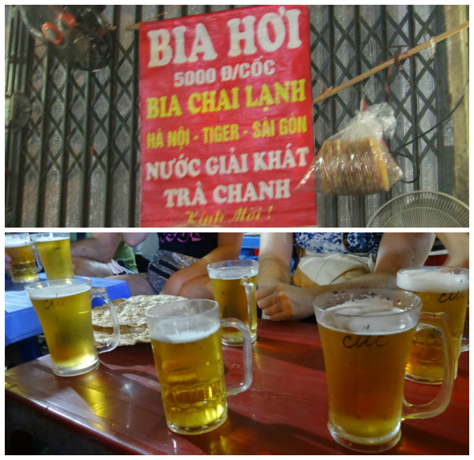

Grab a tiny stool and join the crowds for a local beer in Hanoi, cheers!
