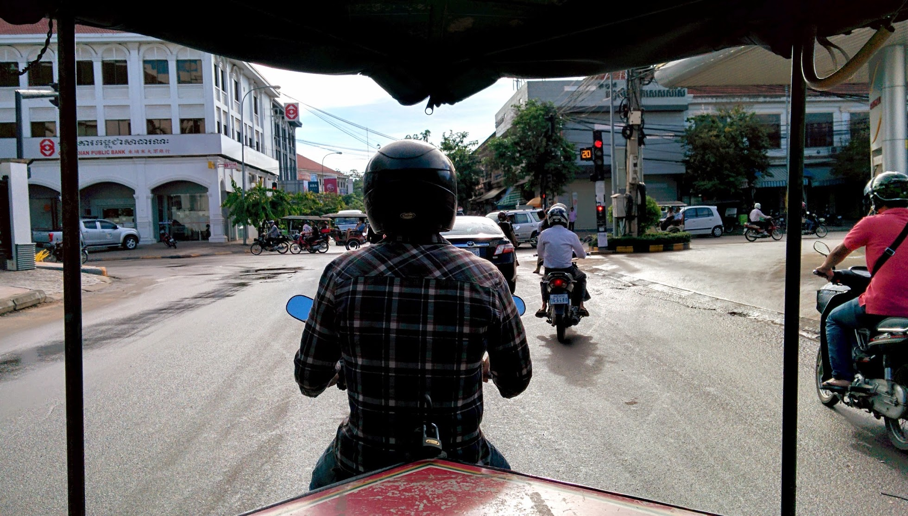
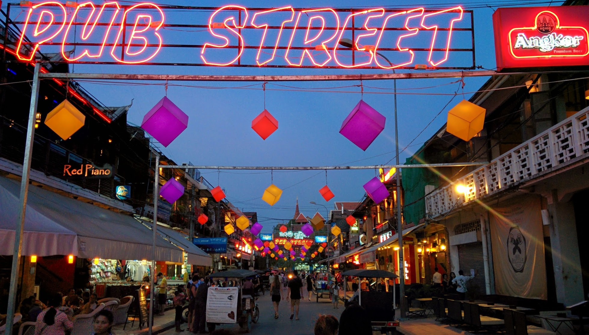
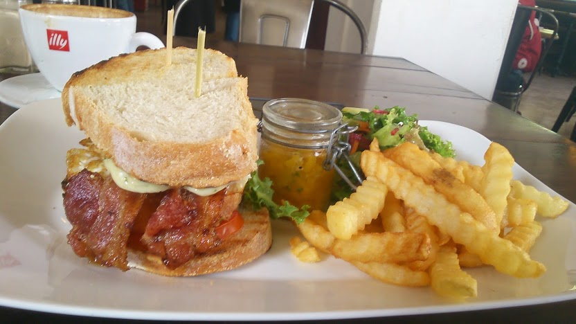
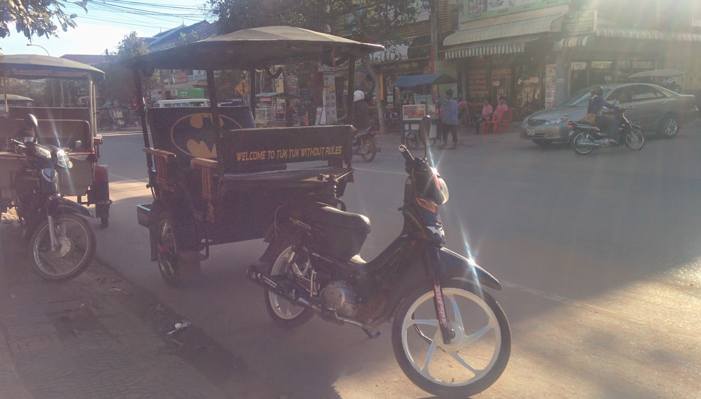
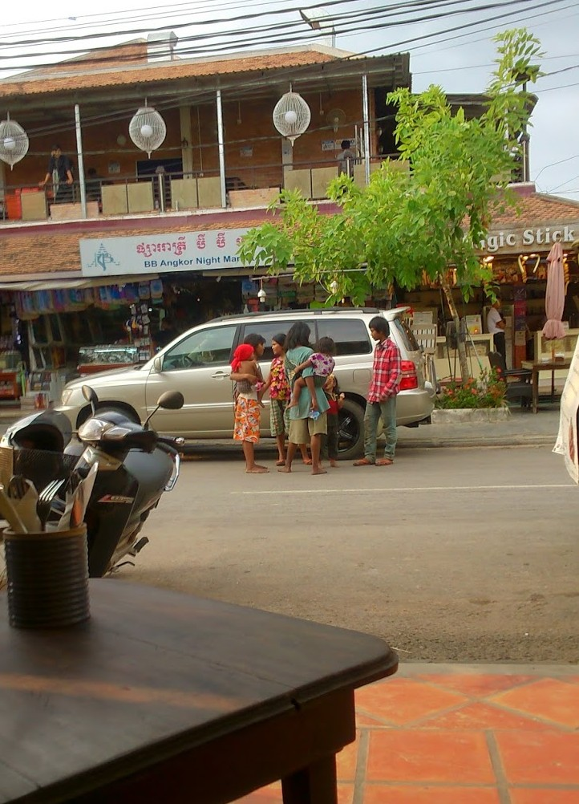

After four nights in Phnom Penh we decided we’d had enough and booked a bus to Siem Reap (via Mekong Limousine Express). Of course, the bus was nothing remotely like a ‘limousine style service’ and was rather a rough, nauseating, severely pot holed ride with overbearing loud karaoke played at random times throughout the 7 hour journey!

Siem Reap is easilyrecognised as Cambodia’s most visited region as it is the home to the magnificent Angkor Archaeological park. Excited by the opportunity to see the temples, we gave ourselves a few days to adjust to Siem Reap so we could plan which temples to visit.

Tuk Tuks are an ideal way to explore the city

We stayed at a ’boutique’ hotel (King’s Boutique) as it was competitively priced at $15/night for a double room with breakfast and pool. Unfortunately the staff were very ditzy and didn’t really know what to do most the time (just to note if you do stay here then you’ll need to ask reception for a new towel every day as the cleaners don’t replace them when cleaning the room!). Apart from these hiccups, the hotel is situated in a convenient location, close to the night markets and restaurants.

Pub Street – a popular hangout for many tourists and travellers

Siem Reap has a big expat community and with this comes many international restaurants and funky bars. The infamous ‘Pub Street’ houses many cheap ‘happy hour’ bars, plenty of tuk tuks all competing tourists attention. I found the vibe in Siem Reap to be much more chilled and relaxed than Phnom Penh; although there were still plenty of tuk tuks we found them to be courteous and apologetic if they came on too strong.

One of favourite hangouts in Siem Reap was Cafe Central – just off Pub Street. I’m addicted to their club sandwiches!

Though Cambodia is notorious for having a high level of crime, we felt safe during our stay in Siem Reap (way more than Phnom Penh’s seedy vibe at certain times in the evening). Of course this helps if you keep your wits about when exploring cities (i.e. not staying out too late night, excessive drinking or offending the locals).

Where else will you find a Bat-mobile tuk -tuk?

The only major concern in Siem Reap were the scams in operation – in particular regarding the young girls and children. Before I visit a place of interest I usually do some light research to find out particular scams targeted at visitors. I found several blogs which discussed the ‘baby milk scan’ as the most common tourist trap.

This is how it unfolds:

_A young teenager carrying a baby or child will approach you and state that they do not want your money, but merely some baby formula to feed their hungry baby/child. They will take you to the nearest convenience store whereby you can buy a tub of baby formula for them. The teenager – now thankful for your purchase can now feed their child, whilst you walk away with a sense of pride helping those in need. Sounds so ideal, doesn’t it?_

Unfortunately there is a dark truth about this so-called ‘act of kindness’. These young teenagers are controlled by a larger operation to go out on the streets in the evening. Nearly all the children/babies involved are known to be drugged to keep them docile throughout the night. There have even been reports that these babies are ‘loaned’ out from their families in an attempt to make money.

What’s even worse is that the convenience stores are in on this too – after the scam is complete the teenagers will go back to the convenience store where the profits are split. This scam ultimately pulls the heart-strings of unsuspecting tourists.

Admittedly it’s difficult to comprehend the situation, especially if you’re approached. But by contributing will only force more vulnerable children on the streets by their families as a means to make a living. As travellers/tourists we play a vital role in ensuring our good deeds go to those who are actually ‘in need’ and not exploiting the system – we can all make a difference if we’re aware.

Scenes like this are very frequent around the central tourist areas. This was taken opposite Pub Street – a group of young girls congregate before they go separate ways. It’s a difficult situation to witness – but by saying ‘no’ we can try and put an end to these scams. Wishful thinking? Perhaps. But we’ve got to start somewhere.
