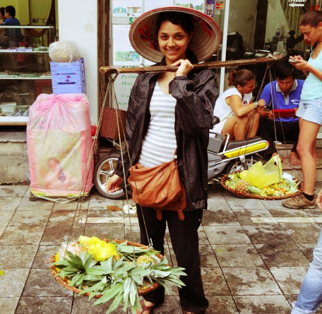
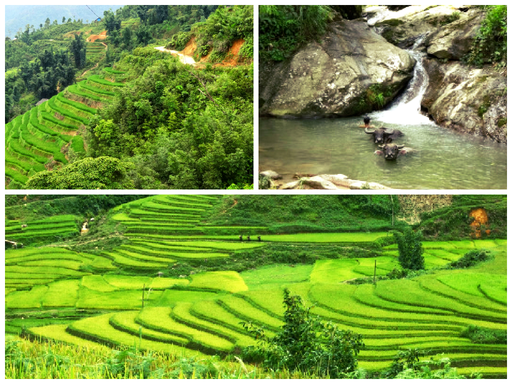
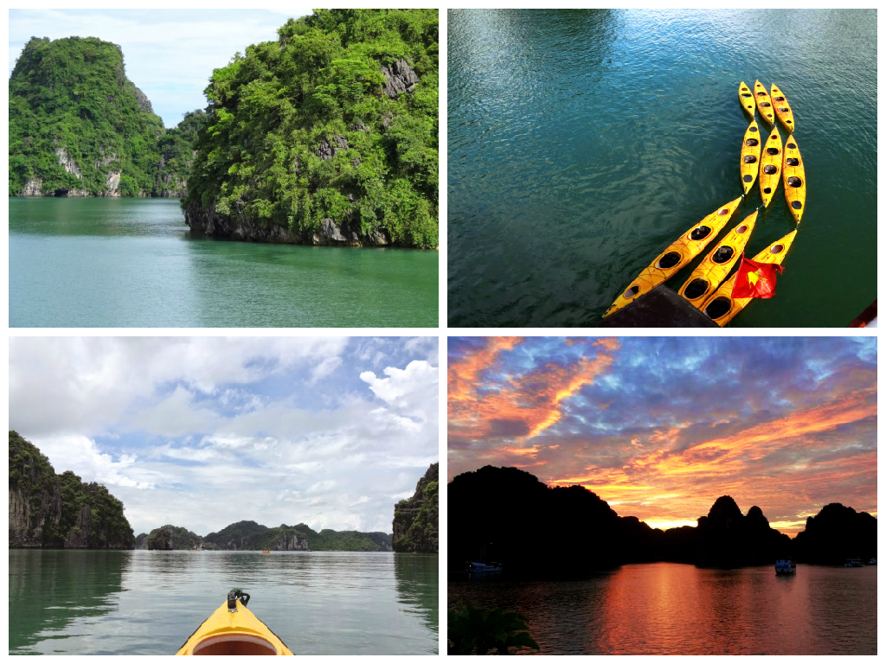
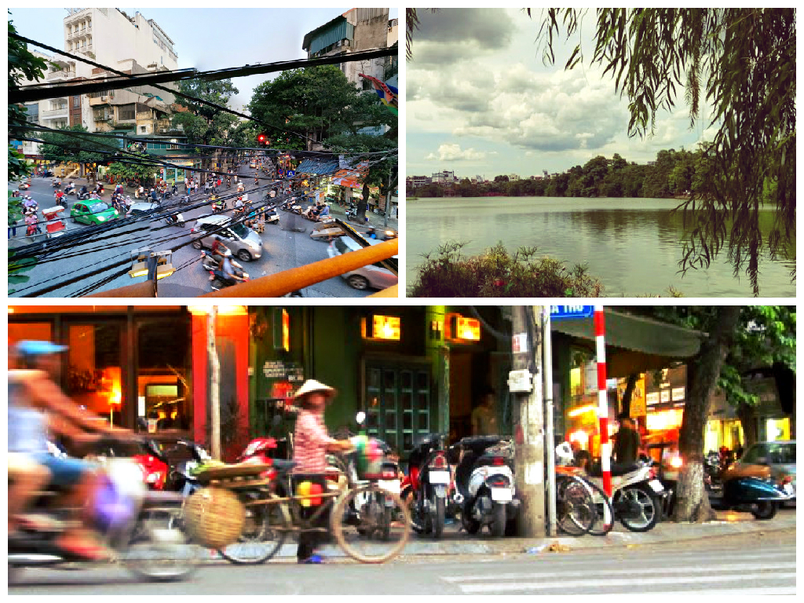
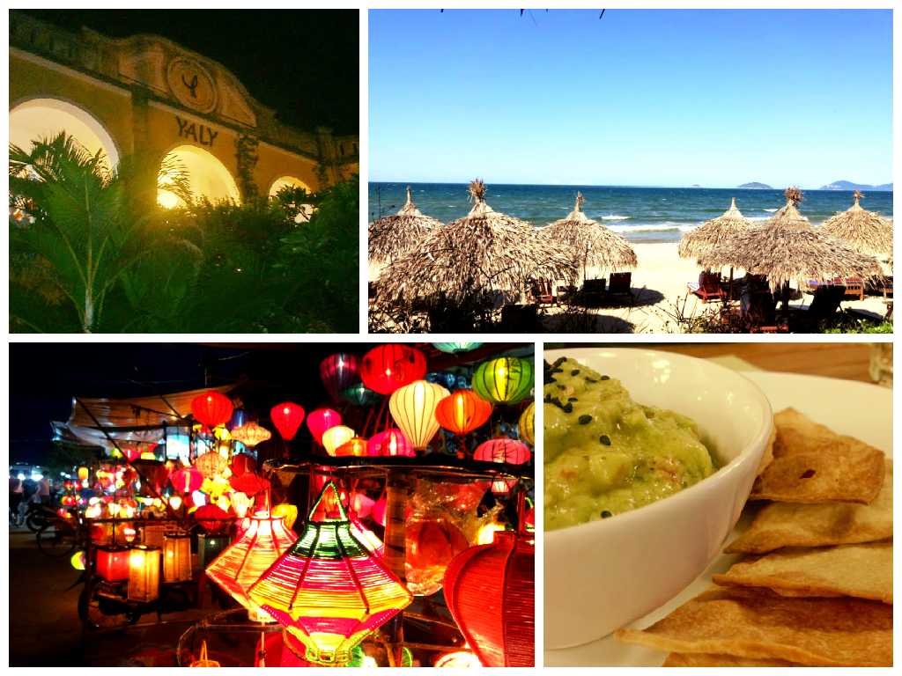
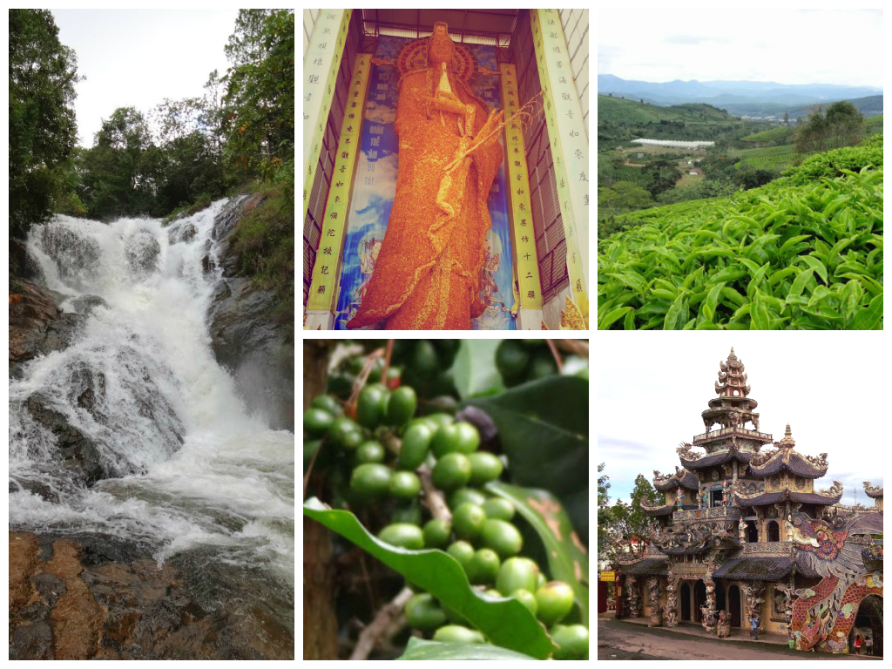
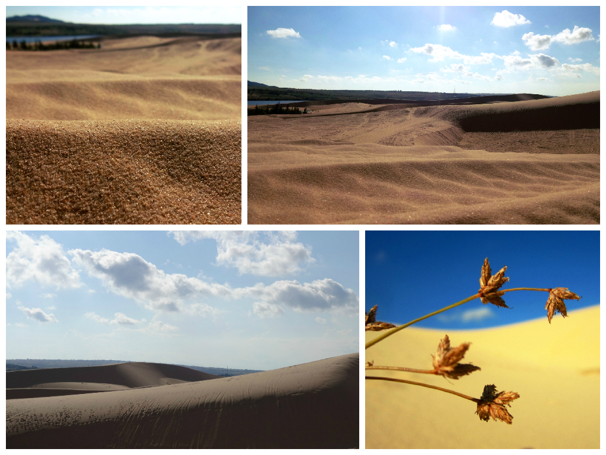
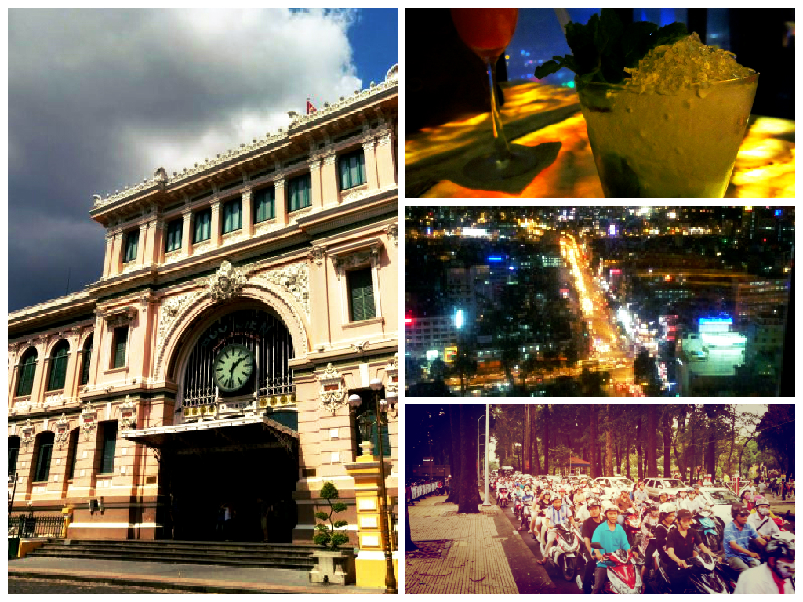

I admit it… I was pretty naïve when I landed in Hanoi. I knew very little about Vietnam or its culture, people and way of life. After spending 2 adventurous months travelling down the country’s spine I’ve immersed myself into Vietnam’s lush scenery, received the warmest generosity from locals and eaten the most incredible food.

Vietnam surpassed my expectations and made me realise how versatile and wonderful this country is. I’m glad in a way that Vietnam hasn’t received the same attention as its nearby neighbour Thailand. Vietnam has retained its tradition and authenticity with pride. However it is likely in the future that with popularity will come the crowds, but for now this country sits quietly among its neighbours.

I’ve visited all the places mentioned in this post. I found each destination to have their own unique characteristics – it’s very rare to find a country with such a versatile landscape.

Read on to see the destinations that made me fall in love with Vietnam, and why you should seriously consider going!

**Sapa**

Sapa is high on the traveller/tourist agenda, and rightly so. Located 1500m above sea level this scenic mountainous town North West of Vietnam is famed for its lush green scenery and cultural diversity – think ethnic hill tribes, vivid green rice paddies, and field upon fields of fresh vegetation. As an easy destination to get to from Hanoi, why not challenge yourself to a trek of you choice (easy and hard options available) and opportunity to stay with a hill tribe family. Immerse yourself into the greenery and enjoy the simple life!

_Getting there: many tour agencies operate in Hanoi to suit a variety of budgets. It’s worth speaking with hostel/hotel staff for recommendations or word of mouth. To get to Sapa you can either take a sleeper bus or sleeper train – if you take a train you’ll also need to take a bus to reach your accommodation._  

**Halong Bay**

Halong Bay is a UNESCO Heritage Site renowend for its impressive geological value and over 1600 uninhabited jewelled limestone formations. Halong Bay is an idyllic setting, perfect for a mini voyage. With many tour companies operating in Hanoi, there’s a budget for all interested ranging from day trips to 4 days/3 night boat tour.

_Personal advice: make this an experience to remember and budget a little more for Halong Bay where you could get the opportunity to sail to a quieter part of the bay and kayak close to the limestone formations, stare gaze in the evenings with a cocktail in hand, and even dine in a cave!_

**Hanoi**

Hanoi’s energy and French flair will entice you in to explore. Join a food tour to find the best street food vendors for local cheap tasty eats, squeeze into a tiny chair and enjoy an ice-cold ca phe sua da. Alternatively there are plenty of museums for the keen history seekers and the grand Hoam Kiem lake to join locals for early morning fitness activities. If you have time, pop down to the famous night markets every Friday – Sunday and work on test out your haggling skills!

_Note: the traffic in Vietnam is unpredictable and can be dangerous. The driving style in Hanoi takes some getting used to. Always keep your wits about and just remember you’re likely to cause an incident if you hesitate when crossing – just keep walking and the traffic will work its way around you!_

**Hoi An**

It’s easy to describe Hoi An as a laid back alternative to Hanoi (with added perks). Not only does Hoi An have fantastic beaches (Ang Bang and Cua Dai) it also boasts a UNESCO Ancient Town, culinary specialities, great value spas and dozens of tailor-made establishments. Explore, pamper, shop and hit the beach – what’s not to like?

_Getting around: Hoi An is mainly flat which makes it very accessible to explore the town by bicycle. Several hotels offer free bicycle hire and motorbike rental if you wish to explore further._

**Da Lat**

When you decide you want a break from the scorching heat in Vietnam, pop down to Da Lat. This cool, breezy region in the Southern Highlands of Vietnam is a gorgeous contrast to other towns – think calming lakes, flowering parks, powerful waterfalls, rolling green hills and pine trees galore! To make the most out of your stay, join one of the many motorbike tours to get a real insight into the beautiful scenery Da Lat has on offer.

_Tip: there are many motorbike agencies operating under the similar name of ‘Easy Rider’. It can be pretty difficult to pick which tour to go for as most reviews are all rated well. We chose the Easy Rider Club (office located opposite The Sinh Tourist office) and enjoyed a fantastic day tour with them._

**Mui Ne**

Feel like you’ve been transported to the Sahara desert and visit the unique sand dunes in Mui Ne. Have your cameras at the ready as you frolic around in the soft sands and marvel at the sweeping landscape. Quad bikes are available for a cheap thrill, or explore further on foot to get the best views. Mui Ne also boasts a quiet idyllic beach with many upcoming hotels in development.

_Tip: the best times to visit the sand dunes would be early morning/before sunset. The weather can get intense between 11am-3pm so apply plenty of sun lotion if you venture out this time!_

**Ho Chi Minh**

Enjoy the fast paced environment Ho Chi Minh boasts and indulge yourself in some of the finest culinary delights, swanky roof top bars and shopping malls. Alternatively, visit the museums to gain an insight into the Vietnam War, waddle through the Cu Chi Tunnels, or take a day trip on the Mekong Delta. Ho Chi Minh (or commonly known as Saigon) is a fast paced city which is ever gaining popularity and making its presence known as one of South East Asia’s booming cities.

_Staying here: there are plenty of options to suit the budget/luxury traveler in Saigon, most accommodation is located in the popular District 1. For those wanting to stay local, try AirBnb and rent a room/apartment in District 2 which has a friendly local/expat vibe and only a 15 minute bus ride into District 1._

Vietnam also boasts an incredible food scene – click [here](/posts/2014-10-what-to-eat-in-vietnam-try-these-10-delights "What to eat in Vietnam? Try these 10 delights") to see which 10 delights I found and recommend through my travels.

**Is it easy to travel through Vietnam?**

Yes! For someone with minimal travel experience we managed to travel through the country without any problems. When travelling via bus, we always used The Sinh Tourist – this is the official name (there are many copycat agencies) which run in all the destinations above (apart from Halong Bay and Sapa unless you book a tour with them). Their prices are clearly listed with bus schedules. Train tickets can easily be purchased at the train stations – it’s always ideal to buy tickets the day before travel (though not always necessary). Translation apps are handy if you’re speaking to someone who speaks little English. Of course you can book transportation through a travel agency, but bear in mind that commission will be added in these cases (which does add up if you’re travelling longer than 1 month+ like we did).

**Did I feel safe travelling through this country?**

Absolutely – we didn’t experience any personal danger towards us. The only quibble I had was regarding traffic – Vietnam’s roads are very congested (primarily motorbikes) which will take a little while to get accustomed to. Always remember to be aware of your surroundings – this doesn’t apply to Vietnam’s traffic but Asia’s traffic in general! It may take a while to get used to it but the rule of thumb is to continue walking so the traffic can redirect around you – sounds daunting but it works!

**What do I love most about Vietnam?**

It’s versatility. Considering the size of the country (in comparison to Thailand) Vietnam’s diverse landscape is so varied and draws so many people seeking adventure, relaxation, history and culture. It also makes an ideal destination if you like to explore multiple locations easily via buses, trains and flights.

**Are the locals friendly?**

I’ve read blogs and articles that focus on how negative/unfriendly Vietnamese locals are. Whilst I can’t comment for the nation, I can honestly say for the 2 months I was there I rarely received bad attitude from the locals. If anything they would be curious, but never rude/aggressive. It’s natural for locals to be curious when they see travelers – it may be the first time they’ve ever seen someone like you!

Some locals don’t encounter these situations often and their actions may come across as rude. As a traveler I respect this and understand that these situations will arise so don’t take it personally. However I have met other travelers that hated their time in Vietnam – it really is a love/hate destination!

So…Apart from all the fantastic reasons I’ve listed on this post for why I want you to visit Vietnam, I saved my favourite (but silly) reason till last.

Vietnam is probably only a handful of countries where I felt like a millionaire! _A millionaire did you say? Do tell…_

Well, just £30 is approximately 1,000,000 Vietnamese dong! The excitement that this will probably be the only period in my life where I have a million of something in my pocket is something to remember!
