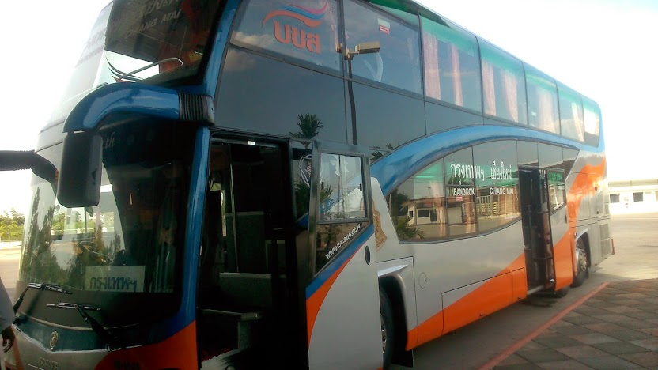
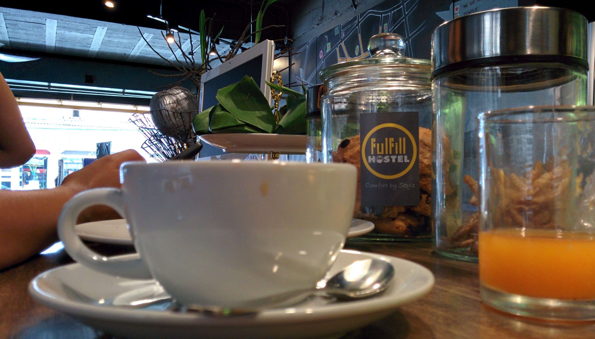
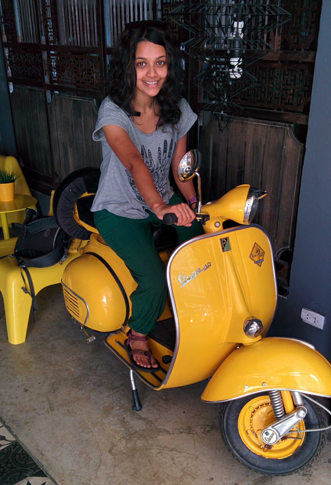
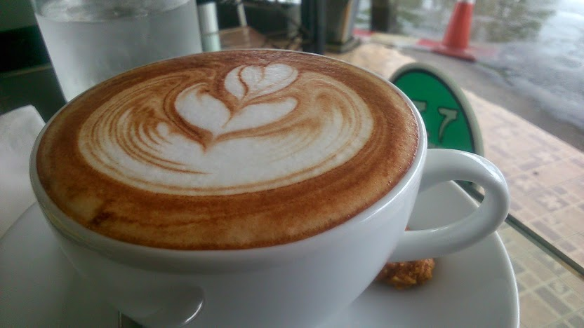
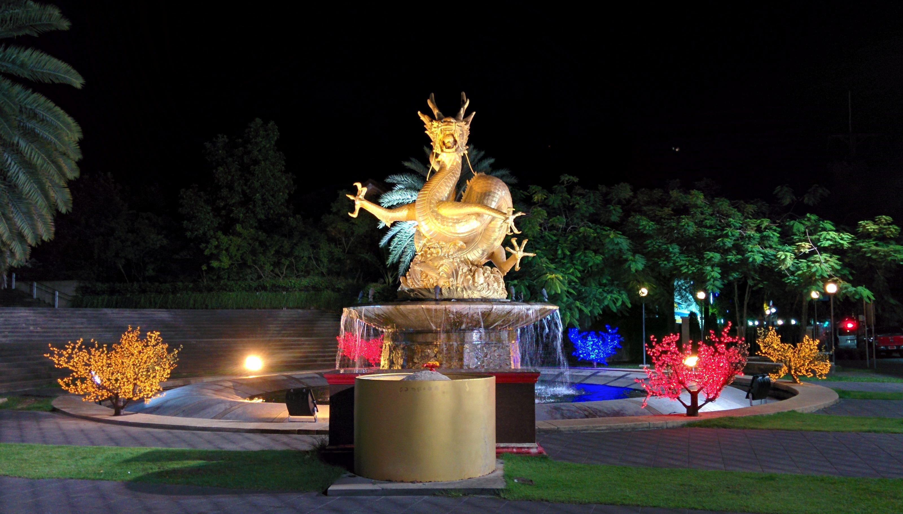
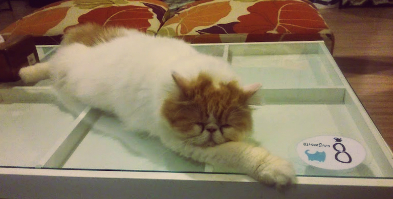

Still challenging overland transportation we booked ourselves a series of buses from Chiang Mai to Phuket. We stayed in Bangkok for a couple of nights before heading down to Phuket.

Bangkok – Phuket – the bus we spent an entire day on

We paid a little extra for a ‘VIP’ bus which departed at 07:00am and took around 12 hours to reach Phuket. We were surprised to find that the bus was pretty decent! The seats reclined fully back with foot rests, the air con was working and blankets were provided. We were given complimentary snacks, lunch and drinks included. There was also a toilet onboard which was a real bonus as the bus only stopped for lunch.

In total it took over 14 hours to reach Phuket. Unfortunately the bus dropped us off at a different terminal which threw out our plans to walk to the hostel. As we arrived in Phuket around 21:00 the locals buses were no longer running so we had to resort to taxis. However the taxi drivers decided to ‘up’ their fares and were charging 300 baht for a 10 minute journey! Fortunately we paired up with another traveler on the same journey as us and managed to haggled down the fare to 200 baht.

There are many budget accommodation options in Phuket, we decided to stay at Fullfill Hostel. The staff were super friendly and bought loads of tasty nibbles from the markets for those staying.

How cute is this vespa!

I found Phuket to have a chilled vibe. There are many tour agencies offering deals to go to the popular islands like Ko Phi Phi. Still feeling restless from the long journey we decided to postpone the islands and instead caught up on some well needed rest, blogging and search for good coffee (luckily we did all 3!)

Enjoying a decent coffee at The Circle Coffee Boutique

The Sea Dragon statue, Queen Sirikit Park

A friend of mine was passing through Thailand and met me in Phuket. It was great catching up and sharing travel stories. We ventured out in the evening to a cat café where we all played with the cats until closing time – unfortunately due to the copious amounts of sneezing that came from me it was clear that I developed an allergy where I can no longer share a room full of cats, boo!

Enjoying a catch up at a cat café! Although this kitty didn’t seem to care
