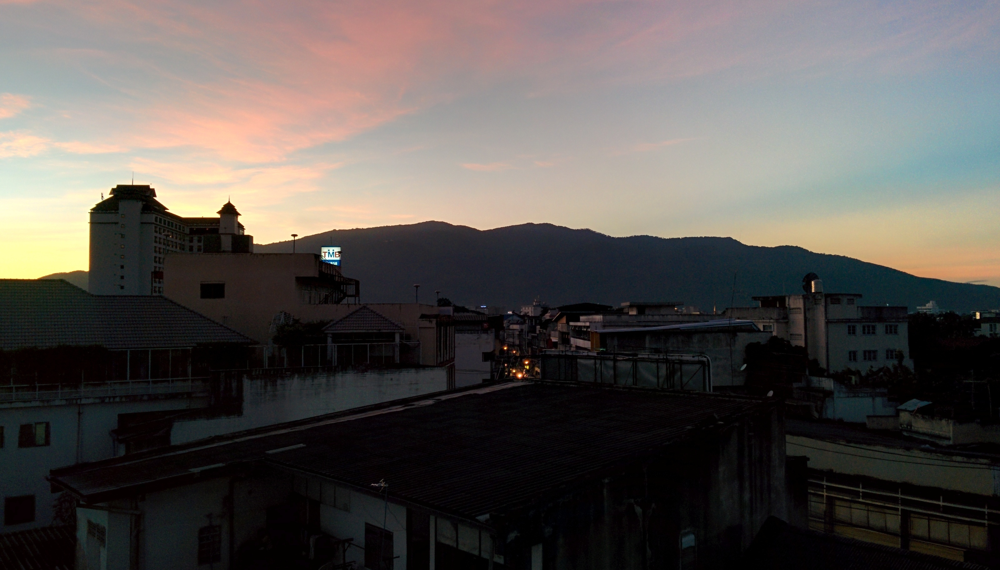
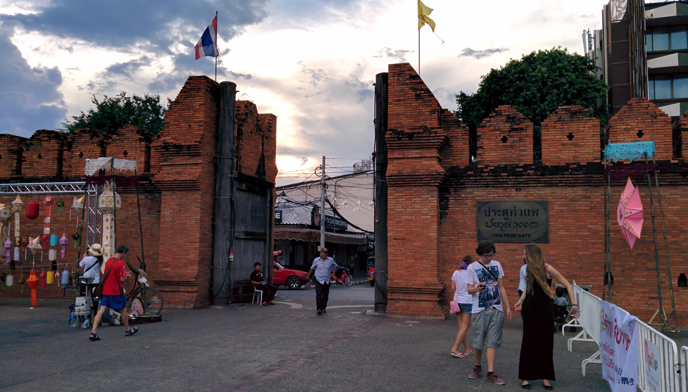
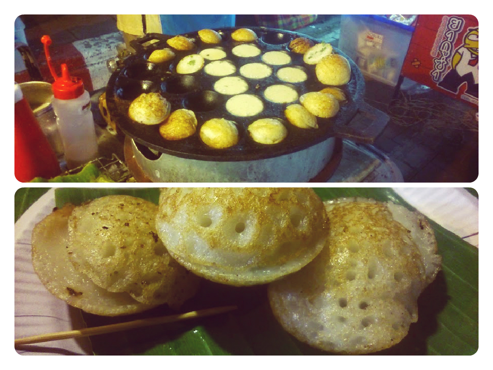
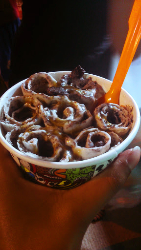
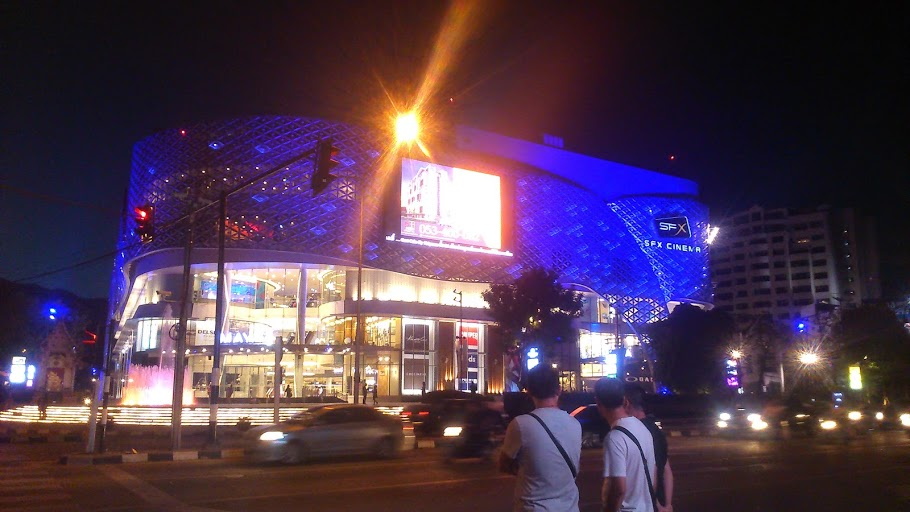

Morning view from our apartment

Chiang Mai is a popular city in Northern Thailand. The city is renowned for its ancient temples, scenic landscapes and welcoming people. Over the years it has gained popularity and homes a thriving expat community.

It took around 3 hours to reach Chiang Mai on bus (from Chiang Rai). I noticed when we arrived how alive the atmosphere was. It’s been on our bucket list to see the Lantern Festival (Yi Peng) and we had arranged our schedule so we arrived in time for the event. We decided to stay at an Airbnb apartment for the duration of our stay. (_We stayed for 1 month in different areas of Chiang Mai – 1 week was a rest week and the other 3 weeks were spent working)_. You can read more about our experience at Yi Peng [here](/posts/2014-11-yi-peng-lanterns-festival-2014-chiang-mai "Yi Peng (Lanterns) Festival 2014, Chiang Mai")

We stayed in different locations around Chiang Mai – Tae Phae Gate and Nimmanhemnin.

**Tae Phae Gate**

Tae Phae Gate

Located east of Chiang Mai, we stayed in an apartment around this area as this was where the main processions for the Yi Peng festival were held. There are an abundance of food stalls and every weekend you’ll find the night markets here. There is so much to see – if you particularly love all things colourful, sparkly and unique (like me) then there is something for you! There is also a large choice of food & drink stalls that cater for all taste buds.

I got addicted to these crispy coconut delights

50 baht for my own wonderful creation – vanilla ice cream, oreo AND brownie pieces. smothered in caramel sauce. Need I say more?!

**Nimmanhemin**

Easily recognised as Chiang Mai’s chic quarter. Nimmanhemin (Nimman for short) boasts fantastic coffee joints, trendy bars, hair salons, luxury condos and boutique clothing. Maya Mall (which has recently opened) is an upscale mall which also has a cinema and food court.

Enjoy a Latte at Ristr8to

Maya Mall

_Know before you go: before a film is shown everyone (inc. visitors) are required to stand up for the Thai Royal anthem. Those who do not participate are technically breaking the law!_

Nimman is also a thriving student scene and hosts several co-working spaces. There are also plenty of apartments available to rent on Airbnb. We stayed in 2 apartments throughout our stay.

Co working – Kyle recommends PunSpace for freelancers looking for office space. There are plenty of desks available with decent wi-fi and 24 hour access. Complimentary tea/coffee/water is also provided.

Of course not everything was a ‘highlight’. I decided to revamp my hair and wanted some highlights. After popping into a few salons for quotes (most were charging UK prices) I managed to find a hair salon that would charge £20 for a cut, highligts & dry. _Great!_ I thought – after showing them an image of what I wanted we got underway for colour.

To cut this story short I ended up with ‘caramel’ highlights instead of glossy highlights I imagined. Was I disappointed? Yeah! Well slightly. I mean it wasn’t the worst colour. It just wasn’t the colour I wanted! The staff were really friendly but I didn’t trust them in rectifying the mistake!

On the left is what I asked for. On the right is what I got!

~~Apart from the hair ordeal~~ We enjoyed our time in Chiang Mai and even managed to spend less than we anticipated. Staying in an apartment worked out to be cheaper than a hotel stay. After several visits at the night markets and moving around Chiang Mai, we managed to use a few tricks to save ourselves some money.

Saving Money Tips:

Haggle! – The night markets are fantastic in Chiang Mai and there is an abundance of wonderful nik naks. The locals are very friendly and its very easy to playfully bargain your way to your chosen goods – some will not want to join in and have fixed price but there also plenty that will play bargain! I always managed to haggle the asking price by _half_ – don’t be shy, just try it!

‘Red trucks’ – also known as songthaews or public taxis. They run very regularly and can easily be flagged down in the city. Rates are often as low as 20 baht per journey (per person).

Street food – the food stalls in Chiang Mai boast some of the tastiest, cheapest eats in Thailand. Good vendors do keep their units clean but if you’re unsure then always choose a vendor that is busy. Pad thai, fried rice, kebabs, crepes, ice cream – these were some of the tastiest and cheapest eats we ate on the regular.
