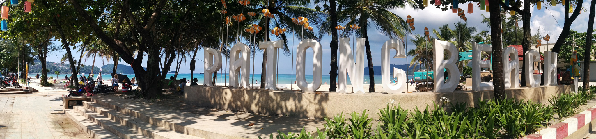
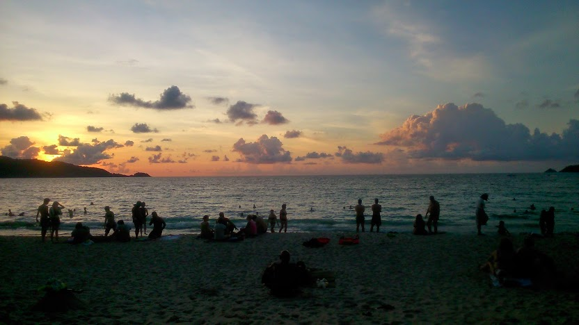
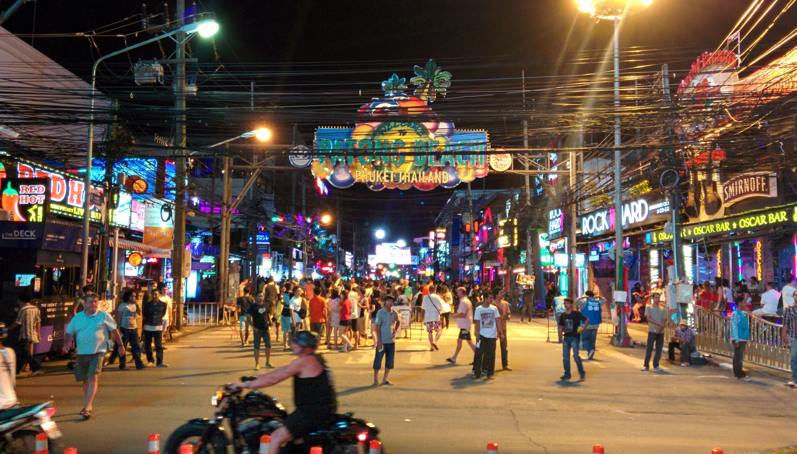

_It’s true what they say. Like Marmite, you’ll either love or hate Patong._

After a chilled few days in Phuket we wanted to check out the beach towns nearby. After reviewing the options we agreed to visit Patong – a lively beach town on Phuket’s West coast.

It took 1 hour to get to Patong from Phuket by local bus. It was clear as we arrived how popular Patong was. Big Western chains have flooded this once idyllic town; there are mass shopping outlets selling the standard ‘same same’ merchandise ranging from souvenirs, clothing, and fake designer goods.

The beach is beautiful but spoiled at the sight of leathery skinned sun bathers wearing pretty much next to nothing. The hawkers are non stop and have a habit of following you as you try to make your way past. _And to think, we’ve not even arrived at our hotel yet!_

Watching the sunset at Patong beach

As with popular tourist locations, I find that the initial ‘buzz’ wears off pretty quickly before I start getting frustrated. Take for example the infamous Bangla Road. This busy road boasts many bars, clubs, food and clothing stalls. It unfortunately hosts a very seedy scene where ‘Ping Pong shows’ are a common theme (even more so than Bangkok). As we made our way through this road we were approached by several touts at once, literally shoving posters in our faces.

At first it was manageable whereby we politely declined and carried on. However just a few steps later we were approached yet again by another tout shoving a near enough identical in front of us. _And guess what happened after that?_ A continuous flow of people that make it their mission to invade your personal zone.

The atmosphere can turn very sour as a result of this. There were several occasions where the locals would get verbally aggressive if we ignored them.Their behaviour to be frank was disgusting. Repulsed by the sight of cheap seedy bars and the stupid noises the touts were making about Ping Pong shows we got our step on and exited the area.

Shocked, disappointed and feeling bitter we retreated back to our hotel room and counted down the hours till we left this hellish town.

Bangla Road – possibly the worst road I’ve ever encountered

Looking from a tourist perspective I’d say Patong ticks many boxes to satisfy the needs of holiday makers.There’s of course a beach, good weather, cheap food and huge bar/club scene. I can see why many people choose this as a destination to visit.

For me, Patong is too commercialised and overbearing. It easily pushed my limitations. I found nothing authentic or admirable about the place. To me it’s just another generic Western-style beach town.

I think it’s safe to say that I won’t visit Patong again.

Ever.
