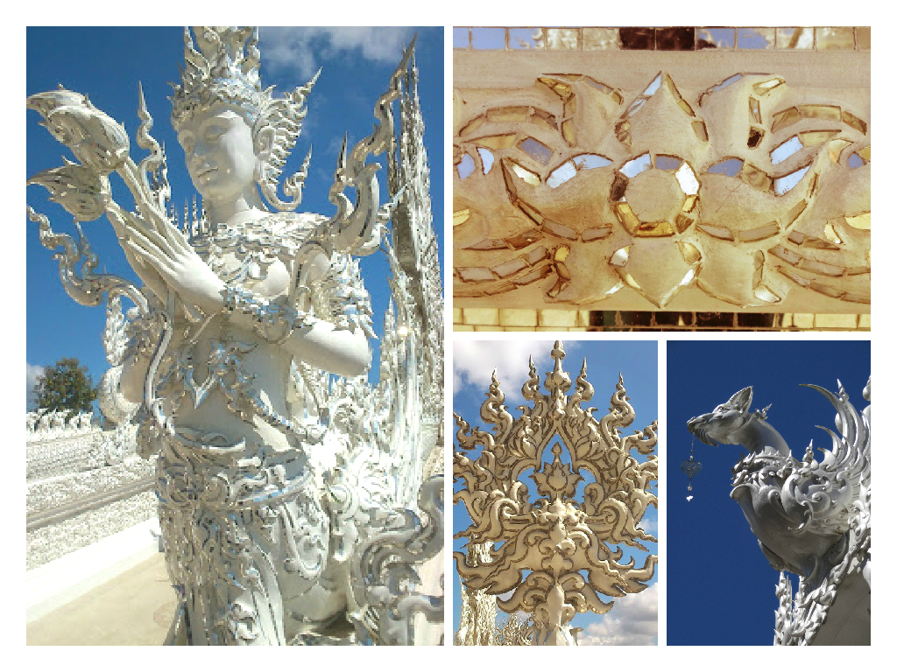

From Sukothai we headed back to Phitsanolouk and caught a local bus to Chiang Rai. The journey lasted 10+ hours with only 1 stop for a quick toilet/food break. You can pretty much imagine how boring/tiring/dismal/frustrating it was!

Chiang Rai is the most Northern region we’ll be visiting in Thailand. Our main reason for visiting Chiang Rai was to see Wat Rong Khun – otherwise known as ‘The White Temple’.

Tuk tuks regularly run to the White Temple and its easy to negotiate a return fare (we managed 150 baht for a round trip). It only takes around 20 minutes to reach the temple. It is free to enter into the White Temple but in the afternoon it is most busiest.

To say that the White Temple is incredible is somewhat of an understatement. The White Temple is in fact a masterpiece still in progress and is in its 16th year since the project began. The temple is designed and built by Thai artist Ajarn Chalermchai Kositpipat. His main visionary goal is to showcase the wonders of Thai Buddhist art.

As quoted from the pamphlet at the gift museum:

_‘I want to be the only artist in the world who can create anything with utmost freedom. I want to be good and valuable to my country. I want to create arts in my own style and to develop Thai Buddhist arts to be accepted internationally. I want people of all nations to come and admire my works, like when they want to visit the Taj Mahal or the Angkor Wat. Therefore, I need to devote all my time to this and also educate along my vision to at least two consecutive classes of pupils. Maybe in 60 to 90 years after my death will the project be completed_.’

It is clear to see how complex and creative the design of the temple is. This unconventional Buddhist temple is a mixture of dark and creative meaningful thoughts, all of which is expressed though architecture that encapsulates the artistic mind of Ajarn.

The grand, mystical entrance

The ‘white’ is to symbolise Lord Buddha’s purity. The mosaic band of glass mirrors are to reflect Lord Buddha’ wisdom.

‘The hands from Hell’ – seen as you cross over the bridge to enter the temple. The hands are there to symbolise ‘desire’ and other temptations which lead people astray. Crossing the bridges is to walk past these temptations and into the light (as such, i.e. heaven)

It’s clear to see how unique this temple is – there is no temple like this in the world.

Inside the temple you can find more art murals though no photos are allowed in this section. The murals are the equivalent at looking into someones mind. Picture the following characters – Osama Bin Laden, George Bush, Michael Jackson, Harry Potter, Superman, Batman, Spiderman, Hulk, Angry Birds, Neo (Matrix), Jack Sparrow (_just to name a few_) battling a demon.

In Ajarn’s words (again taken from the pamphlet) the mural primarily refers to the ‘killing of the innocence’ – by which the mural depicts both Bin Laden and Bush as the eyes of the devil. The superheroes depicted show that not even they can help us during evil encounters, such as the atrocities of the Twin Towers (which are also on the mural). Deep, bold, dark but very thought provoking.

The White Temple is by far the most wildest unconventional temples have ever seen (_never would I have managed to use the words ‘wild’ and ‘temple’ in a sentence!_). I have never seen a temple so bold and thought-provoking; dark but enlightening at the same time. And to think, it’s not even completed yet!

Just a few of the many weird and wonderful faces found around the complex – believe me there were crazier objects around!

