As we consider ourselves lovers of Thai cuisine we chose to do a cooking class in Chiang Mai. Of course there are plenty (if not, too many) options available and we very nearly missed out because we couldn’t decide who to go with!

I noticed a particular leaflet advertising ‘We Cook Thai Home Garden Cooking School’ at our apartment. As a spur of the moment gesture I contacted them via email to see if they had availability for the next day. I was pleasantly surprised to receive a quick response from a lady called Miw to confirm availability and prices. Appreciating the speedy response, I booked our spots right away and told Kyle the good news!

The next day we were picked up by Miw and met the rest of the group. The day started off at the morning markets. At the markets we chose on the leaflet what we’d like to cook. We were allowed to make 1 appetiser, 1 stir fry, 1 curry paste, a soup dish, curry and desert of our choice.

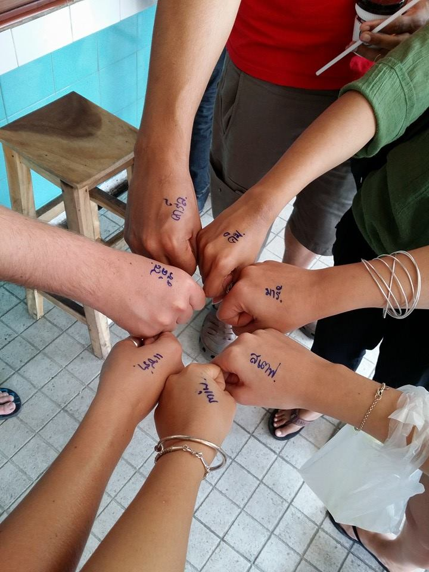

All our names written in Thai!

Miw showed us what type of ingredients will be used in our class. There was so much fresh produce, I wanted to buy everything there! We all got the chance to ask our _what’s this?_ and _‘what does it taste like?_ questions. Miw took it in her stride and answered all our questions effortlessly, even buying samples so we could try ourselves.

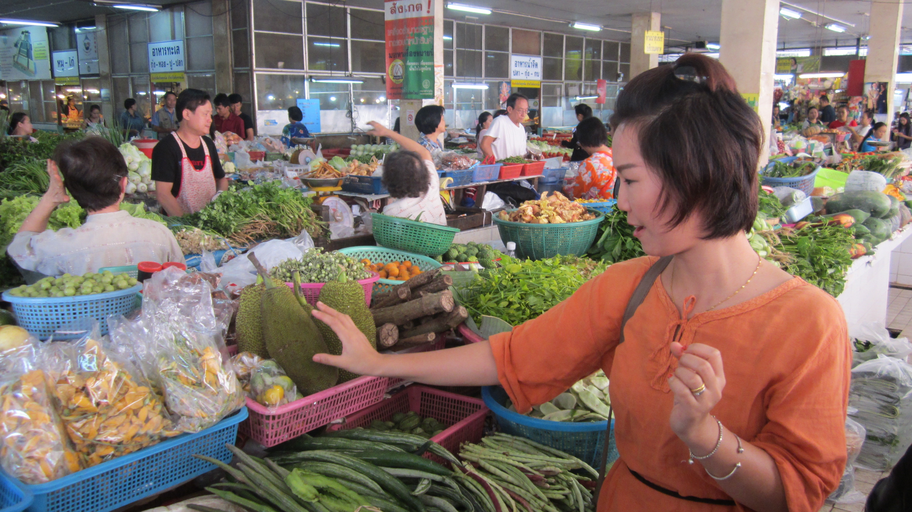

So fresh, so green!

We were given some time to wander around the markets and get a coffee before we departed. I was in awe at the amount of stock in. If we had this type of stock back at home I’d be there every day! The variety was abundant, the produce was so fresh and vibrant. It got us very excited to use some of these ingredients in our class.

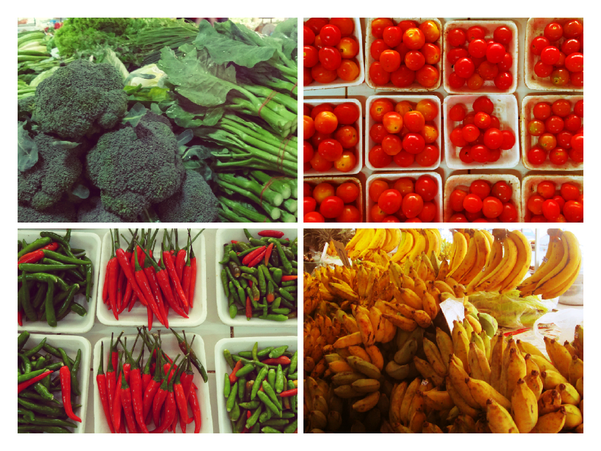

Fresh, abundant, colorful!

After our stop at the markets we made our way to Miw’s home which was located in a local quiet residency. We were greeted with a lush, open air cooking environment and welcomed in Miw’s home for a drink before we began.

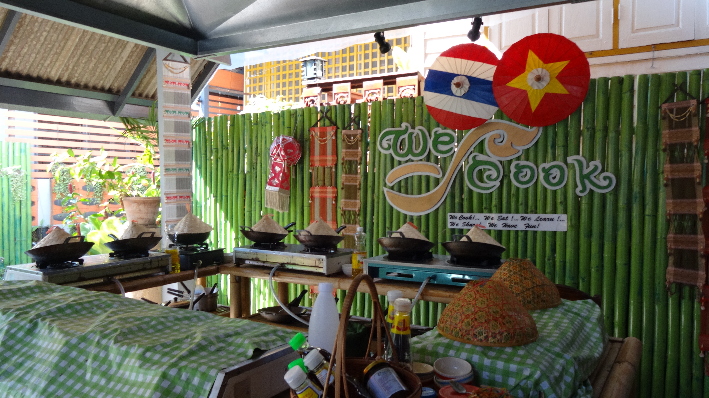

What a wonderful set up!

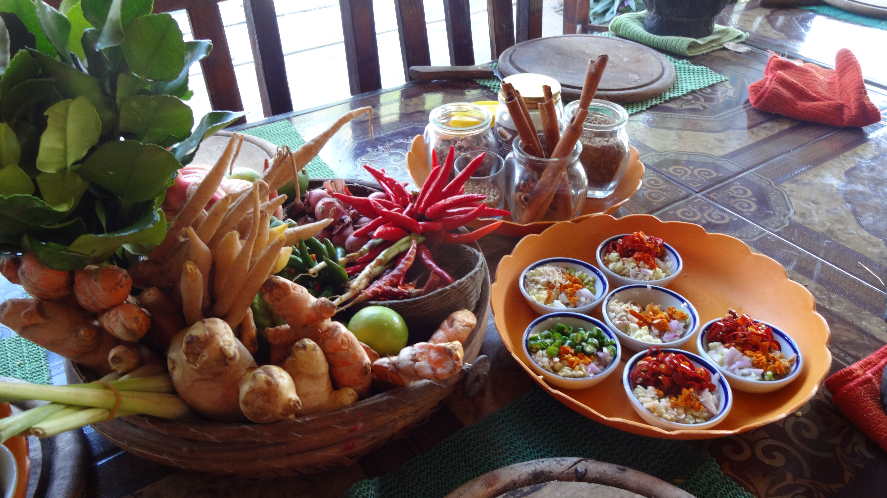

Ready to start 🙂

**Time to cook!**

I decided to make the following dishes:

Papaya salad – Pad Thai – Green curry paste – Green Curry – Noodle soup – Sticky rice and mango

The day was split into sections as if we were cooking a 3 course meal – appetizers, starters, mains and deserts. Without giving away all the secrets that we learned (_cheeky, I know_) Miw prepared us each step of the way and made us all realise how easy it was to cook Thai food.

First up were the ‘appetizers’ and starters. See how amazing this looks –

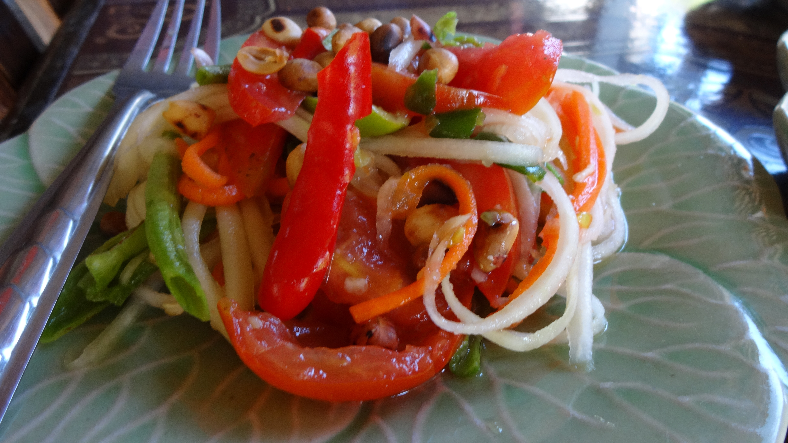

1\. Spicy Papaya salad. I only used 2 chillies but the heat was mind blowing!

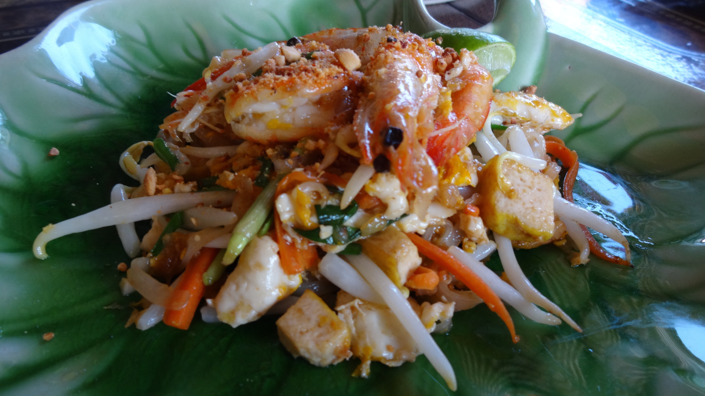

2\. Pad Thai with shrimp and tofu

Excited by our first dishes we were sent upstairs by Miw to enjoy our creations. We had fun testing out each others food and comparing our spice levels!

Next up we prepared our curry pastes – this is where we got our muscles out and pounded the life into some spices!

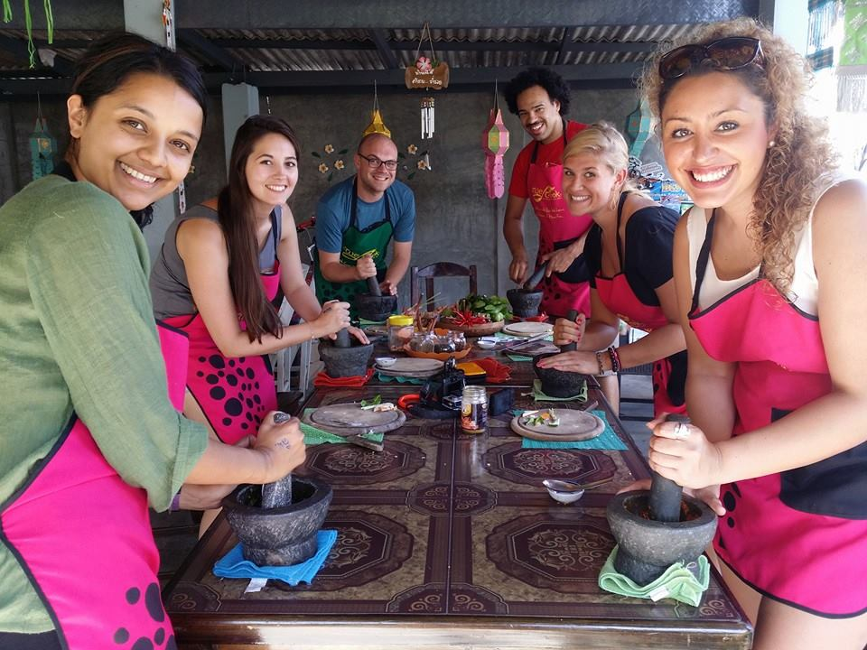

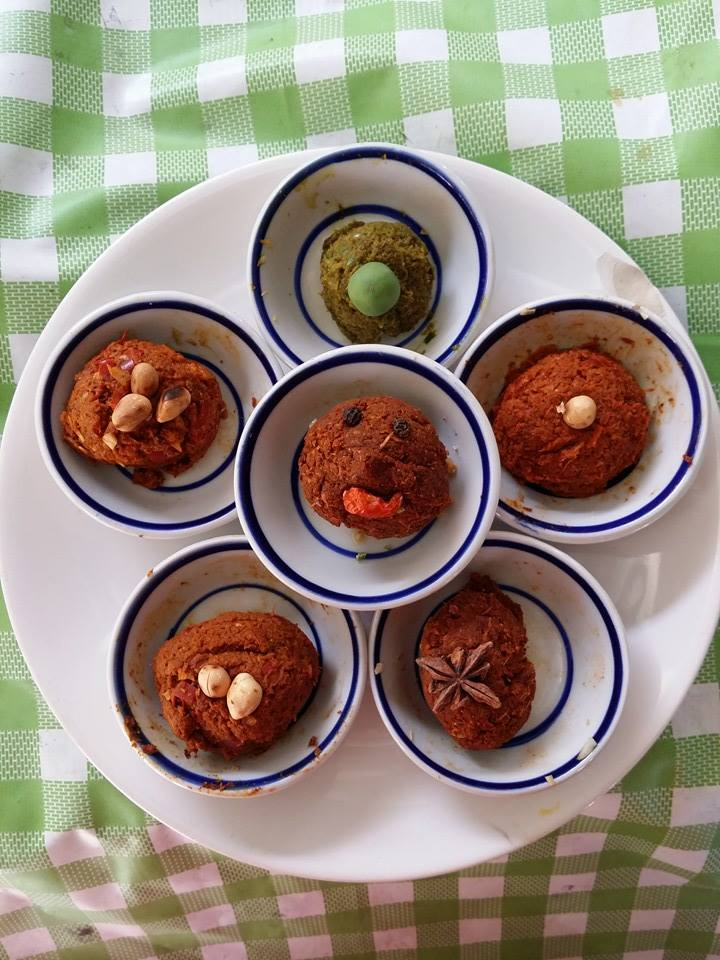

3\. The curry pastes

After the pastes were finished we were instructed by Miw to get some beers and take a rest! Not wanting to disobey we toddled off to nearest store for a ‘refreshing drink’ and walk around. When we arrived back the preparation table was ready with another set of ingredients for the next course.

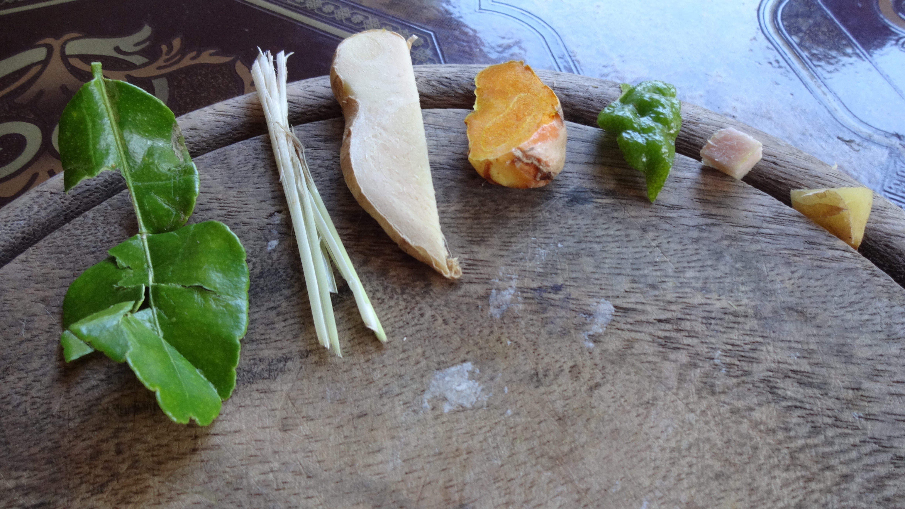

Sampling a variety of roots and herbs

The next dish was easy to prepare as they were mainly soupy-broth dishes. Miw handed out various spices according to our chosen dishes and explained what flavours they bring to the dish. We also learned what other ingredients can be substitued in these dishes if we can’t find the ingredients back in our home countries.

We got on with preparing the deserts (this was done before we cooked the mains so they had time to cool down). Me and Kyle took to the hobs to create the bases for the 2 deserts – making the sticky rice and coconut milk. I cannot tell you how amazing the smells were from both pans!

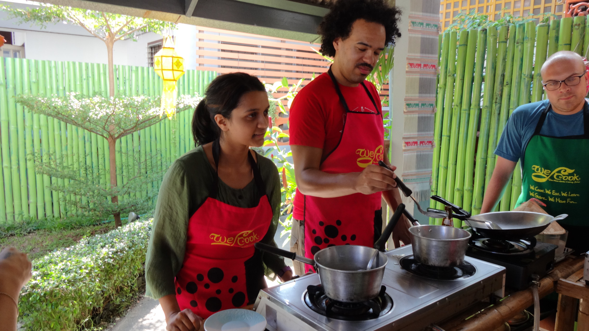

Game faces on!

With the desert bases prepared and ready to rest, we turned our attentions to the soup and curries. It was now time to cook the mains!

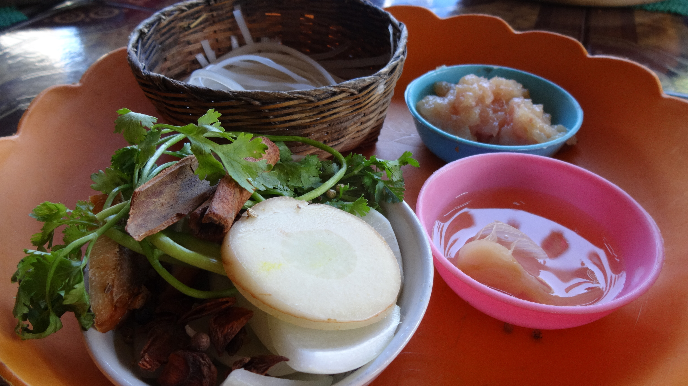

Ingredients prepped for the Noodle soup

We started off with the soup dishes. They literally took a matter of minutes to make. It was intense, quick and easy. As soon as everyone’s dish had finished we swapped our pans for woks and changed the ingredients to make our curries. It was up to us how spicy we wanted to make the curry (the more paste you use the hotter the curry will be). Again the process was super fast and intense, but with speedy results. I have never in my life cooked a curry as quick as this one!

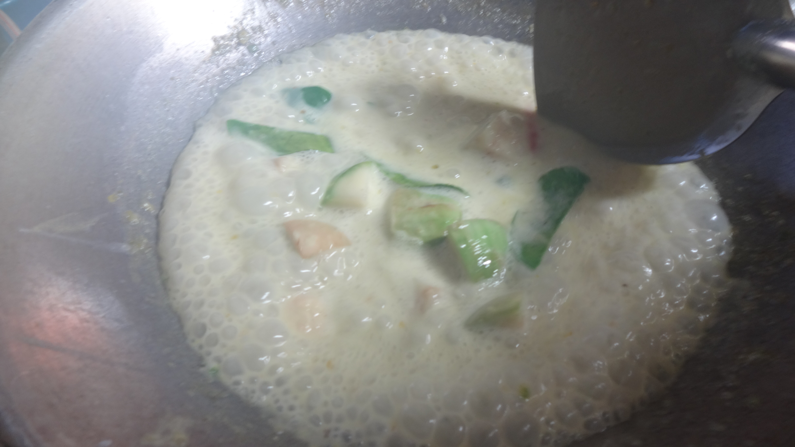

My green curry bubbling away

The end result?

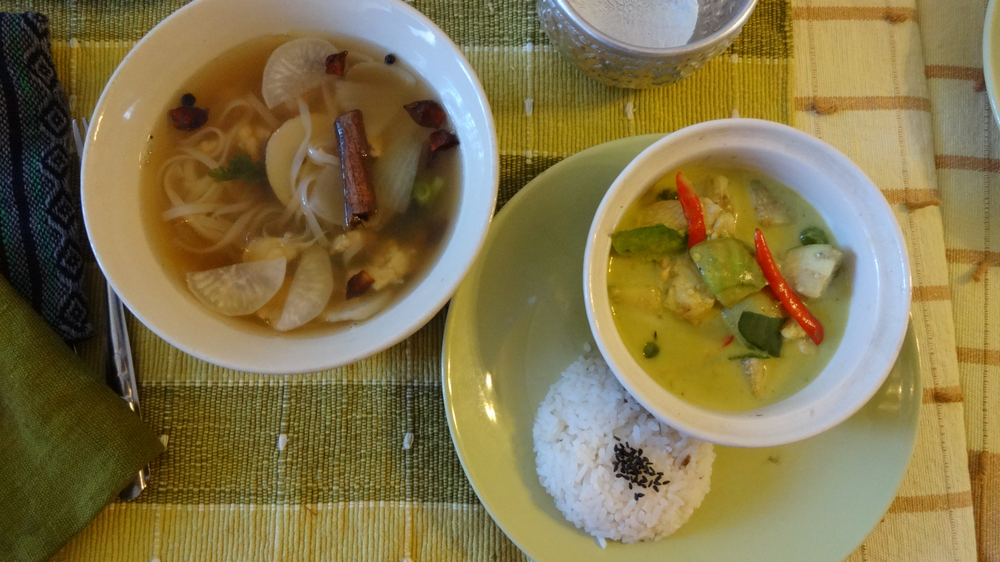

4\. Noodle broth and 5. Green curry

YES!

After working up a mini sweat over our woks we gladly returned upstairs to gorge out. We passed our creations proudly around the table for us all to sample and to try out each others’ dishes. We literally ate until we couldn’t move, forgetting that we still had desert to come!

Excited by desert I forgot to take a photo of my sticky rice and mango 🙁 luckily Kyle took one of his and it was tasty enough to feature on my post! (This is how the sticky rice and mango looks taken from another class on We Cooks Facebook [page](https://www.facebook.com/397432923663490/photos/a.399811310092318.94398.397432923663490/526869314053183/?type=3&theater) – top image)

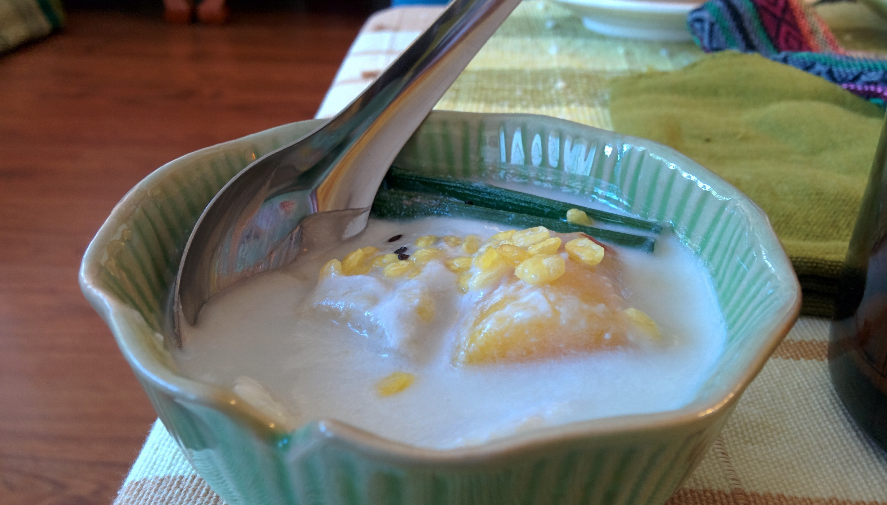

6\. Desert, bananas in coconut milk.

Everything about this day was fab. We learned so much about Thai food, ingredients, preparation and presentation. All of this and how simple it is to create such tasty food. We even received a complimentary cookbook containing all the recipes made from our session.

There was nothing I could fault about our cooking experience with Miw. She was such a kind-hearted person that radiated fun and passion; Miw and her assistants did everything they could to make sure each of us had a great time. The cost of the session per person is around £20 – this includes pick up/drop off, 6 chosen dishes and a cookbook. What a bargain!

It also helped that our group got on really well – so well even that we all met up later for a few drinks out at the night markets! And to think we did this all last minute…See, it’s never to late to join in on the fun!

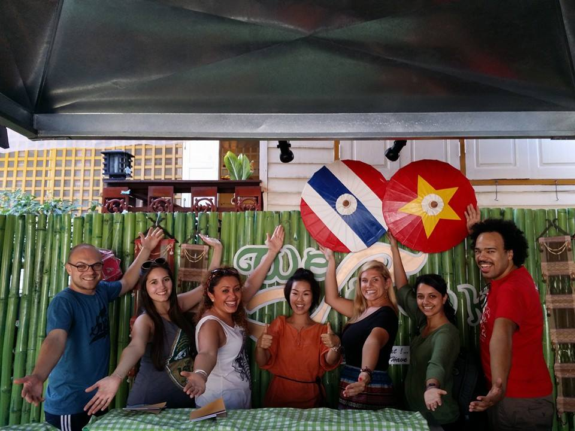

What a day!

To find out more information about We Cook – Thai Home Garden Cooking School you can check out their Facebook page [here](https://www.facebook.com/pages/We-Cook-Thai-Home-Garden-Cooking-School/397432923663490) and TripAdvisor rating [here](http://www.tripadvisor.com.my/Attraction_Review-g293917-d4309638-Reviews-We_Cook_Thai_Home_Garden_Cooking_School-Chiang_Mai.html)
