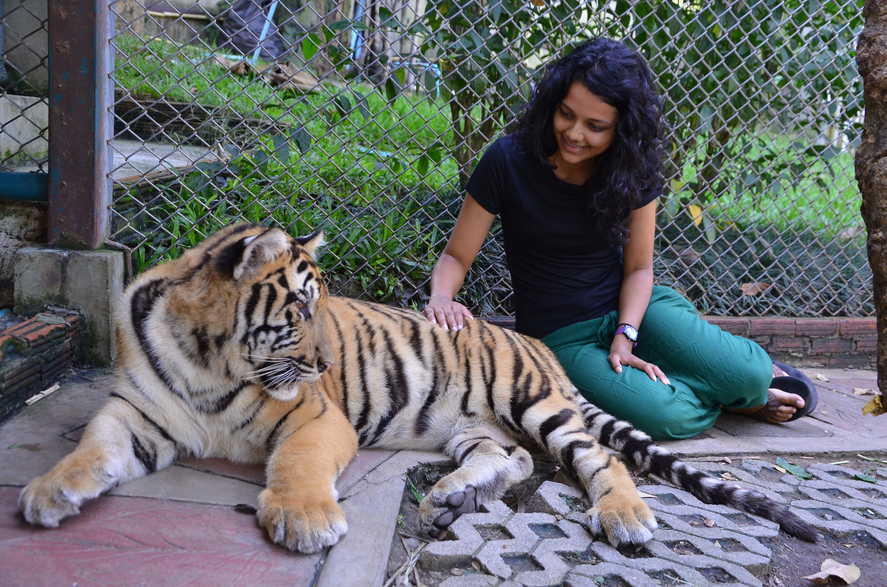
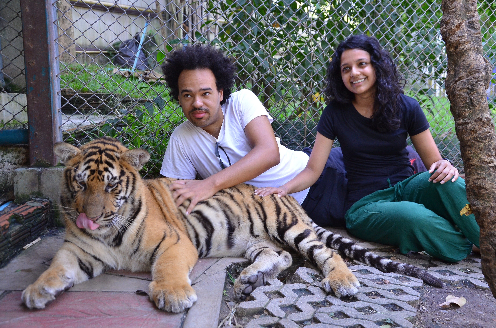
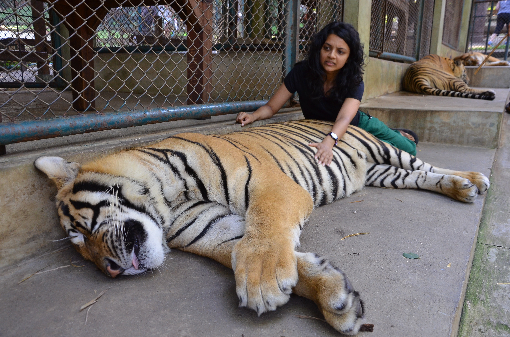
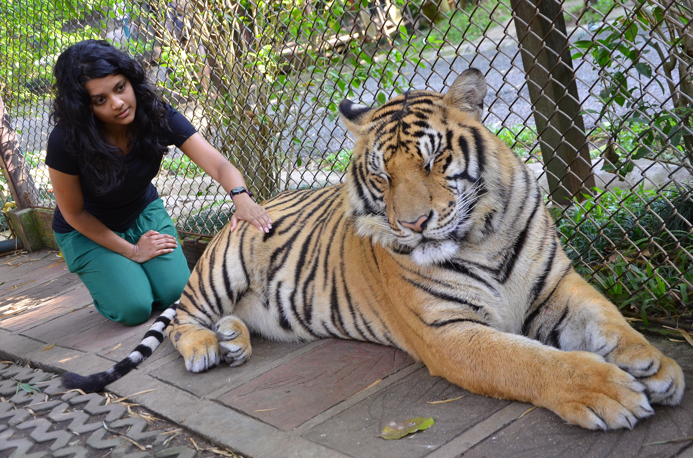
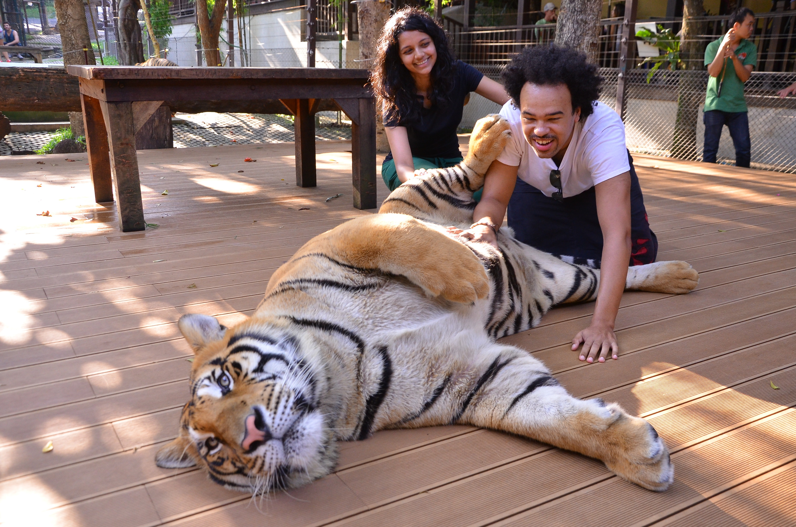
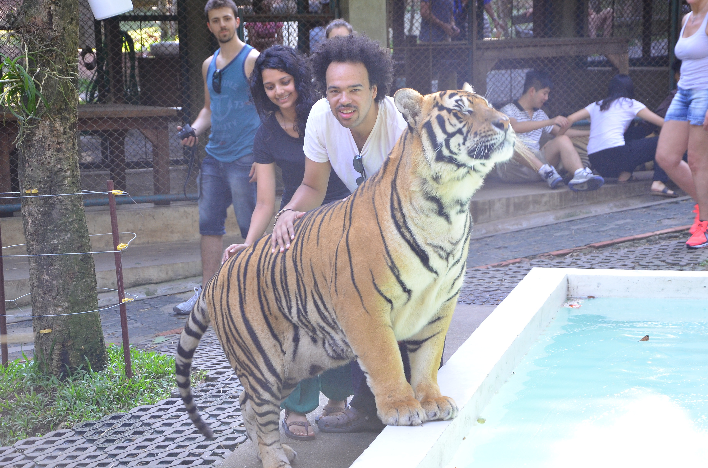
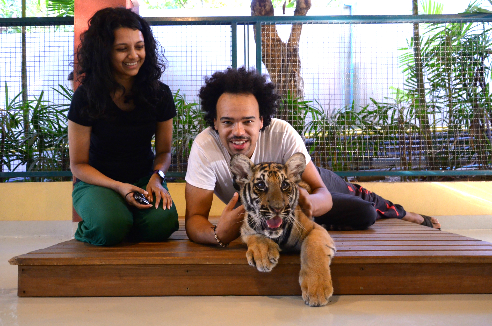
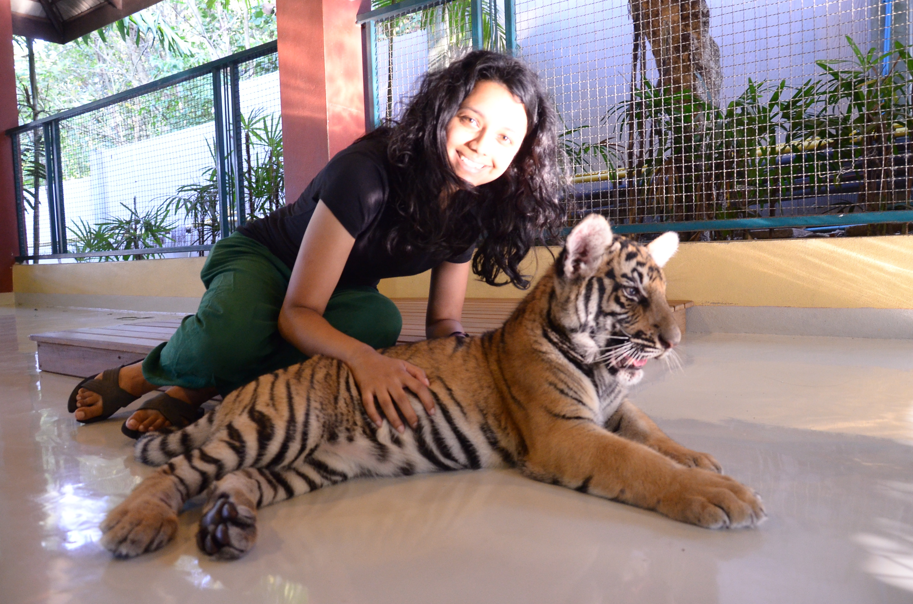
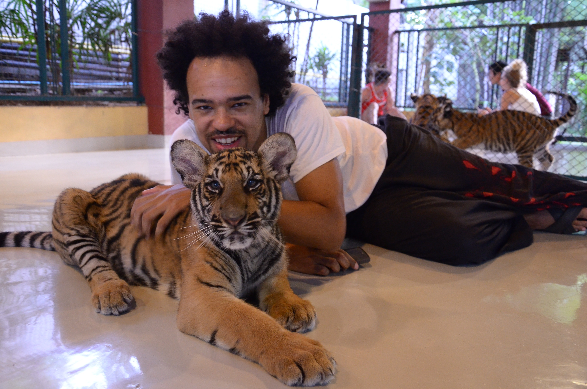
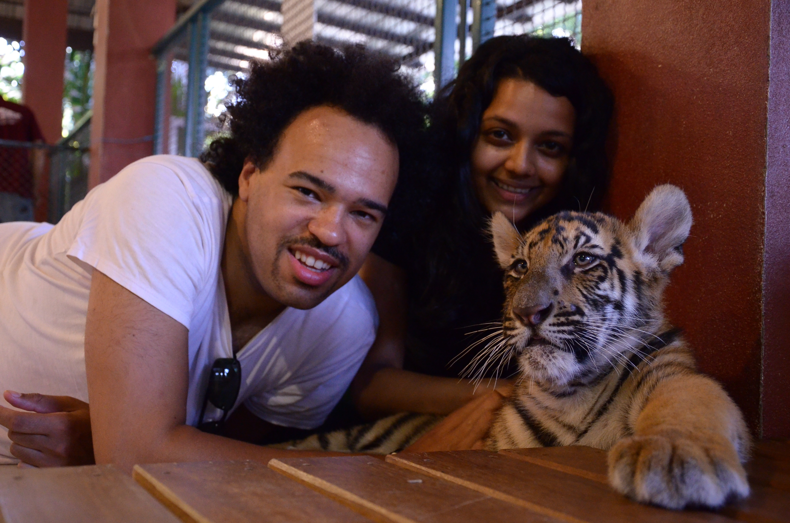

Tigers. _‘King of the Jungle’ – as the saying goes._Something which the majority of the world’s population adore, admire and respect. At least that’s what I thought, until I visited Tiger Kingdom.

Tigers are powerful, they are hunters, they fight for their territory. But if we had the opportunity to be near these animals? Maybe even going as far as touching them?

Well this is where Tiger Kingdom fits the bill (_apparently_) by giving visitors the opportunity to enter the enclosure and get up close with a tiger. Or as their motto on the pamphlet states ‘playing with tigers in enclosures without chains’.

We decided to go to Tiger Kingdom on a whim. Were the tigers being drugged? Do they actually care about the welfare of the tigers or is this just a profitable tourist trap?

It took around 40 minutes to reach Tiger Kingdom from Nimmanhemin. It was pretty easy negotiating a return fare with a tuk tuk – all the drivers know this particular attraction. It costed 500 baht for a return fare which is about right considering the distance. We chose to visit on a Sunday as we assumed it’d be quiet. _Wrong._ The place was heaving and reluctantly we joined the queue. The prices to enter were individually priced according to the ages. The prices were as follows:

Smallest (2-3 months) – 620 baht

Small (4-6 months) – 620 baht

Medium (9-12 months) – 420 baht

Big (13-30 months) – 420 baht

Hire a Photographer – 299 baht per cage

We decided to see the big, small and smallest tigers. A discount is applied if you view multiple enclosures. We also (stupidly) paid for a photographer so we could spend more time with the tigers. _At least that was the idea…._

We had to wait a while before we were allowed in; there were a huge volume of visitors and we were pretty much on a conveyor belt system once we bought our tickets. Before we entered the first enclosure one of the staff members tapped her stick on a board signalling us to read the basic ‘_do’s and do not’ do’s_‘ wand that was pretty much the safety briefing.

First we went inside the ‘Small’ tiger enclosure.

Umm..they’re not really that small are they?

Uh oh…he’s looking at me

As soon as we were inside we were quickly moved to the nearest tiger. I was pretty reluctant to just sprawl myself all over the tiger in vain for a good photo. _They could have at least let us stand around for a few minutes to adjust._But no. The keepers and photographers were already dictating where to go and what to do. Kyle was a lot more relaxed than me and managed to give the tigers a good belly rub. Unfortunately I didn’t feel the same and couldn’t shake off the anxiety.

It felt like we were in there for 5 minutes before we were ushered out to the next enclosure. I actually felt pretty relieved at first, until we were told that the next enclosure were the ‘big cats’.

The camera never lies….

Judging by my facial pattern, I don’t look particularly relaxed here. There’s a reason for that. As soon as we stepped inside the enclosure we were again forced onto the nearest docile tiger for a few quick shots. Not only was I quite fearful (the sheer size of these tigers made me tremble) the keepers did nothing to assure me or calm my nerves.

In fact I was making them angry! _Hurry up hurry up before tiger wakes up. Quickly quickly. Rub them harder!! Okay you go. You (Kyle) come sit quickly for photo. HURRY!!!_

It didn’t matter what position I got in, I just didn’t feel comfortable

_Pick up the tail and put it around your mouth_. What? Why the hell would I want to do that? _An animal of such grace and presence – and you want me to put its tail around my mouth?_That’s just stupid.

My thoughts didn’t go well with the keepers or photographer so I happily switched places and gave myself a time out.

Fortunately Kyle’s belly tickles were proving a hit

A hazy image littered with tourists in the background. Not doing very well Mr Photographer ey?

We were probably in the enclosure for about 10 minutes until we were pushed to move on. I was running out of patience with the scenario, but thankfully we only had one enclosure left and that was to see the smallest tigers.

Shoes are required to be taken off and hands washed before you enter to see the smallest tigers.

The little tigers did lighten our moods, but not for long

I have to say I enjoyed being around the smallest tigers. They were very active and playful. But because of the amount of people in the enclosure they were constantly getting separated everyone could take photos.

Very poor photography…

One of the ‘better’ photos taken

Pushed into a corner for one last photo

We were in the enclosure for less than 10 minutes before we were told our time was up.

After feeling slightly better for seeing the little tigers, our moods dropped again as we walked around the other enclosures. We saw a heavily crowded pen with more than a dozen adult tigers confined inside. Some were sleeping but many looked very agitated and were pacing around in a distressed state. It was shocking to see the conditions they were held in. Even more concerning we saw a lion confined in filthy conditions. It was quite evident that the enclosure had not been cleaned for some time.

**Is it safe to visit Tiger Kingdom?**

Regarding my experience, I didn’t feel 100% safe during my visit. There were so many moments where I felt uneasy in the enclosures. It’s all too clear in the photos how uncomfortable I felt The keepers intentions are not concerned about the visitor because they’re too busy keeping the tigers ‘in line’.

The keepers use sticks which they use to ‘tap’ the tigers nose to stop the them being too playful and to divert their attention away from the crowds. The amount of visitors allowed in the enclosures is exceeding its threshold. There is way too much onus on the keepers in the event of an emergency. You’re telling me that you’re going to trust a man with just a stick to save you from a tiger attack? _Exactly…._

**What about the tigers, are they drugged?**

The smallest and small tigers are indeed very playful and active when we visited. This isn’t to say that they aren’t drugged or mistreated though. I’ve no idea what conditions they’re treated in when the vicinity is closed, I can only go by assumption. As for the adult tigers, I can only assume the worst after seeing the state they’re kept in. Plus, with the amount of visitors allowed inside the enclosures I’m sure that certain ‘methods’ are used to keep the animals compliant.

**Would I return to Tiger Kingdom?**

Never again.

Tiger Kingdom remains a controversial yet popular attraction. I can see how this cruel lucrative business has profited in the the exploitation of these tigers, enticing so called ‘animal lovers’ and the curious alike.

There are more tigers held in captivity then there are in the wild. **Remember – there is a difference between wild tigers and tigers in captivity.** There is a difference people! I have read so many blogs of people desiring to visit Tiger Kingdom so they can cuddle a wild tiger. Seriously? How stupid can you get! If you want to see a wild tiger, then guess where you have to go? You have to go to the WILD to see them in their natural habitat!! Not go to Tiger Kingdom and hold the tail of a human-reared animal.

Unfortunately Tiger Kingdom will remain due to the sheer number of visitors that flock here each year. It’s likely to remain this way until something drastic happens, and lets face it – it’s only a matter of time.

_The purpose of this post isn’t to force people to boycott Tiger Kingdom. The opinions in this post outline my personal thoughts and feelings from my visit. Animal tourism is huge business in countries like Thailand, it is not just tigers that are subjected to abuse in this industry. My only hope is for people to research these types of attractions beforehand to make an informed decision, if your intentions are focused on animal welfare._
