Ahh, the Yi Peng festival. Otherwise known as the Lanterns festival. Before we set off on our travels (actually way before that) we always spoke about this particular festival.

_Wouldn’t it be great to go there? I bet it’d be wonderful. Look at how beautiful these photos are! Ahh I’m getting jealous now. If only we just ‘dropped’ everything and went this year. But that’s not gonna happen is it? Oh well, it’s good to dream I guess…._

Well, it’s a good thing we did ‘drop’ everything to go traveling and visit Thailand to see Yi Peng!

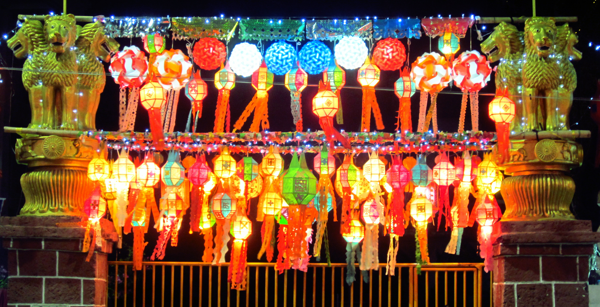

The Yi Peng festival coincides with the full moon of the second month of the Thai lunar calendar. Millions of lanterns are released as a sign of respect for Buddha. The lanterns represent the release of negative karma. It has also become an iconic image; a dark sky filled with twinkly floating lights (if _you’ve watched the Disney film Tangled then it’s pretty much the same thing!)_

Messages of good fortune are written on the lantern before they’re released – if your lantern is still lit before its out of sight it means that your fortune will come true!

Unfortunately we missed out on tickets for the Mae Jo university release (and the local release which took place in October). Instead we joined in on the activities which were just as busy and consisted of daily parades, beauty contests and DIY lantern releases!

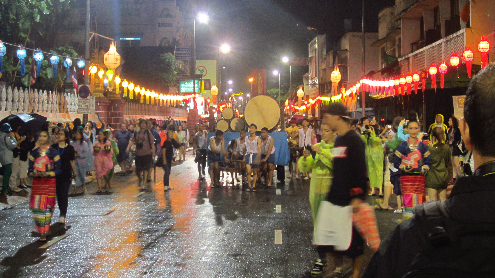

The start of the parades

Precession well under way

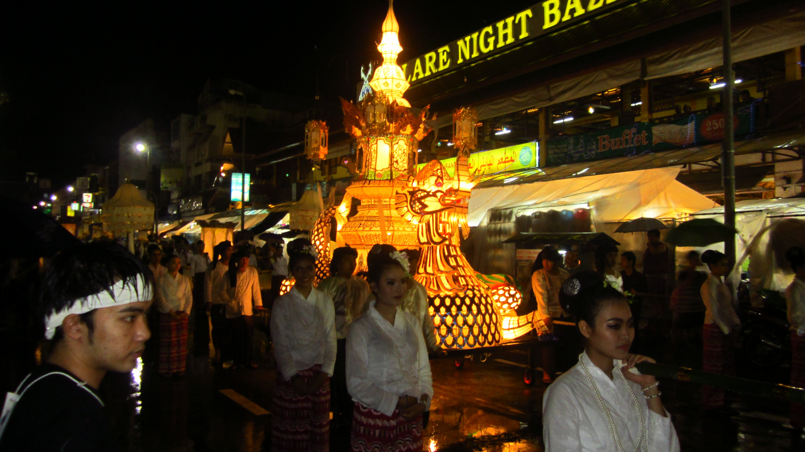

Parade in full swing

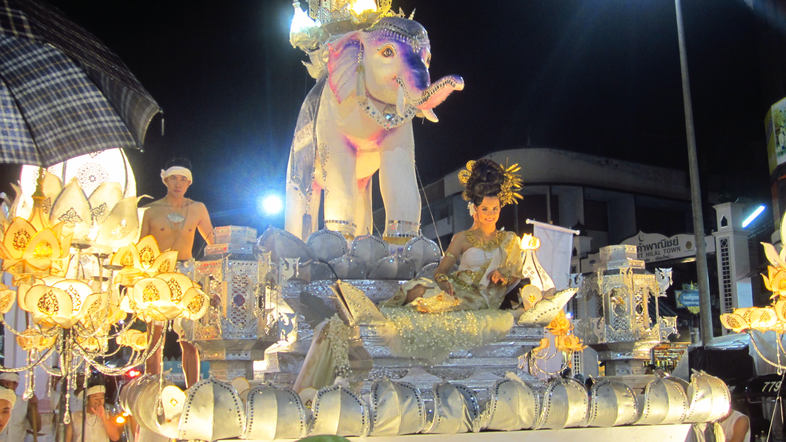

One of the many floats parading the beauty contestants. This girl was a stunner!

Even though it rained throughout the parade, spirits were high. We made our way to the nearest Buddhist temple where people were allowed to buy and release their own lanterns. We didn’t have to wait long to buy a couple of lanterns, though it took longer figuring out what to write on them!

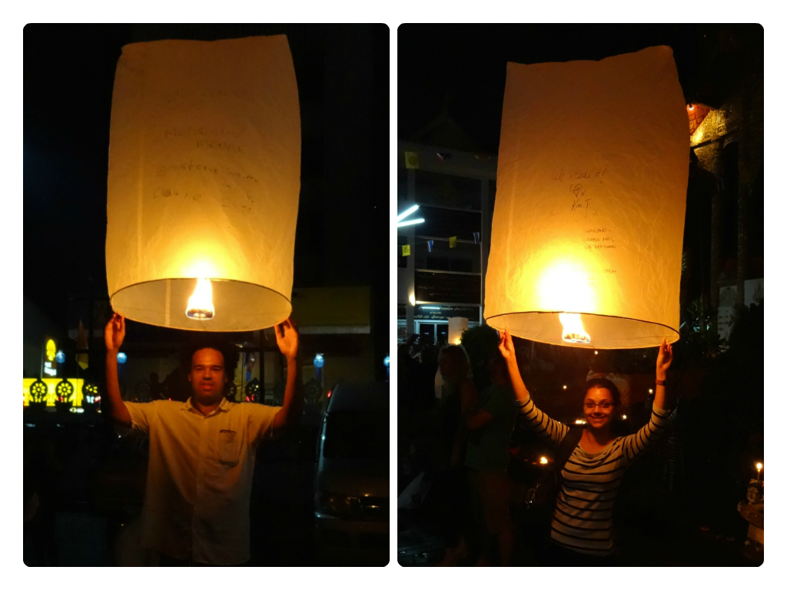

Our lanterns at the ready!

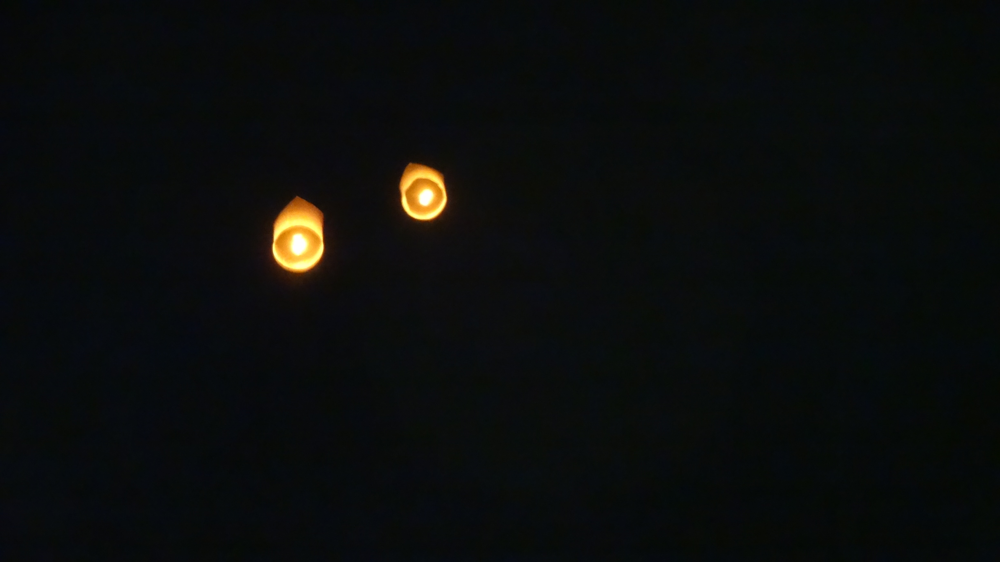

And they’re off

We don’t have fancy cameras so most of our photos are nowhere near the quality you’ll find on other sites. That being said, it’s always better to see these types of events in reality! We took the following images from our apartment block and around the parade.

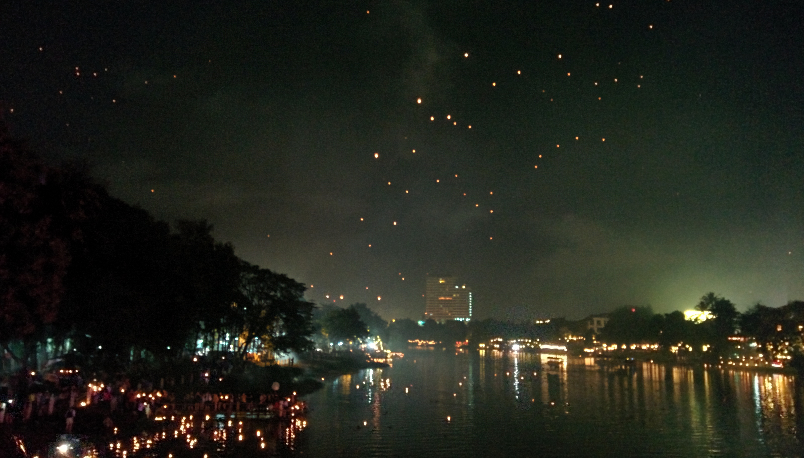

Lanterns galore

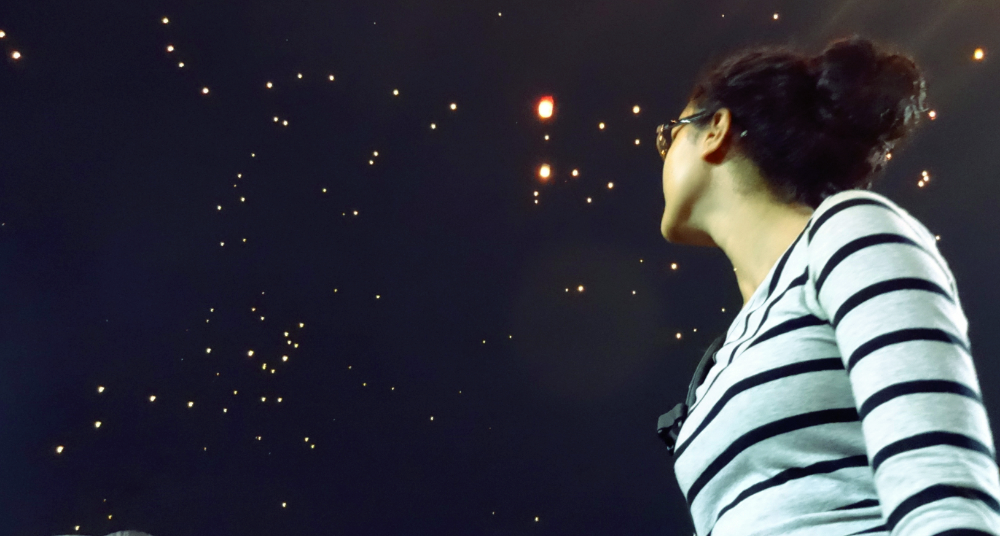

Twinkle twinkle little lanterns!

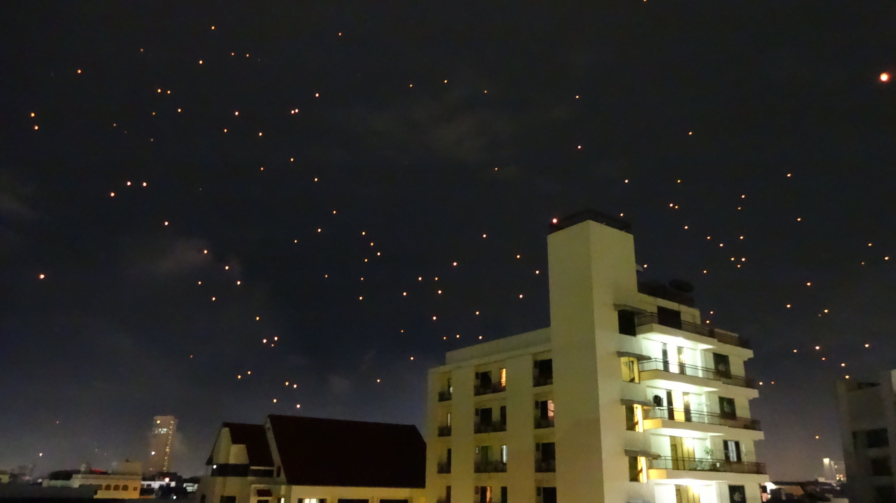

Taken from our apartment

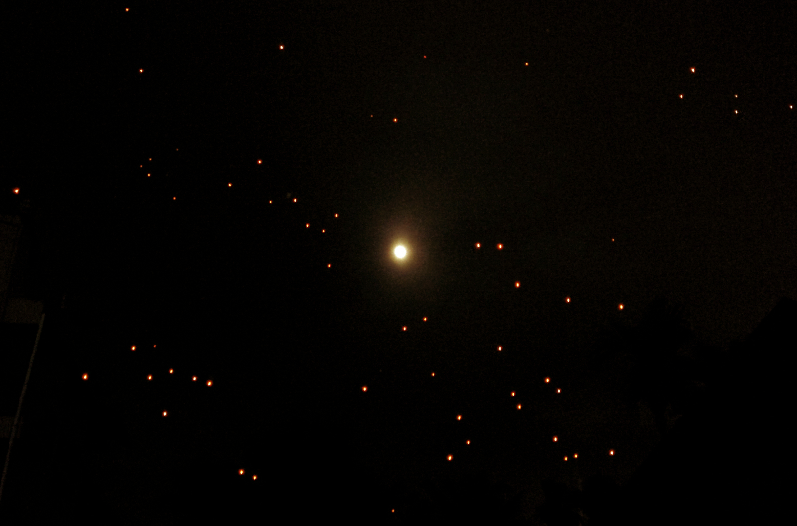

I love this image – it was impossible to capture the scene but it looked the lanterns were floating stars, wandering around the moon. Difficult to explain, but beautiful to witness!

Even though we didn’t get the opportunity to see the mass release, we made the most of our time here and enjoyed the festival. The atmosphere was electric! Each night the excitement filled the air as people were cheering as lanterns continually released. In a super cliche way it was a such a magical moment to watch thousands of lanterns float off into the night.

Being apart of Yi Peng was such a fantastic experience however the event shall remain on my bucket list so I can see the mass release in the future!

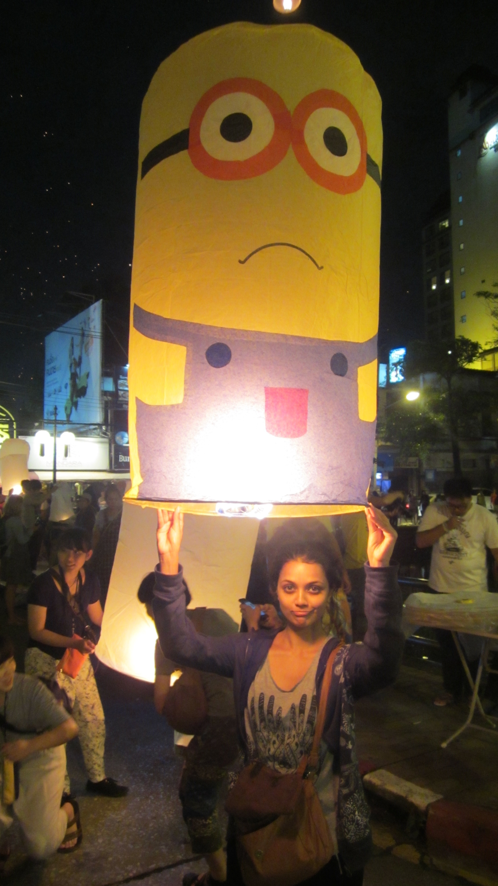

My minion lantern! Excuse my face, I was trying to copy the minions face (you guys knew that already…!)
