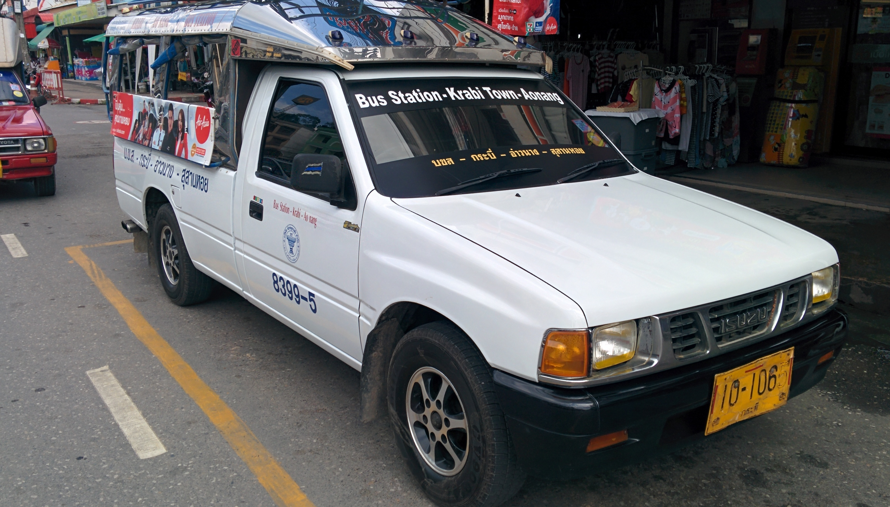
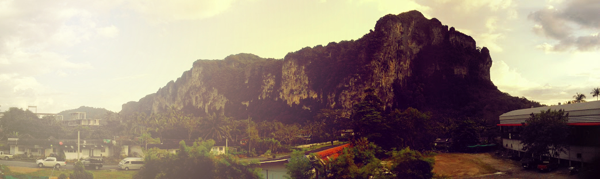
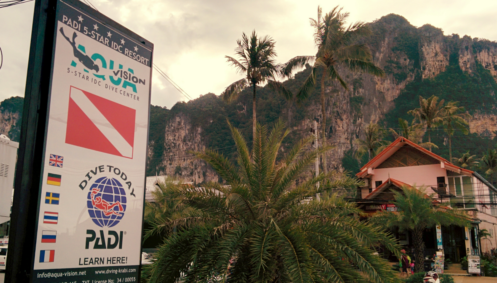
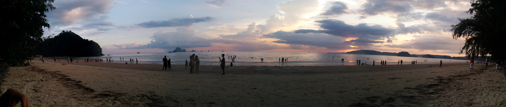
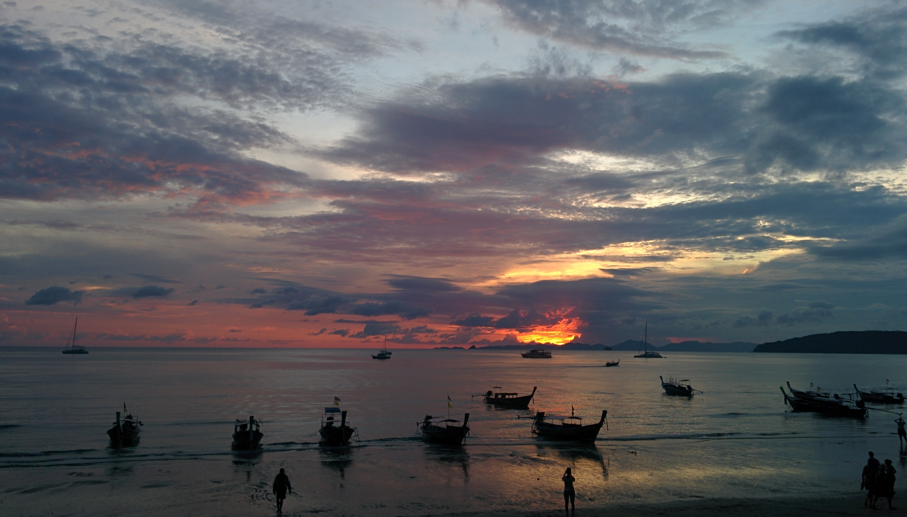
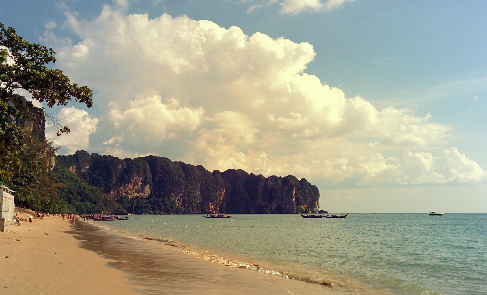
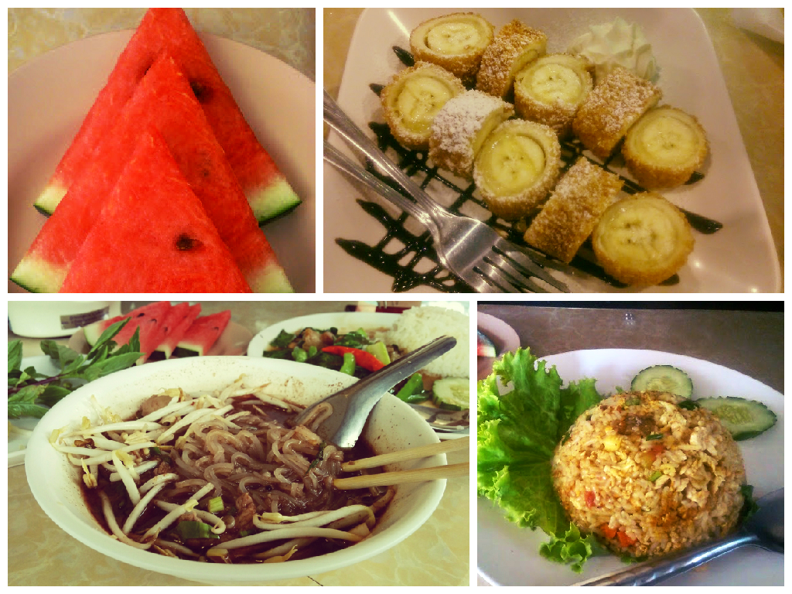
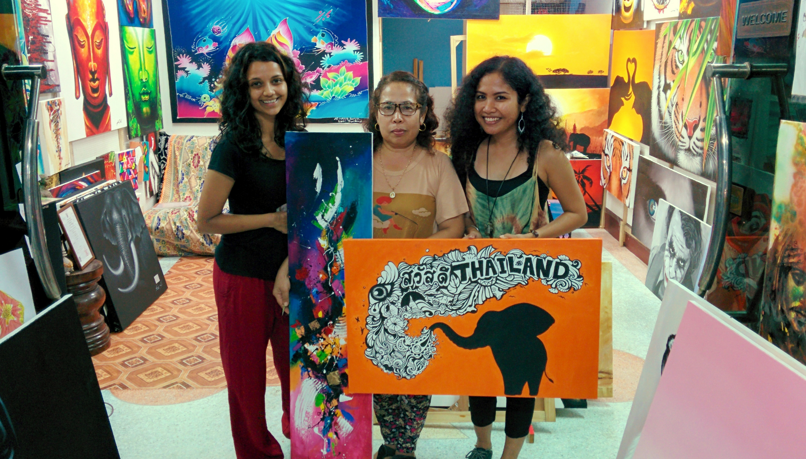

We decided to visit Ao Nang as it wasn’t too far from Krabi. The white songthaews go direct to Ao Nang (bus station is outside the KFC) and costed 100 baht for the both of us. It only took around 40 minutes to reach there.

The white songthaew go to and from Krabi town to Ao Nang

Ao Nang is a popular beach town in Krabi town and consists of a main road bustling with restaurants, bars, hotels and clothing stalls. There are a few Western chains (Starbucks, Subway, McDonalds) but nowhere near to the extent like Patong.

We weren’t too sure if we’d like Ao Nang so we only booked the one night. As as were walking around the area Kyle spotted a few diving centres and decided to sign up for a PADI course – thus extending our stay for another 4 days!

I quite liked Ao Nang. Yes, it was touristy and it was quite annoying when the staff at restaurants would list everything on their menu the moment you show an interest eating at their restaurant. But it was tolerable. The locals were still friendly. There wasn’t a sense of seediness in the air when it approached a certain time in the evening. There are decent restaurants and bars to drink at, some even have live music.

There are many transportation options around Ao Nang and we saw plenty of long tail boats at the pier going to Railay beach and other islands.

Tasty cocktails at the Reggae bar

Did I forget to mention how beautiful the landscape is?

Beautiful view from Lanna Beach Guesthouse

Panoramic view of the beach

Watching the sunset

The beach also has a beautiful backdrop of the limestones – unfortunately it rained mostly during our visit so we only went to the beach in the evenings when the weather brightened up.

The food at Boat Noodle is both cheap and delicious

There are many food options around Ao Nang. There must be a demand for Indian curry houses because there were at least 3-4 establishments within walking distance of each other! For decent Thai food I recommend the Boat Noodle. The food there is both cheap and tasty. They also had free wi-fi which was ideal for me; I managed to get some blogging done here whilst Kyle was doing his PADI.

I noticed several art galleries in Ao Nang which caught my attention; however I realised that most galleries selling the art were replicas of the same subject (e.g. monkey wearing headphones, Bob Marley etc).

It wasn’t till I got further down the road where Kyle spotted an art piece he liked. We were invited into the gallery by the owner Dao to have a look around. Although there were replica styles of art we’d seen at other galleries, I felt that Dao added another dimension to her artwork.

There was one piece in particular which stuck out to me, something I’ve not seen before. I asked Dao if this piece was a replica. She told me that this piece had been created in the spur of the moment and was the only piece like this.

_Yes!_ I was excited to find a piece of art created on a whim – to me it was unique and meaningful. Not having the money to buy it there and then, I told Dao to keep hold of it till the next day.

The wonderful artist Dao on the far right with her mum in the middle. The middle colourful piece is Kyles and the Thailand piece is mine 🙂

Dao puts so much enthusiasm and soul into her work, it was great to talk to someone with so much passion! You can check out Dao’s incredible gallery on her Facebook page [here](https://www.facebook.com/daoartist).

The vibe in Ao Nang is certainly more laid back and chilled than the other beach towns we’ve visited in Thailand. I enjoyed the downtime we had here and feel well rested to move onto the other islands.
