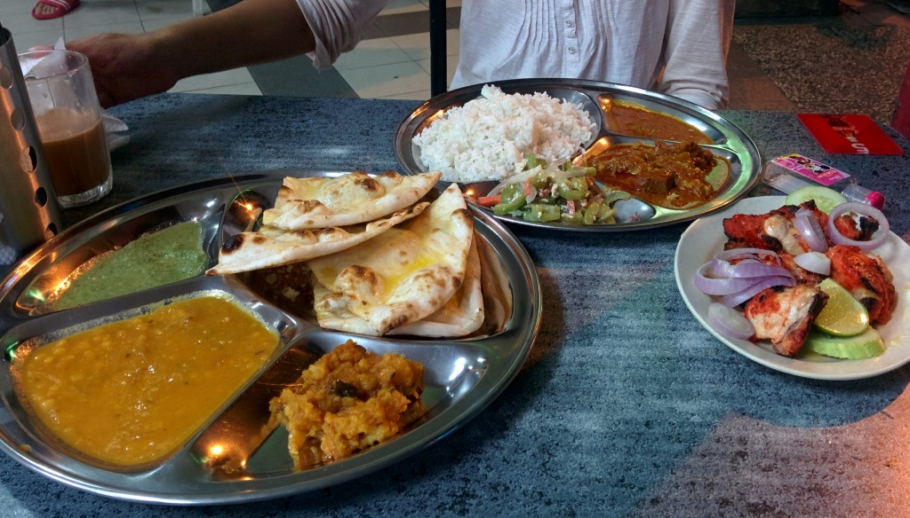
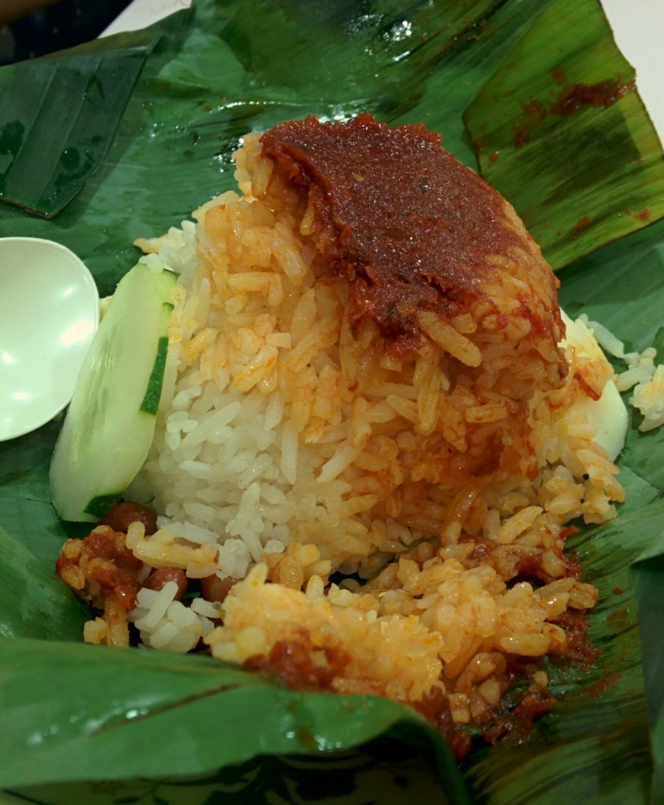

Our coach journey which began in Hat Yai (Thailand) took over 14 hours to reach Malaysia’s Capital, Kuala Lumpur.

We were so tired, restless and bored, but our moods started to perk up as we entered the city.

_Look! Over there, I saw just saw the Petronas Towers. We’re nearly there!_

The coach terminated at Pudu Sentral. Due to last minute plans we booked a hotel across the bus terminal for one night before we go to the AirBnb apartment.

Yum! Our first sample of Malay food at Restaurant Tg’s Nasi Kandar

Breakfast, Nasi Lemak

Our first impressions of Kuala Lumpur are positive. The Petronas Towers look incredible and we can’t wait to explore the cty over the following days. Even the food we’ve tried has been decent, I’m liking the generous portions and Malay flavours.

We look forward to spending Christmas and New Years here, especially as we’re staying at an Airbnb apartment so we can cook our own food, woohoo!
