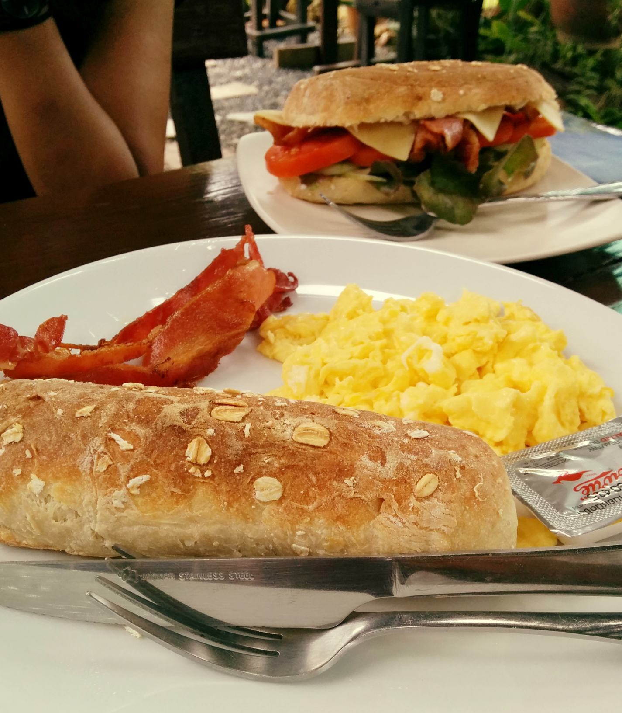
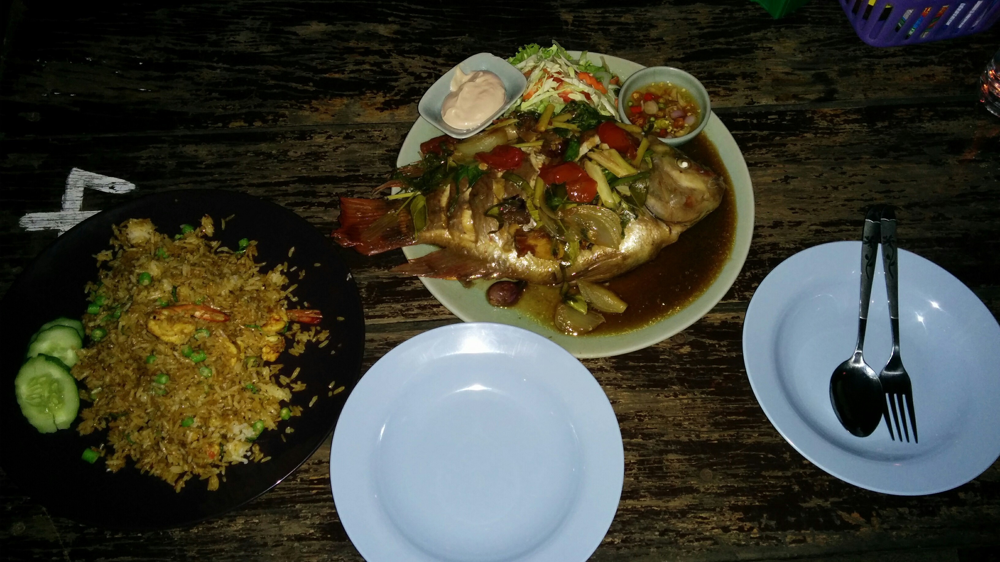
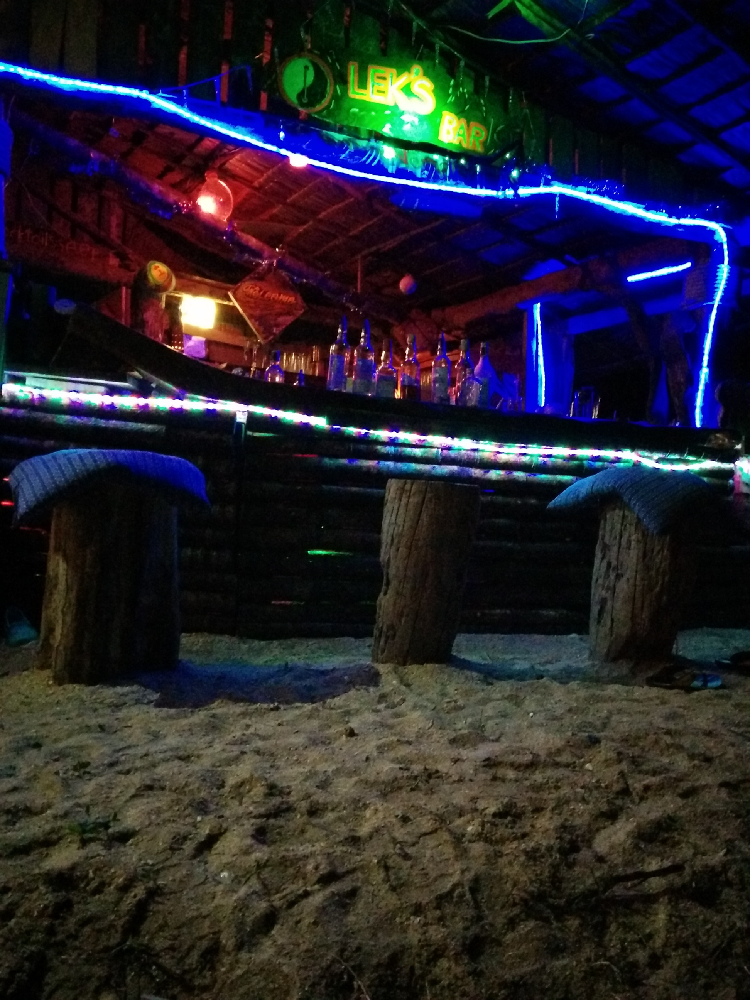
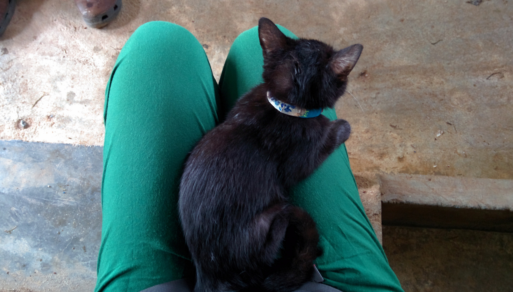
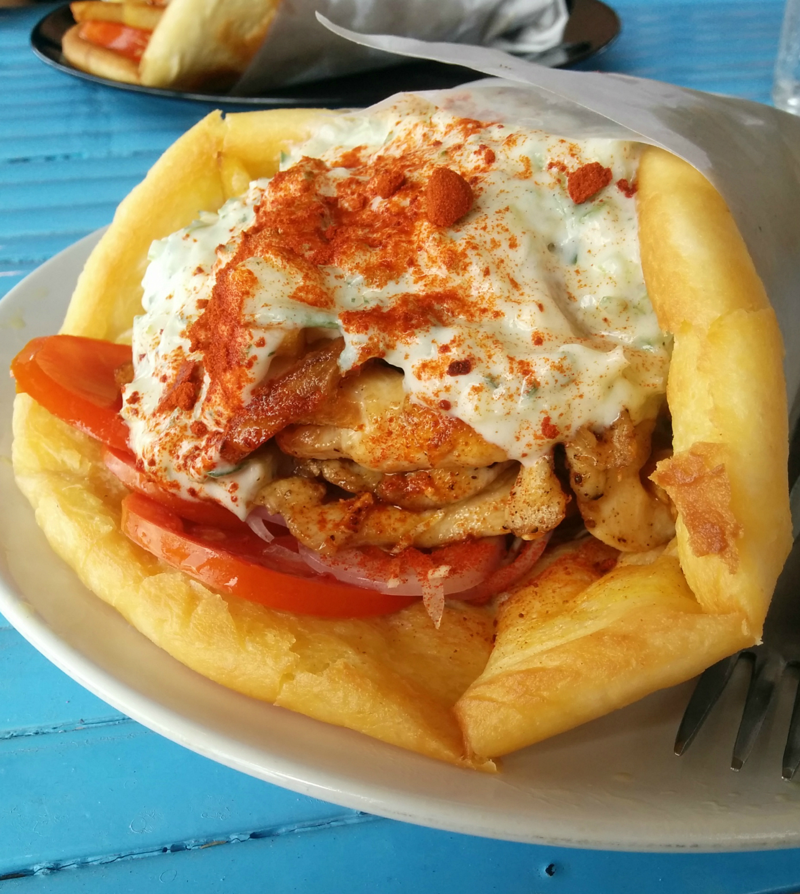
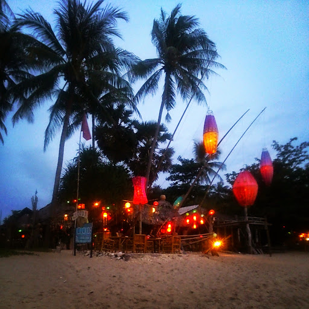

We’ve seen our share of overhyped, touristy beach destinations in Thailand during our travels. It was time to go somewhere that retained its charm and authenticity. Welcome to Ko Lanta!

It took around 90 minutes by ferry to reach Ko Lanta from Koh Phi Phi Don. It was just starting to rain as we arrived but we remained optimistic. We were picked up at the port and taken to our hotel Lanta Just Come where we stayed for a few nights. The hotel is situated on a main road within walking distance to the beach, restaurants and convenience stores.

Delicious brunch at Peak Cafe

The nearest beach (Klong Khong) was only a five-minute walk away so we dropped our backpacks and went for walk.

We passed a few beach bars as we walked along the beach. Then for about half an hour there was nothing but palm trees and a beautiful sea view until we reached the next set of bars. It was pushing on to early evening and we were hoping to catch the sunset so we walked up to the first bar we saw, ordered a couple of cocktails and plonked ourselves on the loungers to get a good view. I’m so glad we did!

A beautiful sunset to end our first evening, Khlong Kong beach

We were really enjoying the reggae vibes and cocktails at this bar so decided to stay around. The BBQ had started and we were curious to see what was on the menu. The owner was super friendly and told us what fresh fish had been caught for the day. We wasted no time ordering one of those fishes whilst we sat back and enjoyed another cocktail.

Fresh tilapia and spicy fried rice.

Beachy vibes at Lek’s bar

The BBQ fish was so chunky and tasted so damn good! Paired with a side of spicy rice we were treated to a delicious meal. The owner popped by regularly to checked up on us, and invited us for a round of shots (not the flimsy style ones, we’re talking double shots of 40% rum!).

The night got better when we were allowed to pop our own music on – I can’t explain how awesome it was to have our own funky vibes playing in the background, listening to the waves with a cocktail in hand. _It was bliss!_

It wasn’t just the beaches and bars which we enjoyed. We made a visit to Lanta Animal Welfare (LAW) – a non-profit animal charity treating and caring stray dogs and cats. They have sterilised over 8,000 animals and continue to provide treatment for abused animals on the island.

We joined the free hourly tour and learned of the hard work and dedication the volunteers and staff put in to make sure these animals are treated until they are eventually re-homed. After the tour we were allowed to play with the cats and even take one of the dogs out for a walk.

We gladly donated to this cause and offered to walk an older dog – unfortunately he was still a little unwell and we had to cut the walk short because he wasn’t in the mood to keep going! You can find out more information about Lanta Animal Welfare [here](http://www.lantaanimalwelfare.com/ "Lanta Animal Welfare") whereby you can sign up to volunteer, donate and even adopt a dog or cat!

One of the kittens sitting comfortably on my lap

This cat loved Kyle and stayed with him till feeding time!

We chose not to rent a motorbike during our stay in Ko Lanta. In hindsight we probably slightly regret that choice, although when we did enquire about a rental at our hotel we didn’t feel 100% about the bikes. Luckily we were nearby all the amenities we needed and managed to get by walking.

One of the biggest tastiest souvlakis I’ve had at the Greek Taverna

Everything about Ko Lanta ticked our boxes – the wonderful food, empty beaches, laid back bars and friendly locals. Even the animal charity was one of the best things we did in Thailand! Ko Lanta has retained it’s rustic charm and laid back attitude. It’s difficult to say if this will still be the case in a few years time – I can’t help but wonder how long it’ll be till the ‘tourist bug’ invades this peaceful island. For now it remains one of Thailand’s well kept gems that I’ll remember fondly.

I’m going to miss the beach bars here!
