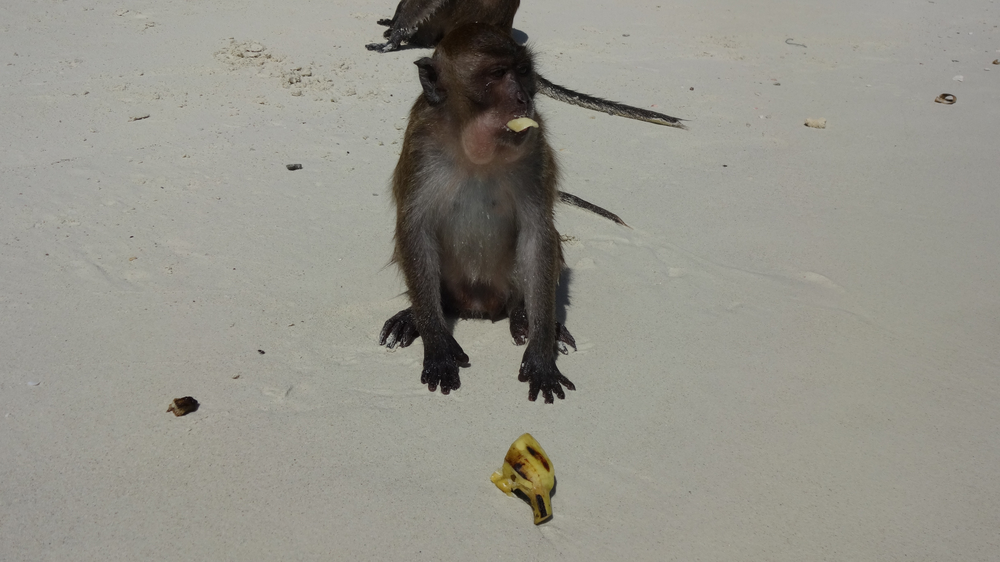

When most people think of Thailand they think of the film ‘The Beach’. The film’s location was filmed at Maya Bay on Ko Phi Phi Le. The success of the film threw Maya Bay into the spotlight as one of Thailand’s most visited destination.

We decided against a tour and wanted to find a long tail boat that’d take us there ourselves. We’ve heard how crowded Maya Bay gets and we wanted to go on our watch before it gets too busy. It really didn’t take long before we found a guy (Sam) at his boat, agreed a price of 1200 baht for the places we wanted to go, and scheduled a time to meet. It was that straightforward!

Morning smiles, ready to go!

We arrived at the boat by 08:00am where Sam had just returned from his early morning fishing. The skies were clear blue, the sun was shining and our spirits were high. Soon as we climbed in we were on our way!

Ko Phi Phi Le island in sight

It took around 30 minutes to reach the island. I’m not a ‘sea’ person but enjoyed the pleasant ride. It was a beautiful sight to see Ko Phi Phi Le in the distance, it felt like a proper adventure getting there even though it’s a popular route.

Nearly there…

Before we reached the bay I had some slight reservations. _What if it’s already crowded? What if it’s not all that it’s cracked up to be? I hope we don’t get ‘too’ disappointed…_

So close…

Stunning turquoise waters

There were a few long tail boats docked and we did see people on the bay. However it was nowhere near the extent I had in mind. We were starting to get really excited and couldn’t wait to get off. When we eventually docked we were informed that we needed to pay a ‘dock’ fee of 100 baht per person. Luckily we had read into this and knew the fee was charged by the park if you arrive in a long tail boat. We paid the fee then set off exploring.

Sam the man!

We were so happy we got here early! Yes there were a few boats and people sunbathing/taking photos but there was plenty of room to roam around a take a few decent shots. The sand was so white and fluffy, the waters were so vivid and cool. And then the backdrop of those limestone formations against a bright blue sky. _Just wow._

Remembering there was more to see on this island we grabbed our belongings and wandered around. We passed a few huts where tourists can stay the night and walked to the viewpoint which overlooked another entrance to the bay.

We noticed from around 09:00am more boats were docking at the bay. The crowds were coming in thick and fastt. Feeling content that our time on Maya Bay was complete we found our long tail boat and moved on before it got too much!

It was starting to get much busier by the time we left

Feeling victorious that we missed the crowds. Too bad our eyes are closed & smiles look evil, the sun is to blame for that!

Our next stop was just around the corner from Maya Bay for a spot of snorkelling.

Sam also took us to a few other spots for a quick snorkel before we made our to Monkey island.

Sam chopping up bananas to hand to the monkeys

It was fun at first feeding the monkeys – until the bananas ran out! Of course there were plenty of other people doing the same as us and the monkeys are fully aware that when another boat arrives then so will more bananas!

After a while we noticed the monkeys getting rather aggressive, I even had one going straight for me! Luckily it was only a close call, though I imagine the number of visitors receiving treatment for monkey bites to be quite high.

One of the monkeys checking out our long tail boat

After our monkey ordeal we decided it was time to make a move and retreated back to our boat. We were pretty tired at this point and were fortunate to be heading back to Ko Phi Phi Don.

By midday we arrived back at Phi Phi Don, we paid Sam and thanked him for the experience. The total cost of our half day excursion was 1500 baht – around £30.

We couldn’t really fault anything about our excursion and were so happy to have hired a long tail boat ourselves. Not only did we get to experience Maya Bay away from the crowds (which was a huge bonus) we had the ability to see what we wanted.

My advice if you decide to check out Maya Bay?

1\. Go early. Between 06:00am – 08:00am (latest) is ideal

2\. Rent your own long tail boat. The cost can work out cheaper if there’s a small group and you’ll get to choose how long you stay at certain places

Wouldn’t you rather spend a bit more for a memorable experience, rather than paying for a cheap excursion and having a terrible time?
