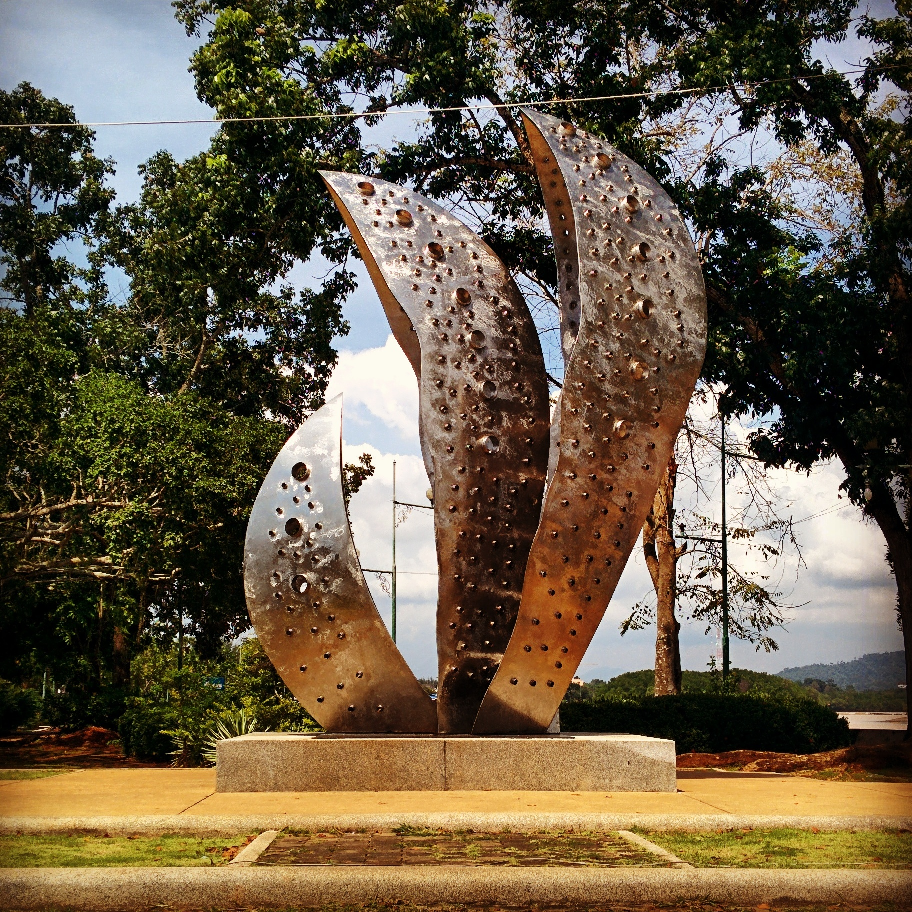
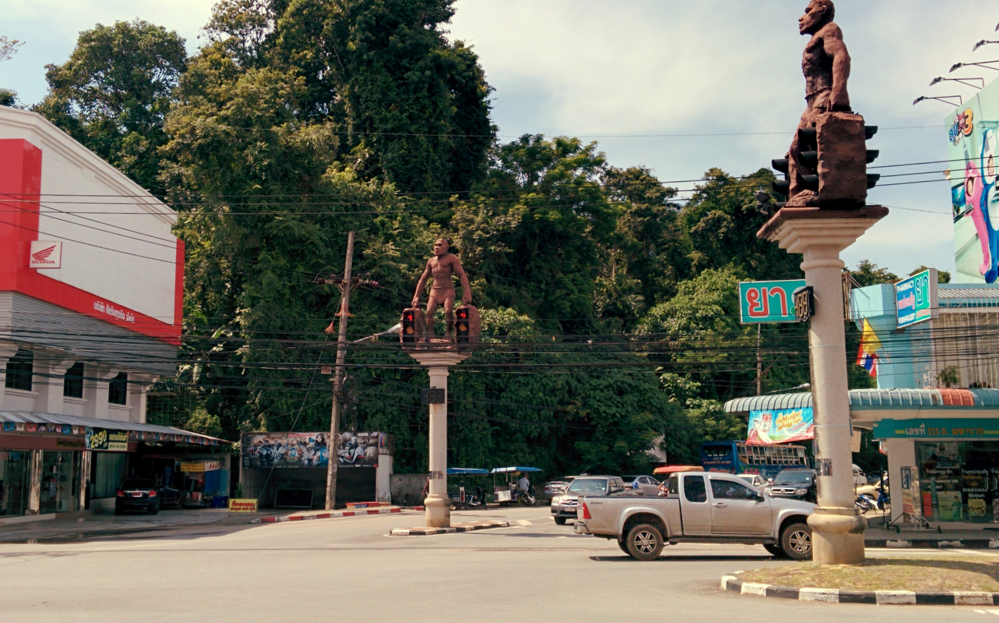
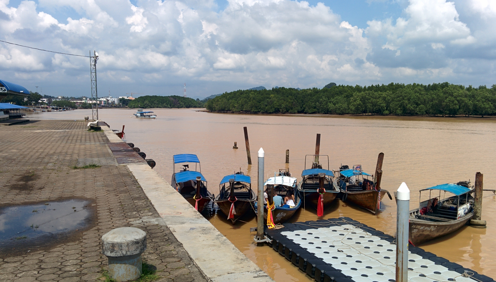

We needed an escape plan out of Patong and decided it was time to make our way to Krabi. It was actually quite easy – we hopped on a bus from Patong back to Phuket, and from there we caught a local bus going to Krabi. It only took 3 hours, we were just so glad to be far away from Patong!

Cool claw sculpture near the river

Krabi town oozed the space and calm we needed for a couple of nights till we planned our next move. There are plenty of guesthouses and travel agencies within the town offering competitive rates (however during high season the price of guesthouses inflate and availability does become limited).

We also found a good choice of food and drink establishments with decent wi-fi connection. The night markets are a very popular choice, here you can find an abundance of fresh fruit and veg alongside tasty curries and snacks. We popped to the markets each evening to stock up on some fried chicken and mini pancakes!

Enjoying a coffee at May and Mark’s House (opposite the night markets)

Krabi town does not have a beach, but there are plenty of transport options to get you to the beach of your choice. Ferries run daily to Ko Phi Phi and Koh Lanta, whilst the long tail boats take around an hour to reach Railay beach. The beach town Ao Nang can easily be reached by white coloured songthaews.

The local boat service to Railay Beach

Krabi town has decent transport links to the islands and beaches – the hardest part for us is choosing where to go first! We enjoyed the sense of calm and friendly locals around the area, it’s such a nice feeling to walk around and not be hassled or have posters shoved in our faces! However I reckon more than 2 nights in Krabi is enough, any longer than this and you’ll run out of things to do. I definitely see Krabi town as a base to rest before moving onto another location.

_We just need to decide where to go next…maybe a coffee at May and Mark’s House will help us decide!_
