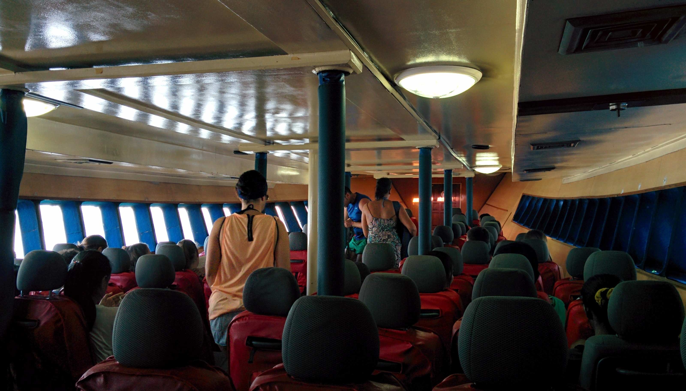
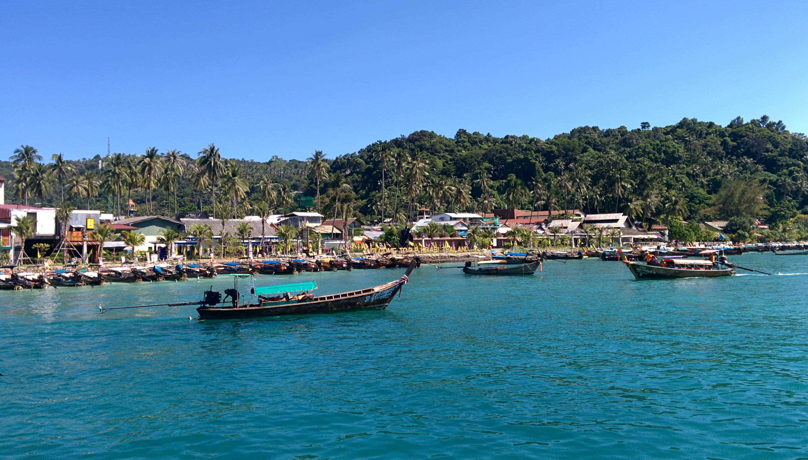
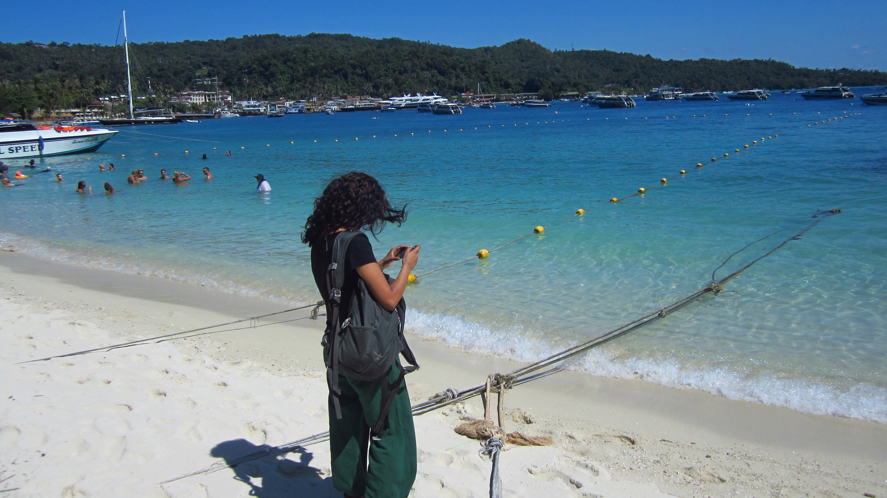
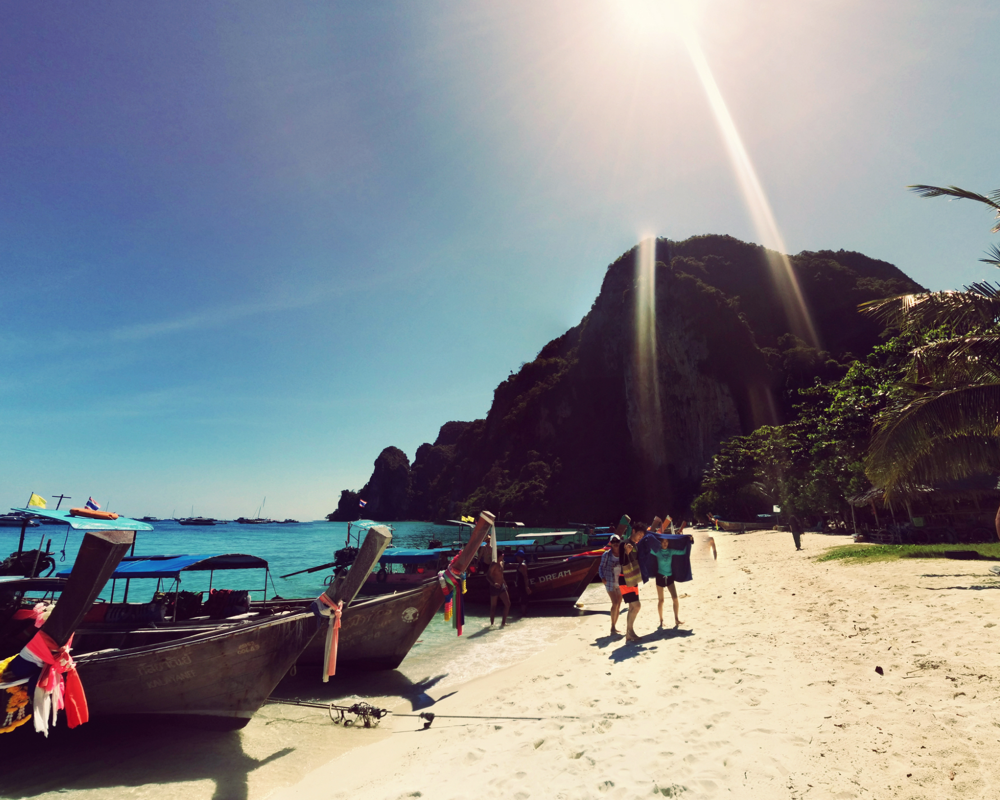
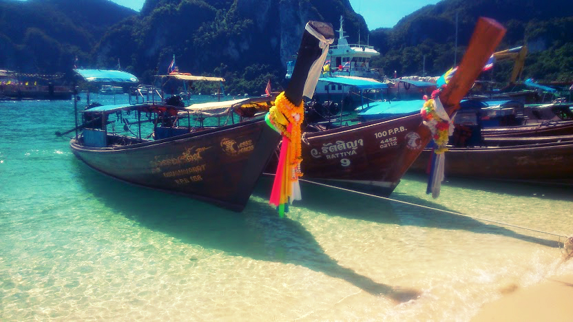

From Ao Nang we went Ko Phi Phi. We found a tour agency and book ourselves on a ferry for the next day. The price per person for the ferry was 300 baht.

Our tickets for the ferry also included pick up from our guesthouse. We left our guesthouse at 07:00am and jumped into the large songthaew which picked up as many people as possible to take to the port.

Onboard the ferry to Phi Phi

The ferry took around 2 hours (as usual the ferry departed later than expected!) but the journey itself was pleasant.

Wow!

Already aware that Ko Phi Phi has an overwhelming tourist scene, I wasn’t expecting much at all. I was actually half expecting to see really dark murky waters, an overload of boats (don’t get me wrong there were still quite a lot) and a lot less greenery. I was pleasantly surprised to see how beautiful the landscape was, but still had reservations until I checked out other parts of the island.

Staying in Phi Phi is expensive, this is just something that needs to be budgeted. We stayed at the Sea Shell Hut, a very basic guesthouse that were charging $24/night. This was the cheapest place we managed to find – remember we went in high season so prices would no doubt have been inflated further. But for a couple of nights, the guesthouse sufficed and was within walkable distance to the beach, port and nightlife.

The island is best accessible by walking, there are no taxis or cars here. Luckily for us our guesthouse was a 5 minute walk from the port so we didn’t have to walk very far at all! Expect to budget more for food and drinks on the island – even the 7-Eleven inflate prices!

I was taken aback at the beauty of the island. Picturesque turquoise waters, soft golden sands, clear blue skies, rustic long tail boats and dramatic limestone formations. I was beginning to let my guard down and have some serious fun!

The major downfall I noticed is all too apparent in the fact that this beautiful island is overrun by tourists. Of course with such beauty comes a cost – and it so happens to be us. The crowds that flock this tiny island do so in order to indulge in the sun, sea, copious amounts of drinking and strangely tattoos (_the tattoo parlours were heaving at night – I can’t help but think many of those tattoos were regretted the day after)_. The amount of rubbish created as a result of tourists is overwhelming – so much so that there is an entry tax of 20 baht (per person) to help fund the cleaning operation.

Fire show at Ibiza bar

Phi Phi comes alive at night and the beach bars certainly go all out. House music is on full blast, there are cocktail buckets galore and regular fire shows to entertain the crowds. For the first night it was pretty fun sipping on cocktails and cheering on the fire jugglers. But to do it all again the next evening? Nah.

Most the bars around the beach cater for the ‘single let’s mingle’ crowd. There’s no way you can go to these bars for a casual drink and conversation. I wouldn’t class myself as ‘old’ but not everyone finds this scene entertaining. Fortunately there are other options if you explore; we found a little beach bar on the quieter side of the island near the port and had enjoyed a few cocktails, star gazing and listening to the waves (_now that’s my kinda evening_).

I was particularly disappointed to find animal attractions on the islands. Nearby the main bars and clubs, we saw two men pushing gibbons onto revellers in the hope for a paid photo. These gibbons only looked a couple of years old. It was sickening to see people queueing up so they can hold the gibbon claiming ‘_oh but I love animals!’_. These gibbons have been separated from their natural environments all in the vain for a cheap photo thrill. It’s yet another upsetting but occurring theme of animal tourism in Thailand.

I can only imagine how wonderful this island was when it had just been discovered. Nowadays the island is plagued by the overwhelming sight and sounds of tourism. The waters continue to get crowded by the volume of boats that pass through to meet the demand. It’s difficult to find a decent spot on the beach without getting hit by a beach ball or overharing the next person’s conversation as you try to relax.

Our next mini excursion is Maya Bay so I best get used to the volume of people around me because it’s going to be packed out there!
