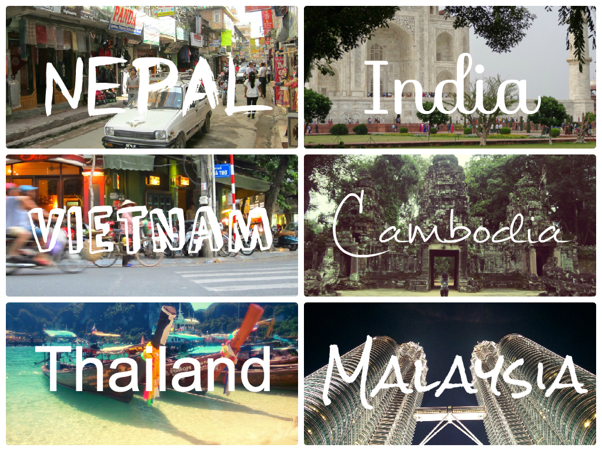

**6 countries in 6 months**

It’s been 6 months since we left our routine lifestyle in the UK and started our Asian adventure. As I sit here in Kuala Lumpur trying to sum up my thoughts into a post, it’s surreal to think how far we have come and what we’ve accomplished.

Traveling has been an eye-opening, first hand educational experience for me which continues to spark my curiosity and excitement. It has been a roller coaster of emotions and physical endurance that have rounded us into the travellers we are. We purposely challenged ourselves to go on as much overland transportation. Since August 2014 when we landed into Hanoi (from New Delhi) we have made our way overland through Vietnam, Cambodia, Thailand and Malaysia.

**Short Summary of the Past 6 Months**

The adventure started in Kathmandu where we had pre-booked a Gecko’s tour, starting in Nepal and finishing in New Delhi. We eased ourselves into our travels with a tour group and had a fantastic experience. Both countries are challenging to navigate around and looking back I had no regrets about going on the tour.

From New Delhi we made plans to go Vietnam, challenging ourselves to travel throughout the country. After 2 months traveling through the diverse landscapes of Vietnam we crossed the border into Cambodia. We cut down the time spent in Cambodia as it was more costly than budgeted. We still enjoyed our time and I cannot recommend how incredible the temples are at Angkor Wat. Our next border crossing was Thailand where we had a 2 month tourist visa. Again, we challenged ourselves to travel north of the country to visit wonderful ancient towns and cities, and back down through the beach towns – all via buses and trains. Most recently we crossed the overland border into Malaysia to spend Christmas and New Years.

There are so many experiences which we’ve faced, both incredible and stressful. Here are just a few to name:

**Top 5 lowlights**

1\. Delayed on our first flight out from London Heathrow by 42 hours, reaching Kathmandu 2 days later than anticipated.

2\. Spending 12 days in a cockroach infested room in Kathmandu.

3\. Admitted to a clinic for food poisoning in Kathmandu.

4\. Wading through a flooded street in Varanasi, India.

5\. Witnessing someone getting run over by a motorcycle in Chiang Mai (she was okay and went straight to hospital, but it was pretty horrifying to see).

**Top 5 Highlights**

1\. Watching the sunset at Udaipur, Rajasthan.

2\. Star gazing at Halong Bay, Vietnam.

3\. Exploring the ancient temples in Angkor Wat, Cambodia.

4\. Setting off our own lanterns at Yi Peng festival in Chiang Mai, Thailand.

5\. Seeing cats and dogs well looked after at Lanta Animal Welfare, Thailand.

Travel isn’t just about seeing the wonderful sights around the world, drinking in cheap bars and lounging on beaches. It’s an exhausting, ever-changing process where at times even the simplest day-to-day tasks are difficult to handle.

There are times where I’ve hit rock bottom and experienced bad homesickness, where I’ve been that close to packing my things and running to the nearest airport to get home.

I’ve learnt over the months to adapt and minimise feelings of homesickness – a Skype call back home or snacking on a Western treat really helps. When we arrived in Malaysia I treated myself a tub of peanut butter, Nando’s hot sauce a Kinder White Bueno! It’s the little things I’ve missed which make such a difference and keep me going in this journey.

**Travel Plans for the upcoming 6 months**

The plan is to continue through Asia for another 6 months. We’re planning a brief visit to Singapore after Malaysia and then flying over to Indonesia. After Indonesia our aim is to visit the Philippines, Japan and China – we’ve not yet worked out how long we’ll be staying in each country. Our aim is to be in Hong Kong by July 2015 which will mark a year anniversary travelling.
