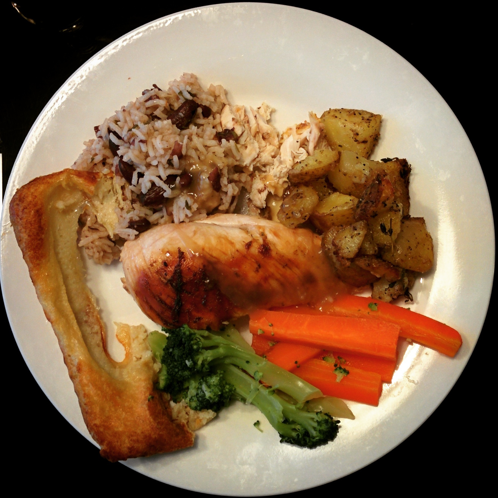
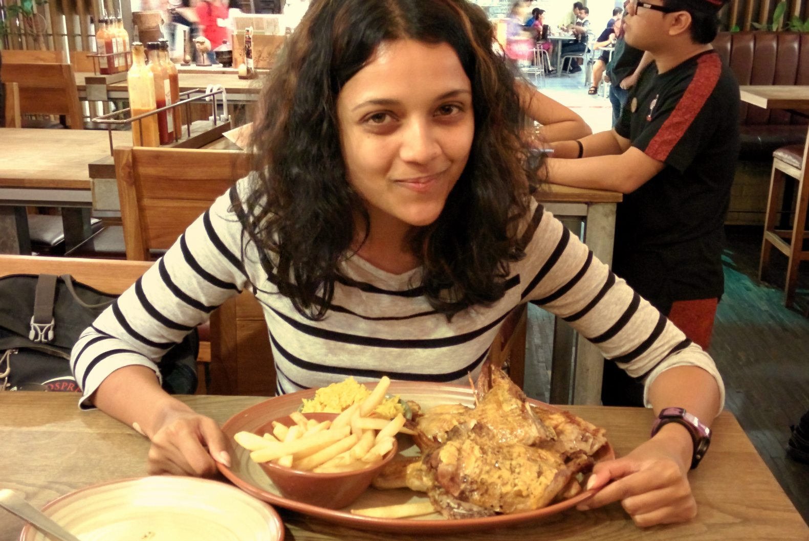
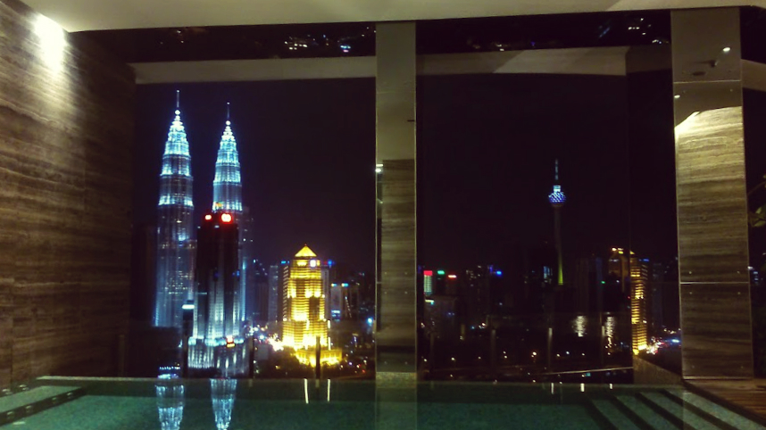
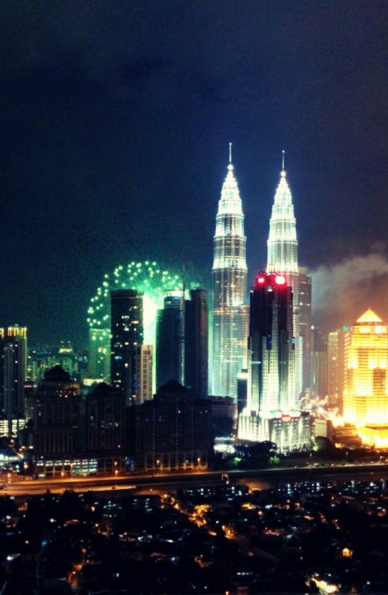

This is the first time we’ve spent both Christmas and New Years in another country. Our passports allow us to stay in Malaysia for 3 months without a visa so we have both time and flexibility here. The first few weeks in Kuala Lumpur will be spent resting up – we then intend to stay for around a month after so Kyle can catch up with work commitments.

Though Malaysia gets involved in the festive spirit Christmas is treated like any other day. To be honest we loved the fact the Christmas wasn’t such a big deal. Every year back in the UK the TV is taken over by Christmassy adverts/films/songs, whilst the shopping centres are choked up with customers grabbing anything Christmas related for the ‘big day’.

We were getting to the point in our travels where we started to miss home and family – especially at this time of year where we reminisced on previous Christmas feasts we used to indulge in (_yes_ _I don’t like Christmas but I do like loads of chocolate, mince pies and mulled wine!_).

We’ve been traveling for nearly 6 months and wanted to stay somewhere with a little bit of luxury (e.g. with a pool and gym). We booked a really nice AirBnB apartment which had the all the amenities to relax and catch up on some decent sleep (in a proper bed!). Not wanting to feel left out on Christmas we went to a gourmet supermarket and stock up on some ingredients to cook ourselves a mini feast.

Our home-cooked Christmas meal, it was so good!

Kuala Lumpur reminds of us our own homely comforts – shopping malls, restaurants and pavements designated for walking! We miss cooking so it was a wlecomed prospect to buy our own ingredients and cook to our hearts content.

Enjoying a Nandos after 6 months!

We’ve previously celebrated New Years in big cities like London and Edinburgh and wanted to do something a little different this year.

Originally the plan was to have a flat gathering with the other guests and their friends. Unfortunately the plan fell apart when a family had rented out one of the rooms with a child! Undeterred by the setback me and Kyle went to the top floor of the residency with a few drinks and watched the fireworks from the top deck.

It was a simple stress free way to start the New Year!

Lounging around the infinity pool overlooking the Petronas Towers on New Years Eve

New Years fireworks which lasted for about 5 minutes!

I really enjoyed being away from the Christmas festivities and experiencing a New Year in another country. It was refreshing to see another perspective from a culture which don’t conform to the festivities we see back in the UK.

Staying in an apartment and having the ability to cook our own food and sleep in a real bed did help us with our homesickness. Of course we miss our families and comforts, but we still have the desire to travel and see more of Asia – nearly 6 months and we still feel like we haven’t scratched the surface yet!
