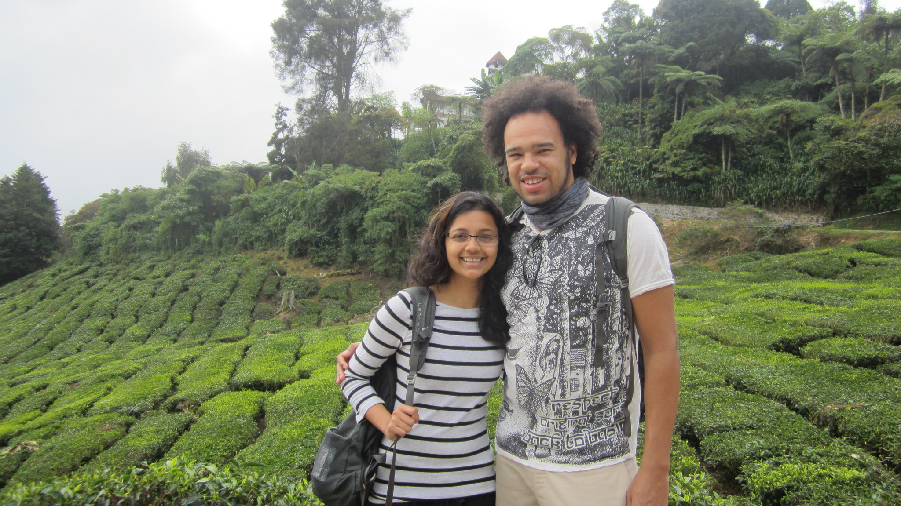
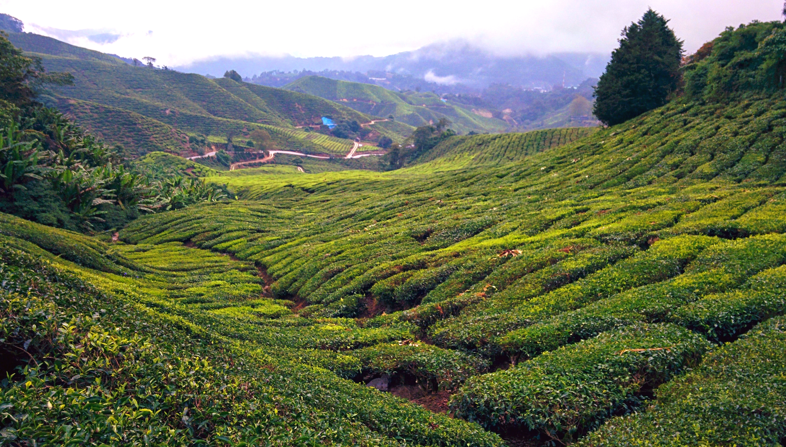
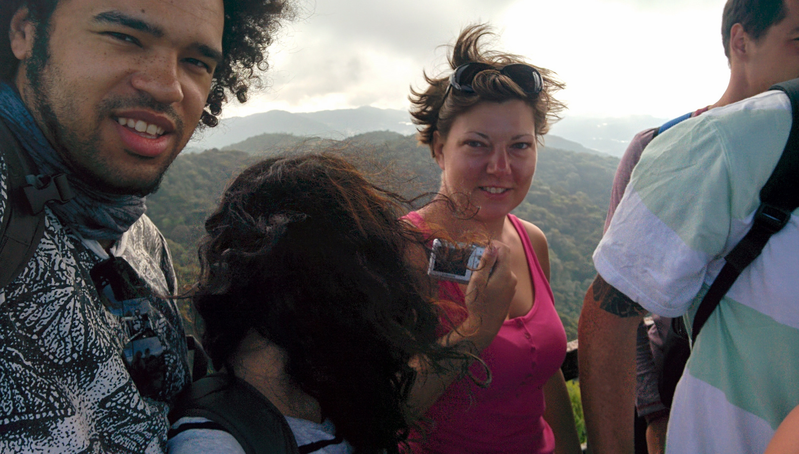
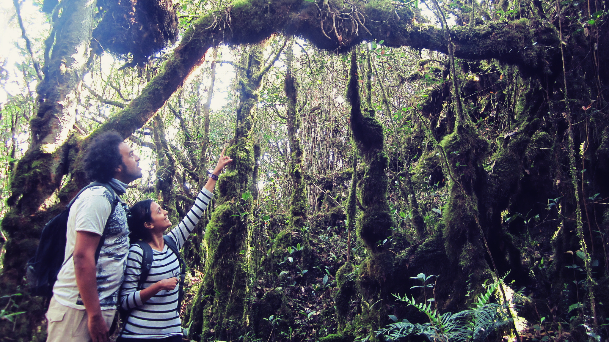
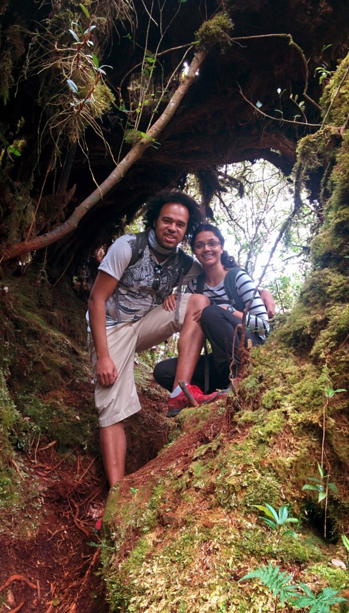
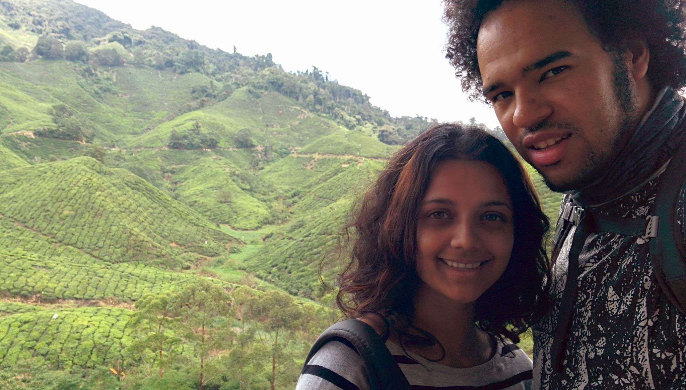
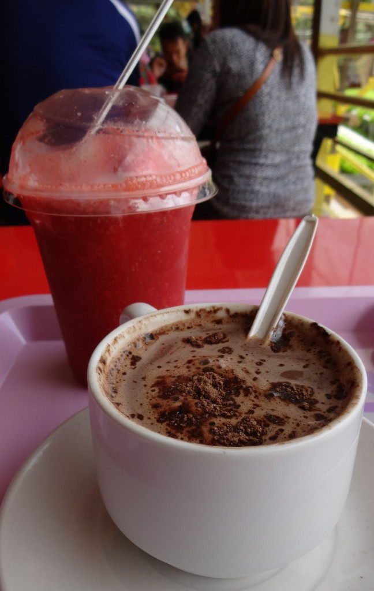
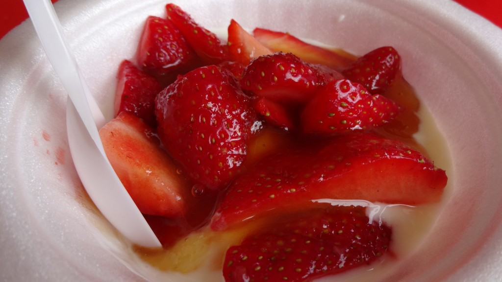
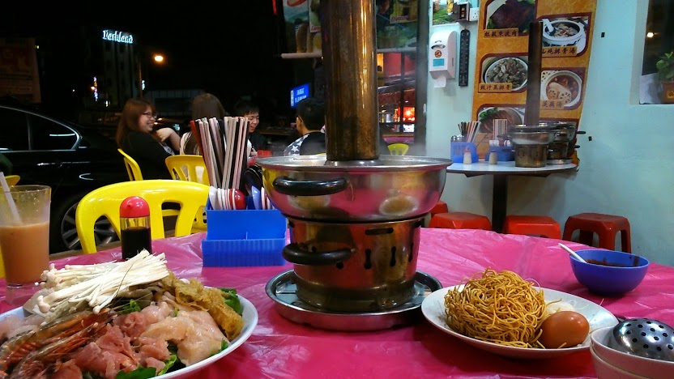
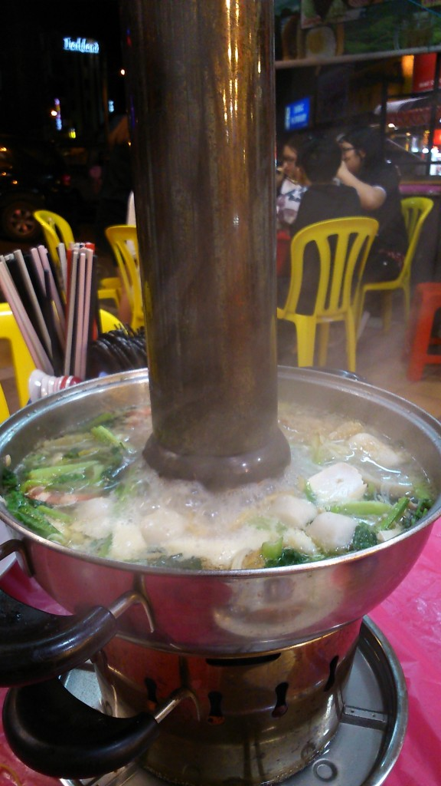

_Ahh, the Cameron Highlands_. _Just saying the name is a fresh, breezy sigh of relief…_

The Cameron Highlands is easily recognised as the home of Malaysia’s Boh tea plantation. Amongst the wealth of tea available in this region there are plenty of strawberry farms, bee farms and varied hiking routes.

Our stay in the highlands was brief so we decided to make the most of our time and booked a half day tour with [Eco Cameron Travel Tours](http://www.ecocameron.com/). Not expecting much (being a last-minute decision) we ended up on a great tour with a really good guide called Appu.

Our half tour covered Gunung Brinchang, Mossy forest and Boh Tea plantation.

We first stopped by the plantations for photos whilst Appu explained how tea originated in Malaysia. Though the scenery is beautiful there has been a large volume of illegal farmers whose practices are causing environmental degradation on the land. It’s a sad but common issue we’ve found in countries across Asia – however Appu did explain that the authorities are actively closing down the illegal farming sites.

We briefly stopped by Gunung Brinchang to see the viewpoint. Unfortunately due to the volume of other tours there it became rather hectic finding a decent spot for photos – we were there for only five minutes before moving on!

Just a ‘bit’ crowded at Gung Brinchang!

The particular highlight of the tour was Mossy Forest. Appu introduced us to the wonders of this forest and stressed how important it was to avoid touching the moss. _Basically if you step on the moss, you kill the moss!_

It was surreal walking through the forest. The ground was so springy! The forest felt mysterious, enchanted even. Thick, mossy covered trunks gnarled over us; huge thick trunks snaked along the ground. We were constantly stepping over, ducking under, and climbing up roots.

Every few steps Appu stopped to show us a plant and explained its medicinal purposes. I honestly lost count of how many plants we were shown – everything in the forest has a purpose!

There are an abundance of plants used for medicinal purposes around Mossy Forest

Our next stop after the Mossy Forest was Boh Tea plantation factory. Compared to the forest, it was pretty boring to walk around the DIY tour but we were interested in sampling some teas. Unfortunately the restaurant was very busy, by the time we received our teas we had to rush drinking them as we had to head back – _the only downside doing tours ey!_

The view from the restaurant at Boh Tea Plantation

If it wasn’t for Appu’s ecological insight we wouldn’t have appreciated how amazing the highlands were – especially the Mossy Forest. We thanked Appu for a great tour and arrived back at our hotel in the afternoon. Near our hotel was a popular strawberry farm so we decided to continue the fun and test Malaysia’s’ strawberries.

Yum! Fresh strawberry shake and a strawberry hot chocolate

…Shortly followed by an obligatory bowl of fresh strawberries, yoghurt and honey

It might be because we haven’t eaten strawberries in over 6 months, but these strawberries were delicious! They reminded me of the seasonal strawberries we get in the UK. Apparently due to the climate here the strawberries are grown all year round, lucky!

Apart from gorging on strawberries and tea, there was surprisingly a good choice of food options in Brinchang and Tanah Rata. Apart from the usual Malay/Indian/Chinese options, we noticed a lot of establishments promoting ‘steamboat’ specials.

Trying a Steamboat at Hong Kong restaurant, Tanah Rata

A steamboat is essentially a hot-pot. It consists of a central pot simmering with broth. Whilst the broth bubbles away a variety of ingredients are added – this can be a selection of meats, vegetables, noodles and eggs.

Unfortunately we weren’t very keen on the steamboat. What is essentially chicken broth, meat and veg got boring _very quickly_. We only managed 2/3 bowls each before we called it quits. Plus, the amount they gave us was enough for at least 4 people!

Our huge steamboat – there is at least enough in here to feed 4 people!

The Cameron Highlands is a very beautiful region in Malaysia to experience. There was nothing more enjoyable than cooling down in such a scenic environment and enjoying the fresh local produce.

Unfortunately during our tour Appu mentioned that certain parts of the landscape are being cleared away to build more hotels. I hope the impact won’t affect the overall environment – it’s such a beautiful place to visit and connect with nature. I want to return to the Cameron Highlands in the future, I just hope it remains as beautiful as it is now!
